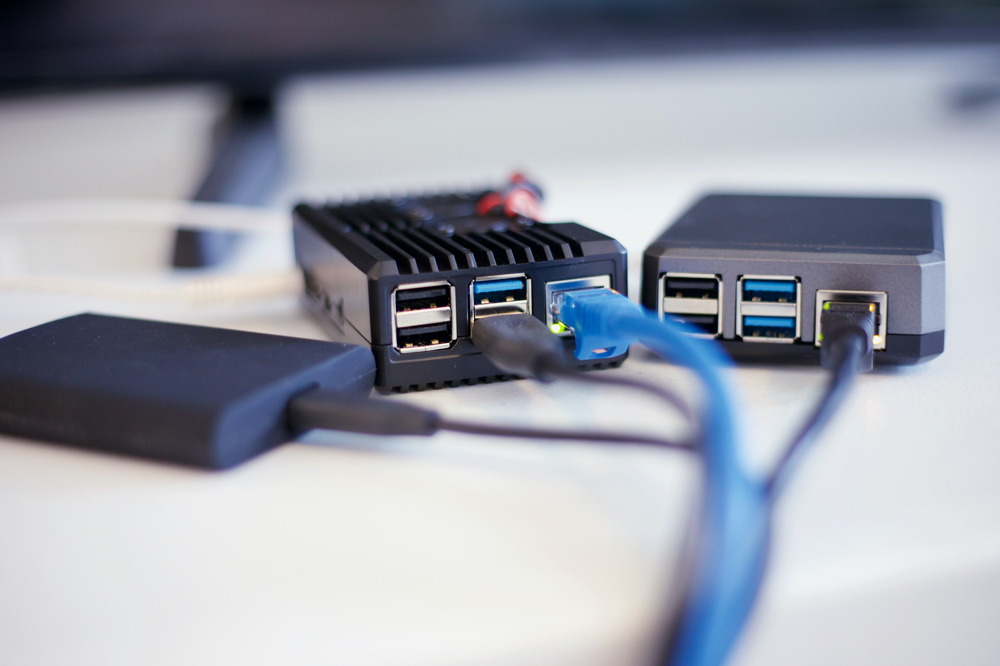
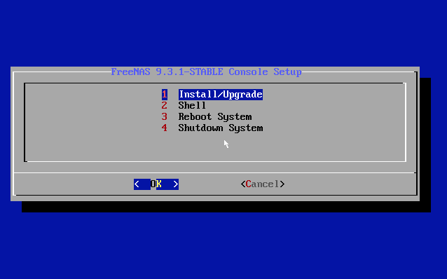
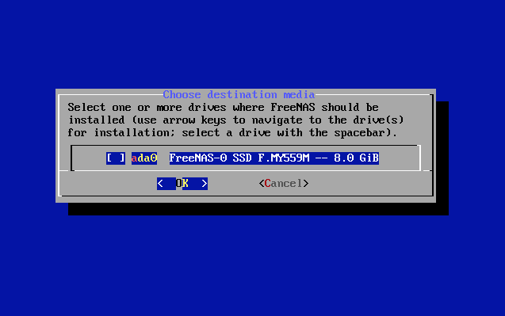
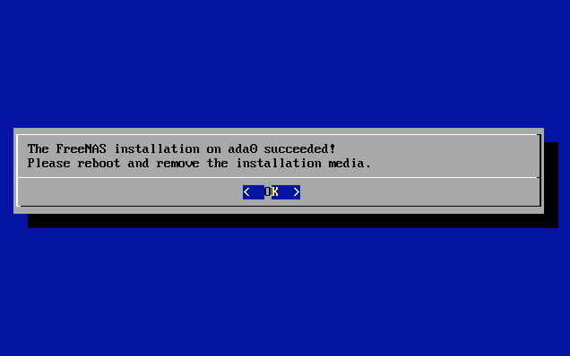
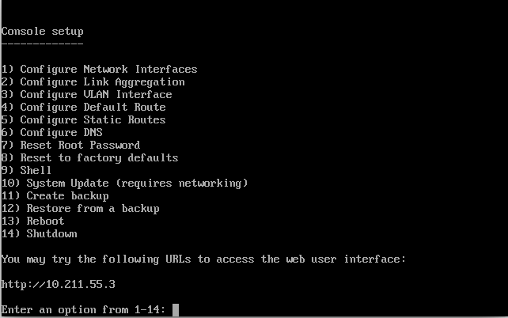
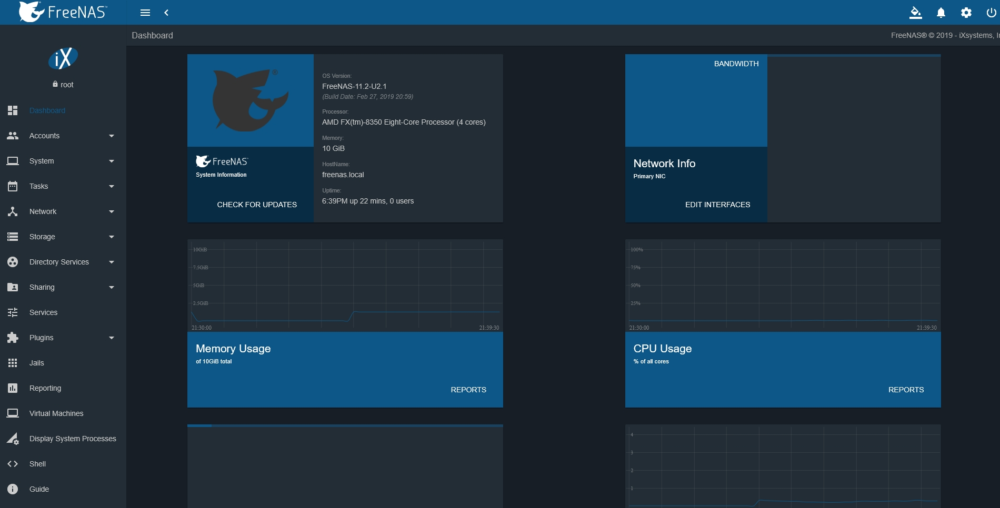

# Nas e TrueNAS (FreeNAS)

Un [Network Attached Storage (NAS)](https://it.wikipedia.org/wiki/Network_Attached_Storage) è un dispositivo collegato alla rete la cui funzione è quella di consentire agli utenti di accedere e condividere una memoria di massa, in pratica costituita da uno o più dischi rigidi, all'interno della propria rete o dall'esterno.

In questa guida vedremo come riutilizzare un vecchio PC con hardware ormai obsoleto per realizzare un NAS utilizzando [TrueNAS (freenas)](https://www.freenas.org/).  

# TrueNAS (FreeNas)

TrueNAS è un sistema operativo open source che ti permette di realizzare un NAS utilizzando un PC.

## Installazione di TrueNAS

- Scarica l'immagine del sistema operativo TrueNAS da [qui](https://www.freenas.org/download-freenas-release/#), il solito file con estensione `.iso`
- Scrivi l'immagine su una chiavetta usb da almeno 8GB. Puoi usare uno dei tanti tool come [Rufus](https://rufus.ie/it/) o [balenaEtcher](https://www.balena.io/etcher/)
- Riavvia il PC che vuoi utilizzare come NAS ed entra nel BIOS. Da qua dovrai inserire l'opzione di boot attraverso chiavette USB assicurandoti che non ci siano opzioni di sicurezza attive che impediscano il boot.
- Collega il PC tramite cavo Ethernet alla presa LAN della tua adsl e gli hard disk che vuoi utilizzare come memoria di archiviazione.
- Avvia il PC. Se la configurazione del bios è corretta, dovrebbe partire la procedura di installazione di TrueNAS.
- La procedura di installazione è molto semplice, c'è solo un passaggio a cui prestare attenzione: la scelta del disco di installazione di TrueNAS. Infatti, il disco che utilizziamo per ospitare il sistema operativo non può essere utilizzato per la condivisione ma sarà riservato al sistema operativo. Inoltre, a un certo punto dell'installazione, vi chiederà di scegliere una password per accedere come amministratore al NAS. Queste credenziali vi serviranno una volta che l'installazione sarà completata per accedere alla web user interface e configurare il NAS.

Qui sotto riporto alcune immagini della procedura di installazione 

Una volta terminata l'installazione, riavvia il PC assicurandoti di aver tolto la chiavetta USB con l'immagine di TrueNAS. In questo modo partirà il sistema operativo dal disco su cui hai scelto di installare il sistema operativo. 

Dopo il boot, se tutto è andato a buon fine, dovrebbe comparire l'indirizzo IP a cui sarà accessibile la web user interface di TrueNAS.

Digitando l'indirizzo IP su un motore di ricerca, comparirà la pagina di accesso alla web user interface. L'username è `root` mentre la password è quella che hai impostato in fase di installazione.

## Configurazione

Una volta che hai installato TrueNAS, hai l'indirizzo IP e sei entrato nella pagina principale della web user interface direi che è il momento di configurare un disco per la condivisione.

Si tratta di:

- creare un nuovo **pool** dal menu *Storage/Pools*
- creare un account che possa accedere alla memoria di condivisione, dal menù *Accounts/Users*
- aggiungere il path di condivisione (ovvero la porzione del disco che si desidera condividere) dal menù *Sharing/Windows Shares(SBM)* (se si desidera averne accesso da un account windows).

## Accesso

