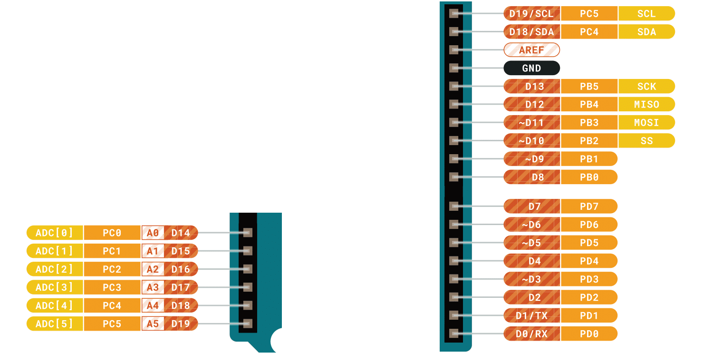

# Pin I/O

## Pin Digitali 
Ci sono 14 PIN digitali numerati da `0 - 13` per l'interfacciamento digitale con il mondo esterno. Possono essere utili per collegare LED, tasti, display LCD, matrici di LED e molto altro. In generale è possibile collegare ogni dispositivo digitale ovvero componenti che ricevono o trasmettono solo due possibili valori di tensione `5V`, `0V`. Alucuni pin sono marcati con una `~`. Sono dedicati al modulo `PWM` che studieremo più avanti.

## Pin Analogici
Ci sono inoltre 5 PIN numerati da `14 - 19` per l'interfacciamento con segnali analogici in **ingresso** come sensori di temperatura, microfoni o in generale qualsiasi segnale elettrico che varia in modo continuo nel range `[0v - 5v]`.

