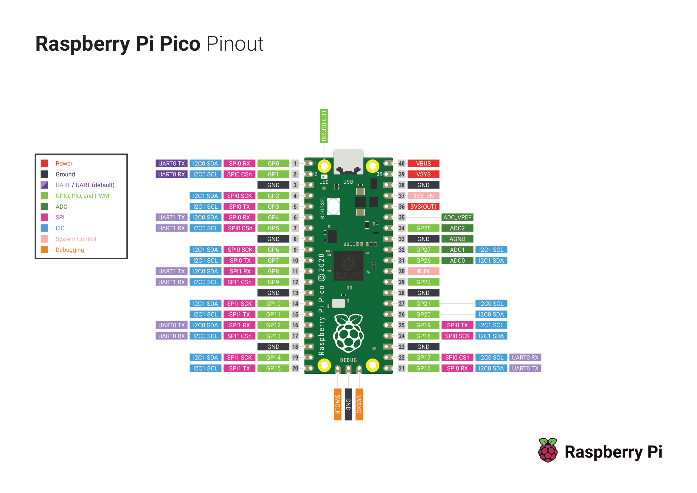

# Raspberry pi pico e Micropython


## Pinout




## Strumenti necessari

Per iniziare con il primo programma e micropython vai su [Getting started with MicroPython](https://www.raspberrypi.org/documentation/pico/getting-started/) e segui le istruzioni, sono complete e fatte bene. 

In pratica dovrai collegare raspberry pi pico al PC in modalità "Mass storage" cioè come una normale chiavetta USB e copiare un particolare file in formato `UF2` che trovi su [Getting started with MicroPython](https://www.raspberrypi.org/documentation/pico/getting-started/).

Per collegare raspberry pi pico al PC in modalità "Mass Storage" dovrai prima premere il tasto presente sulla board poi collegare raspberry all'USB come suggerito dall'immagine


Se sei curioso di conoscere qualcosa di più sul formato `UF2` vai su [uf2](https://github.com/microsoft/uf2)

## Link Utili

- Pagina ufficiale [raspberry pi pico](https://www.raspberrypi.org/documentation/pico/getting-started/)
- Esempi di programmazione in [c/c++](https://github.com/raspberrypi/pico-examples)
- Esempi di programmazione in [micropython](https://github.com/raspberrypi/pico-micropython-examples)
- Micropython [docuementazione ufficiale](https://docs.micropython.org/en/latest/library/index.html)
- Python [documentazione ufficiale](https://docs.python.org/3/library/)
- Python asincrono [Coroutines and Tasks](https://docs.python.org/3/library/asyncio-task.html)

## Primo script

```python
async def blink(led, period_ms):
    while True:
        led.on()
        await uasyncio.sleep_ms(500)
        led.off()
        await uasyncio.sleep_ms(period_ms)

async def main(led1, led2):
    uasyncio.create_task(blink(led1, 1000))
    uasyncio.create_task(blink(led2, 2000))
    while True:
        await uasyncio.sleep_ms(20_000)


# Running on a generic board
from machine import Pin
uasyncio.run(main(Pin(25, Pin.OUT), Pin(16, Pin.OUT)))
```

### Binary Clock

Per l'orologio binario avrai bisogno della libreria [max7219](https://github.com/FideliusFalcon/rpi_pico_max7219). A questo punto devi caricare lo script max7219.py su raspberry pi pico. Se usi Thonny puoi farlo con il tasto "salva", ricordando di specificare "salva su dispositivo". Una volta che lo script è all'interno di raspberry pico puoi scrivere il seguente script ed eseguirlo.

Se vuoi rendere lo script funzionante stand alone, ovvero senza eseguirlo necessariamente da Thonny puoi salvare questo script all'interno della memoria di raspberry pico chiamandolo boot.py

```python
#Binary CLOCK
#V1.00

import max7219
from machine import Pin, SPI
import time

# https://github.com/FideliusFalcon/rpi_pico_max7219
# VCC -> VBUS, pico number: 40
# GND -> GND,  pico number: 38
# DIN -> MOSI (SPI0 TX) GP7, pico number: 10
# CS  -> SPI0 CSn GP5, pico number: 7
# CLK -> SCK GP6, pico number: 9

MAX7219_NUM = 4
cs_pin = 5
spi = SPI(0)
display = max7219.Matrix8x8(spi=spi, cs=Pin(cs_pin), num=MAX7219_NUM)

def seconds_unit(i):
  display.pixel(7,7,(i>>0)&1)
  display.pixel(6,7,(i>>1)&1)
  display.pixel(5,7,(i>>2)&1)
  display.pixel(4,7,(i>>3)&1)
def seconds_dozens(i):  
  display.pixel(7,6,(i>>0)&1)
  display.pixel(6,6,(i>>1)&1)
  display.pixel(5,6,(i>>2)&1)
  display.pixel(4,6,(i>>3)&1)
  
def minutes_unit(i):
  display.pixel(7,4,(i>>0)&1)
  display.pixel(6,4,(i>>1)&1)
  display.pixel(5,4,(i>>2)&1)
  display.pixel(4,4,(i>>3)&1)
def minutes_dozens(i):  
  display.pixel(7,3,(i>>0)&1)
  display.pixel(6,3,(i>>1)&1)
  display.pixel(5,3,(i>>2)&1)
  display.pixel(4,3,(i>>3)&1)
  
def hours_unit(i):
  display.pixel(7,1,(i>>0)&1)
  display.pixel(6,1,(i>>1)&1)
  display.pixel(5,1,(i>>2)&1)
  display.pixel(4,1,(i>>3)&1)
def hours_dozens(i):  
  display.pixel(7,0,(i>>0)&1)
  display.pixel(6,0,(i>>1)&1)
  display.pixel(5,0,(i>>2)&1)
  display.pixel(4,0,(i>>3)&1)

seconds = 30
minutes = 2
hours = 23

while True:
        
    seconds_unit(seconds%10)
    seconds_dozens(seconds//10)
    
    minutes_unit(minutes%10)
    minutes_dozens(minutes//10)
    
    hours_unit(hours%10)
    hours_dozens(hours//10)
    
    display.show()
    
    seconds = seconds + 1
    
    if (seconds == 60):
        seconds = 0
        minutes = minutes + 1
    if (minutes == 60):
        minutes = 0
        hours = hours + 1
    if (hours == 24):
        hours = 0
    
    time.sleep_ms(1000)      # sleep for 500 milliseconds
```


