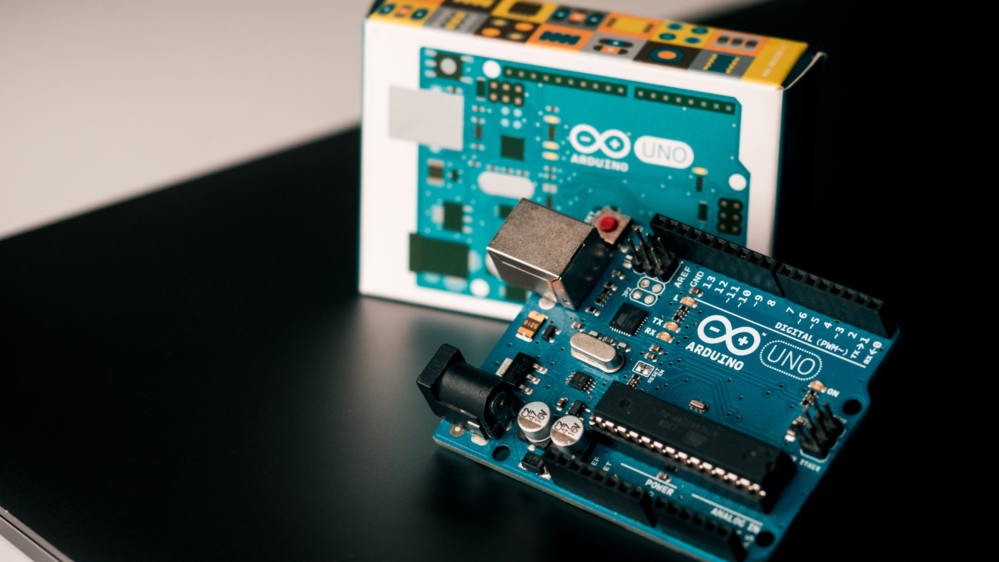
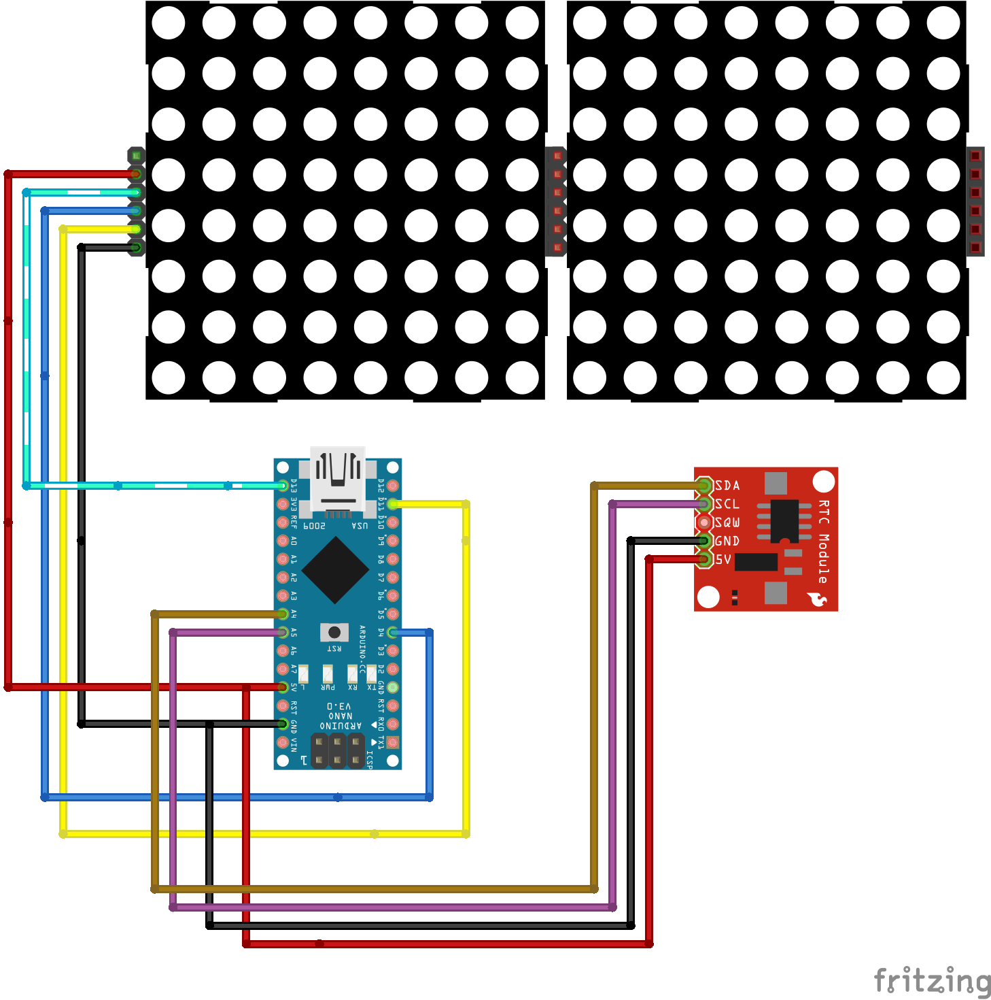
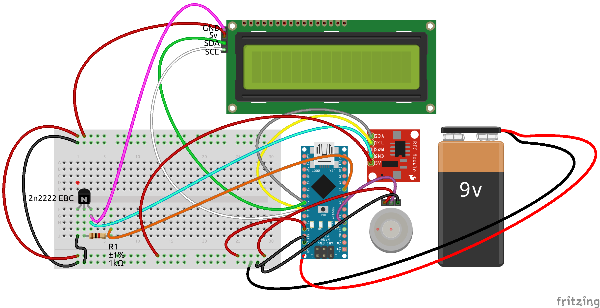

# Arduino

- [Arduino](#arduino)
- [Lezione 01](#lezione-01)
- [Lezione 02](#lezione-02)
  - [Alimentare arduino](#alimentare-arduino)
- [Lezione 03](#lezione-03)
  - [Pin I/O](#pin-io)
- [Lezione 04](#lezione-04)
  - [Sketch](#sketch)
  - [Primo sketch - LED Blink](#primo-sketch---led-blink)
- [Lezione 05](#lezione-05)
  - [PWM](#pwm)
- [Lezione 06](#lezione-06)
  - [Documentazione Linguaggio Arduino](#documentazione-linguaggio-arduino)
  - [Binary Clock](#binary-clock)
    - [Collegamenti Hardware](#collegamenti-hardware)
    - [Il codice](#il-codice)
  - [RTC e display 7 segmenti](#rtc-e-display-7-segmenti)
  - [EEPROM](#eeprom)
  - [SLEEP MODE](#sleep-mode)
  - [Contatto magnetico](#contatto-magnetico)
  - [RTC e Display I2C](#rtc-e-display-i2c)

# Lezione 01

Arduino è una scheda elettronica per realizzare prototipi. Il cuore di arduino è il **microcontrollore**. Il modello **Arduino UNO R3** utilizza il microcontrollore **Atmega328P**.



Un microcontrollore (in inglese microcontroller in acronimo MCU ovvero MicroController Unit), in elettronica digitale, è un dispositivo elettronico integrato su singolo circuito elettronico, nato come evoluzione alternativa al microprocessore e utilizzato generalmente in sistemi embedded ovvero per applicazioni specifiche di controllo digitale.


La scehda di Arduino, attraverso il microcontrollore, comunica con il mondo esterno attraverso i suoi PIN. Un microcontrollore in genere svolge un compito molto specifico come leggere il valore di certi sensori collegati in ingresso o settare le uscite collegate a qualche attuatore. Ci sono molti componenti elettronici interfacciabili direttamente con Arduino


# Lezione 02

## Alimentare arduino

Puoi alimentare Arduino con il connettore DC con una tensione nel range `6-20V`


Puoi inoltre utilizzare il cavo usb collegato a PC o un a un caricatore per smartphone. Il cavo USB è inoltre indispensabile per il caricamento del programma da PC alla memoria interna del microcontrollore


Puoi alimentare Arduino *manualmente* attraverso il pin `Vin` con una tensione esatta di `5V`.


Una volta alimentato Arduino puoi prelevare le tensioni di `5v`, `3.3v` e il riferimento `GND` dagli omonimi pin.

Esiste inoltre un tasto `RESET` che consente il riavvio di Arduino.

E' possibile inoltre riavviare Arduino attraverso il pin `RESET` con un apposito *segnale di reset*.

# Lezione 03

## Pin I/O

**Pin Digitali**<br>
Ci sono 14 PIN digitali numerati da `0 - 13` per l'interfacciamento digitale con il mondo esterno. Possono essere utili per collegare LED, tasti, display LCD, matrici di LED e molto altro. In generale è possibile collegare ogni dispositivo digitale ovvero componenti che ricevono o trasmettono solo due possibili valori di tensione `5V`, `0V`. Alucuni pin sono marcati con una `~`. Sono dedicati al modulo `PWM` che studieremo più avanti.

**Pin Analogici**<br>
Ci sono inoltre 5 PIN numerati da `14 - 19` per l'interfacciamento con segnali analogici in **ingresso** come sensori di temperatura, microfoni o in generale qualsiasi segnale elettrico che varia in modo continuo nel range `[0v - 5v]`.


# Lezione 04

## Sketch

Lo `Sketch` è il programma, la logica. Arduino utilizza come linguaggio di programmazione il `C++` ma fornisce anche delle funzioni di interfacciamento o meglio delle **classi** e dei **metodi** per l'accesso in modo semplificato all'Hardware. Per far ciò, all'accensione del microcontrollore, Arduino configura i registri interni dei moduli del microcontrollore con un settaggio standard e "maschera" queste operazioni all'utente finale mostrando solo due macroblocchi:


- **setup**
- **loop**


In linea generale possiamo affermare che:

- **setup:** i comandi scritti all'interno di questo blocco vengono eseguiti una sola volta all'avvio di Arduino.
- **loop** i comandi scritti all'interno di questo blocco vengono eseguiti ciclicamente dopo l'avvio di Arduino fino al riavvio o spegnimento della board.

## Driver necessari

Normalmente, installando l'IDE Arduino ti troverai installati anche tutti i driver necessari per comunicare con la scheda. Se acquisti un Arduino clone tuttavia potresti aver bisogno dei driver (per Windows) poichè spesso i componenti hardware non sono proprio gli stessi. Da [questa pagina](http://www.wch-ic.com/downloads/CH341SER_EXE.html) è possibile scaricare i driver necessari. Trovi un file eseguibile anche all'interno di questa repository al percorso `files/CH341SER.EXE`

## Primo sketch - LED Blink

Come primo Sketch vedremo come far lampeggiare un LED. Useremo il LED connesso direttamente ad arduino al `pin 13`. Per far ciò dovremo:

in  `void setup {}`:
- Impostare il `pin 13` come `output`

in `void loop(){}`:
- Scrivere il valore logico `HIGH` sul `pin 13` per fornire `5v` ed accendere il led tramite l'istruzione `digitalWrite()`
- Inserire un ritardo che esprime il tempo in cui il `pin` starà acceso con l'istruzione `delay()`
- Scrivere il valore logico `LOW` sul `pin 13` per togliere l'alimentazione e spegnere il led tramite l'istruzione `digitalWrite()`
- Inserire un ritardo che esprime il tempo in cui il `pin` starà spento con l'istruzione `delay()`

Poichè il `void loop(){}` esegue in loop le istruzioni, realizzerai un lampeggio del LED infinito.

Il codice completo:

```cpp
void setup() {
  // initialize digital pin LED_BUILTIN as an output.
  pinMode(13, OUTPUT);
}

// the loop function runs over and over again forever
void loop() {
  digitalWrite(13, HIGH);   // turn the LED on (HIGH is the voltage level)
  delay(1000);                       // wait for a second
  digitalWrite(13, LOW);    // turn the LED off by making the voltage LOW
  delay(1000);                       // wait for a second
}
```

Adesso è sufficiente:
- Premere il tasto `Verifica` che controllerà la sintassi e ti avviserà se hai inserito qualche comando non valido nella finestra nera in basso
- Premere il tasto `Esegui` che andrà a inserire il codice all'interno della memoria di Arduino e a procedere con l'esecuzione dello sketch

E' possibile trovare questo sketch esempio su `File/Esempi/01.Basics/Blink`

Apparirà come:

```cpp
/*
  Blink

  Turns an LED on for one second, then off for one second, repeatedly.

  Most Arduinos have an on-board LED you can control. On the UNO, MEGA and ZERO
  it is attached to digital pin 13, on MKR1000 on pin 6. LED_BUILTIN is set to
  the correct LED pin independent of which board is used.
  If you want to know what pin the on-board LED is connected to on your Arduino
  model, check the Technical Specs of your board at:
  https://www.arduino.cc/en/Main/Products

  modified 8 May 2014
  by Scott Fitzgerald
  modified 2 Sep 2016
  by Arturo Guadalupi
  modified 8 Sep 2016
  by Colby Newman

  This example code is in the public domain.

  http://www.arduino.cc/en/Tutorial/Blink
*/

// the setup function runs once when you press reset or power the board
void setup() {
  // initialize digital pin LED_BUILTIN as an output.
  pinMode(LED_BUILTIN, OUTPUT);
}

// the loop function runs over and over again forever
void loop() {
  digitalWrite(LED_BUILTIN, HIGH);   // turn the LED on (HIGH is the voltage level)
  delay(1000);                       // wait for a second
  digitalWrite(LED_BUILTIN, LOW);    // turn the LED off by making the voltage LOW
  delay(1000);                       // wait for a second
}
```

L'unica differenza che trovi è `LED_BUILTIN`. E' una **costante** il cui valore è pari a `13`.

Il valore di tutte le costanti di Arduino le puoi trovare sulla documentazione ufficiale: [Arduino - constants](https://www.arduino.cc/reference/it/language/variables/constants/constants/)

# Lezione 05

## PWM

In elettronica e telecomunicazioni la modulazione di larghezza di impulso (o PWM, acronimo del corrispettivo inglese pulse-width modulation) è un tipo di modulazione digitale che permette di ottenere una tensione media variabile dipendente dal rapporto tra la durata dell'impulso positivo e dell'intero periodo (duty cycle). Allo stesso modo, è fondamentalmente utilizzato per protocolli di comunicazione in cui l'informazione è codificata sotto forma di durata nel tempo di ciascun impulso. Grazie ai moderni microcontrollori, è possibile attivare o disattivare un interruttore ad alta frequenza e allo stesso modo rilevare lo stato e il periodo di un impulso.


Poichè arduino è alimentato a `5V` se volessi ottenere un valore medio pari a `2.5V` in uscita da un pin digitale dovrei generare un segnale `PWM` con le seguenti caratteristiche:

- Frequenza: fissa. Valori standard di frequenza per i segnali PWM vanno da qualche centinaia di `Hz` a qualche `Khz`. Il valore di frequenza è stabilito internamente da Arduino quindi per adesso non dovrai preoccupartene.
- Duty cicle: `50%`. Per impostare il duty cicle si imposta un valore nel range `0-255` all'interno della funzione `analogWrite()`. Attraverso la proporzione:
```math
dutyCicle% : 100% = value: 255
```
Poichè vogliamo `dutyCicle% = 50%`, allora `value = 127`

Nel prossimo esempio genererò un segnale `PWM` con `duty cicle = 50%` per controllare la luminosità di un LED.

Per far ciò è necessario:
- collegare un LED a un PIN qualsiasi con uscita PWM. Sono quelli identificati dal simbolo `~`. Utilizzerò il pin `9`
- chiamare il comando `analogWrite()` specificando come primo parametro il pin sul quale si desidera generare il segnale `PWM`, quindi il pin `9` e come secondo parametro il `duty cicle` espresso con un numero da `[0 - 255]`. Per ottenere un `duty cicle` del `50%` scriverò `127`

Lo sketch completo è:

```cpp
void setup() {

}

void loop() {
  analogWrite(9, 127);
}
```

Arduino fornisce un esepio più compelto all'interno della cartella degli esempi `File/Esempi/01.Basics/Fade`

```cpp
/*
  Fade

  This example shows how to fade an LED on pin 9 using the analogWrite()
  function.

  The analogWrite() function uses PWM, so if you want to change the pin you're
  using, be sure to use another PWM capable pin. On most Arduino, the PWM pins
  are identified with a "~" sign, like ~3, ~5, ~6, ~9, ~10 and ~11.

  This example code is in the public domain.

  http://www.arduino.cc/en/Tutorial/Fade
*/

int led = 9;           // the PWM pin the LED is attached to
int brightness = 0;    // how bright the LED is
int fadeAmount = 5;    // how many points to fade the LED by

// the setup routine runs once when you press reset:
void setup() {
  // declare pin 9 to be an output:
  pinMode(led, OUTPUT);
}

// the loop routine runs over and over again forever:
void loop() {
  // set the brightness of pin 9:
  analogWrite(led, brightness);

  // change the brightness for next time through the loop:
  brightness = brightness + fadeAmount;

  // reverse the direction of the fading at the ends of the fade:
  if (brightness <= 0 || brightness >= 255) {
    fadeAmount = -fadeAmount;
  }
  // wait for 30 milliseconds to see the dimming effect
  delay(30);
}
```
 In questo esempio il LED, connesso al PIN `9` si accenderà e si spegnerà in modo graduale. Per ottenere questo effetto si agisce su parametro che regola il `duty cicle` che in questo programma è definito dalla variabile `brightness`.

- In pratica il software imposta una `brightness` pari a `0` aumenta la variabile `brightness` del valore pari a `fadeAmount` (impostata a `5`) secondo l'espressione `brightness = brightness + fadeAmount` che diventa quindi `brightness = brightness + 5`

- Ripete questa operazione ogni `30 millisecondi`.

In questo modo il LED aumenterà la sua luminosità in modo graduale

- Una volta che `brightness` è arrivata al valore massimo, `brightness >= 255`, inverte il valore di `fadeAmount`. In questo caso quindi l'espressione diventa `brightness = brightness - 5`.

- Ripete questa operazione ogni `30 millisecondi`.

 Il risultato è che il LED diminuirà la sua luminosità in modo graduale.

- Una volta che `brightness` è arrivata al valore minimo, `brightness <= 0`, inverte il valore di `fadeAmount`. In questo caso quindi l'espressione torna a essere `brightness = brightness + 5`.
- Ripete questa operazione ogni `30 millisecondi`.

E continua fino al reset di Arduino.

**Domanda:**<br>
Quanto impiega il ciclo di accensione?<br>
vista l'espressione `brightness = brightness + fadeAmount` e visto il ritardo pari a `30ms`, si ha che `brightness` passa da 0 `255` in `51` step ( `255/5` ) e quindi il ciclo di accensione graduale dura `30ms*51 = 1.53 secondi`. Poichè il ciclo di spegnimento è simmetrico, se ne deduce che il ciclo completo (accensione + spegnimento) dura poco più di `3 secondi`

**Puoi provare:**<br>
Puoi provare a cambiare il ritardo di `30ms` o il `fadeAmount` per cambiare la velocità di accensione/spegnimento.

Puoi anche impostare un valore minimo di `brightness` e un valore massimo

Ecco un esempio:

```cpp
/*
  Fade

  This example shows how to fade an LED on pin 9 using the analogWrite()
  function.

  The analogWrite() function uses PWM, so if you want to change the pin you're
  using, be sure to use another PWM capable pin. On most Arduino, the PWM pins
  are identified with a "~" sign, like ~3, ~5, ~6, ~9, ~10 and ~11.

  This example code is in the public domain.

  http://www.arduino.cc/en/Tutorial/Fade
*/

int led = 9;           // the PWM pin the LED is attached to
int brightness = 0;    // how bright the LED is
int fadeAmount = 2;    // how many points to fade the LED by
byte maxBrightness = 200;
byte minBrightness = 10;

// the setup routine runs once when you press reset:
void setup() {
  // declare pin 9 to be an output:
  pinMode(led, OUTPUT);
}

// the loop routine runs over and over again forever:
void loop() {
  // set the brightness of pin 9:
  analogWrite(led, brightness);

  // change the brightness for next time through the loop:
  brightness = brightness + fadeAmount;

  // reverse the direction of the fading at the ends of the fade:
  if (brightness <= minBrightness || brightness >= maxBrightness) {
    fadeAmount = -fadeAmount;
  }
  // wait for 3 milliseconds to see the dimming effect
  delay(1);
}
```

**Piccolo Approfondimento - Frequenza PWM**<br>
Come già detto, Arduino imposta un valore di frequenza per il segnale PWM ma quale?
Per Arduino UNO il valore è `490.20 Hz` per i pin `D3,D9, D10, D11` e il valore `976.56 Hz` per i pin `D5 & D6`.

Cosa cambia al variare della frequenza? <br>
Provo a darti una spiegazione molto qualitativa.. <br>
IL PWM agisce sul'inerzia elettromeccanica dei componenti. Puoi intuire che abbassando la frequenza il componente possa diventare meno fluido. Se si parla di un LED, a una frequenza molto bassa vedrai lampeggiare il LED.
Allo stesso tempo puoi intuire che alzando troppo la frequenza sia difficile per il componente leggere valori di duty cicle troppo piccoli. Nel caso del LED, lo vedrai sempre spento.
Per determinare i valori minimi e massimi di frequenza PWM è necessario eseguire un'analisi dei componenti capacitivi/indutti parassiti e studiare la caratteristica al variare della frequenza. Per adesso comunque ti basta sapere che in linea generale, le frequenze possono andare nei casi più comuni tra `[100Hz - 100Khz]`. Avrai frequenze piuttosto basse se il componente ha una *capacità di reazione* lenta e frequenze più alte per componenti che hanno una *capacità di reazione* alta

# Lezione 06

## Documentazione Linguaggio Arduino

Arduino utilizza il linguaggio `C++` ma esporta una serie di funzioni molto semplici per il controllo dell'Hardware.
[Qui](https://www.arduino.cc/reference/it/) puoi trovare la documentazione ufficiale del linguaggio di Arduino.


Qua sotto riporto comunque qualche costrutto fondamentale del linguaggio `C++` e qualche funzione esportata da Arduino.

**Le variabili**

| Tipo di Dato | Dimensione  | Descrizione  |
| -----------  | ----------- | ----------- |
| char         | 1 Byte         | Contenitore per caratteri e valori alfanumerici (e.g., ‘a’, ‘b’, ‘1’, etc)      |
| bool   | 1 Byte        |Contenitore per valori booleani (e.g., true, false)
| int   | 2 Byte        |Contenitore per numeri interi nel range numerico, da -32768 a 32767.
| unsigned int  | 2 Byte        |Contenitore per numeri interi senza segno nel range numerico, da 0 a 65535.
| long  | 4 Byte        |Contenitore per numeri interi nel range numerico, da -2147483648 a 2147483647
| unsigned long  | 4 Byte        |Contenitore per numeri interi nel range numerico, da 0 to 4,294,967,295 (2^32 – 1)
| float  | 4 Byte        |Contenitore per numeri interi nel range numerico, da 0 to 4,294,967,295 (2^32 – 1)
| double  | 4 Byte        |Contenitore per numeri interi nel range numerico, da 0 to 4,294,967,295 (2^32 – 1)
| String  | -       |Contenitore per testo (e.g., “Resistenza”)


## Binary Clock

Per questo orologio binario ho utilizzato la libreria [simple_matrix](https://github.com/Electro707/Simple-LED-Matrix-Library) per la gestione della matrice di LED e la libreria [RTClib](https://github.com/adafruit/RTClib) per la gestione del tempo.

Ho modificato la libreria [simple_matrix](https://github.com/Electro707/Simple-LED-Matrix-Library) creando una nuova versione, [simple_matrix_v2](https://github.com/CodeCoagious19/arduino-libraries/tree/master/MatrixLEDLib_v2) che in più contiene i metodi:

- `writeSquare(order, x, y, value)`
- `writePixel(x, y, value)`

### Collegamenti Hardware

|LED Matrix Pins|	Arduino Pins|
|---|---|
|VCC|	VCC|
|GND|	GND|
|DIN|	D11|
|CLK|	D13|
|CS|	D4 |

|RTC |	Arduino Pins|
|---|---|
|VCC|	VCC (+5V)|
|GND|	GND|
|SDA|	A4 (SDA) |
|SCL|	A5 (SCL)|



### Il codice

L'orologio binario consiste nel codificare ore, minuti e secondi con la relativa sequenza binaria.

Ho deciso di codificare ogni cifra in una sequenza binaria rappresentando quindi separatamente decine e unità per ore, minuti e secondi.

Ad esempio:

```c++
12

//decine //unità
0001     0010
```

Inoltre la rappresentazione del tempo all'interno della matrice di LED va dall'alto verso il basso a partire dalle ore.

In conclusione, per rappresentare la seguente ora: `21:34:46` vedrai:

```c++
21:34:46

//d  //u
0010 0001
0011 0100
0100 0110
```

Ecco quindi il codice completo..

```c++
#include "simple_matrix_v2.h"  //Import the library
#include "RTClib.h"

#define NUMBER_OF_DISPLAYS 2 //Sets the number of display (4 for this example)

/*
Initialize the library. The 4 means that the CS pin is connected to pin D4.
You can change this to whatever you want, just make sure to connect the CS
pin to the pin number.

The disp means that any future function calls to the library uses "disp" as the
library's object name. For example, the library has a function called
"setIntensity", you need to write "disp.setIntensity" to call that function.

If you notice that the display is upside-down per display, change
simpleMatrix disp(4, false, NUMBER_OF_DISPLAYS); to simpleMatrix disp(4, true, NUMBER_OF_DISPLAYS);
*/

/*
WARNING!!
There are several problems with the coding of (x, y) coordinates. I advise you to change the library for the LED matrix and switch to MD_MAX72XX which is much more complete and configurable.
*/
simpleMatrix disp(4, true, NUMBER_OF_DISPLAYS);
RTC_DS1307 rtc;

#define ORDER 2
#define START_X 0
#define START_Y 8

#define ADJUST_HOUR true

int seconds = 0;
int minutes = 0;
int hours = 0;

void seconds_unit(int i){
  //If you don't understand, see WARNINGS
  int x = 0;
  int y = 0;
  int value = 0;
  for (int bitNumber = 0; bitNumber < 4; bitNumber++){
    x = START_Y - 1*ORDER;
    y = START_X + bitNumber*ORDER;
    value = (i>>bitNumber)&1;
    disp.writeSquare(ORDER, x, y, value);
  }
}

void seconds_dozens(int i){
  //If you don't understand, see WARNINGS
  int x = 0;
  int y = 0;
  int value = 0;
  for (int bitNumber = 0; bitNumber < 4; bitNumber++){
    x = START_Y - 1*ORDER;
    y = START_X + 8 + bitNumber*ORDER;
    value = (i>>bitNumber)&1;
    disp.writeSquare(ORDER, x, y, value);
  }
}

void minutes_unit(int i){
  //If you don't understand, see WARNINGS
  int x = 0;
  int y = 0;
  int value = 0;
  for (int bitNumber = 0; bitNumber < 4; bitNumber++){
    x = START_Y - 2*ORDER -1;
    y = START_X + bitNumber*ORDER;
    value = (i>>bitNumber)&1;
    disp.writeSquare(ORDER, x, y, value);
  }
}
void minutes_dozens(int i){
  //If you don't understand, see WARNINGS
  int x = 0;
  int y = 0;
  int value = 0;
  for (int bitNumber = 0; bitNumber < 4; bitNumber++){
    x = START_Y - 2*ORDER -1;
    y = START_X + 8 + bitNumber*ORDER;
    value = (i>>bitNumber)&1;
    disp.writeSquare(ORDER, x, y, value);
  }
}  

void hours_unit(int i){
  //If you don't understand, see WARNINGS
  int x = 0;
  int y = 0;
  int value = 0;
  for (int bitNumber = 0; bitNumber < 4; bitNumber++){
    x = START_Y - 3*ORDER -2;
    y = START_X + bitNumber*ORDER;
    value = (i>>bitNumber)&1;
    disp.writeSquare(ORDER, x, y, value);
  }
}

void hours_dozens(int i){
  //If you don't understand, see WARNINGS
  int x = 0;
  int y = 0;
  int value = 0;
  for (int bitNumber = 0; bitNumber < 4; bitNumber++){
    x = START_Y - 3*ORDER -2;
    y = START_X + 8 + bitNumber*ORDER;
    value = (i>>bitNumber)&1;
    disp.writeSquare(ORDER, x, y, value);
  }
}


//This code will run only once when the Arduino is turned on.
void setup(){
  rtc.begin();
  //Starts the library
  disp.begin();
  //Set the LED's intensity. This value can be anywhere between 0 and 15.
  disp.setIntensity(0x01);

  if(ADJUST_HOUR){
     rtc.adjust(DateTime(F(__DATE__), F(__TIME__)));
   }
}

//After void setup(), this code will run and loop forever.
void loop(){

    DateTime adesso = rtc.now();

    seconds = adesso.second();
    minutes = adesso.minute();
    hours = adesso.hour();

    seconds_unit(seconds%10);
    seconds_dozens(seconds/10);

    minutes_unit(minutes%10);
    minutes_dozens(minutes/10);

    hours_unit(hours%10);
    hours_dozens(hours/10);

    delay(1000);

}
```

## RTC e display 7 segmenti

|7 SEG Pins|	Arduino Pins|
|---|---|
|VCC|	VCC|
|GND|	GND|
|DIN|	D11|
|CLK|	D13|
|CS|	D10 |

[tutorial](https://www.instructables.com/MAX7219-7-Segment-Using-Arduino/)

```c++
//We always have to include the library

#include "LedControl.h"

/*
Now we need a LedControl to work with.
***** These pin numbers will probably not work with your hardware *****
pin 12 is connected to the DataIn
pin 11 is connected to the CLK
pin 10 is connected to LOAD
We have only a single MAX72XX.
*/

LedControl lc=LedControl(12,11,10,1);

/* we always wait a bit between updates of the display */
unsigned long delaytime=500;

void setup() {

  /* The MAX72XX is in power-saving mode on startup, we have to do a wakeup call */
  lc.shutdown(0,false);
  /* Set the brightness to a medium values */
  lc.setIntensity(0,8);
  /* and clear the display */
  lc.clearDisplay(0);
}

int ore = 22;
int minuti = 30;
int secondi = 0;
int centesimi = 0;

void loop() {
  lc.setDigit(0,7,ore/10,false);
  lc.setDigit(0,6,ore%10,true);
  lc.setDigit(0,5,minuti/10,false);
  lc.setDigit(0,4,minuti%10,true);
  lc.setDigit(0,3,secondi/10,false);
  lc.setDigit(0,2,secondi%10,true);
  lc.setDigit(0,1,centesimi/10,false);
  lc.setDigit(0,0,centesimi%10,false);
  delay(10);
  centesimi++;
  if (centesimi == 100){
    centesimi = 0;
    secondi++;
  }
  if (secondi == 60){
    minuti++;
    secondi = 0;
  }
  if (minuti == 60){
    ore++;
    minuti = 0;
  }
  if (ore == 24){
    ore = 0;
  }
}
```


## EEPROM

```c++
#include <EEPROM.h>

int nByte = 0;
int value = 50;
void setup()
{
  Serial.begin(9600);
  if(EEPROM.read(nByte) == 255){
    Serial.println(String(String(nByte) + "vuoto"));
    EEPROM.write(nByte, value);
  }
  else{
    int tempvalue = EEPROM.read(nByte);
    String toprint = String(String(nByte) + ":" + String(tempvalue));
    Serial.println(toprint);
  }
  
}
void loop()
{

}
```

## SLEEP MODE

```c++
/**
 * Author:Ab Kurk
 * version: 1.0
 * date: 24/01/2018
 * Description: 
 * This sketch is part of the beginners guide to putting your Arduino to sleep
 * tutorial. It is to demonstrate how to put your arduino into deep sleep and
 * how to wake it up.
 * Link To Tutorial http://www.thearduinomakerman.info/blog/2018/1/24/guide-to-arduino-sleep-mode
 */

#include <avr/sleep.h>//this AVR library contains the methods that controls the sleep modes
#define interruptPin 2 //Pin we are going to use to wake up the Arduino


void setup() {
  Serial.begin(9600);//Start Serial Comunication
  pinMode(LED_BUILTIN,OUTPUT);//We use the led on pin 13 to indecate when Arduino is A sleep
  pinMode(interruptPin,INPUT);//Set pin d2 to input using the buildin pullup resistor
  attachInterrupt(digitalPinToInterrupt(interruptPin), wakeUp, RISING);//attaching a interrupt to pin d2
  digitalWrite(LED_BUILTIN,HIGH);//turning LED on
}

void loop() {
 delay(5000);//wait 5 seconds before going to sleep
 digitalWrite(LED_BUILTIN,LOW);//turning LED off
 Going_To_Sleep();
}

void Going_To_Sleep(){
    sleep_enable();//Enabling sleep mode
    set_sleep_mode(SLEEP_MODE_PWR_DOWN);//Setting the sleep mode, in our case full sleep
    sleep_cpu();//activating sleep mode
  }

void wakeUp(){
  Serial.println("Interrrupt Fired");//Print message to serial monitor
  sleep_disable();//Disable sleep mode
  Serial.println("just woke up!");//next line of code executed after the interrupt 
  digitalWrite(LED_BUILTIN,HIGH);//turning LED on
}
```

## Contatto magnetico


```c++
void setup() {
  pinMode(2, INPUT_PULLUP);
  pinMode(LED_BUILTIN, OUTPUT);
  Serial.begin(9600);
}

void loop() {
  bool v = digitalRead(2);
  digitalWrite(LED_BUILTIN, !v);
  delay(100);
}
```

## RTC e Display I2C

In questo esempio vedremo come realizzare un orologio utilizzando il modulo **RTC**, un display **LCD** con interfaccia **I2C** e un **tasto touch**. L'orologio sarà alimentato da una **pila a 9V** quindi, per evitare che si scarichi nel giro di poche ore, faremo in modo che arduino vada in **sleep mode** disabilitando tutte le periferiche ad esso connesso. Il tasto touch servià a risvegliare la arduino, il display e il modulo RTC per 10 secondi.



|RTC |	Arduino Pins|
|---|---|
|VCC|	VCC (+5V)|
|GND|	GND|
|SDA|	A4 (SDA) |
|SCL|	A5 (SCL)|

|LCD |	Arduino Pins|
|---|---|
|VCC|	VCC (+5V)|
|GND|	GND|
|SDA|	A4 (SDA) |
|SCL|	A5 (SCL)|


```c++
#include <Wire.h> 
#include <avr/sleep.h>
#include <LiquidCrystal_I2C.h>
#include "RTClib.h"

#define WAKEUP_PIN 2 
#define RTC_LDC_PIN_POWER_SUPPLY 7
#define timeBeforeWakeUp 10000
#define refreshTime 1000

#define ON true
#define OFF false

enum Mesi {Jan = 1, Feb, Mar, Apr, May, Jun, Jul, Aug, Sept, Oct, Nov, Dec};
enum Giorni {Sunday = 0, Monday, Tuesday, Wednesay, Thursday, Friday, Saturday};

//You shall flash the sketch two time.
//The first for adjust the time 
//The second for run arduino stand alone
#define ADJUST_HOUR false
DateTime dateNow = DateTime(2021, May, 19, 19, 9, 10);

LiquidCrystal_I2C lcd(0x27,20,2);  // set the LCD address to 0x27 for a 16 chars and 2 line display
RTC_DS1307 rtc;

//add 0 if number is  < 9 and return a string
String fillZeros(int n) {return (n < 10 ? String('0' + String(n)) : String(n)); }

//receive h, m, s and return hh:mm:ss
String standardTime(int h, int m, int s){ return (String(fillZeros(h) + ':' + fillZeros(m) + ':' + fillZeros(s))); } 

void setup()
{
  pinMode(RTC_LDC_PIN_POWER_SUPPLY, OUTPUT);
  pinMode(WAKEUP_PIN,INPUT_PULLUP);

  attachInterrupt(digitalPinToInterrupt(WAKEUP_PIN), mcuWakeUp, FALLING); //attaching a interrupt to pin

  rtc_lcd_PowSupply(ON);
  
  if(ADJUST_HOUR){
     //to set time at the compilation time
     //rtc.adjust(DateTime(F(__DATE__), F(__TIME__)));
     rtc.adjust(dateNow);
   }
}

void loop()
{
    DateTime now = rtc.now();

    int year = now.year();
    int month = now.month();
    int day = now.day();
    int dayOfTheWeek = now.dayOfTheWeek();

    int seconds = now.second(); 
    int minutes = now.minute();
    int hours = now.hour();

    String LCD_firstRow = "";
    switch(dayOfTheWeek){
      case Sunday: LCD_firstRow =  LCD_firstRow + "Dom" + " "; break;
      case Monday: LCD_firstRow =  LCD_firstRow + "Lun" + " "; break;
      case Tuesday: LCD_firstRow =  LCD_firstRow + "Mar" + " "; break;
      case Wednesay: LCD_firstRow =  LCD_firstRow + "Mer" + " "; break;
      case Thursday: LCD_firstRow =  LCD_firstRow + "Gio" + " "; break;
      case Friday: LCD_firstRow =  LCD_firstRow + "Ven" + " "; break;
      case Saturday: LCD_firstRow =  LCD_firstRow + "Sab" + " "; break;
      break;
      default:;
    }
    LCD_firstRow = LCD_firstRow + String(day) + " ";
    switch(month){
      case Jan: LCD_firstRow =  LCD_firstRow + "gen" + " "; break;
      case Feb: LCD_firstRow =  LCD_firstRow + "gen" + " "; break;
      case Mar: LCD_firstRow =  LCD_firstRow + "mar" + " "; break;
      case Apr: LCD_firstRow =  LCD_firstRow + "apr" + " "; break;
      case May: LCD_firstRow =  LCD_firstRow + "mag" + " "; break;
      case Jun: LCD_firstRow =  LCD_firstRow + "giu" + " "; break;
      case Jul: LCD_firstRow =  LCD_firstRow + "lug" + " "; break;
      case Aug: LCD_firstRow =  LCD_firstRow + "ago" + " "; break;
      case Sept: LCD_firstRow =  LCD_firstRow + "set" + " "; break;
      case Oct: LCD_firstRow =  LCD_firstRow + "ott" + " "; break;
      case Nov: LCD_firstRow =  LCD_firstRow + "nov" + " "; break;
      case Dec: LCD_firstRow =  LCD_firstRow + "dic" + " "; break;
      break;
      default:;
    }
    LCD_firstRow = LCD_firstRow + String(year);
    
    lcd.setCursor(0,0);
    lcd.print(LCD_firstRow);
    lcd.setCursor(0,1);
    lcd.print(standardTime(hours, minutes, seconds));
 

    delay(refreshTime);
    static int counter = 0; 
    if(counter < timeBeforeWakeUp){
      counter +=  refreshTime; 
    } 
    //go to sleep
    else {
      counter = 0;
      rtc_lcd_PowSupply(OFF);
      mcuGoToSleep();
      //after wake up
      rtc_lcd_PowSupply(ON);
    }
}

void rtc_lcd_PowSupply(bool isOn){
  if(isOn){
    digitalWrite(RTC_LDC_PIN_POWER_SUPPLY, HIGH);
    lcd.init();  
    lcd.backlight();                   
    lcd.setCursor(0,0);
    delay(100);
    rtc.begin();
  }
  else{
    digitalWrite(RTC_LDC_PIN_POWER_SUPPLY, LOW);
  }
}

void mcuGoToSleep(){
  sleep_enable();
  set_sleep_mode(SLEEP_MODE_PWR_DOWN);
  sleep_cpu();
}

void mcuWakeUp(){
  sleep_disable();//Disable sleep mode
}
```
