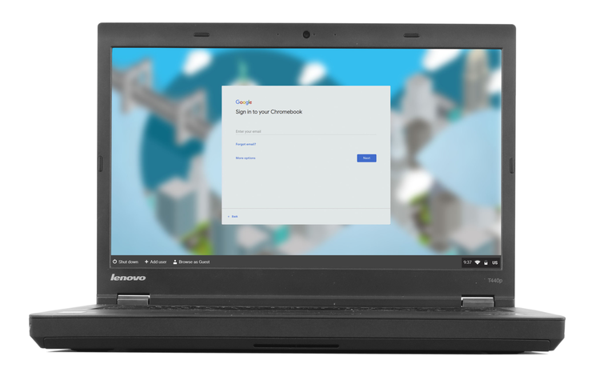

# Come installare CloudReady Os

CloudReady Os è un sistema operativo basato su Chromium OS, proprio come Chrome OS il sistema operativo utilizzato nei chromebook.

Neverware è un'azienda tecnologica con sede a New York ed ha sviluppato CloudReady, una distribuzione di Chrome OS progettata per essere installata su computer esistenti (in contrapposizione alla versione commerciale di Google, Chrome OS , che viene venduto principalmente come software pre-caricato sul netbook ). Neverware commercializza CloudReady come un mezzo per riutilizzare i computer più vecchi (in particolare nelle scuole), riducendo così i rifiuti elettronici.

# Download

Scarica lo strumento **USB maker** di cloudReady da [qui](https://www.neverware.com/freedownload#intro-text).
Provvederà a scaricare l'immagine di cloudReady os e creare il supporto di avvio attraverso una penna USB.

# Avvia

Una volta che la penna USB è pronta la procedura è del tutto analoga all'installazione di qualsiasi altro sistema operativo desktop. 
Dovrai quindi collegare la penna USB, accedere al BIOS e impostare come priorità di boot l'avvio tramite penna USB.

