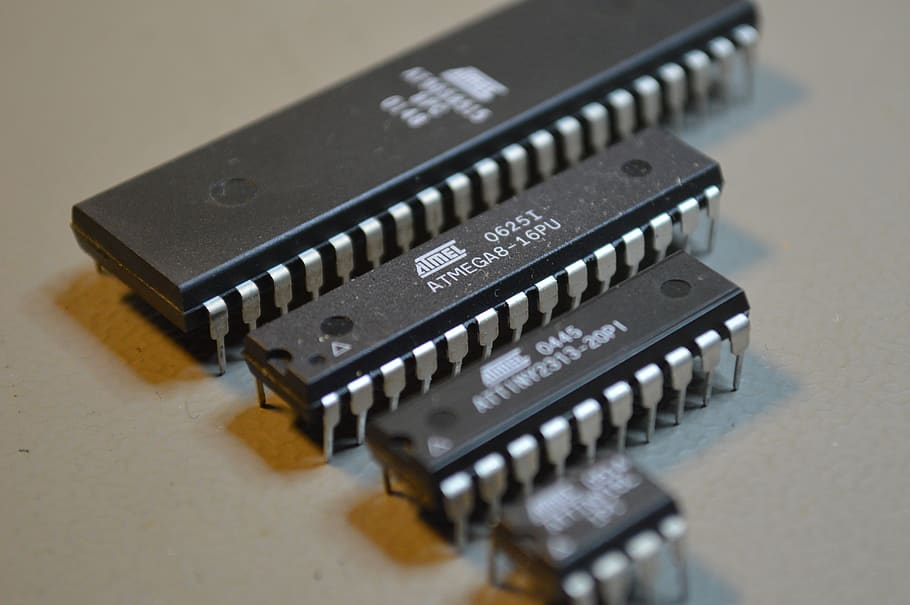

# Arduino

Arduino è una scheda elettronica per realizzare prototipi. Il cuore di arduino è il **microcontrollore**. Il modello **Arduino UNO R3** utilizza il microcontrollore **Atmega328P**.

Un microcontrollore (in inglese microcontroller in acronimo MCU ovvero MicroController Unit), in elettronica digitale, è un dispositivo elettronico integrato su singolo circuito elettronico, nato come evoluzione alternativa al microprocessore e utilizzato generalmente in sistemi embedded ovvero per applicazioni specifiche di controllo digitale.

La scehda di Arduino, attraverso il microcontrollore, comunica con il mondo esterno attraverso i suoi PIN. Un microcontrollore in genere svolge un compito molto specifico come leggere il valore di certi sensori collegati in ingresso o settare le uscite collegate a qualche attuatore. Ci sono molti componenti elettronici interfacciabili direttamente con Arduino

