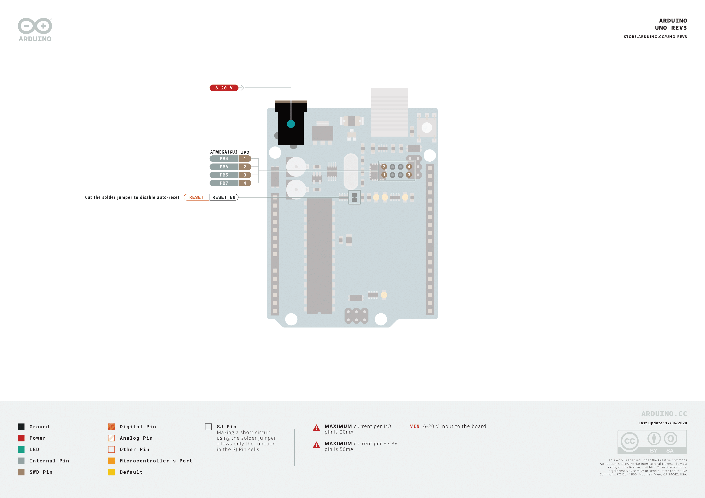
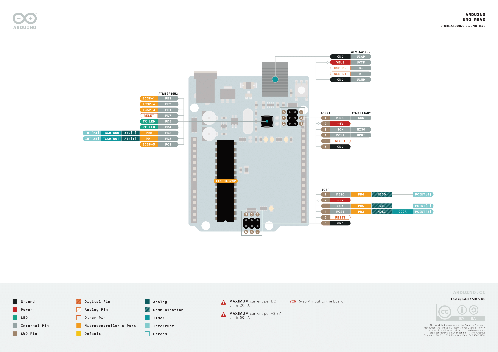
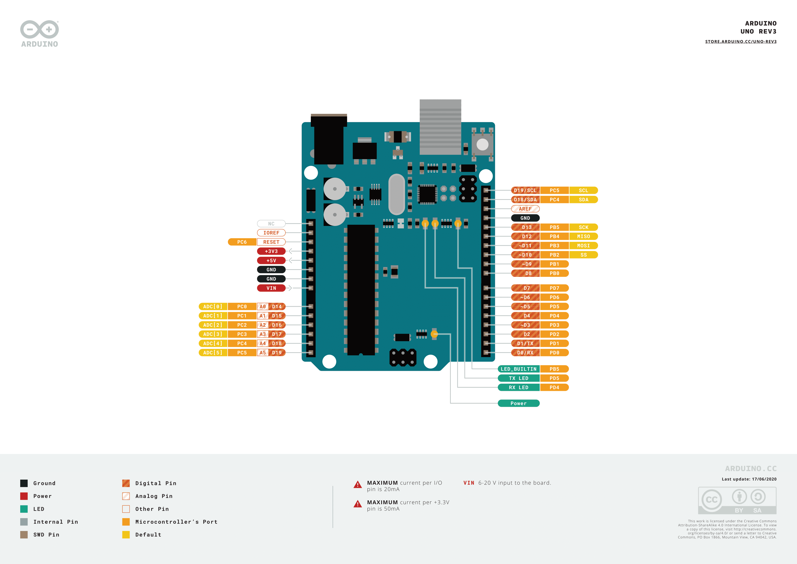

# Come alimentare Arduino

Puoi alimentare Arduino con il connettore DC con una tensione nel range `6-20V`

Puoi inoltre utilizzare il cavo usb collegato a PC o un a un caricatore per smartphone. Il cavo USB è inoltre indispensabile per il caricamento del programma da PC alla memoria interna del microcontrollore

Puoi alimentare Arduino *manualmente* attraverso il pin `Vin` con una tensione esatta di `5V`.

Una volta alimentato Arduino puoi prelevare le tensioni di `5v`, `3.3v` e il riferimento `GND` dagli omonimi pin.

Esiste inoltre un tasto `RESET` che consente il riavvio di Arduino.

E' possibile inoltre riavviare Arduino attraverso il pin `RESET` con un apposito *segnale di reset*.
