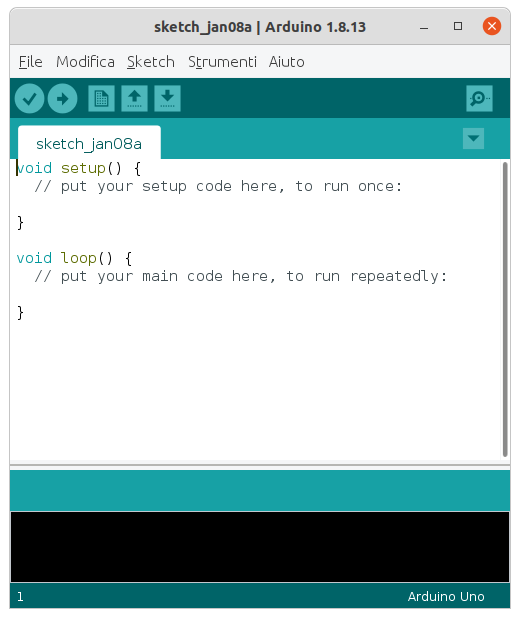

# Sketch

Lo `Sketch` è il programma, la logica. Arduino utilizza come linguaggio di programmazione il `C++` ma fornisce anche delle funzioni di interfacciamento o meglio delle **classi** e dei **metodi** per l'accesso in modo semplificato all'Hardware. Per far ciò, all'accensione del microcontrollore, Arduino configura i registri interni dei moduli del microcontrollore con un settaggio standard e "maschera" queste operazioni all'utente finale mostrando solo due macroblocchi:

- **setup**
- **loop**

In linea generale possiamo affermare che:

- **setup:** i comandi scritti all'interno di questo blocco vengono eseguiti una sola volta all'avvio di Arduino.
- **loop** i comandi scritti all'interno di questo blocco vengono eseguiti ciclicamente dopo l'avvio di Arduino fino al riavvio o spegnimento della board.

# Driver necessari

Normalmente, installando l'IDE Arduino ti troverai installati anche tutti i driver necessari per comunicare con la scheda. Se acquisti un Arduino clone tuttavia potresti aver bisogno dei driver (per Windows) poichè spesso i componenti hardware non sono proprio gli stessi. Da [questa pagina](http://www.wch-ic.com/downloads/CH341SER_EXE.html) è possibile scaricare i driver necessari. Trovi un file eseguibile anche all'interno di questa repository al percorso `files/CH341SER.EXE`