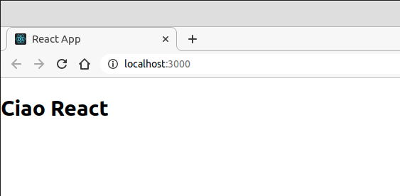
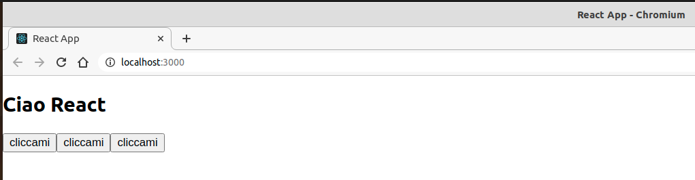
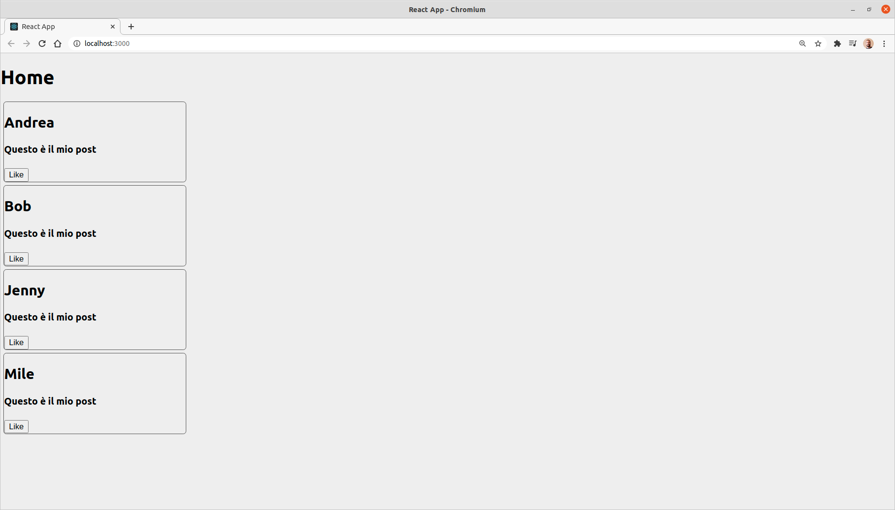

# React.js

- [React.js](#reactjs)
- [Prerequisiti](#prerequisiti)
- [React.js in pratica](#reactjs-in-pratica)
  - [Strumenti necessari](#strumenti-necessari)
  - [Hello react!](#hello-react)
- [Folder structure react app](#folder-structure-react-app)
  - [Package.json](#packagejson)
  - [Folder public](#folder-public)
  - [Folder src](#folder-src)
    - [App.js](#appjs)
    - [Index.js](#indexjs)
- [React component](#react-component)
  - [Partiamo da zero](#partiamo-da-zero)
  - [Divertiamoci un po'](#divertiamoci-un-po)
    - [Creaiamo Qualcosa di più interessante](#creaiamo-qualcosa-di-più-interessante)
    - [Aggiungiamo un po' di stile](#aggiungiamo-un-po-di-stile)
- [Props](#props)
- [Stato](#stato)
- [Hooks](#hooks)

# Prerequisiti

React è una libreria Javascript utilizzata per creare applicazioni web e usa la sintassi [jsx](), un mix tra [html]() e [javascript](). Per poter padroneggiare react avrai bisogno di conoscere Javascript, html e css.

# React.js in pratica

Puoi trovare un tutorial ben fatto sulla pagina ufficiale di [react.js](https://it.reactjs.org/docs/getting-started.html#learn-react). Ti proporrà due tipi di tutorial, uno pratico basato sulla costruzione del gioco del tris e uno passo passo in cui potrai apprendere i concetti di react un po' alla volta.

## Strumenti necessari

Per creare un'app react avrai bisogno di:
- [nodejs]()
- script `create-react-app`

Se hai una delle ultime versioni di nodejs, avrai incluso anche `npx` un comando che ti permette di installare degli script come `create-react-app`, eseguirlo e successivamente cancellarlo. In questo modo eviti di installare script a livello globale.

## Hello react!

Se vuoi creare un'applicazione react, digita da terminale:

```bash
npx create-react-app my-app
```

Il comando crea la cartella `my-app`, installa le librerie React e
React-DOM con le loro dipendenze, configura il package.json e crea i file di un'applicazione di esempio..

```bash
Success! Created my-app at /home/s/Repository/corso-react/my-app
Inside that directory, you can run several commands:

  npm start
    Starts the development server.

  npm run build
    Bundles the app into static files for production.

  npm test
    Starts the test runner.

  npm run eject
    Removes this tool and copies build dependencies, configuration files
    and scripts into the app directory. If you do this, you can’t go back!

We suggest that you begin by typing:

  cd my-app
  npm start

Happy hacking!
```

Se, come suggerito, entri nella root principale della tua applicazione e lanci il comando `npm start` vedrai partire un'app di default

```bash
cd my-app
npm start
```


# Folder structure react app

Lanciando lo script `crete-react-app` verrà creat una folder structure di questo tipo:

```bash
my-app
├── README.md
├── node_modules
├── package.json
├── .gitignore
├── public
│   ├── favicon.ico
│   ├── index.html
│   └── manifest.json
└── src
    ├── App.css
    ├── App.js
    ├── App.test.js
    ├── index.css
    ├── index.js
    ├── logo.svg
    └── serviceWorker.js
    └── setupTests.js
```

## Package.json
Il file `package.json` è un file di configurazione e contiene tra le altre cose il nome dell'applicazione, la versione, le dipendeze ovvero i pacchetti npm necessari a react, scripts..

```json
{
  "name": "my-app",
  "version": "0.1.0",
  "private": true,
  "dependencies": {
    "@testing-library/jest-dom": "^5.11.9",
    "@testing-library/react": "^11.2.3",
    "@testing-library/user-event": "^12.6.2",
    "react": "^17.0.1",
    "react-dom": "^17.0.1",
    "react-scripts": "4.0.1",
    "web-vitals": "^0.2.4"
  },
  "scripts": {
    "start": "react-scripts start",
    "build": "react-scripts build",
    "test": "react-scripts test",
    "eject": "react-scripts eject"
  },
  "eslintConfig": {
    "extends": [
      "react-app",
      "react-app/jest"
    ]
  },
  "browserslist": {
    "production": [
      ">0.2%",
      "not dead",
      "not op_mini all"
    ],
    "development": [
      "last 1 chrome version",
      "last 1 firefox version",
      "last 1 safari version"
    ]
  }
}

```

## Folder public

```bash
├── public
│   ├── favicon.ico
│   ├── index.html
│   └── manifest.json
```


Contiene il file `index.html` ovvero l'entry point dell'applicazione react.

```html
<!DOCTYPE html>
<html lang="en">
  <head>
    <meta charset="utf-8" />
    <link rel="icon" href="%PUBLIC_URL%/favicon.ico" />
    <meta name="viewport" content="width=device-width, initial-scale=1" />
    <meta name="theme-color" content="#000000" />
    <meta
      name="description"
      content="Web site created using create-react-app"
    />
    <link rel="apple-touch-icon" href="%PUBLIC_URL%/logo192.png" />
    <!--
      manifest.json provides metadata used when your web app is installed on a
      user's mobile device or desktop. See https://developers.google.com/web/fundamentals/web-app-manifest/
    -->
    <link rel="manifest" href="%PUBLIC_URL%/manifest.json" />
    <!--
      Notice the use of %PUBLIC_URL% in the tags above.
      It will be replaced with the URL of the `public` folder during the build.
      Only files inside the `public` folder can be referenced from the HTML.

      Unlike "/favicon.ico" or "favicon.ico", "%PUBLIC_URL%/favicon.ico" will
      work correctly both with client-side routing and a non-root public URL.
      Learn how to configure a non-root public URL by running `npm run build`.
    -->
    <title>React App</title>
  </head>
  <body>
    <noscript>You need to enable JavaScript to run this app.</noscript>
    <div id="root"></div>
    <!--
      This HTML file is a template.
      If you open it directly in the browser, you will see an empty page.

      You can add webfonts, meta tags, or analytics to this file.
      The build step will place the bundled scripts into the <body> tag.

      To begin the development, run `npm start` or `yarn start`.
      To create a production bundle, use `npm run build` or `yarn build`.
    -->
  </body>
</html>
```

La cosa da notare è che il body non contiene niente tranne un `div` vuoto con `id="root"`.

## Folder src

```bash
└── src
    ├── App.css
    ├── App.js
    ├── App.test.js
    ├── index.css
    ├── index.js
    ├── logo.svg
    └── serviceWorker.js
    └── setupTests.js
```

L'applicazione react si sviluppa intorno ai file: `App.js` e `index.js`

### App.js

```jsx
import logo from './logo.svg';
import './App.css';

function App() {
  return (
    <div className="App">
      <header className="App-header">
        
        <p>
          Edit <code>src/App.js</code> and save to reload.
        </p>
        <a
          className="App-link"
          href="https://reactjs.org"
          target="_blank"
          rel="noopener noreferrer"
        >
          Learn React
        </a>
      </header>
    </div>
  );
}

export default App;
```

Osserva che

1. **tutto è racchiuso dentro una funzione Javascript chiamata `App`**

```jsx
function App() {
  return (
    //..
  );
}
```

2. La funzione `App` ha come valore di `return` delle linee di codice molto somiglianti ad `html` anche se viene compilato e tradotto in javascript. Questa particolare sintassi è chiamata `JSX`

```html
    <div className="App">
      <header className="App-header">
        
        <p>
          Edit <code>src/App.js</code> and save to reload.
        </p>
        <a
          className="App-link"
          href="https://reactjs.org"
          target="_blank"
          rel="noopener noreferrer"
        >
          Learn React
        </a>
      </header>
    </div>
```

3. la funzione `App` è esportata esternamente.

```jsx
export default App;
```

### Index.js

```jsx
import React from 'react';
import ReactDOM from 'react-dom';
import './index.css';
import App from './App';
import reportWebVitals from './reportWebVitals';

ReactDOM.render(
  <React.StrictMode>
    <App />
  </React.StrictMode>,
  document.getElementById('root')
);

// If you want to start measuring performance in your app, pass a function
// to log results (for example: reportWebVitals(console.log))
// or send to an analytics endpoint. Learn more: https://bit.ly/CRA-vitals
reportWebVitals();
```

# React component

Un componente in react è un file che rappresenta un elemento grafico. Un componente contiene tutto il codice necessario per poter essere rappresentato quindi codice `html, css, javascript`. La forza di react sta nel poter creare un componente e riutilizzarlo a piacimento in ogni punto dell'applicazione

## Partiamo da zero

Entra nel file `App.js` e sentiti libero di cancellare tutto. Partiamo da qualcosa di più semplice

```Javascript
//App.js
import React from 'react';

function App(){
  return(
    <div>
      <h2>Ciao React</h2>
    </div>
  )
}

//Equivale a
//React.createElement(div)

export default App;
```

Otterrai:



Quello che hai fatto è scrivere codice `JSX` cioè codice simil-html compilato da react in modo che appaia come codice javascript.

Apri anche il file `index.js` e osserva le importazioni

```javascript
//index.js
import React from 'react';
import ReactDOM from 'react-dom';
import './index.css';
import App from './App';
import reportWebVitals from './reportWebVitals';

ReactDOM.render(
  <React.StrictMode>
    <App />
  </React.StrictMode>,
  document.getElementById('root')
);

// If you want to start measuring performance in your app, pass a function
// to log results (for example: reportWebVitals(console.log))
// or send to an analytics endpoint. Learn more: https://bit.ly/CRA-vitals
reportWebVitals();
```

Noterai l'importazione di `App`

```javascript
import App from './App';
```

Nota anche come react si connette alla vera pagina in esecuzione `/public/index.html`, cioè attraverso il metodo `ReactDOM.render()` `document.getElementById('root')`

```javascript
ReactDOM.render(
  <React.StrictMode>
    <App />
  </React.StrictMode>,
  document.getElementById('root')
);
```

Ricordiamo infatti che la pagina in esecuzione è proprio `/public/index.html`

```html
<!DOCTYPE html>
<html lang="en">
  <head>
    <meta charset="utf-8" />
    <link rel="icon" href="%PUBLIC_URL%/favicon.ico" />
    <meta name="viewport" content="width=device-width, initial-scale=1" />
    <meta name="theme-color" content="#000000" />
    <meta
      name="description"
      content="Web site created using create-react-app"
    />
    <link rel="apple-touch-icon" href="%PUBLIC_URL%/logo192.png" />
    <!--
      manifest.json provides metadata used when your web app is installed on a
      user's mobile device or desktop. See https://developers.google.com/web/fundamentals/web-app-manifest/
    -->
    <link rel="manifest" href="%PUBLIC_URL%/manifest.json" />
    <!--
      Notice the use of %PUBLIC_URL% in the tags above.
      It will be replaced with the URL of the `public` folder during the build.
      Only files inside the `public` folder can be referenced from the HTML.

      Unlike "/favicon.ico" or "favicon.ico", "%PUBLIC_URL%/favicon.ico" will
      work correctly both with client-side routing and a non-root public URL.
      Learn how to configure a non-root public URL by running `npm run build`.
    -->
    <title>React App</title>
  </head>
  <body>
    <noscript>You need to enable JavaScript to run this app.</noscript>
    <div id="root"></div>
    <!--
      This HTML file is a template.
      If you open it directly in the browser, you will see an empty page.

      You can add webfonts, meta tags, or analytics to this file.
      The build step will place the bundled scripts into the <body> tag.

      To begin the development, run `npm start` or `yarn start`.
      To create a production bundle, use `npm run build` or `yarn build`.
    -->
  </body>
</html>
```

In particolare ti faccio notare:

```html
<body>
  <noscript>You need to enable JavaScript to run this app.</noscript>
  <div id="root"></div>
  <!--
    This HTML file is a template.
    If you open it directly in the browser, you will see an empty page.

    You can add webfonts, meta tags, or analytics to this file.
    The build step will place the bundled scripts into the <body> tag.

    To begin the development, run `npm start` or `yarn start`.
    To create a production bundle, use `npm run build` or `yarn build`.
  -->
</body>
```

In pratica, quello che viene fatto dal metodo `ReactDOM.render()` è prendere il componente `App` e inserirlo all'interno di `<div id="root"></div>`


## Divertiamoci un po'

Adesso aggiungerò un tasto e l'evento `click`

```javascript
import React from 'react';

function App(){
  return(
    <div>
      <h2>Ciao React</h2>
      <button onClick={() => console.log('tasto cliccato')}>cliccami</button>
    </div>
  )
}

//Equivale a
//React.createElement(div)

export default App;
```

Cliccando il tasto otterrai una stampa su console, `"tasto cliccato"`


Puoi farlo in un modo alternativo facendo uso di un metodo:

```javascript
import React from 'react';

function App(){
  const stampa = () => {
    console.log('tasto cliccato')
  }
  return(
    <div>
      <h2>Ciao React</h2>
      <button onClick={stampa}>cliccami</button>
    </div>
  )
}

//Equivale a
//React.createElement(div)

export default App;
```

Un altro modo è quello di creare un componente esterno

All'interno di `src` creo un nuovo file ad esempio `Stampa.js`

```javascript
//Stampa.js
import React from 'react'

function Stampa() {
  const stampa = () => {
    console.log('stampa');
  }
  return (
    <button onClick={stampa}>cliccami</button>
  )
}

export default Stampa;
```

A questo punto devo importarlo in `App.js` e mandando in esecuzione, tutto funzionerà come prima

```javascript
import React from 'react';
import Stampa from './Stampa';

//JSX
function App(){
  return(
    <div>
      <h2>Ciao React</h2>
      <Stampa />
    </div>
  )
}

//Equivale a
//React.createElement(div)

export default App;
```


Una creato un componente puoi riutilizzarlo ovunque, basterà importarlo

```javascript
import React from 'react';
import Stampa from './Stampa';

//JSX
function App(){
  return(
    <div>
      <h2>Ciao React</h2>
      <Stampa />
      <Stampa />
      <Stampa />
    </div>
  )
}

//Equivale a
//React.createElement(div)

export default App;
```



### Creaiamo Qualcosa di più interessante

Creo un componete `FacebookPosts.js`:

```javascript
//FacebookPosts.js
import React from 'react';

function Post() {
  return (
    <div>
      <h2>Autore</h2>
      <h4>Questo è il mio post</h4>
      <button>Like</button>
    </div>
  )
}

export default Post;
```

Lo importo nella `App.js`

```javascript
//App.js
import React from 'react';
import Post from './FacebookPosts';

//JSX
function App(){
  return(
    <div>
      <h1>Home</h1>
      <Post />
    </div>
  )
}

//Equivale a
//React.createElement(div)

export default App;
```
 Apparirà qualcosa del tipo:


### Aggiungiamo un po' di stile

Per aggiungere stile, puoi farlo in moduli `css`. In questo esempio aggiungeremo stile al componente `FacebookPosts.js` attraverso il file `App.css`

```javascript
//FacebookPosts.js
import React from 'react';
import './App.css';

function Post() {
  return (
    <div className="Post">
      <h2>Autore</h2>
      <h4>Questo è il mio post</h4>
      <button>Like</button>
    </div>
  )
}

export default Post;
```

```css
/*App.css*/
.Post{
  border: 1px solid #555;
  border-radius: 5px;
  margin: 5px 5px 0px 5px;
  display: flexbox;
  flex-direction: column;
  justify-content: center;
  width: 300px;
};
```

Apparirà qualcosa del tipo:


Puoi modificare anche il file `index.css` che rappresenta lo stile generale di tutta la pagina `html`

# Props

Per passare valori tra i componenti puoi usare `props`.

Ti faccio vedere un esempio in cui aggiungo dei Post e a ogni Post passo l'autore del post

```javascript
//App.js

import React from 'react';
import Post from './FacebookPosts';

//JSX
function App(){
  return(
    <div>
      <h1>Home</h1>
      <Post autore="Andrea" />
      <Post autore="Bob" />
      <Post autore="Jenny" />
      <Post autore="Mile" />
    </div>
  )
}

//Equivale a
//React.createElement(div)

export default App;
```

```javascript
//FacebookPost.js

import React from 'react';
import './App.css';

function Post(props) {
  return (
    <div className="Post">
      <h2>{props.autore}</h2>
      <h4>Questo è il mio post</h4>
      <button>Like</button>
    </div>
  )
}

export default Post;
```

Otterrai:



`props` è un oggetto che contiene proprietà da noi definite.

Vediamo un altro esempio.

```javascript
//App.js

import React from 'react';
import Post from './FacebookPosts';

//JSX
function App(){
  return(
    <div>
      <h1>Home</h1>
      <Post autore="Andrea" description="Mi piace il gelato"/>
      <Post autore="Bob" description="E' una bella giornata"/>
      <Post autore="Jenny" description="Mi piace il gatto"/>
      <Post autore="Mile" description="Mi piace il cane"/>
    </div>
  )
}

//Equivale a
//React.createElement(div)

export default App;
```

```javascript
//FacebookPost.js

import React from 'react';
import './App.css';

function Post(props) {
  return (
    <div className="Post">
      <h2>{props.autore}</h2>
      <h4>{props.description}</h4>
      <button>Like</button>
    </div>
  )
}

export default Post;
```


# Stato

Immagina queso problema semplice. Con un tasto voglio cambiare il valore di una varibile


```javascript
//App.js

import React from 'react';
import Post from './FacebookPosts';

//JSX
function App(){
  return(
    <div className="Container">
      <h1>Home</h1>
      <button>Incrementa</button>
      <h4>Counter: 4</h4>
    </div>
  )
}

//Equivale a
//React.createElement(div)

export default App;
```

In particolare, quello che vorrei fare è far sì che premendo il tasto `Incrementa` si incrementasse il valore che adesso è fisso a `4`

Come si fa?

Dobbiamo introdurre il concetto di `Stato`.

Mostro la soluzione, poi ne parliamo.

```javascript
//App.js

import React from 'react';
import Post from './FacebookPosts';

//JSX
class App extends React.Component{
  state = {
    number: 0
  }
  increment = () => {
    this.setState({
      number: this.state.number + 1
    })
  }
  render(){
    return(
    <div className="Container">
      <h1>Home</h1>
      <button onClick={this.increment}>Incrementa</button>
      <h4>Counter: {this.state.number}</h4>
    </div>
  );
  }

}

export default App;
```

1. Osserva che ho trasformato la funzione `App` in una classe. In particolare una classe che estende la classe `React.component`

```javascript
class App extends React.Component{
  render(){
    return(

    )
  );
}
```

2. Ho definito l'oggetto `state` che contiene la property `number`. `state` è un oggetto, una variabile che contiene lo stato del componente

```javascript
class App extends React.Component{
  state = {
    number: 0
  }
  render(){
    return(

    )
  );
}
```

3. Per accedere alla property `number` ho usato `this.state.number`

```javascript
class App extends React.Component{
  state = {
    number: 0
  }
  render(){
    return(
    <div className="Container">
      <h1>Home</h1>
      <button>Incrementa</button>
      <h4>Counter: {this.state.number}</h4>
    </div>
  );
}
```

4. Ho definito un metodo che potesse incrementare la property definita

```javascript
increment = () => {
  this.setState({
    number: this.state.number + 1
  })
}
```

# Hooks

Con gli Hooks è possibile cambiare lo stato con la notazione a funzione anzichè quella di classe.

Vediamo un esempio pratico.

```javascript
//App.js
import React, {useState} from 'react';

//JSX
function App(){

  const [count, setCount] = useState(0);
  const increment = () => {
    setCount(count + 1);
  }
  return(
    <div className="Cnt">
      <h1>Home</h1>
      <button onClick={increment}>Incrementa</button>
      <h4>Counter: {count}</h4>
    </div>
  );
}

//Equivale a
//React.createElement(div)

export default App;
```

Per adesso, continueremo a gestire lo stato con la notazione a classe. Più avanti approfondiremo il concetto di hooks e sarai libero di utilizzare la notazione che più ti piace. E' importante tuttavia conoscere entrambe le sintassi poichè in rete si trovano esempi con entrambi i metodi. E' bene tu sappia che React verte per utilizzare la notazione funzionale attraverso gli hooks.
