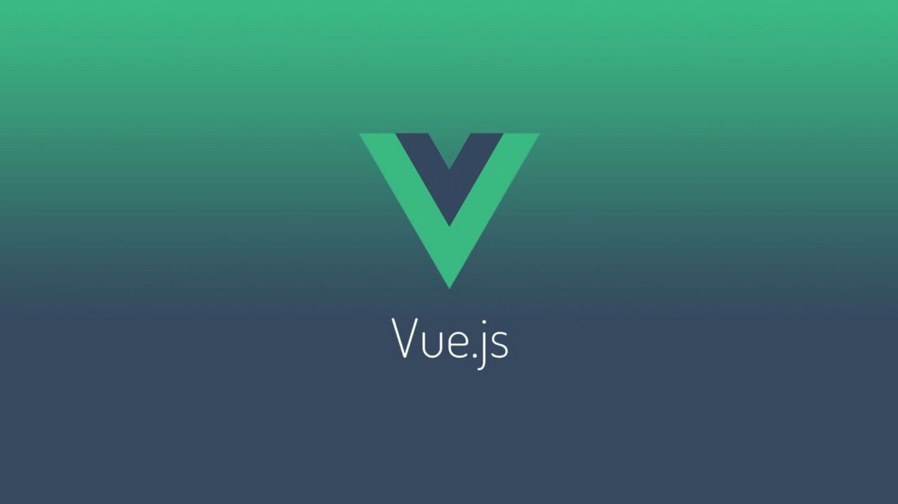

# Vue.js



[vue.js](https://vuejs.org/) è un framework javascript progressive per la realizzazione di **SPA** single page application.

Caratteristiche:

- Getione automatica dell'aggiornamento del DOM, **rendering dichiarativo**. Esiste quindi un binding (collegamento) diretto tra `html` e `javascript`, **reactive**
- Implementa il **Virtual dom**. Il runtime di vue decide cosa aggiornare del dom avendo quindi maggiori performance.
- Basato su componenti
- Integrato con typescript, sass, unit testing, node.js
- Routing e gestione dello stato

Puoi trovare una guida di riferimento [qui](https://www.mrw.it/javascript/guida-vue-js/)


## Prima applicazione vue.js

Crea in una directory un file `index.html` e un file `app.js`

```html
//index.html
<!DOCTYPE html>
<html lang="en">
<head>
  <meta charset="UTF-8">
  <meta name="viewport" content="width=device-width, initial-scale=1.0">
  <meta http-equiv="X-UA-Compatible" content="ie=edge">
  <title>Semplice Applicazione in Vue.js</title>
</head>
<body>

  <div id="app">
    <p>Hello, {{ name }}</p>
  </div>

  <script src="https://cdn.jsdelivr.net/npm/vue/dist/vue.js"></script>
  <script src="app.js"></script>

</body>
</html>
```

```javascript
//index.js
const vm = new Vue({
    el: '#app',
    data: {
      name: 'Vue'
    }
  });
```

- `el`: riferimento all'elemento controllato da vue
- `data`: con questo oggetto si stabilisce il binding tra valori `html` e `vue`, app.js. 
- `name` è **interpolato** dall'html utilizzando la sintassi:

```bash
{{ name }}
```


