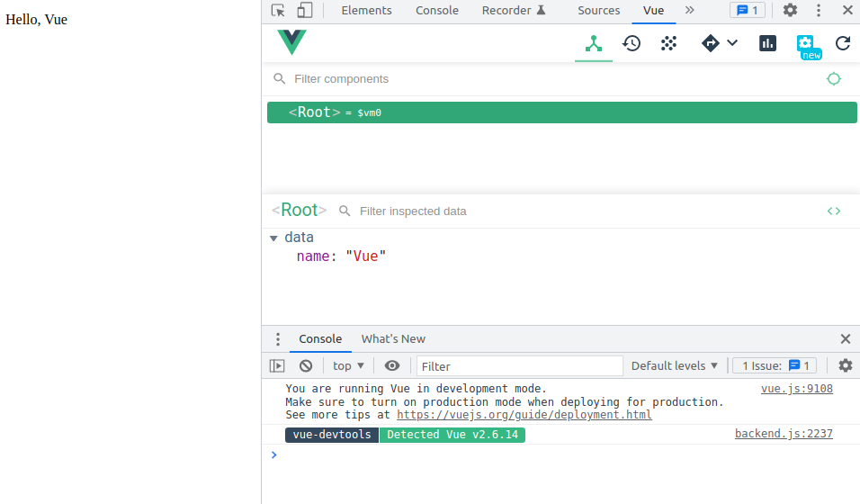

# Vue.js devtools

Vue.js devtools è un'estensione per google chrome (la trovi [qui](https://chrome.google.com/webstore/detail/vuejs-devtools/nhdogjmejiglipccpnnnanhbledajbpd/related)) che ti permette di avere un supporto a vue

