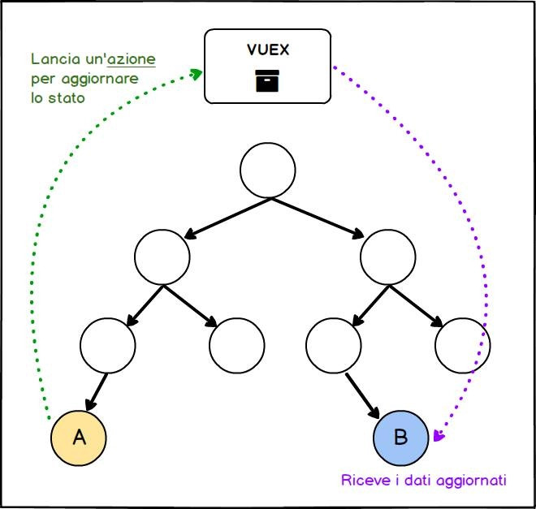

# Usare Vuex per la gestione dello stato di un'applicazione

## Cos'è Vuex
Col nome **Vuex** ci si riferisce ad un pattern e all'omonima libreria usata per la gestione dello stato di un'applicazione. Vuex prende ispirazione da **Redux** che a sua volta è nato sulla base del pattern Flux, sviluppato dal team di React con l'intento di creare un modo prevedibile, riproducibile ed affidabile per la gestione dei dati di un'applicazione.

Al contrario di Redux che è indipendente da qualsiasi libreria o framework, Vuex è stato realizzato per essere usato appositamente al fianco di Vue.js.

Quando si parla di stato di un'applicazione si fa riferimento ai dati da cui dipendono i componenti e che, quando vengono modificati, causano l'aggiornamento di questi ultimi. Per esempio, nel caso di un sito per la consegna del cibo a domicilio lo stato dell'applicazione è costituito dall'elenco dei ristoranti, dal loro menù di piatti e dai prodotti aggiunti al carrello prima di procedere all'acquisto. Se clicchiamo su un pulsante per aggiungere un nuovo prodotto al carrello, ci aspettiamo che l'applicazione aggiorni automaticamente i dati relativi all'ordine e di conseguenza gli opportuni componenti in modo da mostrare sempre le corrette informazioni.

## Perché usare Vuex

Cerchiamo allora di capire per quale motivo sono stati introdotti dei pattern come Vuex e che tipo di problemi intendono risolvere.

Vuex è particolarmente indicato in applicazioni di grandi dimensioni con numerosi componenti che formano una struttura ad albero piuttosto profondo.

Le applicazioni realizzate con Vue.js seguono il paradigma di flusso unidirezionale delle informazioni. In questo modo i dati vengono trasmessi in modo prevedibile scorrendo sempre dal componente radice verso i componenti figli. Questi ultimi inviano invece delle segnalazioni ai componenti di livello superiore tramite degli eventi.

Il meccanismo appena descritto permette di realizzare delle applicazioni in cui è sempre chiaro in che modo comunicano i componenti, ma crea delle difficoltà se le informazioni da scambiare devono percorrere l'intero albero dei componenti.

Immaginiamo infatti di rappresentare la struttura di una certa applicazione con l'immagine sottostante in cui ogni nodo costituisce un componente.

Se il componente A vuole comunicare con il componente B, deve lanciare un evento personalizzato che viene inoltrato verso l'alto fino al componente base il quale mantiene lo stato dell'applicazione. Dopo aver modificato opportunamente i dati, il componente base invia le informazioni aggiornate tramite Props al componente figlio e la procedura viene ripetuta fin quando i nuovi dati arrivano al componente B.

Per semplificare la comunicazione fra qualsiasi componente dell'applicazione ed evitare un flusso inutile e dispendioso di informazioni ed eventi, introduciamo allora una nuova entità in cui concentriamo i dati dell'intera applicazione. Quando uno dei componenti vuole modificare delle informazioni, invia una richiesta a quest'unica sorgente di dati. Quest'ultima effettua gli aggiornamenti e notifica i componenti che provvedono a mostrare i nuovi dati.

