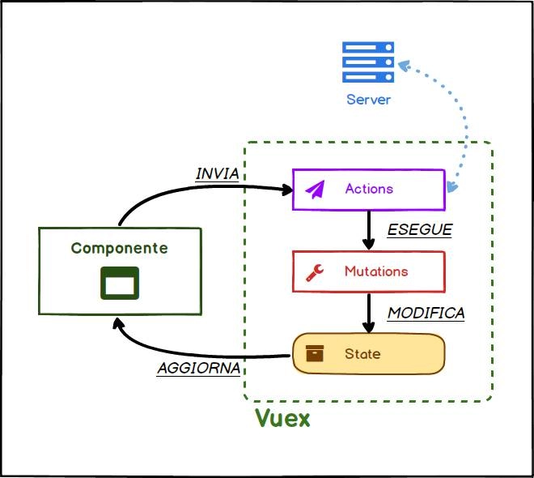

# Capire il funzionamento di Vuex

Vuex viene quindi introdotto per semplificare e rendere più prevedibile lo scambio di informazioni fra componenti.

In Vuex esiste infatti un'entità centrale, detta **Vuex Store** o semplicemente store, che *contiene i dati e fornisce gli strumenti per prelevarli o modificarli*.

Avendo già visto come definire un componente con l'Option API, la struttura dello store dovrebbe risultare familiare.

Per inizializzare lo Store, creiamo un nuovo oggetto che configuriamo come mostrato nel frammento di codice sottostante.

```js
export default new Vuex.Store({
  state: {},
  mutations: {},
  actions: {},
  getters: {}
});
```

Distinguiamo quindi 4 proprietà di cui parleremo nel resto della lezione.

- state
- mutations
- actions
- modules



Attraverso la proprietà **state** definiamo quali sono i **dati** che compongono lo **stato dello store** e quindi dell'applicazione.

**Un componente può ottenere i dati dello state** direttamente oppure attraverso una delle funzioni dell'oggetto **getters**. Possiamo pensare ai getters come le computed properties per uno store Vuex.

**Per modificare i dati dello store, un componente può invece eseguire una mutation**. Si tratta di semplici funzioni che hanno il compito di aggiornare in modo sincrono lo stato dello store.

Le mutations hanno però un limite: **non possono eseguire del codice asincrono**. Non è per esempio possibile effettuare una richiesta ad un server remoto all'interno di una mutation.

**Per questo motivo esistono le actions che possono essere asincrone e possono invocare una o più mutations**. Si tratta anche in questo caso di banali funzioni a cui Vuex passa degli argomenti che vedremo in dettaglio nel resto della lezione.

Di solito, se un componente vuole modificare i dati dello store, lancia una certa action che esegue una mutation. Quest'ultima ha poi il compito di modificare i dati dello state.

Non appena lo stato dello store subisce una modifica, vengono opportunamente aggiornati i componenti.

