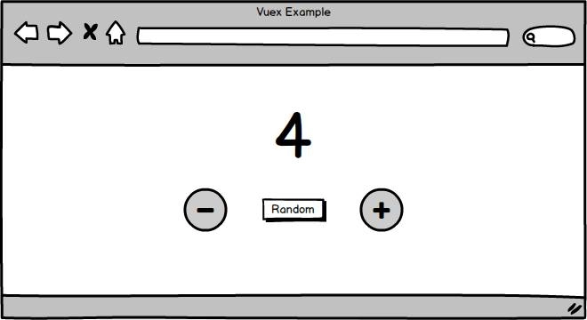

# Esempio di applicazione in Vuex

Creiamo allora un semplice esempio per illustrare in pratica il funzionamento di Vuex. Si tratta di un'applicazione la cui interfaccia presenta tre pulsanti: uno consente di ottenere un nuovo numero casuale, gli altri due permettono di decrementarlo e incrementarlo rispettivamente.



Il numero casuale non viene generato dall'applicazione nel browser, bensì da un server al quale inviamo una richiesta di tipo GET per ottenere un nuovo valore.

Spostiamoci allora in una nuova cartella e lanciamo il comando `vue create vuex-example`. Selezioniamo poi `Manually select features` attraverso i tasti freccia e premiamo il tasto INVIO.

- Sempre attraverso i tasti freccia, navighiamo fra le funzionalità che vogliamo aggiungere al nostro progetto e confermiamo con la barra spaziatrice (Babel, Vuex, Linter / Formatter).


- Selezioniamo poi ESLint + Prettier come linter/formatter.

- Successivamente scegliamo l'opzione Lint on save.

- Indichiamo a Vue di creare dei file separati per la configurazione di Eslint e Prettier.
  
- Infine scegliamo di non salvare la configurazione per progetti successivi.

Aspettiamo che Vue CLI completi la procedura di generazione dei file e dopo qualche minuto verrà creata una nuova cartella vuex-example con i seguenti file (omettiamo la cartella node_modules per semplicità).

```sh
tree vuex-example -aF --dirsfirst -I node_modules
vuex-example
├── public/
│   ├── favicon.ico
│   └── index.html
├── src/
│   ├── assets/
│   │   └── logo.png
│   ├── components/
│   │   └── HelloWorld.vue
│   ├── store/
│   │   └── index.js
│   ├── App.vue
│   └── main.js
├── .browserslistrc
├── .eslintrc.js
├── .gitignore
├── .prettierrc.js
├── README.md
├── babel.config.js
├── package-lock.json
└── package.json

5 directories, 15 files
```

Procediamo eliminando i file non necessari ed aggiungendo quelli che poi useremo nel resto dell'applicazione. Otteniamo quindi la seguente struttura della cartella base del progetto.

```sh
tree vuex-example -aF --dirsfirst -I node_modules
vuex-example
├── public/
│   ├── favicon.ico
│   └── index.html
├── src/
│   ├── assets/
│   │   └── logo.png
│   ├── components/
│   │   ├── CounterButtons.vue
│   │   ├── CounterDisplay.vue
│   │   └── LoadingSpinner.vue
│   ├── services/
│   │   └── RandomNumberService.js
│   ├── store/
│   │   └── index.js
│   ├── App.vue
│   └── main.js
├── .browserslistrc
├── .env.development
├── .eslintrc.js
├── .gitignore
├── .prettierrc.js
├── README.md
├── babel.config.js
├── package-lock.json
├── package.json
└── server.js

6 directories, 20 files
```

