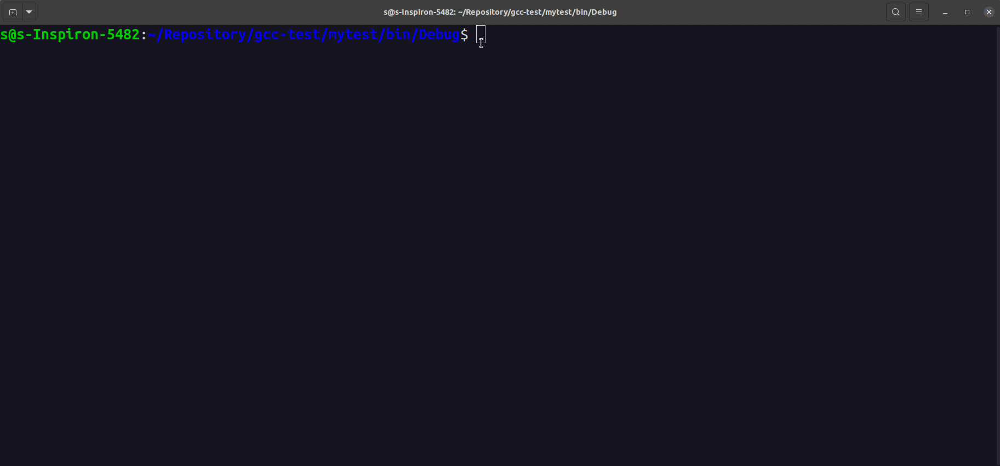
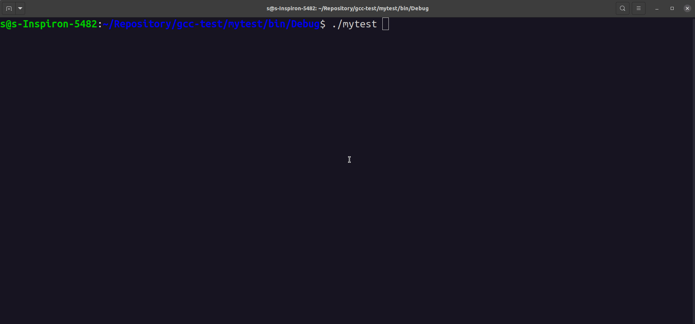
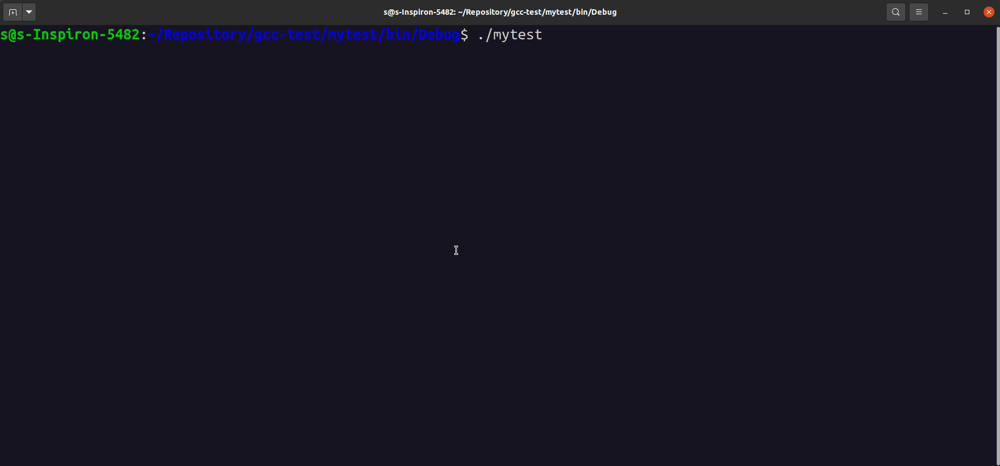
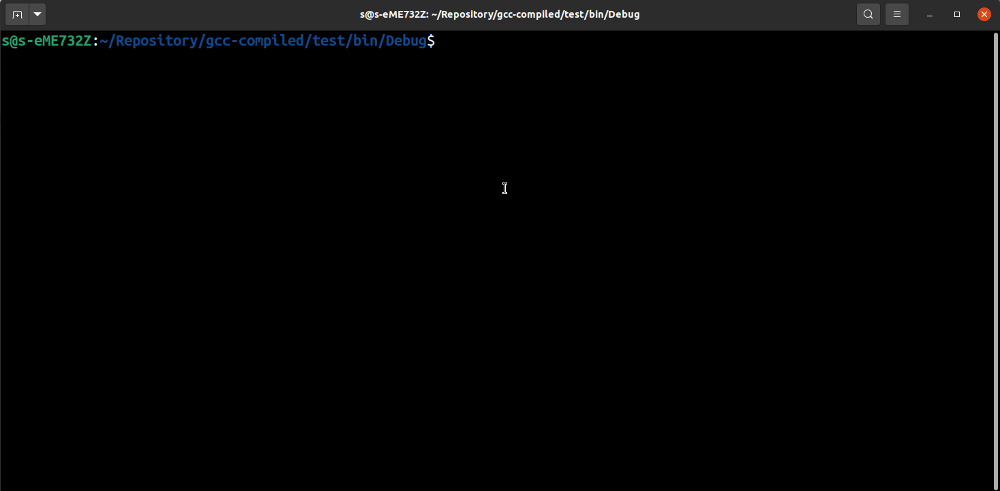
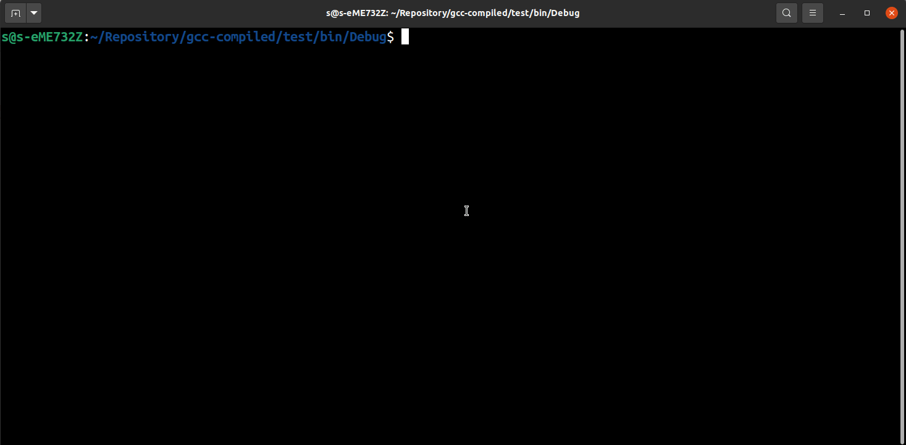

Raccolta di esempi in C++ ordinati secondo difficoltà
  
## Area e perimetro di un rettangolo

Restituisce area e perimetro di un rettangolo dati base e altezza immessi da tastiera

```c++
#include <iostream>
using namespace std;

int main()
{
    cout << "Title: Area e perimetro di un rettangolo" << '\n'
         << "Description: Restituisce area e perimetro di un rettangolo dati base e altezza immessi da tastiera" << '\n';

    double base, altezza, perimetro, area;
    cout << '\n' << "base:";
    cin >> base;
    cout << "altezza:";
    cin >> altezza;

    perimetro = 2 * ( base + altezza );     //Conversione implicita 2 -> 2.0
    area = base * altezza;

    cout << '\n' << "Perimetro: " << perimetro
         << '\n' << "Area: " << area << '\n';
}
```


## Da intero a decine centinaia e unita'

Acquisisce un numero intero positivo minore o uguale a 999 immesso da tastiera e stampa la scomposizione in centinaia, decine, unita'.

**Modo 1:** Uso del costrutto `if ... else`
```c++
#include <iostream>
using namespace std;

int main ()
{
    cout << "Title: Da intero a decine centinaia e unita'" << '\n'
         << "Description: Acquisisce un numero intero positivo minore o uguale a 999 immesso da tastiera e stampa la scomposizione in centinaia, decine, unita'" << '\n';

    int numero, centinaia, decine, unita;
    cout << '\n' << "Inserisci un numero positivo minore o uguale a 999."
         << '\n' << "Numero:";
    cin >> numero;
    if ( ( numero < 0 ) || ( numero > 999 ) )
        cout << '\n' << "Numero non valido";
    else
    {
        unita = numero % 10;
        decine = ( numero / 10 ) % 10;
        centinaia = numero / 100;

        cout << '\n' << "centinaia:" << centinaia
             << '\n' << "decine:" << decine
             << '\n' << "unita':" << unita
             << '\n';
    }
}
```

**Modo 2** Uso del ternary operator `... ? ... : ...`
```c++
#include <iostream>
using namespace std;

int main ()
{
    cout << "Title: Da intero a decine centinaia e unita'" << '\n'
         << "Description: Acquisisce un numero intero positivo minore o uguale a 999 immesso da tastiera e stampa la scomposizione in centinaia, decine, unita'" << '\n';

    int numero, centinaia, decine, unita;
    cout << '\n' << "Inserisci un numero positivo minore o uguale a 999."
         << '\n' << "Numero:";
    cin >> numero;
    //Forzo i numeri maggiori 999 a 999 e i numeri minori di 0 a 0.
    numero = ( numero > 0) ? ( numero < 999 ? numero : 999 ) : 0;

    unita = numero % 10;
    decine = ( numero / 10 ) % 10;
    centinaia = numero / 100;

    cout << '\n' << "centinaia:" << centinaia
         << '\n' << "decine:" << decine
         << '\n' << "unita':" << unita;
         << '\n';
}
```


## Negativo, nullo o positivo?

Acquisisce un numero intero da tastiera e stampa se è negativo, nullo o positivo

**Modo 1:** Uso del costrutto `if ... else`
```c++
#include <iostream>
using namespace std;

int main ()
{
    cout << "Title: Negativo, nullo o positivo?" << '\n'
         << "Description: Acquisisce un numero intero da tastiera e stampa se è negativo, nullo o positivo" << '\n';

    int numero;
    cout << '\n' << "Inserisci un numero intero." << '\n'
         << "Numero:";
    cin >> numero;

    if ( numero < 0 )
        cout << '\n' << "Negativo.";
    else if ( numero == 0 )
        cout << '\n' << "Nullo.";
    else
        cout << '\n' << "Positivo.";

    cout << '\n';
}
```

**Modo 2:** Uso del ternary operator `... ? ... : ...`
```c++
#include <iostream>
using namespace std;

int main ()
{
    cout << "Title: Negativo, nullo o positivo?" << '\n'
         << "Description: Acquisisce un numero intero da tastiera e stampa se è negativo, nullo o positivo" << '\n';

    int numero;
    cout << '\n' << "Inserisci un numero intero." << '\n'
         << "Numero:";
    cin >> numero;

    ( numero == 0 ) ? ( cout << '\n' << "Nullo." ) : ( (numero > 0) ? (cout << '\n' << "Positivo.") : (cout << '\n' << "Negativo.") );

    cout << '\n';
}
```



## Pari o Dispari?

Acquisisce un numero intero da tastiera e stampa se è pari o dispari

```c++
# include <iostream>
using namespace std;

int main(){
    cout << "Ttitle: Pari o dispari?" << '\n' 
         << "Description: Acquisisce un numero intero da tastiera e stampa se è pari o dispari\n";
        
    int n;
    cout << "Inserisci un numero:";
    cin >> n;

    (n%2) ? (cout << "Dispari.") : (cout << "Pari.");

    cout << '\n';
}
```




## Uguali ?

Acquisisce tre numeri interi da tastiera e stampa se sono uguali

```c++
#include <iostream>
using namespace std;

int main(){
    cout << "Title: Uguali ?\n"
         << "Acquisisce tre numeri interi da tastiera e stampa se sono uguali\n";

    int n1, n2, n3;
    cout << "Inserisci tre numeri interi." << '\n';
    cout << '\n' << "n1:";
    cin >> n1;
    cout << "n2:";
    cin >> n2;
    cout << "n3:";
    cin >> n3;

    if ( (n1 == n2) && (n2 == n3) )
        cout << '\n' << "Tutti uguali.";
    else if ( (n1 == n2) || (n1 == n3) || (n2 == n3) )
        cout << '\n' << "Due uguali.";
    else
        cout << '\n' << "Diversi.";
    
    cout << '\n';
}
```


## Da intero a carattere

Acquisisce un numero intero da tastiera e lo converte in un carattere stampabile

```c++
#include <iostream>
using namespace std;

int main(){
    cout << "Title: Da intero a carattere\n"
         << "Description: Acquisisce un numero intero da tastiera e lo converte in un carattere stampabile\n";

    int i;
    cout << "insercisci un numero:";
    cin >> i;

    //Se minore di 31 o maggiore di 127 forza a 32.
    i = ( (i < 32) || (i > 127) ) ? (i=32) : i;
    cout << char(i);

    cout << '\n';
}
```


## Da carattere a intero

Acquisisce un carattere da tastiera e lo converte nel corrispondente codice ASCII

```c++
#include <iostream>
using namespace std;

int main(){
    cout << "Title: Da carattere a intero\n"
         << "Description: Acquisisce un carattere da tastiera e lo converte nel corrispondente codice ASCII\n";

    char c;
    cout << "Inserisci un carattere: ";
    cin >> c;
    if ( ( (c >= 'a') && (c <= 'z') ) || ( (c >= 'A') && (c <= 'Z') ) )
        cout << "\nCodisce ASCII: " << int(c);
    else
        cout << "\nNon e' una lettera dell'alfabeto.";
    
    cout << '\n';
}
```



## Da minuscolo a maiuscolo

Acquisisce un carattere letterale minuscolo da tastiera e lo converte in un carattere letterale maiuscolo

```c++
#include <iostream>
using namespace std;

//0100 0000 -> MAIUSC
//0110 0000 -> min

//Devo mettere a 0 il quinto bit. Quindi min = (xx1x xxxx) & (1101 1111);
// 1101 1111 --> = ~(1<<5)
// ATT:
// 1<<5 = 0010 0000
// ~(1<<5) = 1101 1111

int main() {
    cout << "Title: Da minuscolo a maiuscolo\n"
         << "Description: Acquisisce un carattere letterale minuscolo da tastiera e lo converte in un carattere letterale maiuscolo\n";

    char c;
    cout << "Inserisci un carattere minuscolo: ";
    cin >> c;

    c &= ~( 1 << 5 );

    cout << "Il carattere maiuscolo e': " << c;

    cout << '\n';
}
```


## Da maiuscolo a minuscolo

Acquisisce un carattere letterale maiuscolo da tastiera e lo converte in un carattere letterale minuscolo

```c++
#include <iostream>
using namespace std;

//0100 0000 -> MAIUSC
//0110 0000 -> min

//Devo mettere a 1 il quinto bit. Quindi min = (xx1x xxxx) | (0010 0000);
// 0010 0000 --> = (1<<5)

int main() {
    cout << "Title: Da maiuscolo a minuscolo\n"
         << "Description: Acquisisce un carattere letterale maiuscolo da tastiera e lo converte in un carattere letterale minuscolo\n";

    char c;
    cout << "Inserisci un carattere MAIUSCOLO: ";
    cin >> c;

    c |= ( 1 << 5 );

    cout << "Il carattere minuscolo e': " << c;

    cout << '\n';
}
```


## Da minuscolo a maiuscolo e viceversa

Acquisisce un carattere letterale da tastiera e:
- Lo converte in maiuscolo se è minuscolo
- Lo converte in minuscolo se è maiuscolo
- Restituisce il carattere se non è una lettera

```c++
#include <iostream>
using namespace std;

//010x xxxx -> MAIUSC
//011x xxxx -> minusc
//La lettera 'k' differisce di 2^5 rispetto alla lettera 'K'
//Calcolo 'a' - 'A'

int main (){
    cout << "Title: Da minuscolo a maiuscolo e viceversa\n"
         << "Description: Acquisisce un carattere letterale da tastiera e:\n"
         << "- Lo converte in maiuscolo se è minuscolo\n"
         << "- Lo converte in minuscolo se è maiuscolo\n"
         << "- Restituisce il carattere se non è una lettera\n";

    char c;
    cout << "Inserisci un carattere: ";
    cin >> c;

    const int t = 'a' - 'A';               //Costante di conversione min<->MAIUSC

    if ( c >= 'a' && c <= 'z' ){
        c -= t;                            //Trasformo min->MAIUSC
        cout << "Il carattere maiuscolo e': " << c;
    }
    else if ( c >= 'A' && c <= 'Z' ){
        c += t;                            //Trasformo MAIUSC-min
        cout << "Il carattere minuscolo e': " << c;
    }
    else
        cout << "Il carattere inserito e': " << c;
    
    cout << '\n';
}
```


## Risolvi equazioni di II grado

Calcola i risultati di un equazione di secondo grado del tipo:

```math
ax^2 + bx + c = 0
```

Inserendo da tastiera i valori dei coefficienti `a`, `b`, `c`

```c++
#include <iostream>
#include <cmath>
using namespace std;

int main (){
    cout << "Ttile: Risolvi equazioni di II grado\n"
         << "Description: Calcola i risultati di un equazione di secondo grado del tipo:\n"
         << "ax^2 + bx +c = 0\n"
         << "Inserendo da tastiera i valori dei coefficienti a, b, c\n";

    double a,b,c, x1, x2, delta;
    cout << "\nInserisci i coefficienti a, b, c.\n\n";
    cout << "a:";
    cin >> a;
    cout << "b:";
    cin >> b;
    cout << "c:";
    cin >> c;

    if ( (a==0) && (b==0) && (c==0) )
        cout << "\nEquazione DEGENERE.";
    else if ( (a==0) && (b==0) )
        cout << "\nEquazione IMPOSSIBILE.";
    else if (a==0)
    {
        cout << "\nEquazione di PRIMO grado.";
        x1 = -b/c;
        cout << "\nx=" << x1;
    }
    else
    {
        delta = b*b - 4*a*c;
        if ( delta < 0 )
            cout << "\nx1, x2, soluzioni immaginarie.\n";
        else if ( delta == 0)
        {
            x1 = -b/(2*a);
            cout << "\nx1=x2=" << x1;
        }
        else
        {
            cout << "\nSoluzioni reali e distinte.\n";
            x1 = ( -b + sqrt(delta) )/ ( 2 * a );
            x2 = ( -b - sqrt(delta) )/ ( 2 * a );
            cout << "\nx1:" << x1 << "\nx2:" << x2;
        }
    }

    cout << '\n';
}
```


## Conta dispari da sequenza illimitata

Conta i numeri dispari inseriti da tastiera. Termina al primo negativo o nullo

**Modo 1:** Uso del ciclo `while()`
```c++
#include <iostream>
using namespace std;

/*
NOTA:
- Lo statemeant: conta += n%2;
- Equivake a: conta = conta + n%2;
- Equivale a: if ( n%2 ) conta++;
*/

int main (){
    cout << "Title: Conta dispari"
         << "Description: Conta i numeri dispari inseriti da tastiera. Termina al primo negativo o nullo.\n";

    int n, conta = 0;
    cout << "n: ";
    cin >> n;

    while ( n > 0 ){
        conta += n % 2;
        cout << "n: ";
        cin >> n;
    }
    cout << conta;

    cout << '\n';
}
```

**Modo 2:** Uso del ciclo `for(;;)`
```c++
#include <iostream>
using namespace std;

/*
NOTA:
- Lo statemeant: conta += n%2;
- Equivake a: conta = conta + n%2;
- Equivale a: if ( n%2 ) conta++;
*/

int main (){
    cout << "Title: Conta dispari\n"
         << "Description: Conta i numeri dispari inseriti da tastiera. Termina al primo negativo o nullo.\n";

    int n, conta = 0;
    cout << "n: ";
    cin >> n;

    for (;;)
    {
        if ( n>0 )
        {
            conta += n % 2;
            cout << "n: ";
            cin >> n;
        }
        else
            break;
    }
    cout << conta;

    cout << '\n';
}
```



## Stampa cifre

Stampa le cifre di un numero intero inserito da tastiera a partire da quella meno significativa.

```c++
#include <iostream>
using namespace std;

int main(){
    cout << "Title: Stampa cifre\n"
         << "Description: Stampa le cifre di un numero intero inserito da tastiera a partire da quella meno significativa.\n";

    int n;
    cout << "Inserisci un numero intero\n";
    cin >> n;

    n = ( n > 0 ) ? n : -n;

    cout << "Cifre:\n";
    do {
        cout << '>' << n%10 << '\n';
        n /= 10;
    } while ( n>0 );

    cout << '\n';
}
```


## Tavola pitagorica

Costruisce la tavola pitagorica dato l'ordine "n" immesso da tastiera.

```c++
#include <iostream>
using namespace std;

int main(){
    cout << "Title: Tavola pitagorica"
         << "Description: Costruisce la tavola pitagorica dato l'ordine 'n' immesso da tastiera.\n";

    int n;
    cout << "Inserisci l'ordine 'n' della tavola pitagorica:";
    cin >> n;
    cout << '\n';

    n = n < 1 ? 1 : n;

    for ( int i=1; i <= n; i++ ){
        for ( int j = 1; j <= n; j++ )
            cout << i*j << '\t';
        cout << "\n\n\n";
    }

    cout << '\n';
}
```



## Conta dispari da sequenza limitata

Riceve una sequenza di numeri da tastiera e conta i dispari. Termina anche se un numero inserito è nullo o negativo

```c++
#include <iostream>
using namespace std;

int main(){
    cout << "Title: Conta dispari da sequenza limitata"
         << "Description: Riceve una sequenza di numeri da tastiera e conta i dispari. Termina anche se un numero inserito è nullo o negativo\n";

    int M, n, conta = 0;
    cout << "Inserisci il numero di elementi della sequenza:";
    cin >> M;
    cout << "\nInserisci la sequenza:\n";
    cin >> n;
    conta += n % 2;

    for ( int i = 1; ( i < M ) && ( n > 0 ); i++ ){
        cin >> n;
        conta += n % 2;
    }

    cout << "\nI numeri dispari della sequenza sono:" << conta;

    cout << '\n';
}
```


## Sequenza crescente, decrescente o non ordinata?

Riceve da tastiera una sequenza di numeri interi e calcola se la sequenza è ordinata in modo crescente, decrescente o non ordinata

```c++
#include <iostream>
using namespace std;

int main(){
    cout << "Title: Sequenza crescente, decrescente o non ordinata?\n"
         << "Description: Riceve da tastiera una sequenza di numeri interi e calcola se la sequenza è ordinata in modo crescente, decrescente o non ordinata\n";

    int n, n1, n2, crescente = 0, decrescente = 0, uguale = 0;
    cout << "Immetti la Lunghezza della sequenza numerica:";
    cin >> n;
    cout << "\nImmetti la sequenza:\n";
    cin >> n1;

    for ( int i = 1; ( i < n ) ; i++ ){
        cin >> n2;
        crescente += n2 > n1;
        decrescente += n2 < n1;
        uguale += n2 == n1;
        n1 = n2;
    }

    if ( crescente == n-1 )
        cout << "CRESCENTE";
    else if ( decrescente == n-1 )
        cout << "DECRESCENTE";
    else if ( uguale == n-1 )
        cout << "UGUALE.";
    else
        cout << "NON ORDINATA.";

    cout << '\n';
}
```


## Vettore palindromo

Calcola se il vettore immesso da tastiera è palindromo

```c++
#include <iostream>
using namespace std;

void riempi ( int*, int );
void stampa ( int*, int );
int palindromo ( int*, int );

int main(){
    cout << "Title: Vettore palindromo"
         << "Description: Calcola se il vettore immesso da tastiera è palindromo\n";

    int nElem;
    cout << "Dimensione del vettore: ";
    cin >> nElem;

    nElem = ( nElem < 1 ) ? 1 : nElem;

    int *vett = new int[nElem];

    riempi( vett, nElem );
    stampa ( vett, nElem );
    if ( palindromo ( vett, nElem ) )
        cout << "Vettore palindromo.";
    else
        cout << "Vettore non palindromo.";
    
    cout << '\n';
}

void riempi ( int *v, int n ){
    for (int i = 0; i < n; i++){
        cout << "Elemento " << i+1 << ": ";
        cin >> v[i];                        //v[i] = *(v+i)
    }
}

void stampa ( int *v, int n ){
    cout << "\n[" << n << "] <" << v[0];
    for ( int i = 1; i < n; i++)
        cout << ", " << v[i];               //v[i] = *(v+i)
    cout << ">\n";
}

int palindromo ( int *v, int n ){
    for ( int i = 0, j = n-1; i < j; i++, j--){
        if ( v[i] != v[j] )                 //v[i] != v[j] -> *(v+i) != *(v+j)
            return 0;
    }
    return 1;
}
```


## Conta ricorrenza numerica

Conta la ricorrenza delle cifre 0-9 presenti nella sequenza inserita da tastiera

```c++
#include <iostream>
using namespace std;

void azzera ( int*, int);
void conta ( int*, int);
void stampa ( int*, int);

int main(){
    cout << "Title: Conta ricorrenza numerica\n"
         << "Description: Conta la ricorrenza delle cifre 0-9 presenti nella sequenza inserita da tastiera.\n";

    int LunghSeq, nElem = 10;
    int vettConta[nElem];            //Vettore conteggio cifre.
    azzera ( vettConta, nElem );

    cout << "Lunghezza sequenza: ";
    cin >> LunghSeq;
    cout << "Inserisci la sequenza:\n";

    conta ( vettConta, LunghSeq );
    stampa ( vettConta, nElem );

    cout << '\n';
}

void azzera ( int *v, int n ){
    for ( int i = 0; i < n; i++ )
        v[i] = 0;
}

void conta ( int *v, int l ){
    int num;
    for (int i = 0; i < l; i++ ){
        cin >> num;
        num = ( num >= 0) ? num : -num;     //Controllo sul segno.
        do{
            v[ num % 10 ]++;
            num = num / 10;
        } while ( num > 0 );
    }
}

void stampa ( int *v, int n ){
    for (int i = 0; i < n; i++)
        cout << '\n' << i << ':' << v[i];
    cout << '\n';
}
```

## Conta ricorrenza letterale

Conta la ricorrenza delle lettere contenute in una stringa
- I caratteri non alfabetici vengono ignorati
- Le maiuscole sono considerate muinuscole

```c++
#include <iostream>
using namespace std;

void azzera ( int*, int );
void contaLettere ( char*, int* );
void stampaLettere ( int*, int );

int main (){
    cout << "Title: Conta ricorrenza letterale\n"
    cout << "Description Conta la ricorrenza delle lettere contenute in una stringa\n"
         << "- I caratteri non alfabetici vengono ignorati\n"
         << "- Le maiuscole sono considerate muinuscole\n";

    char stringa [100];
    const int lettere = 26;
    int vettConta[lettere];
    cout << "Inserisci la stringa:";
    cin >> stringa;

    azzera ( vettConta, lettere );
    contaLettere ( stringa, vettConta );
    stampaLettere ( vettConta, lettere );

    cout << '\n';
}

void azzera ( int *v, int n){
    for ( int i = 0; i < n; i++ )
        v[i] = 0;
}

void contaLettere ( char *str, int *c ){
    for ( int i = 0; str[i] != '\0'; i++ ){
        if ( str[i] >= 'a' && str[i] <= 'z')
            c[ str[i] - 'a' ]++;
        else if ( str[i] >= 'A' && str[i] <= 'Z' )
            c[ str[i] - 'A' ]++;
    }
}

void stampaLettere ( int *v, int n ){
    for ( int i = 0; i < n ; i++ )
        cout << '\n' << char('a' + i) << ':' << v[i];
}
```

## Segno elementi di un vettore

Stampa il segno degli elementi di un vettore.

```c++
#include <iostream>
using namespace std;

int main(){
    cout << "Title: Segno elementi di un vettore\n"
         << "Description: Stampa il segno degli elementi di un vettore\n";

    int nElem, pos = 0, null = 0, neg = 0;
    cout << "Inserisci nElem: ";
    cin >> nElem;

    nElem = ( nElem > 0 ) ? nElem : 1;

    int *vett = new int[nElem];

    for ( int i = 0; i < nElem; i++ ){
        cout << "Elemento " << i+1 << ':';
        cin >> vett[i];
    }

    for ( int i = 0; i < nElem; i++ ){
        if ( vett[i] > 0 ) pos++;
        else if ( vett[i] == 0 ) null++;
        else neg++;
    }

    cout << "\nPos: " << pos
         << "\nNull: " << null
         << "\nNeg: " << neg;

    cout << '\n';
}
```


## Vettore - elementi dispari, nulli o pari?

Acquisisce un vettore da tastiera e restituisce il numero degli elementi dispari, nulli e pari in un vettore

```c++
#include <iostream>
using namespace std;

void leggi ( int*, int );
int dzp ( int, int*, int );

int main (){
    cout << "Title: Vettore - elementi dispari, nulli o pari?\n"
         << "Description: Acquisisce un vettore da tastiera Stampa il numero degli elementi dispari, nulli e pari in un vettore\n";

    int nElem, selettore;
    cout << "Inserisci il numero di elementi del vettore, nElem: ";
    cin >> nElem;
    nElem = nElem > 1 ? nElem : 1;

    //Riempi vettore
    cout << '\n';
    int *vett = new int[nElem];
    leggi ( vett, nElem );

    //Stampa il numero di elementi dispari
    selettore = -1;
    cout << "\nDispari: " << dzp ( selettore, vett, nElem );
    //Stampa il numero di elementi nulli
    selettore = 0;
    cout << "\nNulli: " << dzp ( selettore, vett, nElem );
    //Stampa il numero di elementi pari
    selettore = 1;
    cout << "\nPari: " << dzp ( selettore, vett, nElem );

    char c;
    cout << '\n' << "Comando?: (d = dispari, n = nulli, p = pari)";
    cin >> c;
    switch (c){
        case 'd':
           cout << "\nDispari: " << dzp ( -1, vett, nElem );
           break;
        case 'n':
            cout << "\nNulli: " << dzp ( 0, vett, nElem );
            break;
        case 'p':
            cout << "\nDispari: " << dzp ( 1, vett, nElem );
            break;
        default:
            cout << "!!!";
    }

    cout << '\n';
}

void leggi ( int *v, int n ){
    for ( int i = 0; i < n; i ++ ){
        cout << "Elemento " << i + 1 << ':';
        cin >> v[i];
    }
}

int dzp ( int sel, int *v, int n ){
    int conta = 0;
    switch (sel){
        case -1:
            for ( int i = 0; i < n; i++ ){
                v[i] = v[i] < 0 ? -v[i] : v[i];     //NECESSARIO!!
                conta += v[i]%2;
            }
            break;
        case 0:
            for ( int i = 0; i < n; i++ ){
                v[i] = v[i] < 0 ? -v[i] : v[i];     //NECESSARIO!!
                conta += ( v[i] == 0 );
            }
            break;
        case 1:
            for ( int i = 0; i < n; i++ ){
                v[i] = v[i] < 0 ? -v[i] : v[i];     //NECESSARIO!!
                conta += !( v[i]%2 || v[i] == 0 );

            }
            break;
    }
    return conta;
}
```

## Vettore - elementi ordinati? 

Acquisisce un vettore da tastiera e restitusice se gli elementi sono in ordine crescente, descrescente o non ordinati

```c++
#include <iostream>
using namespace std;

void leggi ( int*, int );
int ordinato ( int*, int );
void stampa ( int );

int main (){
    cout << "Title: Vettore - elementi ordinati? \n"
         << "Description: Acquisisce un vettore da tastiera e restitusice se gli elementi sono in ordine crescente, descrescente o non ordinati\n"; 

    int nElem;
    cout << "nElem: ";
    cin >> nElem;
    int *vett = new int [nElem];
    leggi ( vett, nElem );
    stampa ( ordinato( vett, nElem ) );

    cout << '\n';
}

void leggi ( int *v, int n ){
    for ( int i = 0; i < n; i++ ){
        cout << "El " << i + 1 << ':';
        cin >> v[i];
    }
}

int ordinato ( int *v, int n ){

    int decrescente = 1;
    int crescente = 1;
    int uguale = 1;

    for ( int i = 0; i < n - 1; i++ ){
        decrescente &= v[i] > v[i+1];
        crescente &= v[i] < v[i+1];
        uguale &= v[i] == v[i+1];
    }

    if ( decrescente ) return -1;
    if ( uguale ) return 0;
    if ( crescente ) return +1;
    return +2;
}

void stampa ( int ord ){
    switch ( ord ){
        case -1:
            cout << "\nVettore ordinato in senso decrescente.";
            break;
        case 0:
            cout << "\nElementi del vettore uguali.";
            break;
        case +1:
            cout << "\nVettore ordinato in senso crescente.";
            break;
        case +2:
            cout << "\nElementi del vettore non ordinati.";
    }
}
```

## Buffer circolare 

Inizializza un buffer circolare di una dimensione impostata da tastiera.
Sono disponibili i comandi:
- `i`: inserisci, inscerisce un elemento nel buffer
- `e`: estrai, estrai il primo elemento dal buffer in modoalità LIFO (last input, first output)
- `<`: termina

```c++
#include <iostream>
using namespace std;

// 'in' e 'out' devono essere inizialmente sovrapposti.
// 'in' e 'out' sono INDICI.
// COMANDO :
// i = inserisci
// e = estrai

struct buffer {
    int dimensione;
    int in;
    int out;
    int nElem;
    int *pHEAP;
};

void inizializza( buffer &buf , int dim );
int inserisci ( buffer &buf , int val );
int estrai ( buffer &buf , int &val );

int main () {
    cout << "Title: Buffer circolare\n"
         << "Description: Inizializza un buffer circolare di una dimensione impostata da tastiera.\n"
         << "Sono disponibili i comandi:\n" 
         << "- 'i': inserisci, inscerisce un elemento nel buffer\n"
         << "- 'e': estrai, estrai il primo elemento dal buffer in modoalità LIFO (last input, first output)\n"
         << "- '<': termina\n"

    buffer b1;
    int dim, val;
    char c;
    cout << "Inizializza il buffer.\n"
         << "Dimensione:";
    cin >> dim;
    inizializza ( b1, dim );
    cout << "\nInserisci un comando.\n"
         << "i -> inserisci.\n"
         << "e -> estrai.\n"
         << "< -> termina.\n";
    for (;;){
        cout << "\n\nComando?? ";
        cin >> c;
        if ( c == '<')
            break;
        switch (c){
            case 'i':{
                int i;
                cout << "\nImmetti un valore:";
                cin >> val;
                i = inserisci ( b1, val);
                if ( !i )
                    cout << "\n\nBUFFER PIENO.\n";
                break;
            }
            case 'e':{
                int i;
                i = estrai ( b1, val );
                if ( !i ){
                    cout << "\n\nBUFFER VUOTO.\n";
                    break;
                }
                else{
                    cout << "\nL'elemento vale: " << val;
                    break;
                }
            }
            default:
                break;
        }
    }

    cout << '\n';
}

void inizializza ( buffer& buf, int dim ){
    buf.in = 0;
    buf.out = 0;
    buf.nElem = 0;
    buf.dimensione = dim > 0 ? dim : 1;
    buf.pHEAP = new int [buf.dimensione];
}

int inserisci ( buffer& buf, int val){
    // Controllo se e' pieno.
    if ( buf.nElem >= buf.dimensione ){
        return 0;
    }
    // Inserisco l'elemento nel primo posto vuoto.
    buf.pHEAP [buf.in++] = val;
    buf.in = buf.in == buf.dimensione ? 0 : buf.in;
    buf.nElem++;
    return 1;
}

int estrai ( buffer& buf, int &val ){
    if ( buf.nElem <= 0 )
        return 0;
    val = buf.pHEAP [buf.out++];
    buf.out = buf.out == buf.dimensione ? 0 : buf.out;
    buf.nElem--;
    return 1;
}
```

## Contenitore 

Inizializza due contenitori di una dimensione impostata da tastiera contenenti lettere.
Sono disponibili i seguenti comandi:

- `i`: inizializza, inizializza un contenitore
- `>`: inserisci, iscerisce un elemento immesso da tastiera nel contenitore
- `<`: estrai, estrae un elmento da un contenitore
- `u`: Ritorna un contenitore con gli elementi a comune
- `d`: Ritorna un contenitore con gli elementi diversi

```c++
#include <iostream>
using namespace std;

struct contenitore {
    int nElem;
    int cap;
    int ee[26];
};

void inizializza ( contenitore &c, int N ){
    N = N > 1 ? N : 1;
    c.cap = N;
    for ( int i = 0; i < 26; i++ )
        c.ee[i] = 0;
    c.nElem = 0;
}

void inserisci ( contenitore &c, char p ){
    if ( c.nElem >= c.cap || p < 'a' || p > 'z' )
        return;
    c.ee[ p - 'a' ]++;
    c.nElem++;
}

void estrai ( contenitore &c, char p ){
    if ( p < 'a' || p > 'z' )
        return;
    c.nElem -= c.ee[ p - 'a' ];
    c.ee[ p - 'a' ] = 0;
}

void scrivi ( contenitore &c ){
    cout << '<';
    if ( c.ee [0] > 0 )
        cout << 'a' << ": " << c.ee[0];
        for ( int i = 1; i < 25; i++ ){
            if ( c.ee [i] == 0 )
            continue;
            cout << ", " << char ( 'a' + i ) << ": " << c.ee[i];
        }
        cout << '>';
}

contenitore cambiaCapienza ( const contenitore &c, int N ){
    if ( N < c.nElem )
        return c;
    contenitore t;
    t = c;
    t.cap = N;
    return t;
}

contenitore diversiE ( const contenitore &c1, const contenitore &c2 ){
    contenitore c3;
    int N;
    N = (c1.cap <= c2.cap) ? c1.cap : c2.cap;
    inizializza ( c3, N );
    for ( int i = 0; i < 26; i++ ){
        if ( c1.ee[i] == 0 || c2.ee[i] == 0 )
            continue;
        c3.ee[i] = 1;
        c3.nElem++;
    }
}

contenitore diversiN ( const contenitore &c1, const contenitore &c2 ){
    contenitore c3;
    int N;
    inizializza ( c3, c1.cap );
    for ( int i = 0; i < 26; i++ ){
        if ( c1.ee[i] > 0 || c2.ee[i] == 0 ){
            c3.ee[i] = 1;
            c3.nElem++;
        }
    }
    return c3;
}

int capienza ( const contenitore c ){
    return c.cap;
}

int quanti ( const contenitore c ) {
    return c.nElem;
}

int main (){
    cout << "Title: Buffer\n"
         << "Description: Inizializza due contenitori di una dimensione impostata da tastiera contenenti lettere.\n"
         << "Sono disponibili i seguenti comandi:\n"
         << "- `i`: inizializza, inizializza un contenitore\n"
         << "- `>`: inserisci, iscerisce un elemento immesso da tastiera nel contenitore\n"
         << "- `<`: estrai, estrae un elmento da un contenitore\n"
         << "- `u`: Ritorna un contenitore con gli elementi a comune\n"
         << "- `d`: Ritorna un contenitore con gli elementi diversi\n"

    /*
    contenitore c1, c2;
    cout << "\n\n"
         << "i: inizializza.\n"
         << ">: inserisci.\n"
         << "<: estrai.\n"
         << "c: cambia capienaza.\n"
         << "u: Ritorna un contenitore con gli elementi a comune.\n"
         << "d: Ritorna un contenitore con elementi diversi"
         << "q:"
    int capienza;
    int c;
    cout << "Inserisci capienza: ";
    cin >> capienza;
    */
    contenitore c1;
    inizializza ( c1, 5 );


    inserisci ( c1, 'a' );
    inserisci ( c1, 'b' );
    inserisci ( c1, 'a' );
    inserisci ( c1, 'a' );
    inserisci ( c1, 'd' );
    scrivi (c1);

    cout << '\n';
}
```