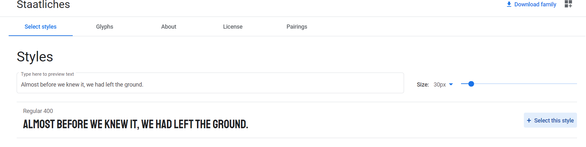

# CSS

- [CSS](#css)
- [Lezione 01](#lezione-01)
  - [Dove inserire il codice CSS?](#dove-inserire-il-codice-css)
  - [Inserire CSS all'interno della pagina HTML](#inserire-css-allinterno-della-pagina-html)
  - [Inserire CSS in un file esterno all'HTML](#inserire-css-in-un-file-esterno-allhtml)
- [Lezione 02](#lezione-02)
  - [Alcune proprietà CSS](#alcune-proprietà-css)
  - [Colori in CSS](#colori-in-css)
  - [Colore CSS Esadecimale](#colore-css-esadecimale)
  - [Perchè è utile questo metodo?](#perchè-è-utile-questo-metodo)
  - [Colore CSS RGB/RGBA](#colore-css-rgbrgba)
- [Lezione 03](#lezione-03)
  - [Background CSS](#background-css)
  - [`background-repeat: no-repeat;`](#background-repeat-no-repeat)
  - [`background-size: cover;`](#background-size-cover)
  - [Bordi CSS](#bordi-css)
  - [Quindi](#quindi)
- [Lezione 04](#lezione-04)
  - [Se volessi stilizzare in modo diverso un elemento appartenente alla stessa categoria?](#se-volessi-stilizzare-in-modo-diverso-un-elemento-appartenente-alla-stessa-categoria)
    - [Si può fare attraverso l'id](#si-può-fare-attraverso-lid)
    - [Si può fare anche attraverso l'uso di una classe](#si-può-fare-anche-attraverso-luso-di-una-classe)
  - [## Lezione 05](#-lezione-05)
    - [Altri selettori CSS](#altri-selettori-css)
    - [`*` Selector](#-selector)
    - [Descendant Selector.](#descendant-selector)
    - [Attribute selector.](#attribute-selector)
  - [## Lezione 06](#-lezione-06)
  - [Google developer tool](#google-developer-tool)
  - [Eredità e Specificità in CSS](#eredità-e-specificità-in-css)
    - [Eredità](#eredità)
    - [Specificità](#specificità)
  - [## Lezione 07](#-lezione-07)
  - [CSS Fonts](#css-fonts)
    - [Google fonts](#google-fonts)
  - [## Lezione 08](#-lezione-08)
    - [CSS Box Model](#css-box-model)
  - [Alcune Estensioni per VSCode](#alcune-estensioni-per-vscode)
  - [Block element](#block-element)
  - [Responsive Deign](#responsive-deign)
  - [Em / Rem](#em--rem)
  - [VH/VW](#vhvw)
  - [FLEXBOX](#flexbox)
  - [WEB HOSTING](#web-hosting)
    - [Shared Hosting](#shared-hosting)
    - [VPS (Virtual Private Server)](#vps-virtual-private-server)
    - [Dedicated Server](#dedicated-server)
  - [Cloud Hosting](#cloud-hosting)
  - [Static Hosting](#static-hosting)

# Lezione 01

Come abbiamo già detto, CSS sta per Cascading Style Sheet e serve quindi per "abbellire" lo stile nativo della pagina HTML. Vediamo la struttura del codice CSS:

```css
selettore{
    proprietà1: valore;
    proprietà2: valore;
}
```

Esempi:

Nell'esempio seguente attribuirò al selettore `h1` il colore "blue" e un font di "30 pixel".
```css
h1{
    color: blue;
    font-size: 30px;
}
```
In questo esempio invece all'attributo immagine associerò un bordo giallo di grandezza di 3 pixel.
```css
img{
    border-color: yellow;
    border-width: 3px;
}
```

## Dove inserire il codice CSS?
E' possibile aggiungere il codice CSS sia all'interno del file HTML, sia in un file esterno.

## Inserire CSS all'interno della pagina HTML
Per questo metodo ci sono due modi:

- Inserire la stilizzazione CSS all'interno della riga da stilizzare con l'attributo `style`. Questo metodo è sconsigliato, si faceva una volta quando il CSS non esisteva ma oggi è ancora valido.
<br>

```HTML
<p style="color: red;">
    sono un paragrafo rosso
</p>
```
<p style="color: red;">
    sono un paragrafo rosso
</p>

- Inserire la stilizzazione CSS con il tag `<style></style>` messo all'interno del tag `<head></head>` del boilerplate html. Questo è consigliato poichè in questo modo avremo tutto ciò che riguarda lo stile all'interno di questo tag.

```HTML
<!DOCTYPE html>
<html>
<head>

<style type="text/css">
    h1{
        color: blue;
    }
</style>

</head>
<body>

<h1>Ciao, sono un h1</h1>

</body>
</html>
```

## Inserire CSS in un file esterno all'HTML
**Questa è sicuramente la soluzione migliore**, è la più pulita e ordinata poichè separa il contenuto HTML che stabilisce la struttura della pagina dallo stile della stessa tramite CSS.

Una volta creato poi sarà necessario creare un collegamento tra i due file usando il `<link>` tag.

Ecco un esempio: <br>
`File CSS (06_HTML_CSS_Style.css)
`
```CSS
h1{
    color: black;
    background: yellow;
}
li{
    color: forestgreen;
}
```
`File HTML (06_HTML_CSS_ElementiBaseCSSEsterniAdHTML.html)`
```HTML
<!DOCTYPE html>
<html lang="en">
<head>
    <title>HTML - CSS Elementi Base</title>
    <link rel="stylesheet" href="06_HTML_CSS_Style.css">
</head>
<body>
    <h1>HTML - CSS Elementi Base</h1>
    <ul>
        <li>Primo ELemento</li>
        <li>Secondo Elemento</li>
    </ul>
</body>
</html>
```

<!DOCTYPE html>
<html lang="en">
<head>
    <title>HTML - CSS Elementi Base</title>
    <style type="text/css">
        #h1_0 {
            color: black;
            background: yellow;
        }
        #ul_0 li{
            color: green;
        }
    </style>
</head>
<body>
    <h1 id="h1_0">HTML - CSS Elementi Base</h1>
    <ul id="ul_0">
        <li>Primo ELemento</li>
        <li>Secondo Elemento</li>
    </ul>
</body>
</html>
Notare il `<link>` tag con `<href>` che linka il file CSS. Questa è sicuramente la soluzione migliore.

# Lezione 02

## Alcune proprietà CSS

In questo esempio riporterò alcune proprietà come l'inserimento di colori, bordi, immagini di background. Alcune proprietà sono rappresentate in modo diverso ma equivalenti.

## Colori in CSS

Vediamo come è possibile esprimere i colori in CSS.
Il metodo che abbiamo visto per adesso è un metodo "amatoriale" ma non è il metodo che i programmatori utilizzano.

Un altro metodo è utilizzare il *valore corrispondente esadecimale del colore*.

## Colore CSS Esadecimale

Ogni colore può essere espresso tramite una terna di valori esadecimali: <br>
```css
RED-GREEN-BLUE
a1 - f6 - 18
```

Ad ogni elemento della terna sono associati due numeri esadecimali in modo tale che il numero vada da 0 a 255. Cio' esprime l'intensità del colore appartenente alla terna.

Con tale terna è possibile rappresentare ogni tipo di colore.

Per rappresentare in CSS il colore in esadecimale è necessario anteporre al numero di sei cifre che rappresenta il colore il simbolo `#`

Es: `red = #ff0000` (ovviamente)


## Perchè è utile questo metodo?

Supponiamo di voler un colore specifico da creare utilizzando un qualsiasi color picker


Scegliendo tramite il color picker il colore desiderato e prelevando il valore esadecimale è possibile ottenere esattamente il valore creato. <br>
Molto utile e versatile rispetto a una serie di colori preimpostati.

## Colore CSS RGB/RGBA

Un altro metodo è utilizzare la terna `rgb()` . Funziona in modo molto simile ai colori in esadecimale, solo che in questo caso inseriremo una terna decimale nel range `0 -255`. Esempio: `rgb(173, 255, 47)`.

La funzione `rgba()` invece introduce l'elemento trasparenza (alpha). L'ultimo elemento infatti va da `0.0 - 1.0`
e rappresenta la trasparenza dell'elemento. Esempio: `rgba(34, 139, 34, 0.2)`, in questo caso la trasparenza sarà al 20%.

# Lezione 03

## Background CSS

Con la proprietà `background` è possibile specificare il colore del background dell'elemento.

Utile la proprietà `background` per impostare un colore della pagina. Per far ciò è possibile impostare la proprietà `background` per l'elemento `body`:

E' possibile impostare anche un'immagine. Per far ciò si usa la funzione `url()`. All'interno della funzione url inseriamo il link dell'immagine che vogliamo rappresentare come sfondo background della pagina.


E' possibile impostare anche alcune proprietà aggiuntiva come la `background-reapeat` o la `background-size`.

## `background-repeat: no-repeat;`

Con questa proprietà è possibile specificare se ripetere o meno l'immagine. Infatti di default, se l'immagine è piccola viene ripetuta, se è grande viene adattata alla pagina. Con questa proprietà  quindi possibile specificare se ripetere o meno l'immagine.

## `background-size: cover;`

Con questa proprietà l'immagine selezionata andrà a riempire tutto lo schermo e se è piu' piccola la adatterà.

## Bordi CSS
Per inserire il bordo all'elemento html è necessario introdurre la proprità `border`. Sarà necessario impostare almeno `border-color` per inserire il colore del bordo, `border-width` per la grandezza del bordo e `border-style` per scegliere lo stile del bordo.

Oppure è possibile inserire la proprità bordo tramite una terna di valori che comprendono la grandezza, lo stile e il colore direttamente con la proprietà `border`

## Quindi
Abbiamo imparato a stilizzare modificando proprietà come la grandezza del font, il colore, inserendo un bordo, un'immagine di proprietà e abbiamo visto che ciò si applica ad ogni elemento appartenente alla stessa categoria (detta anche classe), ad esempio l'elemento `<li>`. Questo significa che se assegnerò certe proprietà all'elemento `<li>` queste verranno applicate a tutti gli elementi `<li>`

`File style.css`
```CSS
h1{
    color: darkslategray;
    border: 2px rgb(173, 255, 47) solid;
    background: grey;
}
li{
    color: rgba(34, 139, 34, 0.5);
    border-color: #000000;
    border-width: 2px;
    border-style: groove;
}
body{
    background: url(https://i.pinimg.com/originals/60/19/89/601989ff441ddc92bc0fa2e05040f9e7.jpg);
    background-repeat: no-repeat;
    background-size: cover;
}
```
`File index.html`
```html
<!DOCTYPE html>
<html lang="en">
<head>
    <title>HTML - CSS Elementi Base</title>
        <link rel="stylesheet" href="style.css">
</head>
<body>
    <h1>HTML - CSS Elementi Base</h1>
    <ul>
        <li>Primo ELemento</li>
        <li>Secondo Elemento</li>
    </ul>
</body>
</html>
```

<!DOCTYPE html>
<html lang="en">
<head>
    <title>HTML - CSS Elementi Base</title>
    <style type="text/css">
        #h1_01 {
            color: darkslategray;
            border: 2px rgb(173, 255, 47) solid;
            background: grey;
        }
        #ul li{
            color: rgba(34, 139, 34, 0.5);
            border-color: #000000;
            border-width: 2px;
            border-style: groove;
        }
        #body_01{
            background: url(https://i.pinimg.com/originals/60/19/89/601989ff441ddc92bc0fa2e05040f9e7.jpg);
            background-repeat: no-repeat;
            background-size: cover;
            height: 400px;
        }
    </style>
</head>
<body>
    <div id="body_01">
    <h1 id="h1_01">HTML - CSS Elementi Base</h1>
    <ul id="ul">
        <li>Primo ELemento</li>
        <li>Secondo Elemento</li>
    </ul>
    </div>
</body>
</html>

# Lezione 04

## Se volessi stilizzare in modo diverso un elemento appartenente alla stessa categoria?

Supponiamo quindi ad esempio di scegliere uno stile di default per l'elemento `<li>` ma di voler cambiare lo stile di un particolare elemento. Come si fa?

### Si può fare attraverso l'id

Ecco un esempio: <br>
 `File HTML`
 ```HTML
<ul>
    <li>Primo ELemento</li>
    <li id="speciale">Secondo Elemento speciale</li>
</ul>
 ```
 `File CSS`
```CSS
#speciale {
    color: red;
}
 ```
In questo modo, solo cio' che avrà l'id `speciale` avrà quella classe di proprietà.
Nota che l'id deve essere unico nel codice! Il nome simbolico che fornisco deve essere unico per tutto il codice

### Si può fare anche attraverso l'uso di una classe

Questo è un metodo migliore. In questo caso attribuendo un elemento a una classe con un certo nome è possibile impostare lo stile solo agli elementi di quella data classe.

 `File HTML`
 ```HTML
<ul>
    <li>Primo ELemento non appartenente a nessuna classe</li>
    <li class="bluColor">Secondo Elemento appartenente alla classe "bluColor"</li>
    <li class="bluColor">Terzo Elemento appartenente alla classe "bluColor"</li>
</ul>
 ```
 `File CSS`
```CSS
.bluColor {
    color: blue;
}
 ```
In questo caso verrano colorati di colore "indigo" solo gli elementi appartenenti alla classe "bluColor". <br>

**Nota** In CSS gli `id` si identificano inserendo `#` + il nome dell' `id` mentre le classi si identidicano tramite `.` seguito dal nome della classe.

 `File CSS`
```css
#speciale {
    color: red;
}
.bluColor {
    color: blue;
}
```
`File HTML`
```html
<head>
    <title>HTML - CSS Elementi Base</title>
    <link href="https://fonts.googleapis.com/css2?family=Staatliches&display=swap" rel="stylesheet">
    <link rel="stylesheet" href="style.css">
</head>
<body>
    <h1>HTML - CSS Elementi Base</h1>
    <ul>
        <li>Primo ELemento</li>
        <li>Secondo Elemento</li>
    </ul>
    <ul>
        <li>Primo ELemento</li>
        <li id="speciale">Secondo Elemento speciale</li>
    </ul>
    <ul>
        <li>Primo ELemento non appartenente a nessuna classe</li>
        <li class="bluColor">Secondo Elemento appartenente alla classe "bluColor"</li>
        <li class="bluColor">Terzo Elemento appartenente alla classe "bluColor"</li>
    </ul>
</body>
```

<head>
    <title>HTML - CSS Elementi Base</title>
    <link href="https://fonts.googleapis.com/css2?family=Staatliches&display=swap" rel="stylesheet">
        <style type="text/css">
            #speciale {
                color: red;
            }
            .bluColor {
                color: blue;
            }
    </style>
</head>
<body>
    <h1 id>HTML - CSS Elementi Base</h1>
    <ul class = "ul_02">
        <li>Primo ELemento</li>
        <li>Secondo Elemento</li>
    </ul>
    <ul .class = "ul_02">
        <li>Primo ELemento</li>
        <li id="speciale">Secondo Elemento speciale</li>
    </ul>
    <ul .class = "ul_02">
        <li>Primo ELemento non appartenente a nessuna classe</li>
        <li class="bluColor">Secondo Elemento appartenente alla classe "bluColor"</li>
        <li class="bluColor">Terzo Elemento appartenente alla classe "bluColor"</li>
    </ul>
</body>

<br>
<br>

## Lezione 05
---

### Altri selettori CSS

Ricordiamo che il selettore permette appunto di selezionare l'elemento ch vogliamo stilizzare.

Per adesso abbiamo visto i selettori generici per ogni elemento html, i selettori definiti da una classe e da un id ma ne esistono altri.

### `*` Selector
Con questo selettore è possibile selezionare ogni elemento della pagina HTML.

### Descendant Selector.
Con questo selettore è possibile selezionare elementi complessi ovvero elementi contenuti in altri elementi, elementi discentendi da altri appunto. Immaginiamo di creare una lista di elementi e immaginiamo che ogni elemento è un anchor tag. Con questo selettore è possibile selezionare solo gli anchor tag all'interno del list item. Sono possibili diverse combinazioni.

### Attribute selector.
Con questo selettore è poissibile scegliere un elemento tramite un attributo ed avere quindi anche in questo caso una selezione più specifica.

```css
/* "*" Selector */
*{
    border: 1px rgb(25, 25, 112) solid;
}
/*Descendant selector*/
li a {
    color: lavenderblush;
}
/*Attribute selector*/
a[href="https://git-scm.com/"]{
    color: lightskyblue;
    border: 2px khaki outset;
}
input[type="email"]{
    border: 4px #f5f5dc dotted;
}
input[type="password"]{
    border: 4px gold dotted;
}
```

Ci sono moltissimi altri selettori in CSS espressi in questo formato:
```CSS
a:visited{
    color: green;
}
```
l'operatore `:` ci permette di accedere alla classe `a` per l'anchor tag e di selezionare l'elemento `visited`. In poche parole questo selettore colorerà di verde soltanto i siti già visitati. Vedremo che con l'operatore `:` o l'operatore `::` è possibile entrare in elementi e funzioni specifiche della classe. Molte di queste verranno suggerite dallo stesso editor di testo.

Vediamo un esempio piuttosto completo di questi tipi di selettori

 `File CSS`
```css
a[href="https://git-scm.com/"]
{
    color: lightskyblue;
}
a[href="https://git-scm.com/"]:hover {
    color: red;
}
input[type="email"]{
    border: 4px #f5f5dc dotted;
}
input[type="password"]{
    border: 4px gold dotted;
}
```
`File HTML`

```html
<form>
    <label for="email"></label>
    <input id="email" type="email" placeholder="email" required>
    <label for="password"></label>
    <input id="email" type="password" placeholder="password" required>
</form>
<a href="https://git-scm.com/">git</a>

```
<style type="text/css">
    a[href="https://git-scm.com/"]
    {
        color: lightskyblue;
    }
    a[href="https://git-scm.com/"]:hover {
        color: red;
    }
    input[type="email"]{
        border: 4px #f5f5dc dotted;
    }
    input[type="password"]{
        border: 4px gold dotted;
    }
</style>
<form>
    <label for="email"></label>
    <input id="email" type="email" placeholder="email" required>
    <label for="password"></label>
    <input id="email" type="password" placeholder="password" required>
</form>
<a href="https://git-scm.com/">git</a>

<br>
<br>

## Lezione 06
---

## Google developer tool

Un importante strumento di debug e studio di codice html è il tasto "Ispeziona elemento" presente su browser google chrome.

Con questo tasto è possibile vedere e modificare il codice html come il testo, il font, il colore, la formattazione e tutto quello che riguarda html/css.

**Nota:** Tutte le modifiche che vengono fatte con questo strumento rimangono temporanee.

Una volta aperto lo strumento si aprirà una finestra con cui è possibile visualizzare il codice.


Premendo sul tasto "select an element to inspect.. " Lo strumento diventa ancora piu' interattivo. cliccando sugli elementi della pagina verranno evidenziati nel codice e viceversa.

## Eredità e Specificità in CSS
### Eredità
Spiega le regole con cui, in CSS, vengono ereditate le proprietà. Ad esempio, se assegno come proprietà il colore rosso all'elemento `ul` ogni elemento della `ul` avrà il colore rosso poichè la proprietà è ereditata dalla classe `ul` visto che è di livello superiore.
Un esempio simile può essere fatto applicando questo concetto al `body`. Se assegno una certa proprietà al `body` verrà applicata a tutti gli elementi all'interno del `body`, cioè tutta la pagina html. Questo è per dire che certe proprietà non importa specificarle perchè verranno ereditate da altre.
### Specificità
Spiega le regole con cui, in CSS, vengono applicate le proprietà in base alla priorità. Meglio far riferimento ad un esempio.
```CSS
body{
    color: gold;
}
ul{
    color: grey;
}
```
Consideriamo l'esempio di sopra. In questo esempio lo stile degli elementi `ul` è in conflitto con lo stile del `body` che ricordiamo raggruppa tutti gli elementi della pagina html. Allora quale colore "vince"?
Vince il colore dell'elemento `ul` poichè è più specifico. Quindi la regola dice che più l'elemento è specifico più ha priorità per la stilizzazione. Elementi di specificità sono anche le classi e gli id.
**Nota**: Gli id sono quelli a priorità piu' alta in termini di specificità.

<br>
<br>

## Lezione 07
---

## CSS Fonts
Vediamo alcune proprietà per i font CSS.

- font-family
- font-weight
- font-size
- line-height
- text-align
- text-decoration

Con queste proprietà è possibile impostare il font, lo spessore, la distanza tra le linee testuali, la grandezza del font, la formattazone testuale e alcune elementi decorativi testuali come ad esempio la sottolineatura. E' possibile trovare qualche esempio nelle esercitazioni.

`File CSS`
```css
.par1{
    font-family: Impact, Haettenschweiler, 'Arial Narrow Bold', sans-serif;
}
/*line-height seleziona la distanza, lo spazio che ci deve essere sia sopra che sotto dell'elemento, in questo caso della linea del paragrafo*/
.par2{
    line-height: 60px;
}
/*font-weight seleziona lo spessore del font, range 100-900*/
.par3{
    font-weight: 900;
}
/*font-size invece va a impostare la grandezza del font*/
.par4{
    font-size: 100px;
}
/*text-align imposta la formattazione del testo: a destra, a sinistra, centrale..*/
.par5{
    text-align: right;
}
/*text-decoration può essere utile per inserire testo sottolineato o altre decorazioni..*/
.par6{
    text-decoration: underline;
}
```
`File HTML`
```html
<p class="par1">
    sono un paragrafo della classe par1
</p>
<p class="par2">
    sono un paragrafo della classe par2
</p>
<p class="par3">
    sono un paragrafo della classe par3
</p>
<p class="par3">
    Anch'io sono un paragrafo della classe par3
</p>
<p class="par4">
    Io invece sono un paragrafo della classe par4
</p>
<p class="par5">
    Io invece sono un paragrafo della classe par5
</p>
<p class="par6">
    Io invece dovrei essere del testo sottolineato
</p>
```
<style type="text/css">
    .par1{
        font-family: Impact, Haettenschweiler, 'Arial Narrow Bold', sans-serif;
    }
    /*line-height seleziona la distanza, lo spazio che ci deve essere sia sopra che sotto dell'elemento, in questo caso della linea del paragrafo*/
    .par2{
        line-height: 100px;
    }
    /*font-weight seleziona lo spessore del font, range 100-900*/
    .par3{
        font-weight: 900;
    }
    /*font-size invece va a impostare la grandezza del font*/
    .par4{
        font-size: 10px;
    }
    /*text-align imposta la formattazione del testo: a destra, a sinistra, centrale..*/
    .par5{
        text-align: right;
    }
    /*text-decoration può essere utile per inserire testo sottolineato o altre decorazioni..*/
    .par6{
        text-decoration: underline;
}
</style>
<p class="par1">
    sono un paragrafo della classe par1
</p>
<p class="par2">
    sono un paragrafo della classe par2
</p>
<p class="par3">
    sono un paragrafo della classe par3
</p>
<p class="par4">
    Io invece sono un paragrafo della classe par4
</p>
<p class="par5">
    Io invece sono un paragrafo della classe par5
</p>
<p class="par6">
    Io invece dovrei essere del testo sottolineato
</p>

### Google fonts
I font forniti di default sono pochi e poco interessanti. Vediamo un modo per linkare fonts esterni come nel caso di "google fonts".
Da https://fonts.google.com/ è possibile per prima cosa scegliere un font che ci piace. E' possibile filtrare in base alle proprietà del font che stiamo cercando.


Una volta scelto un font è possibile scaricarlo, verrà scaricata una cartella zip oppure linkarlo. Un volta entrati all'interno del font desiderato, in alto a destra è possibile selezionare "Download Family" oppure, accanto si aprirà un quadratino con le istruzioni per linkarlo.




In pratica si tratta di aggiungere un link nell `<head>` del codice html e di inserire il font nella sezione CSS che adesso lo riconoscerà.

`File CSS`
```css
.par7{
    background: brown;
    color: whitesmoke;
    font-family: 'Staatliches', cursive;
}
```

`File HTML`
```html
<head>
    <link href="https://fonts.googleapis.com/css2?family=Staatliches&display=swap" rel="stylesheet">
</head>
<p class="par7">
    Io invece dovrei essere un font diverso, preso da google fonts
</p>
```

<head>
    <link href="https://fonts.googleapis.com/css2?family=Staatliches&display=swap" rel="stylesheet">
    <style type="text/css">
        .par7{
            background: brown;
            color: whitesmoke;
            font-family: 'Staatliches', cursive;
        }
    </style>
</head>
<p class="par7">
    Io invece dovrei essere un font diverso, preso da google fonts
</p>

<br>
<br>

## Lezione 08
---

### CSS Box Model
Ogni elemento in html presenta questa struttura:

C'è quindi un contenuto (`content`), un bordo (`border`), uno spazio tra contenuto e bordo (`Padding`) e uno spazio tra il bordo e gli altri elementi (`Margin`).
Questo box-model può essere modificando andando a impostare queste proprietà:


`File CSS`
```CSS
.par8 {
    background: brown;
    color: white;
    /*Box model*/
    border: 4px yellow solid;
    padding: 40px;
    margin: 60px;
}
```

`File HTML`
```html
<p class="par8">
    Con questo paragrafo mi piacerebbe giocare con il box model.
</p>
```
<style type="text/css">
    .par8 {
        background: brown;
        color: white;
        /*Box model*/
        border: 4px yellow solid;
        padding: 40px;
        margin: 60px;
    }
</style>
<p class="par8">
    Con questo paragrafo mi piacerebbe giocare con il box model.
</p>

Inoltre è possibile impostare la grandezza del box tramite `width`, grandezza che può essere espressa in modo relativo o percentuale e l'altezza del box attraverso `height`.

E' possibile avere una granularità superiore andando a impostare anche, per ogni elemento del box, la dimensione di ogni lato del box.

E' infatti possibile avere proprietà come `border-right` o `margin-bottom` che andranno a impostare rispettivamente il bordo destro e il margine basso del box. Con questo si presenta infatti un altro modo per la formattazione del testo tramite il suo box.

Usare `margin-top`, `margin-right`, `margin-bottom`, `margin-left` è utile per selezionare spazi e formattare il contenuto dell'elemento da stilizzare. Esiste un modo per inserirli tutti e 4 insieme. Scrivendo direttamente `margin` è possibile infatti inserire ogni grandezza del margin a partire dal `margin-top` e terminando con `margin-left` cioè seguendo il bordo box in senso orario.

```css
p{
    margin: 10px, 2px, 4px, 1px;
}
```
Equivale a:
```css
p{
    margin-top: 10px;
    margin-right: 2px;
    margin-bottom: 4px;
    margin-left: 1px;
}
```
Oppure se vogliamo il `margin-top` / `margin-bottom` uguali e `margin-right` / `margin-left` uguali è possibile utilizzare sempre la proprietà `margin` con due parametri. In questo caso, il primo parametro verrà interpretato come il `margin-top` / `margin-bottom` mentre il secondo parametro verrà interpretato come il `margin-right` / `margin-left`

```css
p{
    margin: 10px, 2px;
}
```
Equivale a:
```css
p{
    margin-top: 10px;
    margin-bottom: 10px;
    margin-right: 2px;
    margin-left: 2px;
}
```
Un ulteriore importante attributo del `margin` è l'attributo `auto`. Con auto è possibile centrare l'elemento.
Nell'esempio sotto, visto che `margin-top` / `margin-bottom` è pari a `0px` e visto che `margin-right` / `margin-left` è impostato su `auto`, il paragrafo verrà centrato in alto.
```css
p{
    margin: 0px auto;
    width: 50%;
}
```
E' importante tuttavia impostare la grandezza del box tramite la proprietà `width` per dar modo di centrare rispetto alle dimensioni del box. E' chiaro che se il box ha una dimensione del 100% e quindi occupa tutta la pagina l'effetto di centratura non si ha perchè di fatto il box è già centrato.

## Alcune Estensioni per VSCode

- Live Server: Permette di aprire la pagina HTML e aggiornare automaticamente le modifiche salvando il file

- Prettier: Permette di formattare il testo

## Block element

Gli elementi html hanno degli attributi di default che dipendono dal tipo di elemento.

Si distinguono in:

- Block-level Elements: Elementi che partono sempre su una nuova riga. Alcuni tra questi che conosciamo sono `<div>`, `<li>`, `<h1> - <h6>`, `<p>`, `<form>`, `<ol>`, `<table>`.

- Inline Elements: Sono elementi che non partono in una nuova riga. Tra questi troviamo ad esempio `<bottom>`, `<select>`

## Responsive Deign

Come faccio ad ottenere una pagina che a seconda del dispositivo in uso ha una render diverso? <br>
Le pagine internet fatte come si deve hanno stili diversi che si tratti di uno smartphone, un PC o un tablet. Vediamo come si fa.
Questo problema si risolve con le "media queries". Con "@media" è possibile inserire delle proprietà come "max-width" o "min-width che definiscono lo stile solo per particolari dimensioni della pagina. E' quindi possibile creare dei range e definire diversi stili a seconda della pagina.

```HTML
@media (max-width: 500px){
    /*inserisco lo stile che preferisco*/
}
```

Dove e come si mettono le media queries?
Possomo metterle all'interno della pagina HTML dove sta lo stile, quindi nell'`<head>`

```HTML
<head>
    <style>
        @media (min-width: 501px) and (max-width: 768px){
            /*stile per tablet (ad esempio)*/
        }
    </style>
</head>
```

Oppure posso inserirle in un file ".css" esterno **metodo consigliato**.
Nel file ".css" dovrò solo specificare lo stile mentre nella pagina HTML dovrò specificare la regola secondo questa sintassi.

```HTML
<head>
    <style>
        ...
    </style>
    <link rel="stylesheet" media="screen and (max-width:500px)" href="style.css">
</head>
```

## Em / Rem

Em/ Rem sono strumenti utili per regolare a piacimento il font senza dover per forza inserire dei valori assoluti. Ci aiutano quindi a mantenere le proporzioni partendo da un font assoluto e regolando tutti gli altri in modo "relativo". Esmprimendo la grandezza del font in "em" anzichè in "px" si avrà una misura relativa rispetto al valore di default

```HTML
<head>
    <style>
        #box-1{
            font-size: 20px;
        }
        #box-1 p{
            font-size: 1.5em;
        }
    </style>
</head>
```

Nell'esempio di sopra avremo quindi che poichè l'elemento con id "box-1" ha un font-size di 20px e il paragrafo all'interno dell'elemento con id "box-1" ha un font-size di 1.5em il risultato è che il testo del paragrafo risulterà di 30px cioè 1 volta e mezzo il suo valore di default.

**Nota** Tutte le grandezze (margin, padding) del box dell'elemento `<p>` all'interno del "box-1" subiranno il fattore di 1,5.

Di default gli elementi HTML hanno determinati valori di "em".  Principalmente valgono 1em ma a volte troviamo valori strani come ad esempio per
h1, h2, h3. Ad esempio per h3 troviamo 1.17em.

Osservare come i valori assoluti cambino al variare del font-size mentre i valori relativi (em) rimangano tali.
E' possibile inoltre analizzare e capire in dettaglio "em" con l'aiuto dell'elemento "Inspect" di google chrome.

Con l'elemento rem invece si introduce un moltiplicatore rispetto al font-size root html. Il font-size root html è il font che di default ha l'html e vale 16px.
E' possibile cambiarlo in questo modo:

```HTML
<head>
    <style>
        html {
            font-size: 10px;
        }
    </style>
</head>
```

Di fatto quando in google chrome cambiamo il font della pagina, non viene fatto altro che cambiare il font-size.

Esprimendo quindi una grandezza nell'unità di misura rem è possibile cambiarne il font a partire da tale elemento.

```HTML
<head>
    <style>
        html {
            font-size: 10px;
        }
        #box-1 h3 {
            font-size: 2rem;
        }
    </style>
</head>
```
l'elemento h3 con id "box-1" avrà quindi font-size pari a 20px.

Considerazione finale em/rem:

- Le misure espressse in rem dipendono soltanto dal font-size root.
- Le misure espresse in em dipendono dal font-size stabilito per quel box. Se per quel box non è stato stabilito nessuno font-size, anch'esse dipendono dal font size root html.

## VH/VW


```HTML
<head>
    <style>
        .header {
            background: burlywood;
            height: 100vh;
            width: 50vw;
        }
    </style>
</head>
```

Una pagina html è divisa in 100 parti in altezza e 100 parti in larghezza. Nell'esempio è stato impostata una height di 100vh. Questo significa che lo stile prenderà tutta la pagina:
Se mettessi una height di 90vh andrebbe a prendere 9 parti su 10 in altezza e così via
Per cosa può essere utile?In certi siti troviamo questo pattern molto frequentemente.
Un header con una height di 100vh e.. tutto il resto.
Quello che succede è che mettendo elementi dopo l'header che ha una height di 100vh compariranno solo dopu uno scrolling
Nota che impostanto 100vh lo stile coprirà l'intera pagina a prescindere dalle dimensioni quindi è responsive.
Se provi a mettere una 50vh vedi che la classe si prenderà 50 parti su 100 in altezza, quindi metà pagina a prescidere dalle dimensioni
Stessa cosa vale impostando width con un valore epresso con vw. In questo caso ovviamente va a selezionare le parti in orizzontale. E' un po' meno frequente ma a volte può far comodo

## FLEXBOX

E' per creare un layout. Ordina gli elementi in orizzontale e in verticale. E' utile per responsive design, è molto moderno.


Supponiamo di prendere un elemento "div". Consideriamo il flexbox come tutto il contenitore contenente il Div, per far ciò dobbiamo impostare la proprietà display a flex.

Gli elementi all'interno del div sono i flex item


## WEB HOSTING

Il web hosting è uno spazio, un cloud online dove poter ospitare il nostro sito web. Per poter pubblicare online il nostro sito c'è bisogno di un server, cioè un computer costantemente connesso alla rete che permette a un browser di trovare il proprio sito grazie all'indirizzo.

Ecco le alternative possibili:

- Shared Hosting
- VPS Hosting
- Dedicated Server
- Cloud Hosting
- Static Hosting

### Shared Hosting

- Il più economico: dai 3 ai 15 euro al mese.
- Ospita diversi account sullo stesso server
- Può essere usato per piccoli siti web
- Ricco di features: Puoi caricare file tramite FTP (FIle transfer protocol)

### VPS (Virtual Private Server)

- COsto: 15 - 100 euro al mese
- Ci sono meno persone sullo stesso server in cui ognuno è nel proprio ambiente.
- E' piu' sicuro per questo e ci sono meno problemi.
- Ci sono più privilegi (SSH)
- Ha le stesse features dello shared hosting

### Dedicated Server

- Costo: 100 - 400 euro al mese
- E' un server personale, non ospita nessun altro, si affitta proprio una macchina fisica
- Si ha pieno accesso e privilegi perchè è di fatto una macchina personale
- E' usato per grandi siti web e grandi applicazioni
- E' molto potente ma anche molto difficile da usare

## Cloud Hosting

- Costo: paghi a seconda del bisogno cioè a seconda della quantità di dati che usi
- Usato per web apps
- Scalabile e adatto anche per grandi applicazioni
- Piu' difficile da usare rispetto a shared hosting

## Static Hosting

- COsto: Gratis ma paghi gli extra
- Pochi strumenti disponibili
- SI carica il sito web con GIT
- Adatto per siti web statici
