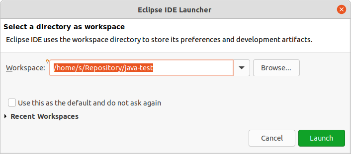
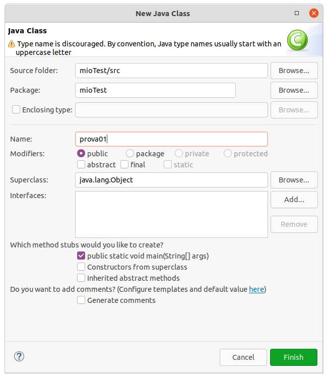
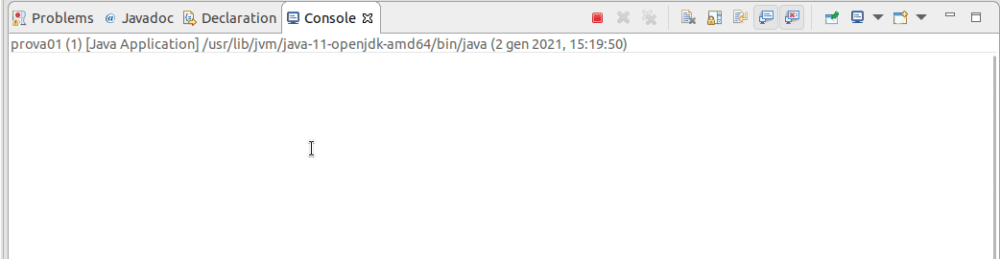
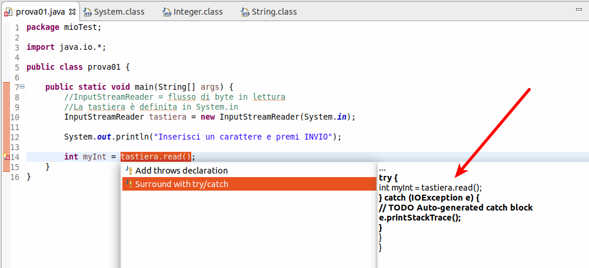

# Java - write once, run anywhere

- [Java - write once, run anywhere](#java---write-once-run-anywhere)
- [Lezione 01](#lezione-01)
	- [Descrizione](#descrizione)
	- [Principi](#principi)
	- [JVM: Java Virtual Machine](#jvm-java-virtual-machine)
	- [JRE: Java Runtime Environment<br>](#jre-java-runtime-environment)
	- [JDK: Java Development Kit<br>](#jdk-java-development-kit)
- [Lezione 02](#lezione-02)
	- [Processo di compilazione Java](#processo-di-compilazione-java)
	- [Setup di Java](#setup-di-java)
- [Lezione 03](#lezione-03)
	- [Primo programma - compilazione manuale](#primo-programma---compilazione-manuale)
- [Lezione 04](#lezione-04)
	- [Installazione e setup di Eclipse](#installazione-e-setup-di-eclipse)
		- [Primo progetto con Eclipse](#primo-progetto-con-eclipse)
- [Lezione 05](#lezione-05)
	- [Introduzione alla OOP](#introduzione-alla-oop)
		- [Classi, oggetti, metodi](#classi-oggetti-metodi)
- [Lezione 06](#lezione-06)
	- [Metodo Main](#metodo-main)
	- [Metodo print](#metodo-print)
	- [Qualche stampa](#qualche-stampa)
	- [Commenti](#commenti)
- [Lezione 07](#lezione-07)
	- [Qualche espressione aritmetica](#qualche-espressione-aritmetica)
- [Lezione 08](#lezione-08)
	- [Variabili](#variabili)
- [Lezione 09](#lezione-09)
	- [Esercizio - Calcolo dell'interesse annuo](#esercizio---calcolo-dellinteresse-annuo)
- [Lezione 10](#lezione-10)
	- [Approfondimento sui tipi primitivi](#approfondimento-sui-tipi-primitivi)
- [Lezione 11](#lezione-11)
	- [Ancora sui numeri](#ancora-sui-numeri)
- [Lezione 12](#lezione-12)
	- [Il tipo char](#il-tipo-char)
- [Lezione 13](#lezione-13)
	- [Il tipo boolean](#il-tipo-boolean)
- [Lezione 14](#lezione-14)
	- [Introduzione a String](#introduzione-a-string)
- [Lezione 15](#lezione-15)
	- [Operatori](#operatori)
		- [Precedenza degli operatori](#precedenza-degli-operatori)
		- [Operatori Unari](#operatori-unari)
	- [Operatori binari](#operatori-binari)
- [Lezione 16](#lezione-16)
	- [Tra stringhe e caratteri.](#tra-stringhe-e-caratteri)
- [Lezione 17](#lezione-17)
	- [E i boolean?](#e-i-boolean)
- [Lezione 18](#lezione-18)
	- [Numeri decimali](#numeri-decimali)
- [Lezione 19](#lezione-19)
	- [Espressioni miste](#espressioni-miste)
- [Lezione 20](#lezione-20)
	- [Numeri Esadecimali, ottali](#numeri-esadecimali-ottali)
	- [Costanti numeriche](#costanti-numeriche)
	- [Sequenze di escape](#sequenze-di-escape)
- [Lezione 21](#lezione-21)
	- [Operatori di Assegnamento](#operatori-di-assegnamento)
- [Lezione 22](#lezione-22)
	- [Operatori Relazionali](#operatori-relazionali)
- [Lezione 23](#lezione-23)
	- [Operatori Logici](#operatori-logici)
- [Lezione 24](#lezione-24)
	- [Costrutto Condizionali If ... Else](#costrutto-condizionali-if--else)
- [Lezione 25](#lezione-25)
	- [Costrutto Switch](#costrutto-switch)
- [Lezione 26](#lezione-26)
	- [Leggere dati da tastiera](#leggere-dati-da-tastiera)
- [Lezione 27](#lezione-27)
	- [Costrutti Iterativi](#costrutti-iterativi)
		- [Ciclo while](#ciclo-while)
- [Lezione 28](#lezione-28)
	- [Qualche esercizio](#qualche-esercizio)
		- [Stampa somma esercizio base](#stampa-somma-esercizio-base)
		- [stampa somma esercizio avanzato](#stampa-somma-esercizio-avanzato)
		- [Aggiunta di un controllo](#aggiunta-di-un-controllo)
- [Lezione 28](#lezione-28-1)
	- [Ciclo do ... while](#ciclo-do--while)
- [Lezione 29](#lezione-29)
		- [For loop](#for-loop)
- [Lezione 30](#lezione-30)
	- [break e continue](#break-e-continue)
- [Lezione 31](#lezione-31)
	- [Sottoprogrammi, Funzioni, Metodi](#sottoprogrammi-funzioni-metodi)
	- [Definizione di un metodo:](#definizione-di-un-metodo)
	- [Chiamata di un metodo:](#chiamata-di-un-metodo)
- [Lezione 32](#lezione-32)
	- [due parole sui parametri](#due-parole-sui-parametri)
- [Lezione 33](#lezione-33)
	- [Return](#return)
- [Lezione 34](#lezione-34)
	- [Qualche approfondimento sui parametri](#qualche-approfondimento-sui-parametri)
- [Lezione 35](#lezione-35)
	- [Array](#array)
- [Lezione 36](#lezione-36)
	- [Errori con gli array](#errori-con-gli-array)
- [Lezione 37](#lezione-37)
	- [Approfondimento Input tastiera](#approfondimento-input-tastiera)
- [Lezione 38](#lezione-38)
	- [Costrutto try catch](#costrutto-try-catch)
- [Lezione 39](#lezione-39)
	- [Esercizio calcolo interesse con input da tastiera parte 1](#esercizio-calcolo-interesse-con-input-da-tastiera-parte-1)
- [Lezione 40](#lezione-40)
	- [Buffered reader Vs Scanner](#buffered-reader-vs-scanner)
- [Lezione 41](#lezione-41)
	- [Regular expression](#regular-expression)
- [Lezione 42](#lezione-42)
	- [Esercizio calcolo interesse con input da tastiera parte 2](#esercizio-calcolo-interesse-con-input-da-tastiera-parte-2)

# Lezione 01

[documentazione oracle](https://docs.oracle.com/javase/tutorial/java/nutsandbolts/index.html)

> In informatica Java è un linguaggio di programmazione ad alto livello, orientato agli oggetti e a tipizzazione statica, che si appoggia sull'omonima piattaforma software di esecuzione, specificamente progettato per essere il più possibile indipendente dalla piattaforma hardware di esecuzione (tramite compilazione in bytecode prima e interpretazione poi da parte di una JVM) (sebbene questa caratteristica comporti prestazioni in termini di computazione inferiori a quelle di linguaggi direttamente compilati come C e C++ ovvero dunque perfettamente adattati alla piattaforma hardware).
> 
> [Java - Wikipedia](https://it.wikipedia.org/wiki/Java_(linguaggio_di_programmazione))

## Descrizione

> Uno dei principi fondamentali del linguaggio è espresso dal motto **WORA** (write once, run anywhere, ossia "scrivi una volta, esegui ovunque"): il codice compilato che viene eseguito su una piattaforma non deve essere ricompilato per essere eseguito su una piattaforma diversa; infatti il prodotto della compilazione è in un formato chiamato bytecode che può essere eseguito da una qualunque implementazione di un processore virtuale detto Java Virtual Machine; al 2014 Java risulta essere uno dei linguaggi di programmazione più usati al mondo, specialmente per applicazioni client-server, con un numero di sviluppatori stimato intorno ai 9 milioni; un buon punto di partenza per imparare Java è il tutorial ufficiale.
> 
> [Java - Wikipedia](https://it.wikipedia.org/wiki/Java_(linguaggio_di_programmazione))

## Principi
> Java venne creato per soddisfare cinque obiettivi primari:<br>
> 1. essere "semplice, orientato agli oggetti e familiare";
> 2. essere "robusto e sicuro";
> 3. essere indipendente dalla piattaforma;
> 4. contenere strumenti e librerie per il networking;
> 5. essere progettato per eseguire codice da sorgenti remote in modo sicuro. 
>
> [Java - Wikipedia](https://it.wikipedia.org/wiki/Java_(linguaggio_di_programmazione))

## JVM: Java Virtual Machine

> In informatica la macchina virtuale Java (detta anche Java Virtual Machine o JVM) è il componente software della piattaforma Java che esegue i programmi tradotti in bytecode dopo la prima fase di compilazione in bytecode (tra i linguaggi di programmazione che possono essere tradotti in bytecode troviamo Java, Groovy, Clojure, Scala ed Eta).
> 
> I passi che devono essere fatti per eseguire un programma scritto in linguaggio Java sono i seguenti:
>
> 1. Un programmatore usa un editor di testo o un integrated development environment come Eclipse, NetBeans o IntelliJ IDEA per scrivere una o più classi Java
> 2. Un software di compilazione trasforma il programma in bytecode, che è una leggera astrazione del codice macchina
> 2. Il bytecode viene fornito ad una macchina virtuale Java che lo esegue
> 
> Il bytecode è generalmente prodotto dalla compilazione di codici sorgenti (o file sorgenti) scritti in linguaggio Java, anche se è possibile produrre bytecode partendo da altri linguaggi come Scala, Clojure o Groovy.
> 
> La JVM è definita da una specifica, mantenuta da Oracle. Qualsiasi sistema che si comporti in modo coerente con tale specifica viene considerato come una particolare implementazione della JVM. Esistono implementazioni software per praticamente tutti i sistemi operativi moderni, sia gratuite che commerciali. Inoltre, esistono implementazioni speciali per particolari ambienti hardware/software, come telefoni cellulari e palmari), e persino implementazioni hardware come Jazelle.
>
> La disponibilità di implementazioni della macchina virtuale Java per diversi ambienti operativi è la chiave della portabilità di Java, proclamata nello slogan write once, run everywhere ("scrivi una volta, esegui dappertutto"). La macchina virtuale realizza infatti un ambiente di esecuzione omogeneo, che nasconde al software Java (e quindi al programmatore) qualsiasi specificità del sistema operativo sottostante
>
> [JVM - Wikipedia](https://it.wikipedia.org/wiki/Macchina_virtuale_Java)


## JRE: Java Runtime Environment<br>
> In quanto tale contiene la Java Virtual Machine, le librerie standard (API Java) e un launcher per le applicazioni Java, necessario per avviare i programmi scritti in linguaggio Java e già compilati in bytecode; è dunque necessario quando si hanno programmi scritti in Java forniti già compilati in bytecode. Materialmente JRE è un plugin per browser in quanto è impiegato per applicazioni web che contengono componenti scritte in Java.<br>
Esso non costituisce un ambiente di sviluppo software e non contiene strumenti di sviluppo (compilatori e/o debugger): per poter sviluppare in Java a monte, a partire dal codice sorgente, è necessario infatti il Java Development Kit (che tipicamente contiene anche il JRE), anch'esso distribuito gratuitamente dalla Sun. Molti IDE offrono inoltre la possibilità di agganciare (linkare) la JRE e poter così sviluppare i propri programmi coadiuvati dell'editor.<br>
Rilasciato in versione 32 bit e 64 bit, ad oggi, l'ultima versione della Java 2 Platform, Standard Edition Runtime Environment è la versione 8: ogni versione ha molti aggiornamenti (detti anche build) che vengono rilasciati durante il periodo di sviluppo (ad es. JRE 6 è arrivato sino all'aggiornamento 45, mentre JRE 7 all'aggiornamento 51; a maggio 2019 JRE versione 8 è in aggiornamento 211 (rilasciata il 16 aprile 2019).<br>
[JRE - Wikipedia](https://it.wikipedia.org/wiki/Java_Runtime_Environment)

## JDK: Java Development Kit<br>
> In informatica il JDK (java development kit) è l'insieme degli strumenti per sviluppare programmi da parte dei programmatori Java. È un prodotto della Oracle Corporation, e fin dall'introduzione di Java è sempre stato l'ambiente di sviluppo più utilizzato dai programmatori Java soprattutto per applicazioni desktop. Per applicazioni più complesse (es. applicazioni web) oggi sempre più spesso si utilizzano per lo sviluppo ed esecuzione programmi IDE a cui è possibile agganciare la JRE. <br>
[JDK - Wikipedia](https://it.wikipedia.org/wiki/Java_Development_Kit)

# Lezione 02

## Processo di compilazione Java

Il codice sorgente java *.java* per poter essere eseguito deve essere:
1. Tradotto in **Bytecode**, formato *.class* tramite il compilatore **JavaC**
2. Assemblato insieme alle librerie Java utilizzate (anch'esse in Bytecode) attraverso un **Loader** producendo un file **Bytecode** molto efficiente
3. Interpretato dall'interprete Java situato all'interno della Java Virtual Machine


## Setup di Java

Scarica la JDK per il tuo sistema operativo:


Fai riferimento alla **Java SE** cioè alla piattaforma *Standard Edition*. La **Java EE** è la versione *Enterprise* è pensata soprattutto per applicativi server.

**Installazione Ubuntu**<br>
Per il sistema operativo Ubuntu dovrebbe già essere installata una versione del java development kit. Da terminale digitando:

```bash
java --version
```

Puoi verificare la versione installata. Nel mio caso:

```bash
openjdk 11.0.9.1 2020-11-04
OpenJDK Runtime Environment (build 11.0.9.1+1-Ubuntu-0ubuntu1.20.10)
OpenJDK 64-Bit Server VM (build 11.0.9.1+1-Ubuntu-0ubuntu1.20.10, mixed mode, sharing)
```

Puoi inoltre verificare la versione di `javac` il compilatore Java digitando da terminale:

```bash
javac --version
```

A questo punto la bash potrebbe non riconoscere il comando perchè l'installazione del pacchetto **JDK** non è globale. 

```bash
Comando «javac» non trovato, ma può essere installato con:
sudo apt install default-jdk              # version 2:1.11-72, or
sudo apt install openjdk-11-jdk-headless  # version 11.0.9.1+1-0ubuntu1~20.10
sudo apt install ecj                      # version 3.16.0-1
sudo apt install openjdk-13-jdk-headless  # version 13.0.4+8-1
sudo apt install openjdk-14-jdk-headless  # version 14.0.2+12-1
sudo apt install openjdk-15-jdk-headless  # version 15+36-1
sudo apt install openjdk-8-jdk-headless   # version 8u275-b01-0ubuntu1~20.10
```


Puoi installare una versione globale e aggiornata del **JDK** seguendo la procedura descritta dal sito ufficiale scaricando il pacchetto `.rpm` oppure puoi digitare il comando per l'installazione della versione 15:

```bash
sudo apt install openjdk-15-jdk-headless  # version 15+36-1
```

A questo punto è possibile verificare che sia stata installata la versione giusta con il comando: 

```bash
javac --version
```

Che dovrà rispondere con:

```bash
15
```

Inoltre, digitando nuovamente:

```bash
java --version
```

Troverete aggiornato anche il pacchetto **JDK**:

```bash
openjdk 15 2020-09-15
OpenJDK Runtime Environment (build 15+36-Ubuntu-1)
OpenJDK 64-Bit Server VM (build 15+36-Ubuntu-1, mixed mode, sharing)
```

Se ti sei confuso durante l'installazione delle versioni di java o ti sei reso contoc che hai bisogno di un'altra versione puoi eliminare tutto con il comando:

```bash
sudo apt-get remove openjdk*
```

A questo punto, i comandi `java` e `javac` non saranno riconosciuti da terminale e potrai procedere ad una nuova installazione

**Installazione Windows**

Scarica l'installer per windows


Esegui la procedura di installazione guidata.


Una volta installato il pacchetto **JDK** apri il prompt dei comandi `cmd` e digita:

```bash
java -version
```

Dovrebbe rispondere con la versione di Java del pacchetto **JDK** appena scaricata:

```cmd
java version "15.0.1" 2020-10-20                                               
Java(TM) SE Runtime Environment (build 15.0.1+9-18)     
Java HotSpot(TM) 64-Bit Server VM (build 15.0.1+9-18, mixed mode, sharing)      
```

Verifica che sia raggiungibile da prompt dei comandi anche il compilatore Java, digitando:

```bash
javac -version
```

Se risponderà con un output del tipo:

```cmd
javac 15.0.1 
```

vuol dire che il setup è terminato, altrimenti sarà sufficiente aggiungere come variabile d'ambiente la directory `bin` all'interno della cartella di installazione di Java. Nel mio caso e probabilmente anche nel tuo (se hai installato la versione a 64 bit) si trova al percorso:

```cmd
C:\Program Files\Java\jdk-15.0.1\bin
```

# Lezione 03

## Primo programma - compilazione manuale

Scrivi il seguente pezzo di codice in un file utilizzando un editor di testo come blocco note (windows) o gedit (linux)

```java
public class MioCalcolo {
	public static void main(String[] args){
    		System.out.print(5 + 3);
	}
}
```

Salva il file con nome `MioCalcolo.java` all'interno di una directory specifica, raggiungi la posizione da terminale e compila il file `java` digitando:

```bash
javac MioCalcolo.java
```

Il compilatore `java` compilerà il sorgente `MioCalcolo.java` producendo un file `MioCalcolo.class` ovvero la traduzione del sorgente in bytecode.

A questo punto digitando il comando:

```bash
java MioCalcolo
```

Verrà eseguito il codice che produrrà come risultato la stampa:

```bash
8
```

# Lezione 04

## Installazione e setup di Eclipse

Per questo corso utilizzeremo Eclipse come IDE.

**Installazione Ubuntu** 

Per installare Eclipse digita da terminale:

```bash
sudo snap install --classic eclipse
```

Poichè abbiamo già installato tutti i pacchetti necessari con la procedura descritta sopra, Eclipse li riconoscerà e li utilizzerà.

**Installazione Windows**

[Scarica Eclipse](https://www.eclipse.org/downloads/) ed esegui l'installer.


Una volta terminato il processo di installazione avrai gli strumenti necessari alla compilazione e debug del codice Java

### Primo progetto con Eclipse

Aprendo Eclipse, ti chiederà di scegliere una workspace:



Scegli una directory di lavoro e premi su `Launch`.
Comparirà adesso la finestra di selezione di un progetto.


Clicca su `Create a new Java Project`


**Attenzione!!** Su windows consiglio di spuntare `Use default JRE 'jre' and workspace compiler preferences` perchè potrebbe andare in conflitto con le versioni di `JRE` installate globalmente su PC


Scegli un nome del progetto ad esempio `mioTest` e premi su `Finish`

Ti chiederà infine se vuoi creare il file `module-info.java`, Per adesso premi su `Don't Create`


Comparirà finalmente la finestra principale di lavoro.
A sinistra troverai il file explore del tuo ambiente di lavoro.


 Per creare un nuovo progetto clicca con il destro su `src` e scegli `new/class`



Dai un nome al file, ad esempio `prova01` e seleziona i flags come in figura. In particolare presta attenzione a selezionare `public static void main(Strings[] args)`.<br>
Premi su `Finish`.

A questo punto sarai pronto per scrivere codice con un template impostato da Eclipse


Per replicare il programmino precedente, compilato ed eseguito manualmente inserisci la linea di codice:

```bash
System.out.print(5 + 3);
```

All'interno del blocco più interno delimitato dalle parentesi graffe. Il risultato finale sarà:

```java
package mioTest;

public class prova01 {

	public static void main(String[] args) {
		System.out.print(5+3);

	}

}
```

Compila ed esegui il codice con il tasto indicato dal simbolo `PLAY`


Troverai il risultato stampato nella finestra della console:


# Lezione 05

## Introduzione alla OOP

Il codice già compilato, sia con Eclipse che in modo manuale:

```java
package mioTest;

public class prova01 {

	public static void main(String[] args) {
		System.out.print(5+3);

	}

}
```

E' stato il nostro primo programma scritto in Java ma di fatto non comprendiamo granchè di cio' che c'è scritto. Intuiamo probabilmente che il codice stamperà il risultato dell'operazione `5+3` poichè riconosciamo il comando `print` il cui termine tecnico è realtà **metodo** derivato della programmazione **OOP** di Java (di cui parleremo approfonditamente alla fine del corso). 

### Classi, oggetti, metodi

Puoi pensare alla **classe** come a una grande famiglia un contenitore di **oggetti** omogenei tra loro e **metodi**. 

Tonando al codice, `print` non fa parte del nucleo delle istruzioni base di Java ma di una libreria esterna, una libreria di input output, situata all'interno della **JRE System Library**. Quindi in fase di compilazione, il compilatore fa uso anche di questa libreria per linkare tutti simboli che trova nel codice sorgente.

La **JRE System Library** come per qualsiasi liberia può essere considerata come un pachetto estensione estensione del linguaggio base Java chiamato `package` e contiente metodi, oggetti, classi.

In generale ogni package deve essere incluso nel codice sorgente con il comando: 

```java
import packageName
```

Nel caso dell'importazione del comando (**classe**) `System` anch'esso non presente nel nucleo base delle istruzioni Java scriveremo:

```java
import java.lang.System;
```

In questo modo importeremo solo la classe `System` del package `lang` situato all'interno del package `java`

**Nota:** <br>

- il nome del package è sempre in minuscolo, es: `java`, `lang` ..
- il nome della classe  è sempre maiuscolo, es: `System`..
- nel caso della **JRE System Library** l'importazione è automatica quindi non è necessario specificare il comando di `import`. Nel caso di uso di una libreria esterna, invece dovremo inserire il comando di `import` specifico per quella libreria

Se vuoi includere tutto il contenuto (tutte le classi, tutti gli oggetti e tutti i metodi) di un `package` puoi farlo utilizzando il carattere `*` al posto della specifica classe


```java
import java.lang.*; //importa tutte le classi all'interno del package java.lang
```

Tornando al codice, abbiamo capito che `System` è una classe della libreria **JRE System Library** in particolare del package `java.lang`. Cosa sono quindi `out` e `print`?

```java
package mioTest;

public class prova01 {

	public static void main(String[] args) {
		System.out.print(5+3);

	}

}
```

`out` è un' **oggetto** contenuto all'interno della classe `System` cioè  un blocco di codice autoconsistente che forma, insieme agli altri oggetti la classe `System`.

**Considerazione**

Non badare troppo alla terminologia per adesso. Evita di soffermarti troppo sui concetti di **classe**, **oggetto**, **metodo**, li capirai più avanti quando inizierai la **OOP**, la programmazione ad oggetti di Java. Per adesso è sufficiente che tu ne abbia colto le differenze è che tu sappia identificare una classe, da un oggetto o da un metodo.

La classe si riconosce perchè è sempre sicritta con la prima lettera in maiuscolo. Un oggetto si riconosce perchè è sempre situato all'interno di una classe e un metodo si riconosce perchè è l'ultimo pezzo, cioè il comando da eseguire e fa riferimento al contesto dell'oggetto

**Infine..**

Il metodo può ricevere, come nel caso di `print`, dei parametri. Posso passare delle stringhe testuali, dei calcoli e una quantità di dati prevista dal metodo.ù

# Lezione 06

## Metodo Main

Partendo sempre dal codice:

```java
package mioTest;

public class prova01 {

	public static void main(String[] args) {
		System.out.print(5+3);

	}

}
```

Analizziamo adesso il metodo `main`

```java
public static void main(String[] args) {
	System.out.print(5+3);

}
```

`main` è il metodo principale che cerca e richiama Java quando manda in esecuzione un codice sorgente java. In sostanza Java eseguirà tutto il codice contenuto all'interno di 
```java
public static void main(String[] args) {
	//code

}
```

## Metodo print

Come abbiamo già detto, il metodo print può ricevere in ingresso una quantità più o meno vasta di dati. Possiamo aiutarci con l'autocompletamento di Eclipse, `Ctrl + space` 


Vedremo in dettaglio tutti i tipi di dato più avanti

## Qualche stampa

Il seguente esempio mostra la differenza tra il metodo `print()` e il metodo `println`. Stamperemo inoltre stringhe, espressioni numeriche ed espressioni miste. 

Alcune regole:

- `print()` stampa inline
- `println()` stampa e va a capo
- Se il metodo `print()` riceve un'espressione numerica, questa viene prima valutata poi convertita in una stringa per la stampa.
- operatore `+`: funge da concatenatore di stringhe se gli operandi sono delle stringhe e da operatore somma se gli operandi sono dei numeri.
- In caso di espressioni miste è possibile utilizzare le parentesi tonde `( )` per forzare la precedenza dell'operatore `+`


```java
package mioTest;

public class prova01 {

	public static void main(String[] args) {
		System.out.print(1 + 1);        //stampa inline del risultato dell'espressione
		System.out.println("ciao");     //stampa "ciao" e va a capo
		System.out.println("a tutti");  //stampa "a tuti" e va a capo
		
		
		/*
		System.out.println("Il risultato è: " + (1+1));  

		- valuta prima il risultato dell'espressione 1+1,
		- lo converte in stringa e quindi diventa "2" 
		- lo concatena a "Il risultato è: "
		- produce:
		"Il risultato è: 2"
		*/
		System.out.println("Il risultato è: " + (1+1)); 
	}

}

/*
output

2ciao
a tutti
Il risultato è: 2
*/
```

## Commenti

I commenti sono linee testuali ignorate dal compilatore e possono essere utili al programmatore per documentare alcune linee di codice.
In java ci suo due tipi di commenti già visti negli esempi precedenti:

- `// text`: per commenti inline
- `/* text */`: per commenti multiline

```java
package mioTest;

public class prova01 {


	public static void main(String[] args) {
		/*
		commento multiline
		System.out.println("Ciao"); 
		*/
		System.out.println("Ciao");  //commento inline
	}

}


```

# Lezione 07

## Qualche espressione aritmetica

Riporto i principali operatori matematici e il calcolo qualche espressione aritmetica. Alcune considerazioni:

- Posso valutare espressioni con operandi misti, numeri interi e numeri decimali. In questo caso i numeri interi vengono convertiti in decimali e valutata l'espressione restituendo sempre un numero decimale.
- L'operatore `/` rappresenta la divisione ma:
  - calcola il **modulo** della divisione intera quando gli operandi sono interi
  -  la divisione decimale quando almeno un operando è decimale effettuando prima una conversione implicita di tutti gli operandi interi in decimale
- L'operatore `%` restituisce il **resto** della divisione intera e ha senso quando gli operandi sono interi
- Le parentesi `( )` possono essere utilizzate per forzare la precedenza tra le operazioni, come in matematica

```java
package mioTest;

public class prova01 {

	public static void main(String[] args) {
		//Somme e sottrazioni di numeri interi e decimali
		System.out.println(1 - 1.41);  //-0.4099999999999999
		
		//Moltiplicazione
		System.out.println(3 * 6.5);   //19.5
		
		//Divisione
		//Se gli operandi sono numeri interi
		//viene calcolato il modulo della divisione intera 
		System.out.println(12 / 3);    //4
		System.out.println(12 / 5);    //2
		
		//Se almeno un operando è decimale
		//vengono convertiti tutti gli operandi in decimale ed effettuata la divisione decimale
		System.out.println(12 / 5.0);  //2.4
		System.out.println(12 / 3.0);  //4.0

		//Resto della divisione intera
		System.out.println(12 % 3);    //0
		System.out.println(12 % 7);    //5
		
		//Le parentesi (), come in matematica, possono essere utilizzate per forzare la precedenza.
		System.out.println( ((5+4) * 9) + 7 );  //88
	}

}
```

# Lezione 08

## Variabili

Le variabili sono contenitori utilizzati per la memorizzazione dei dati. In java, ad ogni contenitore (quindi ad ogni variabile) deve essere associato il **tipo** cioè deve essere dichiarato a priori quale tipo di dato potrà contenere il contenitore

I tipi nativi o predefiniti del linguaggio Java sono:

| Tipo      | Dimensione | Descrizione |
| ----------| -----------| ----------- |    
| `char` | 2 byte | Utilizzato per la memorizzazione di singoli caratteri come `a`, `B` | 
| `int` | 4 byte | Utilizzato per la memorizzazione di numeri interi come `12` `-4`  nel range [-2,147,483,648 to 2,147,483,647]| 
| `short` | 2 byte | Utilizzato per la memorizzazione di numeri interi come `12` `-4` nel range [-32,768 to 32,767]| 
| `long` | 8 byte | Utilizzato per la memorizzazione di numeri interi come `12124L` `-49825L` nel range [-9,223,372,036,854,775,808 to 9,223,372,036,854,775,807]. E' buona norma associare il simbolo `L` alla fine del valore per forzare la rappresentazione su 8 byte| 
| `float` | 4 bytes | Utilizzato per la memorizzazione di numeri decimali come `12.6f` fino a 7 digits dopo la virgola cioè 7 cifre considerabili **esatte** dopo la virgola. E' buona norma associare il simbolo `f` o `F` al termine del valore `float`| 
| `double` | 8 byte | Utilizzato per la memorizzazione di numeri decimali come `12.9876d` fino a 15 digits dopo la virgola cioè 15 cifre considerabili **esatte** dopo la virgola. E' buona norma associare il simbolo `d` al termine del valore `double` per forzare la rappresentazione con un'accuratezza di 15 digits dopo la virgola| 
| `byte`    | 8 byte |Utilizzato per la memorizzazione di numeri nel range [-128 to 127]| 
| `boolean` | 1 bit | Utilizzato per la memorizzazione di dati booleani, un tipo di dato particolare e molto importante nella programmazione che può assumere solo due stati, `true` o `false`| 

Per un approfondimento visita [w3schools.com - Java Variables](https://www.w3schools.com/java/java_variables.asp) e [w3schools.com - Java Data Types](https://www.w3schools.com/java/java_data_types.asp)
  
Una variabile, per poter essre utilizzata, deve essere prima **dichiarata**, dopodichè l'**identificatore** cioè il nome della variabile potrà essere utilizzato nel codice come sostitutivo del suo valore.

Non confondere le variabili, o meglio gli identificatori di variabili, con le **costanti letterali** che invece sono espressioni numeriche o letterali appunto costanti.

**Dichiarazione di una variabile** <br>

Sintassi:

```java
type identificatore = value
```

```java
package mioTest;

public class prova01 {

	public static void main(String[] args) {
		//dichiarazione
		double piGreco = 3.14;
		
		//uso
		System.out.println( "pi greco vale: " + piGreco );  
	}

}

/*
outout
---

pi greco vale: 3.14
*/
```

Nell'esempio, `double` è il tipo, `piGreco` è l'identificatore della variabile mentre `3.14` è il suo valore espresso come costante letterale numerica. Allo stesso modo `"pi greco vale: "` è una costante letterale.

Puoi dichiarare più variabili dello stesso tipo utilizzando separando gli identificatori con la virgola `,` che in programamzione rappresenta sempre un operatore di separazione.

```java
int a = 1, b = 12, c;
```

Nell'esempio ho dichiarato tre variabili intere `a`, `b`, `c`. Il valore della variabile `c` non è ancora espresso, si dice in questo caso che la variabile è **dichiarata** ma non **inizializzata**

**Nota**: E' sempre bene **inizializzare** sempre ogni variabile **dichiarata** poichè l'utilizzo di tale variabile nel codice produce un errore di compilazione

```java
package mioTest;

public class prova01 {

	public static void main(String[] args) {
		//dichiarazione
		double piGreco = 3.14, area, circonferenza, raggio;
		
		area = piGreco* (raggio*raggio);
		System.out.println( area );  
	}

}

/*
output
------

Exception in thread "main" java.lang.Error: Unresolved compilation problems: 
	The local variable raggio may not have been initialized
	The local variable raggio may not have been initialized

	at mioTest.prova01.main(prova01.java:9)
*/
```

Il messaggio è chiaro `The local variable raggio may not have been initialized`. La variabile `raggio` non è stata inizializzata.

**Attenzione!!**<br>
Il solo problema è la variabile `raggio` poichè è in **lettura**. Infatti, sebbene sia `circonferenza` che `area` siano variabili non inizializzate, `circonferenza` non è di fatto mai utilizzata quindi non può generare nessun tipo di errore mentre `area` è utilizzata in **scrittura** ed è logicamente previsto non inizializzare delle variabili per assegnar loro un valore successivo.

A dimostrazione di quanto detto riporto l'esempio di prima assegnando un valore solo alla variabile `raggio`

```java
package mioTest;

public class prova01 {

	public static void main(String[] args) {
		//dichiarazione
		double piGreco = 3.14, area, circonferenza, raggio = 2;
		
		area = piGreco* (raggio*raggio);
		System.out.println( area );  //12.56
	}

}
```

In generale comunque, per evitare confusione, conviene sempre **inizializzare** tutte le variabili al momento della **dichiarazione**

**Naming conventions**<br>
Per la dichiarazione di una variabile puoi usare lettere maiuscole o minuscole seguite da caratteri numerici o il carattere underline, `_`

# Lezione 09

## Esercizio - Calcolo dell'interesse annuo

Il seguente esercizio, in base ad un valore di somma depositata in euro e un tasso percentuale annuo, restituisce il valore della somma depositata dopo un anno in base al tasso di interesse stabilito

```java
package mioTest;

public class prova01 {

	public static void main(String[] args) {
		System.out.println("Percentuale di interesse: 2.5%");
		System.out.println("Somma depositata: 1000 euro");
		System.out.println("---");
		
		
		double percentualeInteresse = 2.5; //percentuale di interesse annuoù
		double sommaDepositata = 1000;     //in euro
		
		//dopo un anno
		sommaDepositata = sommaDepositata * (1 + percentualeInteresse/100);
		System.out.println("Dopo un anno avrai: " + sommaDepositata + "euro");
	}

}

/*
output
---

Percentuale di interesse: 2.5%
Somma depositata: 1000 euro
---
Dopo un anno avrai: 1025.0euro
*/
```

# Lezione 10

## Approfondimento sui tipi primitivi

Questa è una sezione di approfondimento per i tipi primitivi di Java.
Riporto la tabella già vista qualche lezione precedente

| Tipo      | Dimensione | Descrizione |
| ----------| -----------| ----------- | 
| `char` | 2 byte | Utilizzato per la memorizzazione di singoli caratteri come `a`, `B` | 
| `int` | 4 byte | Utilizzato per la memorizzazione di numeri interi come `12` `-4`  nel range [-2,147,483,648 to 2,147,483,647]| 
| `short` | 2 byte | Utilizzato per la memorizzazione di numeri interi come `12` `-4` nel range [-32,768 to 32,767]| 
| `long` | 8 byte | Utilizzato per la memorizzazione di numeri interi come `12124L` `-49825L` nel range [-9,223,372,036,854,775,808 to 9,223,372,036,854,775,807]. E' buona norma associare il simbolo `L` alla fine del valore per forzare la rappresentazione su 8 byte| 
| `float` | 4 bytes | Utilizzato per la memorizzazione di numeri decimali come `12.6f` fino a 7 digits dopo la virgola. E' buona norma associare il simbolo `f` o `F` al termine del valore `float`| 
| `double` | 8 byte | Utilizzato per la memorizzazione di numeri decimali come `12.9876d` fino a 15 digits dopo la virgola. E' buona norma associare il simbolo `d` al termine del valore `double` per forzare la rappresentazione con un'accuratezza di 15 digits dopo la virgola| 
| `byte`    | 8 byte |Utilizzato per la memorizzazione di numeri nel range [-128 to 127]| 
| `boolean` | 1 bit | Utilizzato per la memorizzazione di dati booleani, un tipo di dato particolare e molto importante nella programmazione che può assumere solo due stati, `true` o `false`| 

Alcune considerazione:

- Di default le costanti numeriche intere sono considerate di tipo `int` quindi sono rappresentate su  4 byte.
-  Per rappresentare una costante numerica intera più piccola del tipo `int` come `short` o `byte` è possibile forzare una conversione esplicita tramite l'operatore cast `(short)` o `(byte)`.
-  Per rappresentare una costante numerica intera più grande del tipo `int` come `long` è possibile aggiungere il suffisso `L` o forzare una conversione esplicita con l'operatore cast `(long)`
- Di default le costanti numeriche decimali sono rappresentate con il tipo `double` quindi con un'accuratezza di 15 digits dopo la virgola.
- Per rappresentare una costante decimale più piccola con il tipo `float` è sufficiente inserire il suffisso `f` o `F` oppure forzare una conversione esplicita con l'operatore cast


Vediamo un esempio concreto:

```java
package mioTest;

public class prova01 {

	public static void main(String[] args) {
		//dichiarazione
		//interi
		int   valueInt1   = 217437; 
		short valueInt2   = 2341;  
		long  valueInt3   = 23414246L; 
		byte  valueInt4   = 67;

		//decimali
		float valueDec1  = 12.4F;
		double valueDec2 = 3425.876;
		
		//cast
		
		//conversione implicita da "byte" >>> "long"
		long ris1 = valueInt3 + valueInt4;
		System.out.println(ris1); //23414313
		
		//conversione esplicita in "short" necessaria poichè la conversione implicita
		//convertirebbe automaticamente valueInt2 da "short" a "int"
		//producendo un risultato con un estensione maggiore
		//di quella in grado di contenere la variabile ris2 anch'essa "short"
		short ris2 = (short)(valueInt2 - valueInt1);
		System.out.println(ris2); //-18488

		//conversione esplicita in "float" necessaria poichè la conversione implicita
		//convertirebbe automaticamente valueDec1 da "float" a "double"
		//producendo un risultato con un estensione maggiore
		//di quella in grado di contenere la variabile ris3 anch'essa "float"
		float ris3 = (float)(valueDec2 / valueDec1);
		System.out.println(ris3); //276.28033
	}

}
```

Vediamo un controesempio:

```java
package mioTest;

public class prova01 {

	public static void main(String[] args) {
		//dichiarazione
		long  valueInt3   = 23414246L; 
		byte  valueInt4   = 67;
		
		//Attenzione!!!
		byte ris1 = valueInt3 + valueInt4;
		System.out.println(ris1); //
		
	}

}
/*
Exception in thread "main" java.lang.Error: Unresolved compilation problem: 
	Type mismatch: cannot convert from long to byte

	at mioTest.prova01.main(prova01.java:18)
*/
```

L'errore è, anche in questo caso, chiaro: `Type mismatch: cannot convert from long to byte` cioè non è possibile convertire un `long` in `byte`.

Forzando la conversione esplicita del tipo `long` in tipo `byte` tutto funzionerà ma che risultato oterrai?

```java
package mioTest;

public class prova01 {

	public static void main(String[] args) {
		//dichiarazione
		//interi
		int   valueInt1   = 217437; 
		short valueInt2   = 2341;  
		long  valueInt3   = 23414246L; 
		byte  valueInt4   = 67;
		
		//Attenzione!!!
		byte ris1 = (byte)(valueInt3 + valueInt4);
		System.out.println(ris1); //41
		
	}

}
```

**Attenzione:**<br>
Quando utilizzi i cast, hai la responsabilità di garantire, durante il troncamento, che non si perda l'informazione. Dovrai quindi effettuare i cast consapevolmente sempre.

# Lezione 11

## Ancora sui numeri

I tipi sopra citati `int`, `double`, `float` .. sono tipi predefiniti del linguaggio. Esiste tuttavia, per ogni tipo, una **classe** Java associata di cui è possibile, come ad ogni classe ricavarne **proprietà**,  **instanziare oggetti** ed applicare **metodi**. Non approfondirò l'argomento qua ma vorrei riportarti come sia facile ricavare il range numerico possibile per ogni tipo.

Eclipse ti aiuta con l'autocompletamento `Ctrl + space`. Nel caso della classe `Float`, suggerisce varie opzioni:


Nel seguente esempio manderò in stampa il range numerico di alcuni tipi di dato facendo uso di alcune **proprietà** delle classi `Integer`, `Long`, `Byte`, `Double`.

```java
package mioTest;

public class prova01 {

	public static void main(String[] args) {
		
		System.out.println("--- --- --- --- --- --- --- --- --- --- ---");

		//Integer
		int maxValueInteger = Integer.MAX_VALUE;
		int minValueInteger = Integer.MIN_VALUE;
		
		System.out.println("Max Value Integer: " + maxValueInteger);
		System.out.println("Min Value Integer: " + minValueInteger);
		System.out.println("--- --- --- --- --- --- --- --- --- --- ---");
		
		//Byte
		byte maxValueByte = Byte.MAX_VALUE;
		byte minValueByte = Byte.MIN_VALUE;
		
		System.out.println("Max Value Byte: " + maxValueByte);
		System.out.println("Min Value Byte: " + minValueByte);
		System.out.println("--- --- --- --- --- --- --- --- --- --- ---");
		
		//Long
		long maxValueLong =  Long.MAX_VALUE;
		long minValueLong =  Long.MIN_VALUE;
		
		System.out.println("Max Value Long: " + maxValueLong);
		System.out.println("Min Value Long: " + minValueLong);
		System.out.println("--- --- --- --- --- --- --- --- --- --- ---");
		
		//Per la classe Double e Float, la proprierà MIN_VALUE corrisponde al valore più vicino a 0
		double maxValuePositivoDouble = Double.MAX_VALUE;
		double maxValueNegativoDouble = - Double.MAX_VALUE;
		double minValueDouble = Double.MIN_VALUE;
		
		System.out.println("Max Value Positivo Double: " + maxValuePositivoDouble);
		System.out.println("Max Value Negativo Double: " + maxValueNegativoDouble);
		System.out.println("Min Value Double: " + minValueDouble);
	}

}


/*
output

--- --- --- --- --- --- --- --- --- --- ---
Max Value Integer: 2147483647
Min Value Integer: -2147483648
--- --- --- --- --- --- --- --- --- --- ---
Max Value Byte: 127
Min Value Byte: -128
--- --- --- --- --- --- --- --- --- --- ---
Max Value Long: 9223372036854775807
Min Value Long: -9223372036854775808
--- --- --- --- --- --- --- --- --- --- ---
Max Value Positivo Double: 1.7976931348623157E308
Max Value Negativo Double: -1.7976931348623157E308
Min Value Double: 4.9E-324
*/
```

**Osservazione:** Ti faccio notare come le **proprietà** delle classi siano scritte in *maiuscolo* e senza le parentesi tonde `()` finali tipiche di un **metodo**

# Lezione 12

## Il tipo char

Il tipo `char` è un tipo nativo Java che si estende su 1 byte. La rappresentazione di un carattere in memoria segue la tabella ASCII estesa. Ogni carattere è rappresentato da una sequenza di bit, identificata da un intero su 8 bit.


Vista la dualità tra numeri interi e caratteri è possibile:

- usare numeri interi su 8bit [0 - 255] per rappresentare un carattere secondo la codifica ASCII estesa
- usare un carattere per rappresentare un intero
- usare gli operatori di somma e sottrazione

```java
package mioTest;

public class prova01 {

	public static void main(String[] args) {
		
		System.out.println("--- --- --- --- --- --- --- --- --- --- ---");

		//char
		char c1 = 'a';
		char c2 = '#';
		System.out.println(c1);
		System.out.println(c2);
		System.out.println("--- --- --- --- --- --- --- --- --- --- ---");
		

		//carattere relativo al codice della tabella ASCII: 65 >>> 'A'
		char c3 = 65;
		System.out.println(c3);
		System.out.println("--- --- --- --- --- --- --- --- --- --- ---");
		
		//anche gli interi possono usare i caratteri come costanti numeriche
		int i = 100 + 'A';
		System.out.println(i);
		System.out.println("--- --- --- --- --- --- --- --- --- --- ---");
	}

}

/*
output

--- --- --- --- --- --- --- --- --- --- ---
a
#
--- --- --- --- --- --- --- --- --- --- ---
A
--- --- --- --- --- --- --- --- --- --- ---
165
--- --- --- --- --- --- --- --- --- --- ---
*/
```

# Lezione 13

## Il tipo boolean

Il concetto di valore booleano o logica booleana sta alla base di ogni linguaggio di programmazione. Il controllo del flusso di operazioni e di istruzioni è dettato proprio da questo tipo di logica. Se già conosci  vagamente almeno un linguaggio di programmazione sai di cosa sto parlando, se non è così sappi che capirai a fondo questo concetto a breve quando parleremo di costrutti condizionali e iterativi.

Un variabile booleano può assumere solo due valori: **true** / **false**. Posso utilizzare anche delle espressioni contenenti una condizione da verificare, le quali verranno sempre tradotte in **true** / **false**, qualche esempio:

- `3 == 3`: **true**
- `'A' == 'a'`: **false**
- `(4 - 1) < 4`: **true**

```java
package mioTest;

public class prova01 {

	public static void main(String[] args) {

		//boolean - George Boole
		boolean myBool = true;
		//valuta l'espressione logica restituendo true/false
		boolean myBool2 = 5 < 3;
		
		System.out.println(myBool);
		System.out.println(myBool2);
	}

}

/*
output

true
false
*/
```

# Lezione 14

## Introduzione a String

`String` non è un tipo primitivo ma è una classe. Approfondiremo meglio questa particolare classe più avanti, per adesso ti basta sapere che in quanto classe posso creare delle **istanze** ovvero degli elementi che hanno come modello la classe `String` ed applicar loro dei **metodi** o ricavarne **proprietà**. Un **metodo** è una funzione che svolge un compito ben preciso solo una determinata classe, una proprietà è solo un valore caratteristico di quella classe.

Nell'esempio seguente instanzio un oggetto di tipo `String` di nome `cognome` ed applico i **metodi**:

-  `endsWith(param)`: Ritorna un boolean: **true** se l'oggetto stringa a cui si applica questo metodo termina con la stringa indicata come parametro `param`
-  `lenght()`: Ritorna un valore intero corrsipondente alla lunghezza dell'oggetto stringa a cui si applica questo metodo 

```java
package mioTest;

public class prova01 {

	public static void main(String[] args) {

		//String
		String cognome = "Di Ricco";
		System.out.println(cognome);
		
		//Metodo "endsWith()"
		System.out.println(cognome.endsWith("co"));
		//Metodo "lenght()"
		System.out.println(cognome.length());
		
		//Attenzione
		String lettera = "a"; 
	}

}

/*
Di Ricco
true
8
*/
```

# Lezione 15

## Operatori

Gli operatori si possono classificare per numero di operandi e si parla quindi di operatori:

- **Unari**: Operano con un solo operando
- **Binari**: Operano con due operandi
- **Ternari**: Operano con tre operandi

Inoltre, possono essere classificati in base alla posizione dell'operatore rispetto gli operandi e quindi si parla di operatori:

- **post-fissi**: Se l'operatore è posto dopo l'operando
- **in-fisso**: Se l'operatore è posto tra gli operandi
- **pre-fisso**: Se l'operatore è posto prima l'operando

Qualche esempio:

- `/`, `+`, `-`, `*`, `%`: qualche semplice operatore aritmetico
- `++`, `--` : operatori di incremento/decremento. Si applicano **SOLO** a variabili e non a costanti letterali. Si distinguono ulteriormente in:
  - **Post-incremento/decremento**: L'operatore è **post-fisso**. Prima assegna il valore poi incrementa
  - **Pre-incremento/decremento**: L'operatore è **pre-fisso**. Prima incrementa poi assegna  

Vediamo qualche esempio:

```java
package mioTest;

public class prova01 {

	public static void main(String[] args) {
		//L' operatore "-" nel seguente caso è un operatore unario, prefisso
		int a = -5;
		
		//L' operatore "-" nel seguente caso è un operatore binario, infisso
		int b = 12 - 5;
		
		//Pre-Incremento: Prima incrementa poi assegna
		System.out.println(++a); // -4
		
		//Post-Incremento: Prima assegna poi incrementa 
		System.out.println(a--); // -4
		System.out.println(a);   // -5

		//Dualità tra i caratteri / interi
		char c1 = 'A';
		char c2 = ++c1;
		System.out.println(c2);   // B
	}

}
```

### Precedenza degli operatori

In un espressione aritmetica o logica contenete diversi operatori, valgono regole simili alla matematica. In particolare, se è vero che in matematica certi operatori hanno la **precedenza** su altri,  sappiamo infatti che le moltiplicazioni e divisioni vengono valutate prima delle somme e sottrazioni, è vero anche per la maggior parte dei linguaggi di programmazione. Inoltre rimane vera la proprietà che per forzare precedenza è possibile usare le parentesi ma sono valide, in informatica, solo quelle tonde `()`. Qui sotto ti lascio comunque un link che puoi consultare della tabella delle precedenza degli operatori in Java

[Oracle - Operators](https://docs.oracle.com/javase/tutorial/java/nutsandbolts/operators.html)

### Operatori Unari

- `!`: operatore **not**, negazione logica

```java
package mioTest;

public class prova01 {

	public static void main(String[] args) {
		int eta = 17;
		boolean maggiorenne = (eta > 18);
		System.out.println("E' maggiorenne: " + maggiorenne);
		System.out.println("Non e' maggiorenne: " + !maggiorenne);
	}

}

/*
outputf

E' maggiorenne: false
Non e' maggiorenne: true
*/
```

- `~` negazione (complemento) bit a bit, negazione bitwise

```java
package mioTest;

public class prova01 {

	public static void main(String[] args) {
		//negazione bit a bit ~
		
		//33 = 0001 0001
		int myVar =  33;
		System.out.print(~myVar); //-34, 1110 1110
		
	}
}
```

## Operatori binari

Qualche operazione aritmetica tra numeri interi. A causa del range limitato dei numeri di tipo **Integer**, non sempre va come ce lo aspettiamo..

```java
package mioTest;

public class prova01 {

	public static void main(String[] args) {
		//Operatori binari
		int i1 = 0, i2 = 0, i3 = 0, i4 = 0;
		
		//Somme semplici a due operandi
		i1 = 5 + 3;		i2 = 6 + i1; 	i3 = i1 + i2;
		
		i2 = 3 + 4 + 9 + 10;
		
		i2 = (12 + 6) * 2 * (i3 - (i4 / 5));
		
		//Supera ampiamente la capacità del range [int]
		//Non viene fatto nesssun controllo a runtime o in fase di compilazione Java
		//questi controlli deve farli il programmatore!
		i1 = 1000*1000*1000*1000;
		
		System.out.print(i1); //-727379968
		
	}
}
```

**Attenzione:** L'operatore `/` se applicato a operandi interi restituisce sempre il risultato della divisione intera, detto anche **modulo** o **quoziente**

# Lezione 16

## Tra stringhe e caratteri.

Come sappiamo l'operatore `+` funge da concatenatore di stringhe, stessa cosa non vale però con i caratteri.

```java
package mioTest;

public class prova01 {

	public static void main(String[] args) {
		//Operatori binari
		String s1 = "", s2 = "", s3 = "";

		//Concatenazione tra stringhe
		s1 = "Salve a "; s2 = "tutto il mondo!";
		s3 = s1 + s2;
		System.out.println(s3); //Salve a tutto il mondo!	
	}
}
```

E' possibile assegnare a una variabile di tipo `char` un'espressione *somma di caratteri* poichè verrebbero trattata come un'espressione somma tra interi (rappresentati con il codice ASCII corrispondente) ma non è possibile effettuare la somma tra variabili di tipo `char`.

```java
package mioTest;

public class prova01 {

	public static void main(String[] args) {
		//Operatori binari
		char c1 = ' ', c2 = ' ', c3 = ' ';

		//Stessa cosa non vale con i caratteri	
		c3 = 'A' + ' ';
		System.out.println(c3); //a
		
		//Nel caso della somma tra due variabili di tipo char Java segnala errore, non è previsto
		c1 = 'A'; c2 = ' ';
		c3 = c1 + c2; 
	}
}

/*
Exception in thread "main" java.lang.Error: Unresolved compilation problem: 
	Type mismatch: cannot convert from int to char

	at mioTest.prova01.main(prova01.java:15)
*/
```

Eclipse segnala eventuali errori in fase di scrittura del codice per facilitarne la correzione e ne suggerisce anche una possibile soluzione


Seguendo il consiglio di Eclipse..

```java
package mioTest;

public class prova01 {

	public static void main(String[] args) {
		//Operatori binari
		char c1 = ' ', c2 = ' ', c3 = ' ';

		c1 = 'A'; c2 = ' ';
		c3 = (char) (c1 + c2); 
		
		System.out.println(c3); //a
	}
}
```

Inoltre, sebbene l'operatore `+` sia definito e abbia un senso per le stringhe, l'operatore `-` non è definito con le stringhe

```java
package mioTest;

public class prova01 {

	public static void main(String[] args) {
		//Operatori binari
		String s1 = "", s2 = "", s3 = "";

		//L'operatore "-" non è definito per le stringhe
		s1 = "Salve a "; s2 = "tutto il mondo!";
		s3 = s1 - s2;
		System.out.println(s3); //Salve a tutto il mondo!
	}
}

/*
Exception in thread "main" java.lang.Error: Unresolved compilation problem: 
	The operator - is undefined for the argument type(s) java.lang.String, java.lang.String

	at mioTest.prova01.main(prova01.java:12)
*/
```

Per la sottrazione tra `char` invece valgono le stesse regole viste per l'addizione. Posso quindi assegnare ad un tipo `char` un'espressione *sottrazione di caratteri* poichè verrebbero trattata come un'espressione sottrazione tra interi (rappresentati con il codice ASCII corrispondente) ma non è possibile effettuare la sottrazione tra variabili di tipo `char`


```java
package mioTest;

public class prova01 {

	public static void main(String[] args) {
		//Operatori binari
		char c1 = ' ', c2 = ' ', c3 = ' ';

		//Stessa cosa non vale con i caratteri	
		c3 = 'A' - ' ';
		System.out.println(c3); //!
		
		//Nel caso della somma tra due variabili di tipo char Java segnala errore, non è previsto
		c1 = 'A'; c2 = ' ';
		c3 = c1 - c2; 
	}
}

/*
Exception in thread "main" java.lang.Error: Unresolved compilation problem: 
	Type mismatch: cannot convert from int to char

	at mioTest.prova01.main(prova01.java:15)
*/
```

A questo punto è facile intuire la sorte  degli operatori `/` e `*` i quali non sono definiti per la classe `String` mentre sono definiti per il tipo `char` a patto di considerarli in un'espressione tra caratteri costanti o di effettuare un cast in un'espressione tra  variabili. In generale:

- `String`: E' definito solo l'operatore `+` che funge da concatenatore di stringhe
- `char`: Sono definiti tutti gli operatori `+`, `-`, `/`, `*` a patto di considerare un'espressione tra caratteri costanti o a patto di effettuare un cast.

# Lezione 17

## E i boolean?

Per i boolean somme, sottrazioni, moltiplicazioni e divisioni non sono definiti. Riporto solo l'esempio della sommma

```java	
package mioTest;

public class prova01 {

	public static void main(String[] args) {
		//Boolean
		boolean b1 = true, b2 = true;
		//Tra Boolean la somma non è pervista
		boolean b3 = b2 + b3;
	}
}

/*
Exception in thread "main" java.lang.Error: Unresolved compilation problem: 
	The operator + is undefined for the argument type(s) boolean, boolean

	at mioTest.prova01.main(prova01.java:8)
*/
```

# Lezione 18

## Numeri decimali

Per gli operatori `+`, `-`, `*` valgono le stesse regole viste per i numeri interi. Tuttavia nel caso dell'operatore `/` viene valutata la divisione decimale, a differenza dei numeri interi che ricordo, valuta la divisione intera composta da **quoziente** e **resto**.

Riporto qui sotto un esempio **trappola**.

```java
package mioTest;

public class prova01 {

	public static void main(String[] args) {
		//Operatori binari
		int i1 = 0;
		double d1 = 0;
				
		//Divisione Intera
		i1 = 40 / 15;
		System.out.println(i1);		//2
		
		//Attenzione!!
		d1 = 40 / 15;
		System.out.println(d1);		//2.0
		
		//Forme equivalenti corrette
		d1 = 40d / 15; 
		System.out.println(d1);		//2.6666666666666665
		d1 = 40 / 15.0;
		System.out.println(d1);		//2.6666666666666665
		d1 = (double) 40 / 15;
		System.out.println(d1);		//2.6666666666666665
	}
}

```

**Soluzione trappola:** 
Alla riga:

```java
		//Attenzione!!
		d1 = 40 / 15;
		System.out.println(d1);		//2.0
```

Probabilmente ti sarai aspettato di veder stampato un risultato decimale.. Ma non è così! Questo perchè come già detto, l'operatore `/` calcola la divisione intera se gli operandi sono interi. Beh, in questo caso gli operandi sono interi , non è importante se il contenitore è un `double`, viene quindi calcolata la divisione intera e poi convertita in un numero decimale che tuttavia rimane comunque troncato. Per "forzare" la divisione decimale quando gli operandi sono interi è necessario convertire un operando qualsiasi da intero a `double`. In questo caso poi tutti gli operandi verrebbero convertiti automaticamente in `double` e quindi l'operatore `/` è in grado di calcolare la divisione decimale.

# Lezione 19

## Espressioni miste

In caso di espressioni miste, ciò con operandi di tipo diversom, vale un'unica grande regola generale:

**Il compilatore effettuerà delle conversioni di tipo implicite solo se durante la conversione non si perde informazione, negli altri casi segnalerà un'errore di compilazione indicando l'errore della conversione implicita**

```java
package mioTest;

public class prova01 {

	public static void main(String[] args) {
		//Operatori binari
		int i1 = 0;
		double d1 = 0;

		//Il tipo intero è convertito in double e poi viene calcolata la somma		
		d1 = 100 + 34.91;

		//Il tipo double non può essere convertito implicitamente in double poichè si perderebbe informazione
		i1 = 100 + 34.91; //Error! cannot convert from double to int
	}
}
```

Ogni volta che si effettuano operazioni tra tipi diversi, il compilatore potrebbe rilevare la perdita di informazione, in questo caso segnala un errore di compilazione. Per "forzare" la conversione di tipo è necessario utilizzare l'operatore di **cast** indicando cioè tra le parentesi `()` il tipo di destinazione.


```java
package mioTest;

public class prova01 {

	public static void main(String[] args) {
		//Operatori binari
		int i1 = 0;
		double d1 = 0;

		//Il tipo intero è convertito in double e poi viene calcolata la somma		
		d1 = 100 + 34.91;

		i1 = 100 + (int)34.91;
		System.out.print(i1); //134
	}
}
```

**Regola di buona programmazione:** In un'espressione mista e' buona norma esplicitare sempre il **cast** quando i tipi sono diversi


Java converte implicitamente anche caratteri, numeri interi o decimali in stringa:

```java
package mioTest;

public class prova01 {

	public static void main(String[] args) {
		//Operatori binari
		String s1 = "";
		s1 = "cia" + 'o' + '!';
		System.out.println(s1); //ciao!
		s1 = "pi greco: " + 3.14 ;
		System.out.println(s1); //pi greco: 3.14
	}
}
```

Non è vero il contrario. Non posso cioè ad esempio convertire un numero decimale espresso come stringa in un `double` a meno di utilizzare la **classe** `Double` con il metodo `parseDouble()`

```java
package mioTest;

public class prova01 {

	public static void main(String[] args) {
		//Operatori binari
		double d1 = 0d;
		d1 = "3.14";
	}
}

/*
output

Type mismatch: cannot convert from String to double
*/
```

Utilizzando il metodo `parseDouble()` della classe `Double` sarà possibile convertire una stringa in un numero decimale.

```java
package mioTest;

public class prova01 {

	public static void main(String[] args) {
		//Operatori binari
		double d1 = 0d;
		d1 = Double.parseDouble("3.14");
		System.out.print(d1); //3.14
	}
}
```

Interessante a questo punto vedere anche il metodo `parseInt()` della classe `Integer`.

- `parseInt(param1, param2)`: Il metodo `parseInt()` può ricevere due parametri. Il primo parametro rappresenta la stringa da convertire, il secondo, opzionale, rappresenza invece la base del numero che rappresenta. Di default questo parametro assume che il numero sia decimale, base = 10. 
  
Nell'esempio che segue convertiro' in intero tre tipi di numeri, un decimale, un binario e un esadecimale.

```java
package mioTest;

public class prova01 {

	public static void main(String[] args) {
		//
		String string_temperatura = "12";
		String string_bitSequence = "01011110";
		String string_hexValue = "F20B";
		
		//Converto in intero una stringa che rappresenta un numero decimale, base = 10, opzione di default
		int temperatura = Integer.parseInt(string_temperatura, 10);
		//Converto in intero una stringa che rappresenta un numero binario, base = 2
		int bitSequence = Integer.parseInt(string_bitSequence, 2);
		//Converto in intero una stringa che rappresenta un numero esadecimale, base = 16
		int hexValue = Integer.parseInt(string_hexValue, 16);
		
		System.out.println(temperatura); //12
		System.out.println(bitSequence); //94
		System.out.println(hexValue);	 //61963
	}
}
```
# Lezione 20

## Numeri Esadecimali, ottali

Posso rappresenare anche numeri eadecimale, ottali e binari specificando rispettivamente i prefissi `0x`, `0`, `0b`

```java
package mioTest;

public class prova01 {

	public static void main(String[] args) {
		//
		int esa = 0x45;
		int ott = 0237;
		int bin = 0b010010;
		
		System.out.println(esa); //69
		System.out.println(ott); //159
		System.out.println(bin); //18
		
	}
}
```

## Costanti numeriche

Di default le costanti letterali numeriche intere vengono rappresentate con il tipo `Integer` mentre per i numeri decimali le costanti vengono sempre rappresentate con il tipo `double`. Per rappresentare quindi costanti letterali appartenenti a un tipo diverso è necessario specificarlo esplicitamente.

```java
package mioTest;

public class prova01 {

	public static void main(String[] args) {
		//Necessario specificare il suffisso "L" poichè verrebbe interpretato come un intero
		long longNumber = 2427832389L;
		//Necessario specificare il suffisso "F" poichè verrebbe interpretato come un double
		float floatNumber = 12.8F;
		//Necessario specificare il suffisso "D" poichè verrebbe interpretato come un intero
		double doubleNumber = 34D;
		
	}
}
```

## Sequenze di escape

```java
//a capo
char c1 = '\n';
//backslash
char c2 = '\b';
```

Interessante vedere in azione il backslash. Tuttavia è necessario eseguire il codice da terminale

```java
package mioTest;

public class prova01 {

	public static void main(String[] args) {
		System.out.println("ciao a tutti\b\b\b\b\bnessuno"); //ciao a nessuno
	}
}
```

Vediamo tutte le sequenze di escape in java:

|Escape Sequence |	Description|
|----            | ----        |
|\t				 |Insert a tab in the text at this point.
|\b				 |Insert a backspace in the text at this point.
|\n				 |Insert a newline in the text at this point.
|\r				 |Insert a carriage return in the text at this point.
|\f			 	 |Insert a formfeed in the text at this point.
|\'				 |Insert a single quote character in the text at this point.
|\"				 |Insert a double quote character in the text at this point.
|\\				 |Insert a backslash character in the text at this point.


Interessante la sequenza di escape per l'inserimento di caratteri unicode `\u`

```java
package mioTest;

public class prova01 {

	public static void main(String[] args) {
		char c = '\u1241';
		System.out.println(c); //ቁ
	}
}
```

Attenzione!! Il tipo `char` in questo caso non occupa più 8 bit.

# Lezione 21

## Operatori di Assegnamento

Gli operatori di assegnamento, come già visto, sono utilizzati per assegnare un valore ad una variabile.

Non esiste soltanto l'operatore di assegnamento `=`, esistono forme  sintetiche di operatori di assegnamento che oltre che ad assegnare elaborano il valore della variabile di destinazione specificando un operatore aritmetico. Una lista completa degli operatori di assegnamento aritmetici:

| Operatore      | Esempio | Equivale a |
| ----------| -----------| ----------- | 
| `=` | `x = 5` | `x = 5`  | 
| `+=` | `x += 5` | `x = x + 5` | 
| `-=` | `x -= 5` | `x =  x -5` | 
| `*=` | `x *= 5` | `x = x * 5` | 
| `/=` | `x /= 5` | `x = x / 5` | 
| `%=` | `x %= 5` | `x = x % 5` | 

Un esempio:

```java
package mioTest;

public class prova01 {

	public static void main(String[] args) {
		//Operatori di assegnamento
		int n = 0;
		
		//Assegnamento semplice
		n = 12;
		System.out.println(n); //12
		
		//Assegnamento complesso
		n += 2; 		//n = n + 2
		System.out.println(n); //14
		n += 12 + n*n;  //n = n + (12 + n*n)
		System.out.println(n); //222
		
		n /= 2;
		n -= 40;
		n *= 3; 
		
		System.out.println(n); //213
	}
}
```

Qui sotto riporto per completezza anche una lista degli operatori di assegnamento bit a bit
| Operatore      | Esempio | Equivale a |
| ----------| -----------| ----------- | 
| `&=` | `x &= 5` | `x = x & 5` | 
| `|=` | `x |= 5` | `x = x | 5` | 
| `^=` | `x ^= 5` | `x = x ^ 5` | 
| `>>=` | `x >>= 5` | `x = x >> 5` | 
| `<<=` | `x <<= 5` | `x = x << 5` | 

# Lezione 22

## Operatori Relazionali

Gli operatori relazionali ritornano un **boolean** e sono utilizzati per confrontare due valori o, più in generale, due espressioni:

| Operatore      | Nome | Esempio |
| ----------| -----------| ----------- | 
| `==` | Uguale a | `x == y`: Ritorna **true** solo se `x` è uguale a `y` | 
| `!=` | Diverso da | `x != y`: Ritorna **true** solo se `x` è diverso da `y` | 
| `>` | Maggiore di | `x > y`: Ritorna **true** solo se `x` è maggiore di `y` |  
| `<` | Minore di | `x < y`: Ritorna **true** solo se `x` è minore di `y` | 
| `>=` | Maggiore o uguale di | `x >= y`: Ritorna **true** solo se `x` è maggioere o uguale a `y` | 
| `<=` | Minore o uguale di | `x <= y`: Ritorna **true** solo se `x` è minore o uguale a `y` | 

Un esempio:

```java
package mioTest;

public class prova01 {

	public static void main(String[] args) {
		//Operatori Relazionali
		int x = 0, y = 12;
		
		System.out.println( x == y) ; //false
		System.out.println( x != y) ; //true
		System.out.println( x > y) ;  //false
		System.out.println( x < y) ;  //true
		System.out.println( x >= y) ; //false
		System.out.println( x <= y) ; //true
		
	}
}
```

E' possibile applicare tutti gli operatori relazionali anche ai caratteri:

```java
package mioTest;

public class prova01 {

	public static void main(String[] args) {
		//Operatori Relazionali
		char c1 = 'A', c2 = 'S';
		
		System.out.println( c1 == c2) ; //false
		System.out.println( c1 != c2) ; //true
		System.out.println( c1 > c2) ;  //false
		System.out.println( c1 < c2) ;  //true
		System.out.println( c1 >= c2) ; //false
		System.out.println( c1 <= c2) ; //true
		
	}
}
```

Per le stringhe sono validi solo gli operatori relazionali:

- `==`: Ritorna **true** se due stringhe sono identiche
- `!=`: Ritorna **true** se due stringhe differiscono per uno o più caratteri

```java
package mioTest;

public class prova01 {

	public static void main(String[] args) {
		//Operatori Relazionali
		String s1 = "Giorno", s2 = "Giornata";
		
		System.out.println( s1 == s2) ; //false
		System.out.println( s1 != s2) ; //true
		
	}
}
```

Per confrontare due stringhe è possibile ricorrere a metodi della classe `String` come ad esempio:

- `compareTo(s2)`: confronta la stringa a cui si applica il metodo con la stringa passata per parametro `s2` e ritorna un valore intero.
  - Se il valore di ritorno è **negativo** la stringa a cui si applica il metodo è *minore* dal punto lessicografico della stringa passata per parametro 
  - Se il valore di ritorno è **zero** la stringa a cui si applica il metodo è *uguale* alla stringa passata per parametro
  - Se il valore di ritorno è **positivo** la stringa a cui si applica il metodo è *maggiore* dal punto lessicografico della stringa passata per parametro  

```java
package mioTest;

public class prova01 {

	public static void main(String[] args) {
		//Operatori Relazionali
		String s1 = "Giorno", s2 = "Giornata";
		
		System.out.println( s1.compareTo(s2) ) ; //14
		
	}
}
```

# Lezione 23

## Operatori Logici

Gli operatori logici ritornano un **boolean** e sono usati per la concatenazione di esepressioni logiche:

| Operatore      | Nome | Esempio |
| ----------| -----------| ----------- | 
| `&&` | And Logico | `expr1 && expr2`: Ritorna **true** solo se `expr1` ed `expr2` sono entrambe espressioni vere | 
| `||` | Or Logico | `expr1 || expr2`: Ritorna **true** se almeno una delle espressioni `expr1` e `expr2` risulta vera| 
| `!` | Not Logico | `!expr`: Ritorna **true** se `expr` è **false**, **false** se  `expr` è **true**| 

**Short evalutation:** Nella concatenazione di espressioni logiche il compilatore Java effettua delle ottimizzazioni.

- `expr1 && expr2`: se `expr1` è **false**, `expr2` non viene valutata e ritorna **false**
- `expr1 || expr2`: se `expr1` è **true** `expr2` non viene valutata e ritorna **true**

Esempio:

```java
package mioTest;

public class prova01 {

	public static void main(String[] args) {
		//Operatori Relazionali
		int x = 0, y = 12, c = 4, d = 3;
		
		System.out.println( (x == y) || (c > d) );  //true
		System.out.println( (x != y) && (c >= d) ); //true
		
		//Short evalutation.
		//Poichè la prima espressione (x > y) risulta "false" non ha senso valutare le altre espressioni
		//Ritornerà dunque "false"
		System.out.println( (x > y) && !(c > d) );  //false

		//Attenzione alle precedenze degli operatori!!
		//nel dubbio metti sempre le parentesi
		System.out.println( (!(x > y) && !(c == d)) || (d > c) );  //true

	}
}
```

# Lezione 24

## Costrutto Condizionali If ... Else

Puoi Utilizzare Il costrutto `if ... else` per istruire il programma a prendere **scelte**

Infatti, con il costrutto `if ... else`, se una determinata condizione risulta **true** esegue il codice delimitato dal blocco `if` altrimenti esegue il codice delimitato dal blocco `else`

```java
if (condition) {
	// code A
} else {
	//code B
}
```

Esempio:

```java
package mioTest;

public class prova01 {

	public static void main(String[] args) {
		//Costrutto If ... Else
		
		String name = "Marco";
		int eta = 14;
		int maggioreEta = 18;
		
		if (eta >= maggioreEta) {
			System.out.print(name + " è maggiorenne");
		}
		if (eta < maggioreEta) {
			System.out.print(name + " non è maggiorenne");
		}
		
	}
}

/*
output
---

Marco non è maggiorenne
*/

```

E' possibile specificare condizioni multiple con l'istruzione `else if`:

```java
if (condition1) {
	// code A
} else if (condition2) {
	//code B
}
} else {
	//code C
}
```

Esempio:

```java
package mioTest;

public class prova01 {

	public static void main(String[] args) {
		//Costrutto If ... Else
		
		String name = "Marco";
		int eta = 18;
		int maggioreEta = 18;
		
		if (eta > maggioreEta) {
			System.out.print(name + " è maggiorenne");
		}
		else if (eta < maggioreEta) {
			System.out.print(name + " non è maggiorenne");
		}
		else {
			System.out.print(name + " è un diciottenne");
		}
		
	}
}

/*
output
---

Marco è un diciottenne
*/

```

Nell' esempio di sopra, simile al precedente, ho cambiato l'eta' di Marco e la prima condizione del costrutto `if` da `>=` a `>`. In questo modo *rimane fuori* la condizione in cui `eta == maggioreEta` che sarà rilevata dal blocco `else`.

**Il ramo if e' necessario** 

Non può esistere il ramo `else if` o il ramo `else` se non esiste il ramo `if`. E' un errore sintattico.

```java
else if (condition){
	//code 
}
else {

}

/*
Syntax error on token "else"
*/
```

**Il ramo else non e' necessario** 

Il blocco `else` non è necessario. Se non vengono verificate le condizioni espresse dagli `if` statemeant semplicemente il programma non fa niente

```java
if (condition) {
	// code A
} else if (condition2){
	//code B
}
```

Esempio:

```java
package mioTest;

public class prova01 {

	public static void main(String[] args) {
		//Costrutto If ... Else
		
		String name = "Marco";
		int eta = 18;
		int maggioreEta = 18;
		
		if (eta > maggioreEta) {
			System.out.print(name + " è maggiorenne");
		}
		else if (eta < maggioreEta) {
			System.out.print(name + " non è maggiorenne");
		}
	}
}

/*
output
---

*/
```

**if annidati**

Posso **annidare** gli `if` statemeant per raggiungere condizioni più specifiche.

```java
if (condition1) {
	//code ..
	//..
	if (condition1A){
		//code 1A
	}
	else{
		//condition 1B
	}
	//..
} else if (condition2) {
	//code B
}
} else {
	//code..
	//..
	if (condition_elseA){
		//code else A
	}
	else if (condition_elseB) {
		//code else B
	}
	else{
		//condition else C
	}
	//code
	//..
}
```

I costrutti condizionali `if` più interni, quelli annidati, sono valutati solo se i costrutti condizionali più esterni, quelli che li contengono, sono verificati.

Un esempio:

```java
package mioTest;

public class prova01 {

	public static void main(String[] args) {
		//Costrutto If ... Else
		
		String name = "Marco";
		int eta = 23;
		int maggioreEta = 18;
		int trentenne = 30;
		
		if (eta > maggioreEta) {
			System.out.print(name + " è maggiorenne");
			if (eta > trentenne) {
				System.out.print(name + " ha anche più di 30 anni");
			}
			else {
				System.out.print(" ma non ha più di 30 anni");
			}
		}
		else if (eta < maggioreEta) {
			System.out.print(name + " non è maggiorenne");
		}
	}
}

/*
output
---

Marco è maggiorenne ma non ha più di 30 anni
*/
```

E' possibile tradurre il codice con `if annidati` con una serie di rami `if/else if` semplici facendo uso di **operatori logici**

Vediamo lo stesso esempio di prima:

```java
package mioTest;

public class prova01 {

	public static void main(String[] args) {
		//Costrutto If ... Else
		
		String name = "Marco";
		int eta = 23;
		int maggioreEta = 18;
		int trentenne = 30;
		
		if (eta > maggioreEta && eta > trentenne ) {
			System.out.print(name + " è maggiorenne");
			System.out.print(name + " ha anche più di 30 anni");
		}
		else if (eta > maggioreEta && eta < trentenne ) {
			System.out.print(name + " è maggiorenne");
			System.out.print(" ma non ha più di 30 anni");
		}
		else {
			System.out.print(name + " non è maggiorenne");
		}
	}
}

/*
output
---

Marco è maggiorenne ma non ha più di 30 anni
*/
```

# Lezione 25

## Costrutto Switch

Il costrutto condizionale `switch` può essere utilizzato quando la condizione in un costrutto condizionale può assumere diversi **valori** e, ad ogni valore della condizione, associare un blocco di codice.

```java
switch(expression) {
  case x:
    // code block
    break;
  case y:
    // code block
    break;
  default:
    // code block
}
```

Un esempio:

```java
package mioTest;

public class prova01 {

	public static void main(String[] args) {
		int mese = 5;
		
		switch (mese) {
			case 1:{
				System.out.println("Gennaio");
				break;
			}
			case 2:{
				System.out.println("Febbraio");
				break;
			}
			case 3:{
				System.out.println("Marzo");
				break;
			}
			case 4:{
				System.out.println("Aprile");
				break;
			}
			case 5:{
				System.out.println("Maggio");
				break;
			}
			case 6:{
				System.out.println("Giugno");
				break;
			}
			case 7:{
				System.out.println("Luglio");
				break;
			}
			case 8:{
				System.out.println("Agosto");
				break;
			}
			case 9:{
				System.out.println("Settembre");
				break;
			}
			case 10:{
				System.out.println("Ottobre");
				break;
			}
			case 11:{
				System.out.println("Novembre");
				break;
			}
			case 12:{
				System.out.println("Dicembre");
				break;
			}
			default:{
				System.out.println("Errore! Mese non valido");
				break;
			}
		}
	}
}
```

Lo statemeant `break` rende i rami `case` mutuamente esclusivi. Solo una condizione è verificabile.

Lo steatement `break` tuttavia non è obbligatorio. Se manca, i rami `case` vengono valutati in modo sequenziale.

```java
package mioTest;

public class prova01 {

	public static void main(String[] args) {
		int mese = 4;
		
		switch (mese) {
			case 1: case 3: case 5:
			case 7: case 8: case 10: case 12:{
				System.out.println("Mese con 31 giorni");
				break;
			}
			case 4: case 6:
			case 9: case 11:{
				System.out.println("Mese con 30 giorni");
				break;
			}
			case 28: {
				System.out.println("Mese con 28 giorni");
				break;
			}
			default:{
				System.out.println("Errore! Mese non valido");
				break;
			}
		}
	}
}
/*
output
---

Mese con 30 giorni
*/
```

Puoi utilizzare qualsiasi tipo o espressione nella condizione da verificare dello `switch`. Puoi usare ad esempio stringhe, caratteri, boolean o espressioni complesse. 


```java
package mioTest;

public class prova01 {

	public static void main(String[] args) {
		String mese ="Luglio";
		
		switch (mese) {
			case "Gennaio": case "Marzo": case "Maggio":
			case "Luglio": case "Agosto": case "Ottobre": case "Dicembre":{
				System.out.println("Mese con 31 giorni");
				break;
			}
			case "Aprile": case "Giugno":
			case "Settembre": case "Novembre":{
				System.out.println("Mese con 30 giorni");
				break;
			}
			case "Febbraio": {
				System.out.println("Mese con 28 giorni");
				break;
			}
			default:{
				System.out.println("Errore! Mese non valido");
				break;
			}
		}
	}
}
/*
output
---

Mese con 31 giorni
*/
```

**Attenzione** a non giocare troppo in modo incosapevole con il comando `break` perchè il risultato potrebbe non essere quello atteso.

```java
package mioTest;

public class prova01 {

	public static void main(String[] args) {
		int mese = 5;
		
		switch (mese) {
			case 1:{
				System.out.println("Gennaio");
			}
			case 2:{
				System.out.println("Febbraio");
			}
			case 3:{
				System.out.println("Marzo");
			}
			case 4:{
				System.out.println("Aprile");
			}
			case 5:{
				System.out.println("Maggio");
			}
			case 6:{
				System.out.println("Giugno"); 
			}
			case 7:{
				System.out.println("Luglio");
			}
			case 8:{
				System.out.println("Agosto");
			}
			case 9:{
				System.out.println("Settembre");
			}
			case 10:{
				System.out.println("Ottobre");
			}
			case 11:{
				System.out.println("Novembre");
			}
			case 12:{
				System.out.println("Dicembre");
			}
			default:{
				System.out.println("Errore! Mese non valido");
			}
		}
	}
}

/*
Maggio
Giugno
Luglio
Agosto
Settembre
Ottobre
Novembre
Dicembre
Errore! Mese non valido
*/
```


**Non avrei potuto usare il costrutto if..else?**<br>
Il costrutto `if ... else` è il costrutto più generico e potente alla base di ogni linguaggio di programmazione e, proprio per la sua genericità è preferibile utilizzare in tutti quei casi in cui le condizioni da verificare sono complesse e non facilmente raggruppabili da una famiglia di valori specifici. Nei casi in cui il valore di un'espressione o più semplicemente di una variabile determina l'esecuzione di un blocco di codice specifico, il costrutto `switch` si rileva più lineare e leggibile.

# Lezione 26

## Leggere dati da tastiera

Partiamo da un esempio:

```java
package mioTest;

import java.util.Scanner;

public class prova01 {

	public static void main(String[] args) {
		Scanner tastiera = new Scanner(System.in);
		
		int eta = tastiera.nextInt();
		System.out.print("hai: " + eta + " anni");
	}
}
```



Il codice sopra riportato legge un intero da tastiera, lo memorizza nella variabile `eta` e stampa la variabile.

**Ma come funziona?** <br>
Non possiamo pretendere di capire a fondo il meccanismo che sta alla base poichè ancora dobbiamo affrontare la **OOP** ma di fatto, non sappiamo neanche cosa sta dietro il meccanismo della stampa `System.out.print()`. Ci limiteremo, per adesso ad un apprendimento intuitivo. Riporto i punti fondamentali:

- Creo un'istanze della classe `Scanner` chiamato `tastiera`.
  ```java
  Scanner tastiera = ..
  ```
- Assegno a `tastiera` un nuovo oggetto appartenente alla classe `Scanner` passando come parametro `System.in`. 
- La chiamata `new Scanner(System.in)` invoca il **costruttore** della claase `Scanner`, una particolare funzione che si occupa dell'inizializzazione degli oggetti istanziati attraverso classi.
  ```java
  Scanner tastiera = new Scanner(System.in);
  ```
- A questo punto `tastiera` è un oggetto inizializzato come `input` della classe `Scanner`. Posso quindi utilizzare tutti i metodi della classe `Scanner` applicati a `tastiera`.
- Il metodo `next.Int()` applicato a un oggetto `Scanner` inizializzato come input si occupa di prelevare da tastiera un intero.
  ```java
  int eta = tastiera.nextInt();
  ```

Non importa se non hai capito bene tutti i passaggi. Se avrai la pazienza di arrivare in fondo al corso ne capirai il significato. E' tuttavia necessario introdurre qualche concetto sulla **OOP** visto che Java che è un linguaggio costruito proprio sul meccanismo di programmazione orientata agli oggetti.

**Attenzione!** Il metodo `nextInt()` acquisisce da tastiera solo numeri interi. Verrà sollvato un errore (eccezione) a runtime se rileva un valore diverso.


**Quindi, come acquisisco valori decimale, Stringhe e quantaltro?**
Semplice, utilizzo un metodo diverso. L'autocompletamento di Eclipse può aiutarci a capire tutti i metodi disponibili per quella classe


Ne riporto giusto alcuni:

- `nextDouble()`: Acquisisce da tastiera un numero decimale
- `next()`: Acquisisce da tastiera una stringa, termina al primo spazio
- `nextLine()`: Acquisce da tastiera una stringa, termina con `INVIO`. Acquisice dunque l'intera linea immessa da tastiera

# Lezione 27

## Costrutti Iterativi

I costrutti iterativi sono costrutti essenziali presenti necessariamente in ogni linguaggio di programmazione. vengono chiamati anche loop o cicli e permettono di eseguire un blocco di codice finché rimane vera, **true** una condizione specifica.

### Ciclo while

Il ciclo `while` ripete un blocco di codice finchè la condizione specificata rimane vera:

```java
while (condition) {
  // code
}
```

Esempio:

```java
package mioTest;

import java.util.Scanner;

public class prova01 {

	public static void main(String[] args) {
		int i = 0;
		while (i < 5) {				//i = 0, 0 < 5 //i = 1, 1 < 5 .. 
		  System.out.println(i);	//i = 1        //i = 2        ..
		  i++;
		}
	}
}

/*
0
1
2
3
4
*/
```

**Attenzione**<br>
In una struttura iterativa è sempre bene tener presente:
- La condizione di verifica del ciclo. Prima o poi la condizione deve risultare **false** altrimenti si rischia di costruire un ciclo infinito, bloccando l'esecuzione di tutto il programma!
- L'istruzione che altera, ad ogni iterazione, la condizione da verificare. Se non esiste nessuna istruzione in grado di modificare la condizione sotto controllo del ciclo, allo stesso modo, si ottiene un ciclo infinito. Da evitare!

Il seguente codice stampa il valore `0` infinite volte, bloccando l'utilizzo della **CPU**. E' chiaramente un errore grave!

```java
package mioTest;

import java.util.Scanner;

public class prova01 {

	public static void main(String[] args) {
		int i = 0;
		while (i < 5) {
		  System.out.println(i);
		}
	}
}

/*
0
0
0
0
0
0
0
0
0
0
0
0
0
0
0
0
0
0
0
0
.
.
*/
```

# Lezione 28

## Qualche esercizio

### Stampa somma esercizio base
Stampa la somma dei primi 100 numeri.

```java
package mioTest;

import java.util.Scanner;

public class prova01 {

	public static void main(String[] args) {
		int i = 0;
		int ris = 0;
		while (i <= 100) {
		  ris += i;
		  i++;
		}
		System.out.println(ris); //5050
	}
}
```

### stampa somma esercizio avanzato

Stampa la somma dei numeri interi immessi da tastiera compresi nel range [x, y]. Termina non appena la somma supera il valore 1000

```java
package mioTest;

import java.util.Scanner;

public class prova01 {

	public static void main(String[] args) {
		System.out.println("Stampa la somma dei numeri interi compresi nel range [x, y]");
		System.out.println("Termina non appena la somma supera il valore 1000");
		Scanner tastiera = new Scanner(System.in);
		
		System.out.println("Inserisci il numero di partenza x:");
		int x = tastiera.nextInt();
		System.out.println("Inserisci il numero di fine y:");
		int y = tastiera.nextInt();
		
		int ris = x;
		
		while ( (x < y) && (ris < 1000) ) {
		  x++;
		  ris += x;
		}
		System.out.println("Ultimo valore somato: " + x );
		System.out.println("Risultato: " + ris);
	}
}
```


**Attenzione!**<br>
La sequenza delle istruzioni è importante soprattutto quando queste sono all'interno di una struttura iterativa! Cambiando l'ordine degli statemeant il risultato cambia eccome.. In particolare, all'interno di una struttura iterativa è necessario fare bene i conti poichè ad esempio l'istruzione B successiva all'istruzione A è tale da influenzare l'istruzione A all'iterazione successiva. Consiglio sempre di fare attenzione ai casi eccezionali ovvero i valori di partenza e i valori finali.

Il prossimo esercizio, simile al precedente è sintatticamente corretto ma semanticamente sbagliato. L'algoritmo non è corretto!

```java
package mioTest;

import java.util.Scanner;

public class prova01 {

	public static void main(String[] args) {
		System.out.println("Stampa la somma dei numeri interi compresi nel range [x, y]");
		System.out.println("Termina non appena la somma supera il valore 1000");
		Scanner tastiera = new Scanner(System.in);
		
		System.out.println("Inserisci il numero di partenza x:");
		int x = tastiera.nextInt();
		System.out.println("Inserisci il numero di fine y:");
		int y = tastiera.nextInt();
		
		int ris = x;
		
		while ( (x < y) && ris < 1000) {
		  ris += x;
		  x++;
		}
		System.out.println("Ultimo valore somato: " + x );
		System.out.println("Risultato: " + ris);
	}
}
```
Ho semplicemente invertito l'ordine della sequenza di istruzioni all'interno del ciclo `while`. Il risultato prodotto non è corretto ma un occhio non attento non sarebbe in grado di scoprirlo.


La somma dei numeri compresi tra `[2, 5]` dovrebbe dare come risultato `2 + 3 + 4 + 5 = 14` e non `11`.

**Cos'è che non va?**<br>
Il problema è al primo passo iterativo. 

```java
int ris = x;

while ( (x < y) && ris < 1000) {
	ris += x;
	x++;
}
```

Prima di iniziare il ciclo infatti la la variabile `ris` assume il valore iniziale `x`, quello di partenza ma alla prima iterazione del ciclo somma nuovamente `x` a `ris`, quindi quello che ottengo è: `2 + 2 + 3 + 4 = 11`. Attento che il numero `5`, l'ultimo numero non viene considerato!

**Perchè, al contrario di prima il numero finale non viene incluso nel ciclo?**<br>
Il motivo è sempre lo stesso, perchè ho invertito le istruzioni all'interno del `while` ma in questo caso è colpa dell'ultimo passo iterativo. Infatti all'ultimo passo iterativo, quando `x=4`, il ciclo è ancora valido, `4` viene sommato al risultato `ris` e solo dopo viene incrementato rendendo falsa la condizione del ciclo al passo successivo e quindi impedendo a `ris` di incrementarsi. 

**Modo alternativo??**<br>
Niente paura, sei stai pensando che sia complicato ti garantisco che è così, è complicato! Per questo sto perdendo molto tempo sugli esercizi e sulla pratica. Ecco un esempio dello stesso esercizio svolto mantenendo questo ordine delle istruzioni.

```java
package mioTest;

import java.util.Scanner;

public class prova01 {

	public static void main(String[] args) {
		System.out.println("Stampa la somma dei numeri interi compresi nel range [x, y]");
		System.out.println("Termina non appena la somma supera il valore 1000");
		Scanner tastiera = new Scanner(System.in);
		
		System.out.println("Inserisci il numero di partenza x:");
		int x = tastiera.nextInt();
		System.out.println("Inserisci il numero di fine y:");
		int y = tastiera.nextInt();
		
		int ris = 0;
		
		while ( (x <= y) && ris < 1000) {
		  ris += x;
		  x++;
		}
		System.out.println("Ultimo valore somato: " + --x );
		System.out.println("Risultato: " + ris);
	}
}
```

Che cosa è cambiato? Apparentemente niente ma un occhio esperto potrebbe notare che la variabile `ris` è stata inizializzata con il valore `0` in modo da evitare di sommare due volte il valore iniziale ed è stata cambiata la condizione all'interno del `while` da `(x < y)` a `(x <= y)` in modo da includere anche l'ultimo numero del passo iterativo. Infine anche se è secondario, ho dovuto cambiare la stampa dell'ultimo valore sommato da `x` a `--x` cioè decrementando il valore poichè in questo caso `x`, alla fine del cilco, è fuori range

Non ti fidi? ecco il risultato.


Ti ho convinto che in ciclo la sequenza delle operazioni è fondamentale? Spero proprio di sì :)

### Aggiunta di un controllo

Nell'esercizio precedente tutto sembra funzionare alla grande ma non è così. Che cosa succede se il numero di partenza `x` è maggiore del numero di fine `y`? Un disastro..

Dobbiamo aggiungere un controllo per evitare questo problema, del tipo

```java
if (x > y){
	//fai qualcosa
}
```

In questo caso ho intenzione di scambiare il valore di `x` con `y` per renderla sempre vera.

```java
package mioTest;

import java.util.Scanner;

public class prova01 {

	public static void main(String[] args) {
		System.out.println("Stampa la somma dei numeri interi compresi nel range [x, y]");
		System.out.println("Termina non appena la somma supera il valore 1000");
		Scanner tastiera = new Scanner(System.in);
		
		System.out.println("Inserisci il numero di partenza x:");
		int x = tastiera.nextInt();
		System.out.println("Inserisci il numero di fine y:");
		int y = tastiera.nextInt();
		
		if ( x > y) {
			int temp = x;
			x = y;
			y = temp;
		}
		
		int ris = 0;
		
		while ( (x <= y) && ris < 1000) {
		  ris += x;
		  x++;
		}
		System.out.println("Ultimo valore somato: " + --x );
		System.out.println("Risultato: " + ris);
	}
}
```

Vediamo subito un esempio che passi dal costrutto `if`


Un po' di esercizi e modi di pensare li hai visti. Ti lascio infine un modo compatto per scrivere quel ciclo.

```java
package mioTest;

import java.util.Scanner;

public class prova01 {

	public static void main(String[] args) {
		System.out.println("Stampa la somma dei numeri interi compresi nel range [x, y]");
		System.out.println("Termina non appena la somma supera il valore 1000");
		Scanner tastiera = new Scanner(System.in);
		
		System.out.println("Inserisci il numero di partenza x:");
		int x = tastiera.nextInt();
		System.out.println("Inserisci il numero di fine y:");
		int y = tastiera.nextInt();
		
		if ( x > y) {
			int temp = x;
			x = y;
			y = temp;
		}
		
		int ris = 0;
		
		while ( (x <= y) && ris < 1000) 
		  ris += x++;
		
		System.out.println("Ultimo valore somato: " + --x );
		System.out.println("Risultato: " + ris);
	}
}
```

Ancora continua a funzionare:


# Lezione 28

## Ciclo do ... while

Il ciclo `do ... while` è una variante del ciclo while. Questo ciclo esegue sempre il blocco di codice almeno una volta prima di verificare se la condizione è vera. Ripete il codice finché la condizione rimane vera. La differenza sta dunque alla prima iterazione. Infatti, in un ciclo `while` non è detto che venga eseguito il codice all'interno, se la condizione risulta subito falsa, si esce. In questo caso invece almeno una volta si esegue

```java
do {
  // code block to be executed
}
while (condition);
```

Riporto lo stesso esercizio della somma dei numeri utilizzando il `do ... while`

```java
package mioTest;

import java.util.Scanner;

public class prova01 {

	public static void main(String[] args) {
		System.out.println("Stampa la somma dei numeri interi compresi nel range [x, y]");
		System.out.println("Termina non appena la somma supera il valore 1000");
		Scanner tastiera = new Scanner(System.in);
		
		System.out.println("Inserisci il numero di partenza x:");
		int x = tastiera.nextInt();
		System.out.println("Inserisci il numero di fine y:");
		int y = tastiera.nextInt();
		
		if ( x > y) {
			int temp = x;
			x = y;
			y = temp;
		}
		
		int ris = 0;
		
		do {
			ris += x++;
		} while ( (x <= y) && ris < 1000);
		  
		
		System.out.println("Ultimo valore somato: " + --x );
		System.out.println("Risultato: " + ris);
	}
}
```


# Lezione 29

### For loop

Quando sai esattamente quante volte vuoi ripetere un blocco di codice, puoi usare il ciclo `for` invece di un ciclo `while`:

```java
for (statement 1; statement 2; statement 3) {
  // code block to be executed
}
```
- `statement 1` è eseguita una volta prima dell'esecuzione del ciclo
- `statement 2` definisce la condizione da verificare
- `statement 3` è eseguita ogni volta dopo il blocco di codice

un esempio classico:

```java
package mioTest;

import java.util.Scanner;

public class prova01 {

	public static void main(String[] args) {
		for (int i = 0; i < 5; i++) {
			  System.out.println(i);
		}
	}
}
```

**Una considerazione importante**<br>
La variabile `i` dichiarata all'interno del ciclo `for` **NON E' VISIBILE ALL'ESTERNO** rimane *privata* al ciclo `for`. Richiamando la variabile `i` all'esterno del ciclo `for` si genera un'errore in fase di compilazione poichè di fatto `i` non esiste più. La variabile `i` muore appena terminato il ciclo ed è come se non fosse mai esistita

```java
package mioTest;

import java.util.Scanner;

public class prova01 {

	public static void main(String[] args) {
		for (int i = 0; i < 5; i++) { //qui nasce i
			  System.out.println(i);
		}							  //qui muore i
		System.out.println(i);
	}
}

/*
output

Exception in thread "main" java.lang.Error: Unresolved compilation problem: 
	i cannot be resolved to a variable

	at mioTest.prova01.main(prova01.java:11)
*/
```

**Altre considerazioni**<br>
- `statement 1`, `statement 2`, `statement 3` sono tutte opzionali opzionali
- `statement 1`, `statement 3`possono essere composti da più statement ciascuno, separati dalla virgola `,`

Un esempio:

```java
package mioTest;

import java.util.Scanner;

public class prova01 {

	public static void main(String[] args) {
		for (int i = 0, j = 10; (i < 10) && (j > 0); i++, j--) {
			  System.out.println(i + " - " + j);
		}
	}
}

/*
output

0 - 10
1 - 9
2 - 8
3 - 7
4 - 6
5 - 5
6 - 4
7 - 3
8 - 2
9 - 1
*/
```


Vediamo infine il solito esercizio somma realizzato anche con  il ciclo `for`

```java
package mioTest;

import java.util.Scanner;

public class prova01 {

	public static void main(String[] args) {
		System.out.println("Stampa la somma dei numeri interi compresi nel range [x, y]");
		System.out.println("Termina non appena la somma supera il valore 1000");
		Scanner tastiera = new Scanner(System.in);
		
		System.out.println("Inserisci il numero di partenza x:");
		int x = tastiera.nextInt();
		System.out.println("Inserisci il numero di fine y:");
		int y = tastiera.nextInt();
		
		if ( x > y) {
			int temp = x;
			x = y;
			y = temp;
		}
		
		int ris = 0;
		
		for ( ris = 0; ((x <= y) && ris < 1000); x++)
		  ris += x;
		
		System.out.println("Ultimo valore somato: " + --x );
		System.out.println("Risultato: " + ris);
	}
}
```


# Lezione 30

## break e continue

Hai già visto l'istruzione break usata in un capitolo precedente di questo tutorial. Era usato per "saltare fuori" da un'istruzione switch.

L'istruzione `break` può essere utilizzata anche per uscire da un ciclo.

```java
package mioTest;

import java.util.Scanner;

public class prova01 {

	public static void main(String[] args) {
		for (int i = 0; i < 10; i++) {
			if (i == 4) {
			    break;
			}
			System.out.println(i);
		}
	}
}

/*
output

0
1
2
3
*/
```

L'istruzione `continue` salta all'iterazione successiva ma non termina il ciclo.

```java
package mioTest;

import java.util.Scanner;

public class prova01 {

	public static void main(String[] args) {
		int i = 0;
		while (i < 10) {
			if (i == 4) {
				i++;
				continue;
		  }
		  System.out.println(i);
		  i++;
		}
	}
}

/*
output

0
1
2
3
5
6
7
8
9
*/
```

# Lezione 31

## Sottoprogrammi, Funzioni, Metodi

Per linguaggi non **OOP** si parla di **funzioni**, per linguaggi **OOP** si parla di metodi. Più in generale si può parlare di sottoprogrammi come un raggruppamento di istruzioni atte a svolgere uno scopo preciso.

In Java, poichè è un linguaggio **OOP** si parla di metodi. Abbiamo già visto dei metodi sottoforma di **black-box** come `print`, `println` della classe `System.out` oppure `endsWith()`, `lenght()` della classe `String` o ancora `parseDouble()` della classe `Double`. Dal punto di vista dell'utente si presentano sottoforma di *comandi* ma in realtà sono dei pacchetti di codice scritti anch'essi in linguaggio Java e applicabili soltanto a una particolare **classe**. Infatti il metodo `parseDouble()` è un sottoprogramma applicabile alla **classe** `Double,`, `endsWith()` allo stesso modo è applicabile alla classe `String`. Questi sottoprogrammi non hanno una funzione sintattica specifica, non aggiungono costrutti al linguaggio quindi non lo arricchiscono ma sono indispensabili al fine di poter costruire enormi pezzi di codice poichè permettono la scomposizione dell'intero codice in tanti piccoli pezzi fondamentali isolati e quindi studiabili separatamente.

Ti ho mentito, in realtà hai visto anche l'implementazione di un **metodo**

```java
package mioTest;

public class prova01 {

	public static void main(String[] args) {

	}
}
```
Ebbene sì, fino ad ora abbiamo scritto all'interno del metodo principale `main()` quello che Java cerca sempre alla partenza di un programma come entry point. E abbiamo visto che il metodo `main()` è all'interno della classe `prova01` quindi è un metodo applicabile alla classe `prova01`.

Bando alle ciance vediamo adesso la sintassi base per la definizione di un metodo:

```java
public class prova01 {
	
	//Definizione di un metodo
	static returnType methodName(type1 paramA, type2 paramB, ....) {
		//implementazione
	}

	public static void main(String[] args) {
		//Chiamata di un metodo
		methodName(param1, param2, ...);
	}
}
```

Un metodo per funzionare deve essere definito e successivamente chiamato. Per adesso, di tutti i metodi citati sopra abbiamo visto solo la chiamata ma non sappiamo qual è la loro definizione anche se di fatto non ci interessa. Adesso andremo a definire un nostro metodo e successivamente a chiamarlo.

## Definizione di un metodo:
```java
static returnType methodName(type1 paramA, type2 paramB, ....) {
	//implementazione
}
```
- Nella definizione si stabilisce il **nome** del metodo, un po' come si fa nella dichiarazione delle variabili. Il nome del metodo verrà utilizzato in fase di chiamata
- Si stabiliscono i **parametri formali** ovvero gli input che deve ricevere dall'esterno.
- Si stabilisce un **tipo di ritorno** cioè l'output che dovrà fornire all'esterno. 
- Si scrive l' **implementazione** cioè come gli input dovranno essere elaborati per produrre gli output.
  
## Chiamata di un metodo:

```java
methodName(param1, param2, ...);
```

- E' possibile chiamare un metodo solo se è stato definito.
- Per la chiamata di un metodo è sufficiente digitare il nome del metodo seguito dai parametri racchiusi tra le parentesi `(param1, param2)`. In questo caso i parametri sono detti **attuali**. Il loro valore viene trasferito alla funzione per l'elaborazione 
  

Vediamo un esempio:


```java
package mioTest;

public class prova01 {
	
	//parametri formali
	static void saluta(String nome) {
		System.out.println("Ciao " + nome + "!");
	}

	public static void main(String[] args) {
		//richiamo del metodo, parametri attuali
		saluta("Simone"); //Ciao Simone!
		saluta("Matteo"); //Ciao Matteo!
	}
}
```

- `saluta` è il nome della funzione.
- `void` è il tipo di ritorno della funzione. Il tipo `void` si utilizza quando la funzione non ritorna nessun valore.
- Un solo parametro è definito ed è un oggetto `String`

Un altro esempio. In questo esempio aggiungerò altri parametri per la stampa di una cornice al saluto, stabilendo la lunghezza della cornice:

```java
package mioTest;

public class prova01 {
	
	//parametri formali
	static void saluta(String nome, char simbolo, int lunghezza) {
		for (int i = 0; i<lunghezza; i++) {
			System.out.print(simbolo);
		}
		System.out.print('\n');
		System.out.println("Ciao " + nome + "!");
		for (int i = 0; i<lunghezza; i++) {
			System.out.print(simbolo);
		}
		System.out.print('\n');
	}

	public static void main(String[] args) {
		//richiamo del metodo, parametri attuali
		saluta("Simone", '*', 30);
		saluta("Matteo", '-', 20);
	}
}

/*
output

******************************
Ciao Simone!
******************************
--------------------
Ciao Matteo!
--------------------
*/
```

Cambiando solo i parametri formali ottengo già un risultato molto personalizzato.

# Lezione 32

## due parole sui parametri

I parametri formali, cioè quelli dichiarati in fase di definizione del metodo, **NON SONO VISIBILI ALL'ESTERNO**. E' lo stesso concetto che vale anche per le variabili dichiarate nel ciclo `for`.

```java
package mioTest;

public class prova01 {
	
	//parametri formali
	static void saluta(String nome, char simbolo, int lunghezza) {
		for (int i = 0; i<lunghezza; i++) {
			System.out.print(simbolo);
		}
		System.out.print('\n');
		System.out.println("Ciao " + nome + "!");
		for (int i = 0; i<lunghezza; i++) {
			System.out.print(simbolo);
		}
		System.out.print('\n');
	}

	public static void main(String[] args) {
		System.out.print(simbolo);
	}
}

/*
Exception in thread "main" java.lang.Error: Unresolved compilation problem: 
	simbolo cannot be resolved to a variable

	at mioTest.prova01.main(prova01.java:19)
*/
```

**E' un problema?**<br>
Assolutamente no! Anzi, ai fini di isolare un blocco di codice è giusto che ogni variabile o parametro sia privato al metodo. Chi scrive il metodo deve solo preoccuparsi di produrre certi output dati certi input. Allo stesso modo, all'esterno del metodo, non ci dobbiamo assolutamente preoccupare di come sono state scritte le variabili o di come è stato implementato il metodo. Ci dobbiamo solo preoccupare di utilizzare il metodo nel modo giusto!

Un altro esempio. In queso esempio ottimizzerò ancora il metodo dell'esercizio precedente scompattando il codice ulteriormente. Mano a mano che il codice viene frammentato le singole unità diventano più semplici e facilmente debuggabili.

```java
package mioTest;

public class prova01 {
	
	static void stampaRiga(char simbolo, int lunghezza, boolean aCapo) {
		for (int i = 0; i<lunghezza; i++) {
			System.out.print(simbolo);
		}
		if (aCapo) System.out.print('\n');
	}
	
	//parametri formali
	static void saluta(String nome, char simbolo, int lunghezza) {
		stampaRiga(simbolo, lunghezza, true);
		System.out.println("Ciao " + nome + "!");
		stampaRiga(simbolo, lunghezza, true);
	}

	public static void main(String[] args) {
		saluta("Simone", '*', 30);
		saluta("Matteo", '#', 15);
	}
}
```

Ho aggiunto inoltre una funzionalità in più. Un parametro boolean che specifica se la stampa deve andare a capo oppure no.

Troppi parametri a volte potrebbero essere semplicemente "troppi". 

Un metodo alternativo:

```java
package mioTest;

public class prova01 {
	
	static void stampaRiga(char simbolo, int lunghezza) {
		for (int i = 0; i<lunghezza; i++) {
			System.out.print(simbolo);
		}

	}
	static void stampaRigaLn(char simbolo, int lunghezza) {
		for (int i = 0; i<lunghezza; i++) {
			System.out.print(simbolo);
		}
		System.out.print('\n');
	}
	
	//parametri formali
	static void saluta(String nome, char simbolo, int lunghezza) {
		stampaRigaLn(simbolo, lunghezza);
		System.out.println("Ciao " + nome + "!");
		stampaRigaLn(simbolo, lunghezza);
	}

	public static void main(String[] args) {
		saluta("Simone", '*', 30);
		saluta("Matteo", '#', 15);
	}
}
```

Questo è un metodo che fa uso di un parametro in meno ma di una funzione in più distinguendo `stampaRiga()` da `stampaRigaLn()`. La prima stampa una riga ma non va a capo, la seconda stampa una riga e va a capo.

Cosa ci guadagno? In questo caso di semplicità e intuitività.

# Lezione 33

Ancora un altro esempio.

## Return

Nel prossimo esempio vedremo un tipo di ritorno diverso da `void`. Vedremo anche la parola chiave `return` che permette di restituire un volore all'esterno del tipo specificato in fase di dichiarazione.

Con la seguente definizione di metodo:
```java
static String ripetiSimbolo(char simbolo, int lunghezza) {
	String riga = "";
	//.. code
	return riga;
}
```
Sto assegnando come tipo di ritorno un oggeto di tipo `String`. la parola chiave `return` interrompe la funzione restiutendo il valore indiciato

Vediamo un esempio:

```java
package mioTest;

public class prova01 {
	
	static String ripetiSimbolo(char simbolo, int lunghezza) {
		String riga = "";
		for (int i = 0; i<lunghezza; i++) {
			riga += simbolo;
		}
		return riga;
	}
	
	//parametri formali
	static void saluta(String nome, char simbolo, int lunghezza) {
		String riga = ripetiSimbolo(simbolo, lunghezza);
		System.out.println(riga);
		System.out.println("Ciao " + nome + "!");
		System.out.println(riga);
	}

	public static void main(String[] args) {
		saluta("Simone", '*', 30);
		saluta("Matteo", '#', 15);
	}
}
```

Questo è il la soluzione migliore (per adesso). Invece di stampare direttamente la riga ritorno una `String` che possono quindi mandare come argomento al metodo `print()` o `println()`. In questo caso non importa neanche la suddivisione tra la stampa della riga con o senza `a capo`, ci penserà il metodo `print()` o `println()`. Di gran lunga molto pulito. Inoltre ritornando una `String` posso usare questa stringa per fare ciò che voglio. Con la stamp diretta non ho questa flessibilità, una votla stampato è stampato e la sua funzionalità è terminata.

Un esempio ancora più compatto:

```java
package mioTest;

public class prova01 {
	
	static String ripetiSimbolo(char simbolo, int lunghezza) {
		String riga = "";
		for (int i = 0; i<lunghezza; i++) {
			riga += simbolo;
		}
		return riga;
	}
	
	//parametri formali
	static void saluta(String nome, char simbolo, int lunghezza) {
		System.out.println(ripetiSimbolo(simbolo, lunghezza));
		System.out.println("Ciao " + nome + "!");
		System.out.println(ripetiSimbolo(simbolo, lunghezza));
	}

	public static void main(String[] args) {
		saluta("Simone", '*', 30);
		saluta("Matteo", '#', 15);
	}
}
```

# Lezione 34

## Qualche approfondimento sui parametri

I parametri in java vengono passati per **valore**. Ogni parametro o variabile creata all'interno della definizione di una funzione rimane privato alla funzione e non c'è modo di confondersi. Anche se i parametri attuali coincidono (di nome) con i parametri formali, come spesso accade, deve essere chiaro che fanno riferimento a due variabili diverse. Vediamo un esempio:

```java
package mioTest;

public class prova01 {
	
	//parametri formali
	static void quadrato (int n) {
		n *= n;
		System.out.println(n);
	}
	

	public static void main(String[] args) {
		int n = 10;
		System.out.println(n); //10
		quadrato(n);           //100
		System.out.println(n); //10
	}
}
```

# Lezione 35

## Array

Un array è un contenitore in grado di memorizzare un numero fisso di valori di un singolo tipo. La lunghezza di un array viene stabilita quando viene creato l'array. Dopo la creazione, la sua lunghezza è fissata.


Ogni elemento in un array è chiamato **elemento** e si accede a ciascun elemento tramite il suo **indice** numerico. Come mostrato in figura, la numerazione inizia con 0. Il nono elemento, ad esempio, sarebbe quindi accessibile dall'indice 8.

Un esempio di dichiarazione di un array

```java
//array di interi, la lunghezza è 4
//indice       0   1   2   3
int[] myNum = {10, 20, 30, 40};
//array di String, la lunghezza è 4
//indice         0        1      2       3
String[] cars = {"Volvo", "BMW", "Ford", "Mazda"};
```

Vediamo adesso come si accede in lettura ad un elemento di un array.

```java
package mioTest;

public class prova01 {

	public static void main(String[] args) {
		//array di interi
		//indice       0   1   2   3
		int[] myNum = {10, 20, 30, 40};
		//array di String
		//indice         0        1      2       3
		String[] cars = {"Volvo", "BMW", "Ford", "Mazda"};
		
		System.out.println(cars[1]); //BMW
		System.out.println(myNum[3]);//40
	}
}
```

Vediamo adesso come accedere in scrittura agli elementi di un array.

```java
package mioTest;

public class prova01 {

	public static void main(String[] args) {
		//array di interi
		//             0   1   2   3
		int[] myNum = {10, 20, 30, 40};
		//array di String
		//               0        1      2       3
		String[] cars = {"Volvo", "BMW", "Ford", "Mazda"};
		
		//Accesso in scrittura ad un elemento di un array
		cars[1] = "Mercedes";
		myNum[3] = 140;
		
		System.out.println(cars[1]); //Mercedes
		System.out.println(myNum[3]);//140
	}
}
```

Vediamo un esercizio.
Nel seguente esercizio riempirò un array di 5 numeri decimali casuali che rappresentano l'incasso settimanale di una ipotetica azienda. Per ogni giorno della settimana stamperò l'incasso giornaliero e il parziale settimanale.

- `Random r = new Random();`: Genera un oggetto di nome `r` della classe `Random`.
- Il metodo `nextDouble()` della classe `Random` genera un numero decimale casuale nel range `[0, 1]` 

```java
package mioTest;

import java.util.Random;

public class prova01 {

	public static void main(String[] args) {
		Random r = new Random();
		double totaleIncassi = 0;
		double [] incassiGiornalieri = new double[30];
		
		System.out.println("Incassi dell'azienda Super inc" ); 
		System.out.println("************************************************" ); 
		
		for (int giorno = 0; giorno < 5; giorno++) {
			incassiGiornalieri[giorno] = r.nextDouble()*1000;
			System.out.print("Incasso del giorno " + (giorno + 1) + " vale: " + incassiGiornalieri[giorno]);  
			totaleIncassi += incassiGiornalieri[giorno];
			System.out.println("\nTotale incassi al giorno " + (giorno + 1) + ": "  + totaleIncassi + '\n'); 
		}

	}
}


/*
Incassi dell'azienda Super inc
************************************************
Incasso del giorno 1 vale: 591.9943669250713
Totale incassi al giorno 1: 591.9943669250713

Incasso del giorno 2 vale: 361.53919223504084
Totale incassi al giorno 2: 953.5335591601122

Incasso del giorno 3 vale: 470.24992212457863
Totale incassi al giorno 3: 1423.7834812846909

Incasso del giorno 4 vale: 308.06054288474604
Totale incassi al giorno 4: 1731.844024169437

Incasso del giorno 5 vale: 893.9369612336028
Totale incassi al giorno 5: 2625.7809854030397
*/
```

Nel prossimo esempio incapsulerò la generazione di un numero casuale in un metodo aggiungendo la possibilità di esprimere un range.

- `randomDouble(param1, param2)`: Genera un numero decimale casuale nel range `[param1, param2]`

```java
package mioTest;

import java.util.Random;

public class prova01 {
	
	static double randomDouble (double minValue, double maxValue) {
		double ris = 0d;
		Random r = new Random();
		ris = r.nextDouble()*(maxValue - minValue) + minValue;
		return ris;
	}

	public static void main(String[] args) {
		double totaleIncassi = 0;
		double [] incassiGiornalieri = new double[5];
		
		System.out.println("Incassi dell'azienda Super inc" ); 
		System.out.println("************************************************" ); 
		
		for (int giorno = 0; giorno < 5; giorno++) {
			incassiGiornalieri[giorno] = randomDouble(0, 1000);
			System.out.print("Incasso del giorno " + (giorno + 1) + " vale: " + incassiGiornalieri[giorno]); 
			totaleIncassi += incassiGiornalieri[giorno];
			System.out.println("\nTotale incassi al giorno " + (giorno + 1) + ": "  + totaleIncassi + '\n'); 
		}

	}
}

/*
Incassi dell'azienda Super inc
************************************************
Incasso del giorno 1 vale: 744.9914581441986
Totale incassi al giorno 1: 744.9914581441986

Incasso del giorno 2 vale: 783.3932124466809
Totale incassi al giorno 2: 1528.3846705908795

Incasso del giorno 3 vale: 769.2791383491912
Totale incassi al giorno 3: 2297.663808940071

Incasso del giorno 4 vale: 493.77024887651777
Totale incassi al giorno 4: 2791.4340578165884

Incasso del giorno 5 vale: 136.12792423533682
Totale incassi al giorno 5: 2927.561982051925
*/

```

Nel prossimo esempio aggiungeremo la possibilità di calcolare la media e i giorni in cui l'incasso è sotto la media.

```java
package mioTest;

import java.util.Random;

public class prova01 {
	
	static double randomDouble (double minValue, double maxValue) {
		double ris = 0d;
		Random r = new Random();
		ris = r.nextDouble()*(maxValue - minValue) + minValue;
		return ris;
	}

	public static void main(String[] args) {
		double mediaIncassi = 0;
		double totaleIncassi = 0;
		double [] incassiGiornalieri = new double[5];
		
		System.out.println("Incassi dell'azienda Super inc" ); 
		System.out.println("************************************************" ); 
		
		//inserisco gli incassi giornalieri e stampo il parziale
		for (int giorno = 0; giorno < 5; giorno++) {
			incassiGiornalieri[giorno] = randomDouble(0, 1000);
			System.out.print("Incasso del giorno " + (giorno + 1) + " vale: " + incassiGiornalieri[giorno]); 
			totaleIncassi += incassiGiornalieri[giorno];
			System.out.println("\nTotale incassi al giorno " + (giorno + 1) + ": "  + totaleIncassi + '\n'); 
		}
		
		//calcolo la media 
		mediaIncassi = totaleIncassi/5;
		
		//Stampo i giorni della settimana in cui l'incasso è risultato inferiore all media
		System.out.print("Incasso inferiore alla media nei giorni: "); 
		for (int giorno = 0; giorno < 5; giorno++) {
			if (incassiGiornalieri[giorno] < mediaIncassi)
				System.out.print( (giorno + 1) + ", "); 
		}

	}
}

/*
output
--- --- --- --- --- --- --- --- --- ---

Incassi dell'azienda Super inc
************************************************
Incasso del giorno 1 vale: 267.3356741835512
Totale incassi al giorno 1: 267.3356741835512

Incasso del giorno 2 vale: 686.4601921175105
Totale incassi al giorno 2: 953.7958663010617

Incasso del giorno 3 vale: 610.6233133806691
Totale incassi al giorno 3: 1564.4191796817308

Incasso del giorno 4 vale: 87.57257150511832
Totale incassi al giorno 4: 1651.9917511868491

Incasso del giorno 5 vale: 513.5065433416011
Totale incassi al giorno 5: 2165.49829452845

la media degli incassi vale:433.09965890569003
Incasso inferiore alla media nei giorni: 1, 4, 
*/
```

# Lezione 36

## Errori con gli array

Una volta definito un array, la dimensione è stabilità, non si possono aggiungere, togliere elementi o scrivere/leggere elementi al di fuori del range di un array. In particolare:

- E' un errore di compilazione se tenti di accedere ad un indice negativo
	```java
	package mioTest;

	public class prova01 {
		
		public static void main(String[] args) {
			int[] myArr = new int[5];
			myArr[-1] = 12;
		}
	}
	/*
	Exception in thread "main" java.lang.ArrayIndexOutOfBoundsException: Index -1 out of bounds for length 5
	at mioTest.prova01.main(prova01.java:7)
	*/
	```
- E' un erroro di compilazione se tenti di accedere ad un elemento più grande della grandezza dell'array. Attenzione che se la lunghezza di un array è pari a `5` gli elementi sono elencati nel range `[0 - 4]`
  
	```java
	package mioTest;

	public class prova01 {
		
		public static void main(String[] args) {
			int[] myArr = new int[5];
			myArr[8] = 12;
		}
	}
	/*
	Exception in thread "main" java.lang.ArrayIndexOutOfBoundsException: Index 8 out of bounds for length 5
	at mioTest.prova01.main(prova01.java:7)
	*/
	```

Per concludere aggiungo l'algoritmo per vedere se ci sono due giorni consecutivi con incasso inferiore alla media

# Lezione 37

## Approfondimento Input tastiera

Per la gestione dei dati in input da tastiera è necessario importare il modulo `java.io.*`. Il carattere `*` è necessario per prelevare tutti i package del modulo `java.io`.

La classe `InputStreamReader` rappresenta una classe per la lettura di un byte (non necessariamente da tastiera, per esempio anche su file). Inizializzando un oggetto della classe `InputStreamReader` con l'oggetto `System.in` consento all'oggetto di leggere dati da tastiera tramite il metodo `read()`.

Ma non basta...

```java	
package mioTest;

import java.io.*;

public class prova01 {

	public static void main(String[] args) {
		//InputStreamReader = flusso di byte in lettura
		//La tastiera è definita in System.in
		InputStreamReader tastiera = new InputStreamReader(System.in);	
		
		System.out.println("Inserisci un carattere e premi INVIO");
		
		int myInt = tastiera.read();
	}
}

/*
output

Exception in thread "main" java.lang.Error: Unresolved compilation problem: 
	Unhandled exception type IOException

	at mioTest.prova01.main(prova01.java:14)

```

Il compilatore riporta l'errore `Unhandled exception type IOException`, ovvero.. Non hai gestito un eventuale errore del tipo `IOException`. Eclispe suggerisce anche una soluzione



# Lezione 38

## Costrutto try catch

Durante l'esecuzione del codice Java, possono verificarsi diversi errori: errori di codifica commessi dal programmatore, errori dovuti a un input errato o altre cose imprevedibili.

Quando si verifica un errore, Java normalmente si interrompe e genera un messaggio di errore. Il termine tecnico per questo è: Java genererà un'eccezione (genererà un errore).

- L'istruzione `try` consente di definire un blocco di codice da verificare durante l'esecuzione.
- L'istruzione `catch` consente di definire un blocco di codice da eseguire, se si verifica un errore nel blocco try.

```java
try {
	//codeA -> Da verificare
} catch (Type e) {
	//codeB -> solo se codeA ha rilevato un errore del tipo specificato da Type
}
```

Vediamolo in azione:

```java
package mioTest;

import java.io.*;

public class prova01 {

	public static void main(String[] args) {
		//InputStreamReader = flusso di byte in lettura
		//La tastiera è definita in System.in
		InputStreamReader tastiera = new InputStreamReader(System.in);
		
		int myInt = 0;
		
		System.out.println("Inserisci un carattere e premi INVIO");
		
		//Gestione dell'errore
		try {
			myInt = tastiera.read();
		} catch (IOException e) {
			// TODO Auto-generated catch block
			e.printStackTrace();
		}
		System.out.println("Il carattere ASCII corrsipondente é: " + myInt);
	}
}
```

**Attenzione** Ho dovuto definire fuori dal blocco `try` la variabile `myInt` per una questione di visibilità all'esterno.

La classe `InputStreamReader` permette la lettura di un byte alla volta.

Nel prossimo esempio vedremo come leggere un'intera riga  attraverso l'uso di `BufferdReader`.

La classe `BufferedReader` prende come parametro di inizializzazione un oggetto della classe `InputStreamReader` e forma un buffer, cioè consente l'acquisizione da tastiera di una serie di caratteri. Termina l'acquisizione premendo `INVIO`

```java
package mioTest;

import java.io.*;

public class prova01 {

	public static void main(String[] args) {
		//InputStreamReader = flusso di byte in lettura
		//La tastiera è definita in System.in
		InputStreamReader tastiera = new InputStreamReader(System.in);

		BufferedReader bufferedTastiera = new BufferedReader(tastiera);
		
		System.out.println("Inserisci una frase e premi INVIO");
		
		String myString = "";
		try {
			myString = bufferedTastiera.readLine();
		} catch (IOException e) {
			// TODO Auto-generated catch block
			e.printStackTrace();
		}
		System.out.println("la frase inserita e: " + myString);
	}
}

/*
output

Inserisci una frase e premi INVIO
ciao a tutti quanti
la frase inserita e: ciao a tutti quanti
*/
```

# Lezione 39

## Esercizio calcolo interesse con input da tastiera parte 1

In questa nuova versione ho aggiunto la possibilità di leggere i dati da tastiera esportando il **metodo**:

`leggiDouble(String mainMessage , double minValue, double maxValue)` che:

- Chiede un dato da tastiera stampando il messaggio passato come `String` e come primo parametro (`mainMessage`)
- rileva un errore di formato attraverso il costrutto `try ... catch` e stampa `"Formato non corretto! Riprova.."`
- rileva un errore se il numero inserito non è compreso tra `minValue`, `maxValue` passati rispettivamente come terzo e quarto parametro e stampa il messaggio d'errore `"Valore non appartenente al range: ["minValue" - "maxValue"]"`.
- Ritorna il valore `double` acquisito da tastiera solo se non ci sono errori altrimenti chiede un nuovo dato da tasiera finchè non ci sono errori.

```java
package mioTest;

import java.io.*;

public class prova01 {
	
	static double leggiDouble(String mainMessage, double minValue, double maxValue) {
		InputStreamReader tastiera = new InputStreamReader(System.in);
		BufferedReader bufferedTastiera = new BufferedReader(tastiera);
		
		String rigaLetta = "";
		String formatErrorMessage = "Formato non corretto! Riprova..";
		String rangeErrorMessage = "Valore non appartenente al range";
		
		double doubleLetto = 0;
		double risultato = 0;
		
		boolean error = false;
		do {
			error = false;
			try {
				
				System.out.println(mainMessage);
				rigaLetta = bufferedTastiera.readLine();
				doubleLetto = Double.parseDouble(rigaLetta);
			} catch (IOException e) {
				error = true;
				System.out.println(formatErrorMessage);
				continue;
				
			} catch (NumberFormatException e) {
				error = true;
				System.out.println(formatErrorMessage);
				continue;
			}
			if ( (doubleLetto < minValue) || (doubleLetto > maxValue) ) {
				error = true;
				System.out.println(rangeErrorMessage);
				continue;
			}
			else {
				risultato = doubleLetto;
			}
		} while (error);
		return risultato;
	}

	public static void main(String[] args) {
		
		double sommaIniziale = 0;
		double sommaFinale = 0;
		double percentualeInteresse = 0;
		int anniDeposito = 0;
		
		sommaIniziale = leggiDouble("Inserisci la somma iniziale: ", 100, 1000);
		percentualeInteresse = leggiDouble("Inserisci la percentuale di interesse: ", 1, 5);

		System.out.println("---");
		
		System.out.println("Somma Iniziale: " + sommaIniziale);
		System.out.println("Percentuale di interesse: " + percentualeInteresse);

		System.out.println("---");

	}
}

```

# Lezione 40

## Buffered reader Vs Scanner

Sono differenza perlopiù dal punto di vista hardware.

`BufferedReader`:
- E' una struttura meno sempplice
- legge qualsiasi tipo di dato 
- thread safe

`Scanner`:
- è una struttura più semplice
- non è thread safe


Vediamo lo stesso esempio utilizzando la classe `Scanner`

```java
package mioTest;

import java.io.*;
import java.util.InputMismatchException;
import java.util.Scanner;

public class prova01 {
	
	static double leggiDouble(String mainMessage, double minValue, double maxValue) {
		Scanner sc = new Scanner(System.in);
		
		String formatErrorMessage = "Formato non corretto! Riprova..";
		String rangeErrorMessage = "Valore non appartenente al range: ";
		
		double doubleLetto = 0;
		double risultato = 0;
		
		boolean error = false;
		do {
			error = false;
			try {
				
				System.out.println(mainMessage);
				doubleLetto = sc.nextDouble();
			} catch (InputMismatchException e) {
				error = true;
				System.out.println(formatErrorMessage);
				//Necessario perchè il metodo nextDouble() non toglie il dato dalla tatiera
				//Al ciclo successivo quindi se c'è un errore andrebbe a rileggerlo e continuerebbe così all'infinito
				//nextLine() scarta il dato memorizzato leggendo la prossima linea
				sc.nextLine();
				continue;
			} 
			if ( (doubleLetto < minValue) || (doubleLetto > maxValue) ) {
				error = true;
				System.out.println(rangeErrorMessage + '[' + minValue + " - " + maxValue + ']');
				continue;
			}
			else {
				risultato = doubleLetto;
			}
		} while (error);
		return risultato;
	}

	public static void main(String[] args) {
		
		double sommaIniziale = 0;
		double sommaFinale = 0;
		double percentualeInteresse = 0;
		int anniDeposito = 0;
		
		sommaIniziale = leggiDouble("Inserisci la somma iniziale: ", 100, 1000);
		percentualeInteresse = leggiDouble("Inserisci la percentuale di interesse: ", 1, 5);

		System.out.println("---");
		
		System.out.println("Somma Iniziale: " + sommaIniziale);
		System.out.println("Percentuale di interesse: " + percentualeInteresse);

		System.out.println("---");

	}

}

```

La classe `Scanner` ha anche altri metodi molto ultili sulla lettura dei dati. Vediamo un esmpio.

```java
package mioTest;

import java.io.*;
import java.util.InputMismatchException;
import java.util.Scanner;

public class prova01 {
	
	static double leggiDouble(String mainMessage, double minValue, double maxValue) {
		Scanner sc = new Scanner(System.in);
		
		String formatErrorMessage = "Formato non corretto! Riprova..";
		String rangeErrorMessage = "Valore non appartenente al range: ";
		
		double doubleLetto = 0;
		double risultato = 0;
		
		boolean error = false;
		do {
			error = false;
			System.out.println(mainMessage);
			if ( sc.hasNextDouble() ) {
				doubleLetto = sc.nextDouble();
			}
			else {
				System.out.println(formatErrorMessage);
				error = true;
				sc.nextLine();
				continue;
			}
			if ( (doubleLetto < minValue) || (doubleLetto > maxValue) ) {
				error = true;
				System.out.println(rangeErrorMessage + '[' + minValue + " - " + maxValue + ']');
				continue;
			}
			else {
				risultato = doubleLetto;
			}
		} while (error);
		return risultato;
	}

	public static void main(String[] args) {
		
		double sommaIniziale = 0;
		double sommaFinale = 0;
		double percentualeInteresse = 0;
		int anniDeposito = 0;
		
		sommaIniziale = leggiDouble("Inserisci la somma iniziale: ", 100, 1000);
		percentualeInteresse = leggiDouble("Inserisci la percentuale di interesse: ", 1, 5);

		System.out.println("---");
		
		System.out.println("Somma Iniziale: " + sommaIniziale);
		System.out.println("Percentuale di interesse: " + percentualeInteresse);

		System.out.println("---");

	}

}

```

Metodo alternativo:

In questo metodo alternativo però c'è un bug! Il bug è che inserendo parole spezzate dallo spazio genera degli errori.....
```java
package mioTest;

import java.io.*;
import java.util.InputMismatchException;
import java.util.Scanner;

public class prova01 {
	
	static double leggiDouble(String mainMessage, double minValue, double maxValue) {
		Scanner sc = new Scanner(System.in);
		
		String formatErrorMessage = "Formato non corretto! Riprova..";
		String rangeErrorMessage = "Valore non appartenente al range: ";
		
		double doubleLetto = 0;
		double risultato = 0;
		
		boolean error = false;
		do {
			error = false;
			System.out.println(mainMessage);
			
			//Comtrollo Errore di formato
			while ( !sc.hasNextDouble() ) {
				System.out.println(formatErrorMessage);
				sc.nextLine();
			}
			
			//Passato il controllo del formato
			doubleLetto = sc.nextDouble();
			
			//Controllo Range 
			if ( (doubleLetto < minValue) || (doubleLetto > maxValue) ) {
				error = true;
				System.out.println(rangeErrorMessage + '[' + minValue + " - " + maxValue + ']');
			}
			else {
				risultato = doubleLetto;
			}
		} while (error);
		return risultato;
	}

	public static void main(String[] args) {
		
		double sommaIniziale = 0;
		double sommaFinale = 0;
		double percentualeInteresse = 0;
		int anniDeposito = 0;
		
		sommaIniziale = leggiDouble("Inserisci la somma iniziale: ", 100, 1000);
		percentualeInteresse = leggiDouble("Inserisci la percentuale di interesse: ", 1, 5);

		System.out.println("---");
		
		System.out.println("Somma Iniziale: " + sommaIniziale);
		System.out.println("Percentuale di interesse: " + percentualeInteresse);

		System.out.println("---");

	}

}

```

# Lezione 41

## Regular expression

Il metodo `hasNext()` permette l'inserimento di un `RegEpr`, un'espressione regolare cioè un'espressione in grado di effettuare dei controlli sul flusso di dati ricevuti. 

```java
package mioTest;


import java.util.Scanner;

public class prova01 {
	
	public static String leggiNumeroDiTelefono() {
		try (Scanner sc = new Scanner(System.in)) {
			System.out.print("Inserisci un numero telefonico: ");
			while (!sc.hasNext("[0-9]{3,4}\\-[0-9]{6,7}")) {
				System.out.println("Formato errato! Riprova ...");
				sc.hasNext();
			}
			return sc.next();
		}
	}

	public static void main(String[] args) {
		System.out.println( leggiNumeroDiTelefono() );
	}

}

```

L'espressione regolare:

`[0-9]{3,4}\\-[0-9]{6,7}`

controlla:
- il numero deve iniziare con una serie di `3` o `4` cifre comprese nel range `0-9`
- deve essere seguito dal simbolo `-` (il simbolo `\\` è un escape, serve solo per permettere di leggere il trattino `-`) successivamente che il numero prosegua con un min
- deve concludere con una serie di `6` o `7` cifre comprese nel range `0-9`

# Lezione 42

## Esercizio calcolo interesse con input da tastiera parte 2

Ripartiamo con l'esercizio:

```java
package mioTest;

import java.io.*;

public class prova01 {
	
	static double leggiDouble(String mainMessage, double minValue, double maxValue) {
		InputStreamReader tastiera = new InputStreamReader(System.in);
		BufferedReader bufferedTastiera = new BufferedReader(tastiera);
		
		String rigaLetta = "";
		String formatErrorMessage = "Formato non corretto! Riprova..";
		String rangeErrorMessage = "Valore non appartenente al range";
		
		double doubleLetto = 0;
		double risultato = 0;
		
		boolean error = false;
		do {
			error = false;
			try {
				
				System.out.println(mainMessage);
				rigaLetta = bufferedTastiera.readLine();
				doubleLetto = Double.parseDouble(rigaLetta);
			} catch (IOException e) {
				error = true;
				System.out.println(formatErrorMessage);
				continue;
				
			} catch (NumberFormatException e) {
				error = true;
				System.out.println(formatErrorMessage);
				continue;
			}
			if ( (doubleLetto < minValue) || (doubleLetto > maxValue) ) {
				error = true;
				System.out.println(rangeErrorMessage);
				continue;
			}
			else {
				risultato = doubleLetto;
			}
		} while (error);
		return risultato;
	}

	public static void main(String[] args) {
		
		double sommaIniziale = 0;
		double sommaFinale = 0;
		double percentualeInteresse = 0;
		int anniDeposito = 0;
		
		sommaIniziale = leggiDouble("Inserisci la somma iniziale: ", 100, 1000);
		percentualeInteresse = leggiDouble("Inserisci la percentuale di interesse: ", 1, 5);

		System.out.println("---");
		
		System.out.println("Somma Iniziale: " + sommaIniziale);
		System.out.println("Percentuale di interesse: " + percentualeInteresse);

		System.out.println("---");

	}
}
			
```

Concludo l'esercizio:

```java
package mioTest;

import java.io.*;

public class prova01 {
	
	static double leggiDouble(String mainMessage, double minValue, double maxValue) {
		InputStreamReader tastiera = new InputStreamReader(System.in);
		BufferedReader bufferedTastiera = new BufferedReader(tastiera);
		
		String rigaLetta = "";
		String formatErrorMessage = "Formato non corretto! Riprova..";
		String rangeErrorMessage = "Valore non appartenente al range";
		
		double doubleLetto = 0;
		double risultato = 0;
		
		boolean error = false;
		do {
			error = false;
			try {
				
				System.out.println(mainMessage);
				rigaLetta = bufferedTastiera.readLine();
				doubleLetto = Double.parseDouble(rigaLetta);
			} catch (IOException e) {
				error = true;
				System.out.println(formatErrorMessage);
				continue;
				
			} catch (NumberFormatException e) {
				error = true;
				System.out.println(formatErrorMessage);
				continue;
			}
			if ( (doubleLetto < minValue) || (doubleLetto > maxValue) ) {
				error = true;
				System.out.println(rangeErrorMessage);
				continue;
			}
			else {
				risultato = doubleLetto;
			}
		} while (error);
		return risultato;
	}
	
	public static int leggiInt(String mainMessage) {
		InputStreamReader tastiera = new InputStreamReader(System.in);
		BufferedReader bufferedTastiera = new BufferedReader(tastiera);
		
		String rigaLetta = "";
		String formatErrorMessage = "Formato non corretto! Riprova..";
		
		int intLetto = 0;
		
		boolean error = false;
		do {
			error = false;
			try {
				
				System.out.println(mainMessage);
				rigaLetta = bufferedTastiera.readLine();
				intLetto = Integer.parseInt(rigaLetta);
			} catch (IOException e) {
				error = true;
				System.out.println(formatErrorMessage);
				continue;
				
			} catch (NumberFormatException e) {
				error = true;
				System.out.println(formatErrorMessage);
				continue;
			}
		} while (error);
		return intLetto;
	}

	public static void main(String[] args) {
		
		double sommaIniziale = 0;
		double sommaFinale = 0;
		double percentualeInteresse = 0;
		int anniDeposito = 0;
		
		sommaIniziale = leggiDouble("Inserisci la somma iniziale: ", 100, 1000);
		percentualeInteresse = leggiDouble("Inserisci la percentuale di interesse: ", 1, 5);
		anniDeposito = leggiInt("Durata in anni del deposito: ");

		System.out.println("---");
		
		System.out.println("Somma Iniziale: " + sommaIniziale);
		System.out.println("Percentuale di interesse: " + percentualeInteresse);
		System.out.println("Durata in anni del deposito: " + anniDeposito);

		System.out.println("---");
		
		sommaFinale = sommaIniziale;
		while (anniDeposito > 0) {
			sommaFinale = sommaFinale + sommaFinale/100 * percentualeInteresse;
			anniDeposito = anniDeposito - 1;
		}
		System.out.println("Hai ora in banca: " + sommaFinale +  " euro.");
		System.out.println("fine..");

	}
}

```