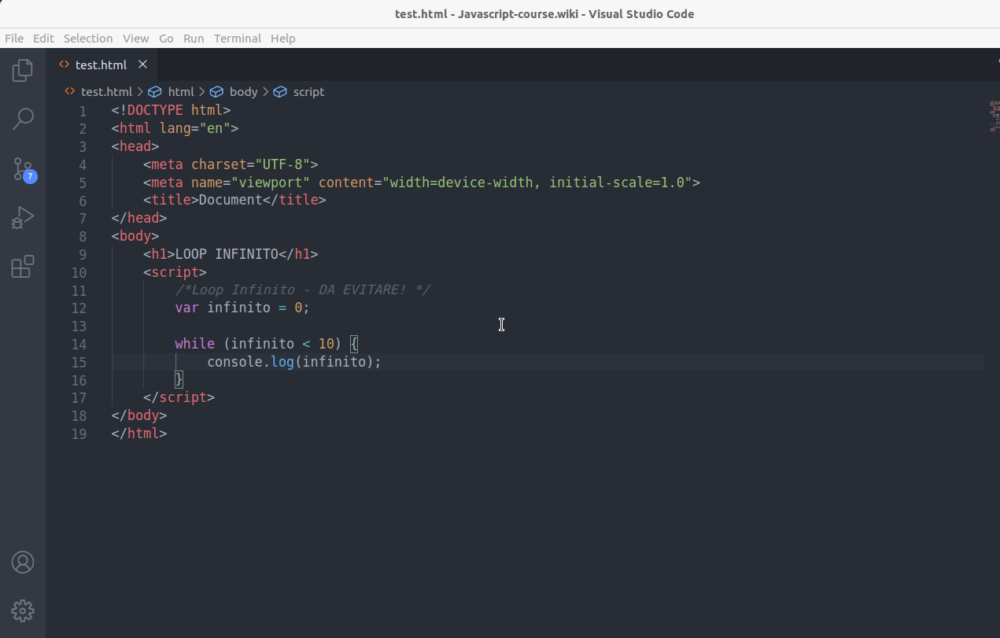
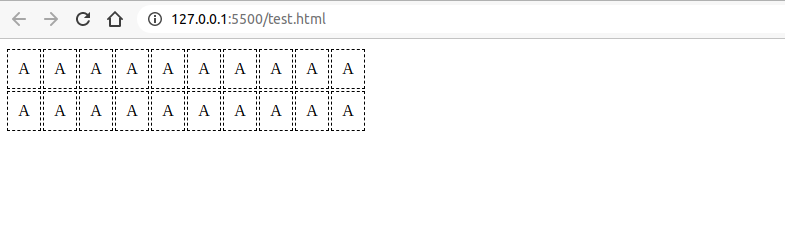
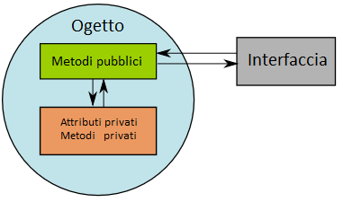
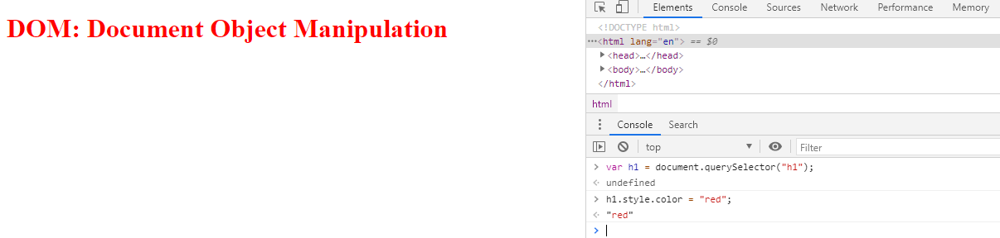

# Javascript


# Lezione 01

## Prerequisiti al corso

Prima di iniziare questo modulo, assicurati di avere una buona familiarità con [HTML](). 

## Approccio al corso
In questo corso vedrai:
1. Javascript orientato alla programmazione web front-end per realizzare  semplici script lato client nonchè per interagire con elementi html/css di una pagina web.
2. Javascript orientato alla programmazione web back-end per l'interazione con il sistema operativo di una macchina fisica. In questo caso avrai bisogno di [Node.js]()

## Strumenti Necessari

Per questo corso avrai bisogno di:
1. un **web browser** come [Google Chrome](https://www.google.com/chrome/). Un browser web contiene tutto il necessario per eseguire Javascript lato client
2. un **editor di testo** come [Visual Studio Code](https://code.visualstudio.com/download). 
3. [Node.js](https://nodejs.org/it/download/), una runtime environment di javascript per poter eseguire script lato server nonchè sulla propria macchina fisica.


## Javascript, ECMA-Script?

ECMAScript (o ES) è la specifica tecnica del linguaggio comunemente noto come Javascript, standardizzata e mantenuta da ECMA International nell'ECMA-262 ed ISO/IEC 16262. 

La specifica è in continuo aggiornamento e di pari passo anche i runtime environment come i browser web o [Nodejs]() devono poter essere allineati.

[Qui](https://kangax.github.io/compat-table/es6/) puoi trovare una tabella aggiornata delle funzionalità coperte da ogni browser web per versione di ECMAScript


In questo corso tratteremo in maniera approfondita ES6.

# Lezione 02

## Primo script all'interno del browser web

Come integro codice javascript all'interno di una pagina html?

### Javascript all'interno del tag `script`
E' possibile inserire codice Javascript direttamente all'interno della pagina html tramite il tag `<script>`.

```html
<!--File index.html-->
<!DOCTYPE html>
<html lang="en">
<head>
    <meta charset="UTF-8">
    <meta name="viewport" content="width=device-width, initial-scale=1.0">
    <title>Document</title>
</head>
<body>
    <script>
        //Stampa "ciao mondo" direttamente nella pagina html
        document.write("ciao mondo");
    </script>
</body>
</html>
```

### Javascript all'interno di un file `.js`
E' possibile creare un collegamento con un file esterno con estensione `.js` che rappresenterà il file contente codice Javascript. 

```html
<!--File index.html-->
<!DOCTYPE html>
<html lang="en">
<head>
    <meta charset="UTF-8">
    <meta name="viewport" content="width=device-width, initial-scale=1.0">
    <title>Document</title>
</head>
<body>
    <script src="main.js"></script>
</body>
</html>
```

```js
//File main.js

//Stampa "ciao mondo" direttamente nella pagina html
document.write("ciao mondo");
```

## Primo script Javascript con node.js

Crea un file `.js` ad esempio `main.js` e scrivi:

```js
console.log('hello');
```

Da terminale digita:

```cmd
node main.js
```

Vedrai stampato sul terminale:

```cmd
hello
```


## Console

Come abbiamo già visto, il metodo `log()` di `Console` stampa un messaggio a video sul terminale in Node.js.
Utilizzando il browser, verrà effettuata la stampa di un messaggio all'interno della web console del browser.

```html
<!--File index.html-->
<!DOCTYPE html>
<html lang="en">
<head>
    <meta charset="UTF-8">
    <meta name="viewport" content="width=device-width, initial-scale=1.0">
    <title>Document</title>
</head>
<body>
    <script>
        //Stampa "ciao mondo" direttamente nella pagina html
        console.log("ciao mondo");
    </script>
</body>
</html>
```


Riporto qualche comando (metodo) aggiuntivo della console:

```js
console.log('Ciao a tutti');         //stampa sulla console
console.warn('Avvertimento');        //Genera un warning
console.error('questo è un errore'); //Genera un errore
console.table({name: 'simone'});     //Stampa in formato tabella
console.clear();                     //Pulisce la console
```

Una lista di tutti i metodi applicabili all'oggetto si trova alla pagina [MDN - Console](https://developer.mozilla.org/it/docs/Web/API/Console)


## Alert & prompt

- `alert(messaggio)` mostra una finestra di avviso contenente il testo specificato
- `prompt()` mostra una finestra di dialogo che consente all'utente di inserire del testo e memorizzarlo in una variabile del programma

```html
<!DOCTYPE html>
<html lang="en">
<head>
    <meta charset="UTF-8">
    <meta name="viewport" content="width=device-width, initial-scale=1.0">
    <title>Document</title>
</head>
<body>
    <script>
        //Salva l'input ricevuto in una variabile cioè un contenitore testuale 
        myName = prompt('Come ti chiami?');
        alert("Il tuo nome è ..");
        //Stampa il valore testuale contenuto nella variabile
        alert(myName);
    </script>
</body>
</html>
```


Approfondimenti sul metodo `alert()` dell'oggetto `Window` li trovate su [MDN - Window.alert()](https://developer.mozilla.org/it/docs/Web/API/Window/alert) mentre approfondimenti sul metodo `prompt()` dell'oggetto `Window` li trovate su [MDN - Window.prompt()](https://developer.mozilla.org/it/docs/Web/API/Window/prompt)

## Commenti


- `// comment`: per commenti inline
- `/* comment */`: per commenti su linee multiple

```js
//inline comment

/*
multi line comment
*/
```

## Introduzione al DOM
Nativamente supportato dai browser per modificare gli elementi di un documento HTML, DOM è un modo per accedere e aggiornare dinamicamente il contenuto, la struttura e lo stile dei documenti. 


[Wikipedia - Document Object Model](https://it.wikipedia.org/wiki/Document_Object_Model)

Hai già visto:

```js
document.write("ciao mondo");
```

Il "comando" `document.write()` è in realtà un **oggetto Javscript** `document` a cui si applica un **metodo** `write()` ovvero una funzione richiamabile solo nel contesto di un particolare oggetto (DOM = Document Object Model).
 

## Introduzione alla libreria JQuery

Vediamo anche come aggiungere librerie esterne, per aggiungere quindi funzionalità al linguaggio standard. Installeremo JQuery perchè è una libreria popolare molto utilizzata proprio per la manipolazione del DOM ovvero degli elementi html.

- Scarica [JQuery](https://jquery.com/download/) e copialo nella root del progetto, dopodichè dovrai creare un collegamento al file attarverso:

```html
 <script type="text/javascript" src="jquery-3.5.1.min.js"></script>
```

Una volta scaricato il file è necessario copiarlo nella root del progetto e creare un collegamento al file html. 

Vediamo alcune funzionalità base offerte della libreria JQuery per la manipolazione del DOM. Le approfondiremo quando necessario più avanti nel corso

- `$()`: Selettore di elementi html. E' possibile selezionare un elemento tramite il suo `id`, la sua `classe`, un `attributo`..

Alcuni metodi:

- `val()`: legge/scrive l'attributo `value` dell'elemento html selezionato
- `click(functionName)`: aggiunge l'evento click all'elemento selezionato e chiama la funzione `functionName`

Vediamo un esempio:

```html
<!DOCTYPE html>
<html lang="en">
<head>
    <meta charset="UTF-8">
    <meta name="viewport" content="width=device-width, initial-scale=1.0">
    <title>Document</title>
    <style>
        table{border: 1px dashed black}
    </style>
</head>
<body>
    <table>
        <tr>
            <td>Nome</td>
            <td> <input type="text" id="myName"> </td>
        </tr>
        <tr>
            <td>Nuovo Nome</td>
            <td> <input type="text" id="new-name"> </td>
        </tr>
    </table>
    <input type="button" value="OK" id="btn-ok">

    <!-- Collegamento alla libreria JQuery.--> 
    <script type="text/javascript" src="jquery-3.5.1.min.js"></script>

    <script>        
        function cambiaNome(){
            //Seleziono l'elemento con id "new-name" e ne prelevo il valore con il metodo "val()"
            //Memorizzo il risultato in una variabile di nome "nuovoNome"
            nuovoNome = $("#new-name").val(); 
            //Assegno all'elemento con id "myName" il valore associato alla variabile "nuovoNome"
            $("#myName").val(nuovoNome); 
            //Pulisco il contenuto del valore dell'elemento con id "new-name"
            $("#new-name").val(""); 
        }
        
       //Associo all'elemento con id "btn-ok" un evento.
       //Al click sull'elemento con id "btn-ok" scatta la funzione "cambiaNome"
        $("#btn-ok").click(cambiaNome)
        
    </script>
</body>
</html>
```


**ATTENZIONE:** Il simbolo `$` è un alias che sta per `jQuery`. Puoi quindi utilizzare `jQuery` al posto di `$` qualora il simbolo `$` fosse utilizzato per unn'altra definizione

## DOM ed Eventi
Appena la pagina html viene eseguita il browser parte con la costruzione del DOM per metterlo a disposizione di Javascript. Nel contempo potrebbe tuttavia scattare l'evento `$("#btn-ok").click(cambiaNome)` e mandare in errore il programma. Per evitare che questo accada è necessario abilitari gli eventi solo dopo che la costruzione del DOM è avvenuta con successo. Per far cio' si utilizza una **funzione anonima** con la seguente sintassi

```js
$( function(){
    //evento
});
```

Riscrivendo il codice abbiamo:

```html
<!DOCTYPE html>
<html lang="en">
<head>
    <meta charset="UTF-8">
    <meta name="viewport" content="width=device-width, initial-scale=1.0">
    <title>Document</title>
    <style>
        table{border: 1px dashed black}
    </style>
</head>
<body>
    <table>
        <tr>
            <td>Nome</td>
            <td> <input type="text" id="myName"> </td>
        </tr>
        <tr>
            <td>Nuovo Nome</td>
            <td> <input type="text" id="new-name"> </td>
        </tr>
    </table>
    <input type="button" value="OK" id="btn-ok">

    <!-- Collegamento alla libreria JQuery.--> 
    <script type="text/javascript" src="jquery-3.5.1.min.js"></script>

    <script>        
        function cambiaNome(){

            nuovoNome = $("#new-name").val(); 
            //Assegno all'elemento con id "myName" il valore associato alla variabile "nuovoNome"
            $("#myName").val(nuovoNome); 
            //Pulisco il contenuto del valore dell'elemento con id "new-name"
            $("#new-name").val(""); 
        }
        
        //L'evento sarà pronto a scattare soltanto quando la struttura del DOM sarà preparata
        $( function(){ 
            $("#btn-ok").click(cambiaNome)
        });
    </script>
</body>
</html>
```

Altri metodi equivalenti:

```js
$().ready(function (){
    //event
})
$(document).ready (function () {
    //event
})
$(window).ready(function () {
    //event
})
```

## Variabili Javascript

Le variabili sono utilizzate per rappresentare valori attraverso un nome simbolico chiamato **identificatore**.

Le variabili in JavaScript hanno un tipo, ma a differenza di altri linguaggi fortemente tipizzati, **Javascript utilizza i tipi per valore** e non per variabile. Questo meccanismo prende il nome di **tipizzazione dinamica**.

```js
var cognome = 'Rossi';
let nome = 'Mario';
const eta = 25;

pi = 3.14;
```

Esistono tre tipi di `keyword` per la dichiarazione di variabili/costanti in JS.

- `var`: Per variabili sia locali che globali.
- `let`: Per variabili locali.
- `const`: Per variabili locali immutabili
- E' possibile inoltre dichiarare una variabile senza nessuna `keyword`, in questo caso sarà l'interprete ad assegnare a tale variabile il qualificatore attraverso il meccanismo dell' **auto-global variable declaration**

## Alcune regole per dichiarazione di variabili

Non è possibile utilizzare:

- un numero, un `#`, una `@`come inizio del nome di una variabile. E' accettanto invece il simbolo `$`
- come identificatore, le keyword native di JS come: `function`, `if`, `delete`, `new`, `while` ..

In javascript è convenzione utilizzare la notazione *camelCase* per la rappresentazione di variabili composte da due o più parole

Vediamo qualche esempio:

```js
//Sintassi alternativa per dichiarare più variabili costanti
const na = 3,
      pigreco = 3.14;
      _iou = 0;
      $yui = 78;
      u-1 = 45; //ERROR!!
      1T = 1;   //ERROR!!
```

## Tipi di dati in JS

ECMAScript definisce sette tipi primitivi:

- Sei tipi di dato che sono *primitives*:
  - `Boolean`. true e false.
  - `null`. Una parola chiave che denota un oggetto nullo.
  - `undefined`. Una proprietà il cui valore non è stato definito.
  - `Number`. 42 oppure 3.14159.
  - `String`. "Salve"
  - `Symbol`. Un tipo di dato la cui istanza è unica e immutabile.
  - `Object`. 

**NOTA:** `typeof` è una proprietà di Javascript che ritorna il tipo di un oggetto o una variabile.

## Tipi Primitivi

Javascript assegna il tipo a una variabile in modo dinamico ovvero in fase di dichiarazione della stessa. Vediamo degli esempi

```js
const nome = 'simone'; 
const cognome = "Di Ricco";
const nome_cognome = `${nome} ${cognome}`;

const temp = -1.5; //Number
const isMaggiorenne = true; //Boolean

const value = null; //Number

const cognome = undefined; //Undefined

const mySymbol = Symbol(); //Undefined

const persona = { //Object
    nome: 'simone',
    eta: 25,
    isMarry: true
}
```

## Standard built-in Object

Sono oggetti predefiniti e accessibili a livello globale, di uso comune in JavaScript. Hanno proprietà e metodi built-in che servono ad eseguire operazioni comuni per l’accesso e la modifica dei dati che contengono.

### Oggetti Fondamentali

Oggetti generali di Javascrpt, sui quali sono basati tutti gli altri oggetti. Rappresentano oggetti, funzioni ed errori.

- Object
- Function
- Boolean
- Symbol
- Error
- EvalError
  
!!!!!!!!!!!!!!!!!!!!!!!!!!!!!!!!!!!!!!!!!
**ATTENZIONE:** Se un reference type (array o oggetto) è dichiarato `const` non significa che non è possibile modificare i campi all'interno ma solo che non posso cambiare la natura del reference type. Il nome di un reference type rappresenta solo l'indirizzo in memoria della struttura.
```js
const myObj {
    nome: 'simone',
    cognome: 'di ricco',
    eta: 34
}

myObj.nome = 'luca'; //OK
myOby = 5;           //ERROR, con const un <oggetto> non può diventare dinamicamente un <number>

let myObj2 {
    ram: 4,
    rom: 5,
    anno: 2010
}

myObj2.ram = 6;   //OK
myObj2 = 18;      //OK con let un <oggetto> può tramutarsi dinamicamente in un <number>
```
!!!!!!!!!!!!!!!!!!!!!!!!!!!!!!!!!!!!!!!!!

## Approfondimento Null - undefined - NaN

- `undefined`: Si verifica quando un oggetto o una variabile non assume nessun valore
- `null`: E' un valore attributo in fase di programmazione per identificare che un dato oggetto o variabile non assume nessun valore. Differisce da `undefined` poichè `null` è previsto deliberatamente in fase di programmazione
- `NaN`: Viene restituito quando **l'espressione numerica** valutata non restituisce un `Number`

Esempio 1:
```js
console.log(null === undefined); //false
```

**Nota:** Per controllare gli stati di *null* e *undefined* è possibile utilizzare direttamente le keyword `null` e `undefined` come nell'esempio sopra illustrato. La stessa cosa non vale per *NaN*. In questo caso si utilizza `IsNaN()`.


```js
//Attenzione
console.log(NaN != NaN); //true !!!!
```
 

## Stringhe

Una stringa è un tipo di dato formato da zero o più caratteri racchiusi tra virgolette doppie `" "`, singole `' '` o tramite accento grave. È possibile chiamare qualsiasi metodo dell'oggetto `String` su una stringa. 

```js
const saluto = 'Ciao a tutti'; 

//Stringa multi-line. Attenzione all'apice -accento grave-
var fraseFilosofica = `Il mattino ha l'oro in bocca.
                       La sera no`;
```

## Opearotri, Proprietà e Metodi su stringhe

## Operatori

- `+`: Uninione/concatenazione di stringhe.
- `[ index ]`: Indicizzazione di una stringa come array di caratteri, in sola lettura
- `<, >`: operatori di confronto tra stringhe. Ritornano un `boolean`, *true/false*
- `{}`: Interpolazione di stringhe

```js
const nome = "marco";
const cognome = "rossi";

console.log(nome + " " + cognome); //marco rossi
//                 0,1,2,3,4 
//const cognome = "r o s s i";
console.log(cognome[1]);     //"o"
console.log(nome > cognome); //true
```

## Approfondimento Interpolazioni di stringhe

Questa parte per adesso potrebbe essere troppo "approfondita", è possibile saltarla senza pregiudicare il corso.

E' possibile utilizzare espressioni all'interno di un unica stringa. Per far cio' si ricorre all'interpolazione di stringhe molto comune anche in altri linguaggi di programmazione.

**La sintassi prevede di usare SOLO l'accento grave** e per le espressioni da valutare, l'operatore `$` seguito dall'espressione racchiusa tra le parentesi graffe `{ }`

```js
let index = 0;
//La variabile "index" viene valuta
console.log(`${index} ciao`); //0

index = index + 1;
console.log(`${index} ciao`); //1
```

## Le stringhe sono immutabili

**!! LE STRINGHE SONO IMMUTABILI IN JAVASCRIPT !!**<br>
Questo significa che dal punto di vista semantico le stringhe non possono essere trattate come array di caratteri e di fatto non è possibile applicare alle stringhe i metodi applicabili agli array.

```js
var saluto = "ciao"
saluto[2] = 'Z';

//Attenzione! LE STRINGHE SONO IMMUTABILI
console.log(saluto); //ciao
```

L'unico modo per cambiare un carattere all'interno di una stringa è distruggere l'intera stringa e ricostruirne un'altra con il carattere modificato tramite assegnamento. Non è possibile tuttavia modificre direttamente il singolo carattere di una stringa.

```js
var saluto = "ciao"
saluto[2] = '2';
console.log(saluto); //ciao

saluto = "super ciao"
console.log(saluto); //super ciao
```

## Proprietà
La propietà `.lenght` restituisce il numero di caratteri presenti nella stringa.

```js
const nome = "marco";
console.log(nome.lenght);   //5
console.log("ciao".lenght); //4
```

## Metodi
Vediamo adesso diversi metodi applicabili alle stringhe. Più avanti, quando tratteremo gli oggetti capiremo meglio la terminologia metodo/proprietà/operatore. Per adesso è importante capirne gli esempi applicativi e imparare ad usare le stringhe per intuirne le potenzialità.

`toUpperCase()`:
- **Parametri** : 
- **Tipo di Ritorno** : `String`
- **Descrizione** : Ritorna la stringa in caratteri maiuscoli
```js
console.log("simOne di rIcco".toUpperCase()); //SIMONE DI RICCO
```

`toLowerCase()`:
- **Parametri** : 
- **Tipo di Ritorno** : `String`
- **Descrizione** :Ritorna la stringa in caratteri minuscoli
```js
console.log("SimOne di rICco".toLowerCase()); //simone di ricco
```

`charAt(index)`:
- **Parametri** : `index` (`Number`)
- **Tipo di Ritorno** : `String`
- **Descrizione** :  Restituisce il carattere all'interno della stringa corrispondente all'indice *index* (Ottenibile anche tramite l'indicizzazione [ ])
```js
console.log("JaVascript".charAt(3)); //a
```


`substring(indexStart, indexEnd)`: 
- **Parametri** : `indexStart` (`Number`), indexEnd (`Number`) 
- **Tipo di Ritorno** : `String`
- **Descrizione** : Ritorna la porzione di stringa compresa tra *indexStart* incluso e *indexEnd* escluso.
```js
console.log("JaVascript language".substring(0, 10)); //JaVascript
```


`endsWith(param)`
- **Parametri** : `param` (`String`)
- **Tipo di Ritorno** : `boolean`
- **Descrizione** :ritorna un boolean se la stringa termina o meno con la stringa *param*
```js
console.log("myPdfFile.pdf".endsWith("pdf")); //true
console.log("01110000011".endsWith("10")); //false
```

`startsWith(string)`: 
- **Parametri** : `param` (`String`)
- **Tipo di Ritorno** : `boolean`
- **Descrizione** :ritorna un boolean (true/false) se la stringa inizia o meno con la stringa *param*
```js
console.log("01110000011".startsWith("0111")); //true
```

`.includes(param1, ?param2)`:
- **Parametri** : `param1` (`String`), `param2` (`Number`), 
- **Tipo di Ritorno** : `boolean`
- **Descrizione** : cerca la stringa *param1* a partire dall'indice opzionale *param2*, ritorna true o false. Se *param2* è omesso cerca *param1* in tutta la stringa
```js
console.log("JaVascript is programming language".includes("is")); //true
console.log("JaVascript is programming language".includes("is", 16)); //false
```

`indexOf(param1, ?param2)` :
- **Parametri** : `param1` (`String`), `param2` (`Number`), 
- **Tipo di Ritorno** : `Number`
- **Descrizione** : Cerca la prima occorrenza della stringa *param1* a partire dall'indice opzionale *param2*. Restituisce l'indice della posizione di *param1*. Se non trova *param1* nella stringa restituisce -1. Se *param2* è omesso cerca *param1* in tutta la stringa a partire dall'inizio della stringa.
```js
console.log("0011010111000110".indexOf("111")); //7
console.log("0011010111000110".indexOf("111", 10)); //-1
```

`lastIndexOf(param1, param2)` :
- **Parametri** : `param1` (`String`), `param2` (`Number`), 
- **Tipo di Ritorno** : `Number`
- **Descrizione** :  Cerca l'ultima occorrenza della stringa *param1* vincolato dall'indice limite *param2*.  Restituisce l'indice della posizione di *param1*. Se *param2* è omesso cerca *param1* in tutta la stringa a partire dalla fine della stringa.


`padEnd(param1, param2)`: 
- **Parametri** : `param1` (`Number`), `param2` (`String`), 
- **Tipo di Ritorno** : `String`
- **Descrizione** : Riempie la stringa fino a una lunghezza massima di *param1*, aggiungendo come riempitivo in coda la stringa *param2*

```js
console.log("100".padEnd(5, "-"));    //100--
console.log("100000".padEnd(5, "-")); //100000
console.log("".padEnd(5, "-"));       //-----
```

`padStart(param1, param2)`:
- **Parametri** : `param1` (`Number`), `param2` (`String`)
- **Tipo di Ritorno** : `String`
- **Descrizione** : Riempie la stringa fino a una lunghezza massima di *param1*, aggiungendo come riempitivo in testa la stringa *param2*

```js
console.log("120".padStart(5, "0"));  //00120
console.log("9040".padStart(5, "0")); //09040
console.log("2".padStart(5, "0"));    //00002
```

`repeat(param)`:
- **Parametri** : `param` (`Number`) 
- **Tipo di Ritorno** : `String`
- **Descrizione** :  Replica la stringa un numero di volte specificato da *param*

```js
console.log("0".repeat(32)); //00000000000000000000000000000000
console.log("*-".repeat(8)); //*-*-*-*-*-*-*-*-
```

`replace(param1, param2)`:
- **Parametri** : `param1` (`String`), `param2` (`String`)
- **Tipo di Ritorno** : `String`
- **Descrizione** :  Sostituisce la prima occorennza della stringa *param1* con la stringa *param2*. Funziona anche se *param1* è un'espressione regolare.

```js
console.log("Ciao a tutto il mondo".replace("o", "0")); //Cia0 a tutto il mondo
//Uso interessante del metodo replace() con un'espressione regolare. /o/g >>> cerca tutte le occorrenze
//di "o". Nota che "g" sta per "global" cioè tutte
console.log("Ciao a tutto il mondo".replace(/o/g, "0")); //Cia0 a tutt0 il m0nd0
```

`search(param)`:
- **Parametri** : `param` (`String`)
- **Tipo di Ritorno** : `Number`
- **Descrizione** : cerca la prima occorenza di *param* e restituisce l'indece della posizione. Funziona anche se *param* è un'espressione regolare. 
```js
console.log("Ciao a tutto il mondo".search("mondo"));  //16
console.log("Ciao a tutto il mondo".search("ill"));  //-1
```

`slice(indexStart, indexEnd)`:
- **Parametri** : `indexStart` (`Number`), `indexEnd` (`Number`)
- **Tipo di Ritorno** : `String`
- **Descrizione** :  Restituisce una sottostringa tra *indexStart* e *indexEnd*

```js
console.log("DRCSMN91L22E715Q".slice(6, 8)); //91
```

`split(separatore, ?max)`:
- **Parametri** : `separatore` (`String`), `max` (`Number`)
- **Tipo di Ritorno** : Array of `String`
- **Descrizione** : Può essere utilizzato per raggruppare delle stringhe sottoforma di array contenute in un unica grande stringa e separate tramite un separatore. Crea quindi un array di stringhe contenente porzioni di stringa derivate dalla stringa a cui è applicato il metodo separate dal carattere (o i caratteri) come indicato nel parametro *separatore*. Il secondo parametro, opzionale, indica il numero massimo di elementi dell'array.

```js
const myArray = "Ciao a tutto il mondo".split(" ");
console.log(myArray);    //(5) ["Ciao", "a", "tutto", "il", "mondo"]
console.log(myArray[3]); //il

const myArray2 = "Ciao a tutto il mondo".split(" ", 3);
console.log(myArray2);   //(3) ["Ciao", "a", "tutto"]
```

`trim()`:
- **Parametri** :
- **Tipo di Ritorno** : `String`
- **Descrizione** : rimuove gli spazi all'inizio e alla fine di una stringa
```js
console.log("#" + "         Ciao a tutto il mondo    ".trim() + "#"); //#Ciao a tutto il mondo#
```

`trimLeft()`:
- **Parametri** :
- **Tipo di Ritorno** : `String`
- **Descrizione** : rimuove gli spazi in testa a una stringa.
```js
console.log("#" + "         Ciao a tutto il mondo    ".trimLeft() + "#"); //#Ciao a tutto il mondo    #
```

`trimRight()`:
- **Parametri** :
- **Tipo di Ritorno** : `String`
- **Descrizione** : rimuove gli spazi in coda a una stringa
```js
console.log("#" + "         Ciao a tutto il mondo    ".trimRight() + "#"); //#         Ciao a tutto il mondo#
```

# Lezione 08

## Conta parole

Il seguente esempio conta le parole inserite in un certo input testuale.
Faremo uso dell'evento `keypress` che scatta ad ogni tasto premuto e del metodo su stringa `split()`

```html
<!DOCTYPE html>
<html lang="en">
<head>
    <meta charset="UTF-8">
    <meta name="viewport" content="width=device-width, initial-scale=1.0">
    <title>Document</title>
</head>
<body>

    <h1>Conta parole</h1>

    <table>
        <td>Testo:</td>
        <tr>
            <td><textarea cols="30" rows="10" id="myText" ></textarea></td>
        </tr>
        <tr>
            <td>Parole nel testo:</td>
        </tr>
        <tr>
            <td><input type="text" id="word-count"></td>
        </tr>    
    </table>

    <!-- Collegamento alla libreria JQuery.--> 
    <script type="text/javascript" src="jquery-3.5.1.min.js"></script>

    <script>        
        function contaParole(){
            //Prelievo il valore dell'elemento con id="myText" lo converto a stringa e lo assegno alla variabile testoInserito
            let testoInserito = String($("#myText").val()); 
            //Prelievo la proprietà lenght di un array formato da parole separate da spazi.
            //ATTENZIONE. NON FUNZIONA CON I DOPPI SPAZI
            let conteggioParole = (testoInserito.split(" ").length);
            $("#word-count").val(conteggioParole)
        }

        $( function(){ 
            $("#myText").keypress(contaParole)
        });
    </script>
</body>
</html>
```


# Lezione 09

## Approfondimento - Rappresentazione numerica in Javascript

Questa parte per adesso potrebbe essere troppo "approfondita", è possibile saltarla senza pregiudicare il corso

## Numeri in Fixed Point
Per il tipo nativo `Number` Javascript utilizza 64 bit per la memorizzazione in ram sia per i numeri interi sia per i numeri decimali a "virgola fissa" (fixed point). Vengono utilizzati 53 bit per la parte intera e i restanti 9 per la parte decimale anche se un numero è intero. Il numero intero (safe) più grande rappresentabile in JS è `MAX_SAFE_INTEGER`.

- `MAX_SAFE_INTEGER`: E' il numero intero più grande a cui posso applicare un incremento in modo affidabile.

Il metodo `isSafeInteger()` applicato all'oggetto `Number` ritorna un `boolean` che indica se il numero è safe oppure no


```js
console.log(Number.MAX_SAFE_INTEGER); //9007199254740991
/*
(property) NumberConstructor.MAX_SAFE_INTEGER: number

The value of the largest integer n such that n and n + 1 are both exactly representable as a Number value. The value of Number.MAX_SAFE_INTEGER is 9007199254740991 2^53 − 1.
*/

let n1 = Number.MAX_SAFE_INTEGER;      //OK, safe
console.log(Number.isSafeInteger(n1)); //true
let n2 = Number.MAX_SAFE_INTEGER + 1;  //OK, safe
console.log(Number.isSafeInteger(n2)); //true
let n3 = Number.MAX_SAFE_INTEGER + 1   //NO, non safe, il risultato non è affidabile
console.log(Number.isSafeInteger(n3)); //false

```

## Numeri in Floating Point
La rappresentazione dei numeri in "virgola mobile" (floating point) Javascript utilizza lo standard IEEE 754 

```js
//MAX_VALUE rappresenta il più grande numero rappresentabile in virogla mobile
console.log(Number.MAX_VALUE); //1.7976931348623157e+308

//Attenzione!!
console.log(0.1 + 0.2 == 0.3); //false
console.log(0.1 + 0.2); //0.30000000000000004
```
Lo standard IEE754 rappresenta i numeri reali e come tale è necessario conoscere ed evitare alcune pratiche di cattivo utilizzo dei numeri reali. In generale con i numeri reali è da evitare l'utilizzo di espressioni di uguglianza. E' possibile tuttavia trasformare un'espressione di uguaglianza esatta con un'espressione di "vicinanza" definendo un'accuratezza in questo modo:

```js
const accuracy = 0.0000001;
console.log( (0.1 + 0.2) - 0.3  < accuracy); //true
```

Il più piccolo valore rappresentabile (vicino allo zero) in floating point è:

```js
console.log(Number.MIN_VALUE); //5e-324
```

E' bene ricordare che la rappresentazione dei numeri con lo standard IEEE 754 è su scala logaritimica quindi non lineare. Questo significa che posso rappresentare numeri estremamente grandi e numeri estremamente piccoli ma la distanza tra due numeri diventa sempre più grande (e quindi meno accurata) mano a mano che i numeri diventano grandi e diventa più piccola (quindi più accurata) mano a mano che i numeri diventano piccoli

## Not A Number NaN

Javascript restituisce `NaN` quando valuta che un'espressione non può essere svolta e darebbe errore.

```js
console.log( 10/"ciao" ); //NaN
console.log( 0/0 ); //NaN
```

E' buona norma evitare NaN in special modo per quelle espressioni numeriche non prevedibili o che ricevono valori dall'esterno. La funzione `isNaN()` restituisce un boolean se un dato valore risulta o meno un NaN.

```js
let myVar = 12 / 0.9;
if ( !isNaN(myVar) ) {
    console.log(myVar);
}
```

# Lezione 10

## Approfondimento - Codifica caratteri Javascript

Questa parte per adesso potrebbe essere troppo approfondita, è possibile saltarla senza pregiudicare il corso

## ASCII

ASCII (acronimo di American Standard Code for Information Interchange, Codice Standard Americano per lo Scambio di Informazioni) è un codice per la codifica di caratteri. Lo standard ASCII è stato pubblicato dall'American National Standards Institute (ANSI) nel 1968

Con US-ASCII si intende un sistema di codifica dei caratteri a 7 bit, comunemente utilizzato nei calcolatori, proposto dall'ingegnere dell'IBM Bob Bemer nel 1961, e successivamente accettato come standard dall'ISO, con il nome di ISO/IEC 646.

Alla specifica iniziale basata su codici di 7 bit fecero seguito negli anni molte proposte di estensione ad 8 bit e quindi 256 caratteri, con lo scopo di raddoppiare il numero di caratteri rappresentabili. Nei PC IBM si fa per l'appunto uso di una di queste estensioni, ormai standard de facto, chiamata extended ASCII o high ASCII. In questo ASCII esteso, i caratteri aggiunti sono vocali accentate, simboli semigrafici e altri simboli di uso meno comune. I caratteri di ASCII esteso sono codificati nei cosiddetti codepage. Ogni paese presentò la sua proposta di ASCII esteso per rappresentare e codificare tutti i caratteri aggiuntivi relativi alla lingua creando non pochi problemi di comunicazione tra continenti. C'era quindi bisogno di uno standard nuovo e unico per tutto il mondo. Nasce quindi l'UNICODE.

[Wikipedia - ASCII](https://it.wikipedia.org/wiki/ASCII)

## Unicode

Unicode è stato creato per risolvere i limiti dei tradizionali schemi di codifica dei caratteri Ad esempio , sebbene i caratteri definiti nella ISO 8859-1 siano ampiamente utilizzati in paesi diversi, spesso si verifica incompatibilità tra paesi diversi. Molti metodi di codifica tradizionali hanno un problema comune, ovvero consentono ai computer di gestire un ambiente bilingue (di solito utilizzando lettere latine e le loro lingue native), ma non possono supportare un ambiente multilingue allo stesso tempo (riferendosi a una situazione in cui più lingue possono essere mescolate contemporaneamente).

Unicode era stato originariamente pensato come una codifica a 16 bit (quattro cifre esadecimali) che dava la possibilità di codificare 65.535 (2^16 -1) caratteri. Tanto si riteneva essere sufficiente per rappresentare i caratteri impiegati in tutte le lingue scritte del mondo. Ora invece lo standard Unicode, che tendenzialmente è perfettamente allineato con la norma ISO/IEC 10646, prevede una codifica fino a 21 bit e supporta un repertorio di codici numerici che possono rappresentare circa un milione di caratteri. Ciò appare sufficiente a coprire anche i fabbisogni di codifica di scritti del patrimonio storico dell'umanità, nelle diverse lingue e negli svariati sistemi di segni utilizzati.

Al 2009, solo una piccolissima parte di questa disponibilità di codici è assegnata. Per lo sviluppo dei codici sono infatti previsti 17 "piani" ("planes", in inglese), da 00 a 10hex, ciascuno con 65.536 posizioni (quattro cifre esadecimali), ma solo i primi tre e gli ultimi tre piani sono ad oggi assegnati[2], e di questi il primo, detto anche BMP, è praticamente sufficiente a coprire tutte le lingue più usate.


Concretamente, questo repertorio di codici numerici è serializzato mediante diversi schemi di ricodifica, che consentono l'uso di codici più compatti per i caratteri usati più di frequente. È previsto l'uso di codifiche con unità da 8 bit (byte), 16 bit (word) e 32 bit (double word), descritte rispettivamente come UTF-8, UTF-16 e UTF-32. UTF-8 è di fatto lo standard successore di ASCII, perfettamente compatibile mentre javascript utilizza l'UTF-16 consentendo di rappresentare un numero elevato di caratteri, 655536. Ciò non significa che per le codifiche UTF-8 e UTF-16 non sia possibile rappresentare tutti i caratteri unicode ma a causa della codifica potrebbe non essere conveniente in certe situazioni utilizzare UTF-8 anzichè UTF-16. In certe situazioni infatti UTF-8 potrebbe aver bisogno di 3 byte per rappresentare un certo carattere mentre UTF-16 soltanto 2. Dipende dalla frequenza e natura dei caratteri. 

Si rirprenda il template html:
```html
<!DOCTYPE html>
<html lang="en">
<head>
    <meta charset="UTF-8">
    <meta name="viewport" content="width=device-width, initial-scale=1.0">
    <title>Document</title>
</head>
<body>
    
</body>
</html>
```

Alla riga

```html
<meta charset="UTF-8">
```
E' indicata la codifica necessaria per la trasmissione e visualizzazione corretta dei caratteri.


[Wikipedia - Unicode](https://en.wikipedia.org/wiki/Plane_(Unicode)) <br>
[Wikibooks - Unicode/Character reference/0000-0FFF](https://en.wikibooks.org/wiki/Unicode/Character_reference/0000-0FFF)<br>


## Caratteri di Escape

Il backslash `\` indica la presenza di un carattere escape che non sarebbe possibile inserire direttamente con un editor di testo poichè verrebbe interpretato come un comando.

Vediamo qualche carattere di escape:

- `\n`: a capo
- `\t`: tab
- `\b`: Backspace
- `\r`: Carriage return
- `\\`: Backslash
- `\'`: Single quote
- `\"`: Double quote


Introdotti gli escape è possibile vedere come inserire un carattere UNICODE tramite il suo codice identificatico: `\u{codice_unicode}`

```js 
let str = "\u{1234}"; // ሴ === 1234 codice unicode, 1 carattere
console.log (str);
console.log (str, str.lenght); //ሴ, 1

//Attenzione!! la codifica UTF-16 non raggiunge direttamnte il carattere stampato qui di seguito
//Utilizza quindi 2 caratteri Javascript
let str = "\u{1F600}"; // 😀 === 1F600 codice unicode, 2 caratteri
console.log (str, str.lenght); //😀, 2
```

Posso risalire al codice unicode tramite il metodo `charCodeAt(index)` che restituisce il codice unicode del carattere specificato da `index`. 

```js

let str = "\u{1F600}"; // 😀 === 1F600 codice unicode 2 caratteri
console.log (str); //😀
console.log(str.charCodeAt(0), strCharCodeAt(1)); //55357 56832
```

C'è anche il metodo che più completo `charCodePointAt(index)` che restituisce il codice unicode che *inizia* da `index`. Questo è necessario per quei caratteri che non possono essere rappresentati da UTF-16 e che quindi sono necessari "due caratteri" Javascript 

```js
let str = "\u{1F600}"; // 😀 === 1F600 codice unicode 2 caratteri
console.log (str); //😀
console.log(str.codePointAt(0)); // 128512 === 1F600 
```

Posso usare l'unicode anche per il nome di variabili! Da evitare.

```js
var \u{1f68} = 2017; // Ὠ
```

# Lezione 11

## Type conversion

JavaScript è un linguaggio con tipi assegnati dinamicamente. Questo significa che non si va a specificare il tipo di dato che una variabile conterrà quando viene dichiarata e anche che il tipo di un dato viene convertito automaticamente a seconda delle necessità durante l'esecuzione dello script. Nelle espressioni che coinvolgono valori numerici e stringhe con l'operatore + JavaScript converte i valori numerici in stringhe (conversione implicita). 
Vediamo come formalizzare questi concetti e distinguere tra conversioni esplicite e implicite.

## Conversione esplicita

E' una pratica di buona programmazione far riferimento a conversioni esplicite come trattamento di errori o ricezione dati dall'esterno anche quando "sembra" che non sia necessario. La conversione esplicita forza un tipo e previene in molti casi errori di mal interpretazione dei dati.
Vediamo alcune soluzioni disponibili per la conversione esplicita tra tipi in Javascript. 

- `String(value)`: converte `value` (qualsiasi tipo) in un tipo `String`
- `value.toString()`: metodo che converte `value` in una stringa (equivalente a `String(value)`)
- `Number(value)`: converte `value` in un tipo `Number`
- `parseInt(value)` - converte `value` in un tipo `Number` e ritorna la parte intera
- `parseInt(value)` - converte `value` in un tipo `Number` e ritorna la parte frazionaria

```js
//Number to string - String(value)
let value = 45;
String(value); //ritorna la stringa '45'

//Boolean to string - String(value)
let value2 = false;
String(value2); //ritorna la stringa 'false'

//Metodo alternativo - toString();
let value3 = false;
(value3).toString(); //ritorna la stringa 'false'

//String to number - Number(string)
let string = '45';
Number(string); //ritorna il numero 45

//Boolean to number - Number(string)
let myBool = true;
Number(myBool); //1ritorna il numero 1

parseInt('100.31'); //100
parseFloat('100.31'); //31
```

## Conversione implicita

Anche se è sconsigliato affidarsi alle conversioni implicite, cioè quelle che Javascript effettua implicitamente incontrando in una espressione due o più valori appartenenti a tipi diversi, è bene conoscerle per difendersi e saperle trattare. In alcuni semplici casi non è comunque sbagliato utilizzarle.

Riporto un esempio qui sotto:

```js
// Type coercion

const nome = 'marco';
const cognome = 'rossi';
const eta = 20;
const sposato = false;

console.log(nome + ' ' + cognome + ' ha ' +  eta + ' anni. ' + 'é sposato? ' + sposato);

/*
Console:
---------------
marco rossi ha 20 anni. E' sposato? false
*/
```

Notiamo che la variabile `eta` è stata convertita da tipo `numero` a tipo `stringa` e la variabile `sposato` è stata convertita da `boolean` a `stringa` in modo implicito da javascript. Queste sono conversioni effettuate in modo automatico da javascript poichè nella stessa espressione si trovano tipi diversi.

# Lezione 12

## Operatori matematici

Vediamo alcuni operatori matematici direttamente con un esempio:

```js
/* operatori matematici */

const questAnno = 2020;

const etaMarco = 25;
const etaStefano = 22;

const nascitaMarco = questAnno - etaMarco;  
const nascitaStefano = questAnno - etaStefano; 

console.log(nascitaMarco);   //1995
console.log(nascitaStefano); //1998

console.log(5 * 2); //10
console.log(5 / 2); //2.5

// Modulo: resto della divisione intera
console.log(7 % 4); //3
```

## Pre e post incremento/decremento

L'operatore di incremento incrementa (aggiunge uno a) il suo operando e restituisce un valore.

- `++x` / `--x`: **pre incremento/decremento** restituisce il valore dopo l'incremento
- `x++` / `x--`: **post incremento/decremento** restituisce il valore prima di incrementare

Pre e post incremento/decremento rilevano una differenza solo in caso di valutazione di un'espressione.
Se troviamo Pre e post incremento/decremento isolati in un singolo statement (come spesso accade) risultano equivalenti.

```js
//Pre incremento
x = 0;
y = ++x; //y=1, x=1

//Post incremento
x = 0;
y = x++; //y=0, x=1

x = 0;
x++; //x=1 // in questo caso è equivalente a ++x

x = 0;
++x; //x=1 // in questo caso è equivalente a x++
```

La lista di tutti gli operatori aritmetici la troviamo alla pagina: [MDN - Operatori Aritmetici](https://developer.mozilla.org/it/docs/Web/JavaScript/Reference/Operators/Operatori_Aritmetici)

## Oggetto MATH

In JS è possibile utilizzare funzioni matematiche avanzate tramite l'oggetto `Math`. Vediamo alcune tra le più comuni:

- `Math.round(value)`: Ritorna l'arrotondamento di *value* al numero più vicino
- `Math.ceil(value)`: Ritorna l' arrotondamento di *value* per eccesso
- `Math.floor(value)`: Ritorna l' arrotondamento di *value* per difetto
- `Math.trunc(value)`: Ritorna il troncamento di *value*
- `Math.sqrt(value)`: Ritorna la radice quadrata di *value*
- `Math.abs(value)`: Ritorna il valore assoluto di *value*
- `Math.pow(base, exp)`: Ritorna l'esponenziale: *base^exp*
- `Math.min(value1, value2, value3, ..)`: Ritorna il minimo valore tra i parametri indicati tra gli argomenti
- `Math.max(value1, value2, value3, ..)`: Ritorna il massimo valore tra i parametri indicati tra gli argomenti
- `Math.random()`: Ritorna un numero random decimale nel range *0 - 1*

Esempio:
```js
//Math.PI
console.log(Math.PI); //stampa del numero pi greco: 3,14..

Math.round(42.1); //42
Math.round(42.5); //43
Math.round(42.7); //43

Math.ceil(42.1); //43
Math.ceil(42.5); //43
Math.ceil(42.7); //43

Math.floor(42.1); //42
Math.floor(42.5); //42
Math.floor(42.7); //42

Math.sqrt(25); //5
Math.sqrt(42.5); //6.

Math.abs(-25); //25
Math.abs(42.5); //42.5

Math.pow(2, 5); //32
(2**5); //32 === 2^5 >> equivalente a Math.pow(2, 5); 
Math.pow(5, 3); //125

Math.min(2, 5, -2, 6); //-2
Math.max(2, 5, -2, 6); //6

Math.random(); //0.234514378429

Math.trunc(12.78899); //12
```

La seguente riga di codice genera un numero casuale da 0 a 100.

```js
console.log(Math.round((Math.reandom()*100))); //45
```

# Lezione 13

## Equazione di II grado

Il seguente script calcola le soluzioni reali di un'equazione di secondo grado. Stampa "Soluzioni immaginarie" se le soluzioni non sono reali 

```html
<!DOCTYPE html>
<html lang="en">
<head>
    <meta charset="UTF-8">
    <meta name="viewport" content="width=device-width, initial-scale=1.0">
    <title>Document</title>

    <style>
        table{
            border: 2px solid gray;
            padding: 5px;
            border-radius: 10px;
        }
        body {
            font-size: 20px;
        }
        .cofficient{ 
            text-align: right;
        }
        #resolve{
            height: 30px;
        }
    </style>

</head>
<body>
    <h1>Equazione di II grado</h1>
    <table>
        <tr>
            <td>
                <input type="text" placeholder="a" class="cofficient" id="a">
                x<sup>2</sup> + 
                <input type="text" placeholder="b" class="cofficient" id="b">
                x + 
                <input type="text" placeholder="c" class="cofficient" id="c">
                = 0
            </td>
        </tr>
        <tr>
            <td><input type="button" value="Risolvi" id="resolve"></td>
        </tr>
        <tr>
            <td>
                <input type="text" placeholder="---" id="ris-1">
                x<sub>1</sub> 
            </td>
        </tr>
        <tr>
            <td>
                <input type="text" placeholder="---" id="ris-2">
                x<sub>2</sub> 
            </td>
        </tr>

    </table>

    <script type="text/javascript" src="jquery-3.5.1.min.js"></script>

    <script>
        function ResolveEqIIgrado(){
            //Prelievo il valore dell'elemento con id="myText" lo converto a stringa e lo assegno alla variabile testoInserito
            let a = Number($("#a").val()); 
            let b = Number($("#b").val());
            let c = Number($("#c").val());

            let delta = Math.sqrt(b**2 - 4*a*c);

            if (isNaN(delta)) {
                $("#ris-1").val("Soluzioni immaginarie");
                $("#ris-2").val("Soluzioni immaginarie");
            } 
            else{
                let ris1 = (-b - delta)/(2*a);
                let ris2 = (-b + delta)/(2*a);
                $("#ris-1").val(String(ris1));
                $("#ris-2").val(String(ris2));
            }
        }

        $( function(){ 
            $("#resolve").click(ResolveEqIIgrado)
        });
    </script>
</body>
</html>
```


# Lezione 14

## Operator Precedence

La precedenza degli operatori determina la priorità in cui gli operatori vengono valutati. Gli operatori con precedenza più alta sono valutati prima degli operatori con precedenza più bassa.

La lista completa di tutti gli operatori con le rispettive precedenze la troviamo qua: 
[MDN - Operator Precedence](https://developer.mozilla.org/en-US/docs/Web/JavaScript/Reference/Operators/Operator_Precedence)

Da notare che l'operatore `( )` ha la priorità più alta e quindi la precedenza su tutti gli operatori. Questo significa che per forzare la precedenza, esattamente come per la matematica è possibile sfruttare le parentesi `( )`.

**Regola di buona programmazione:** Non è mai una buona pratica di programmazione lasciare espressioni troppo complesse prive di parentesi anche se sono rispettate dal punto di vista semantico tutte le precedenze previste. Le parentesi, oltre a forzare la precedenza, offrono visivamente una chiarezza maggiore, evitando di commettere errori banali di svista.

```js
/* Operatore precedence */
/* Calcolo eta' media */

const questAnno = 2020;
const maggiorenne = 18;

const nascitaMarco = 1996;
const nascitaLuca = 2006;


/* l'operatore "-" ha precedenza sull'operatore ">" quindi l'espressione è svolta correttamente da sinistra verso destra
La sottrazione verrà quindi svolta prima dell'operatore ">" */
let isMaggiorenne = questAnno - nascitaMarco > maggiorenne
console.log(isMaggiorenne); //true
let isMaggiorenne = questAnno - nascitaMarco > maggiorenne
console.log(isMaggiorenne); //false

//Grouping
const etaMarco = questAnno - nascitaMarco; //24
const etaLuca = questAnno - nascitaLuca;   //14

// In questo caso poichè la divisione ha precedenza sulla somma è necessario forzare la priorità inserendo le parentesi
// Calcolo età media
console.log ( (etaMarco + nascitaLuca)/2 ); //19
```

## Associatività

L'associatività specifica in che modo vengono eseguite le elaborazioni a parità di operatore.
Mentre la precedenza valuta la priorità, l'associatività valuta la modalità di esecuzione. Quasi tutti gli operatori hanno un'associatività *left-to-right* ovvero, l'elaborazione è da sinistra verso destra esattamente come per la matematica. 

Alla pagina [MDN - Operator Precedence](https://developer.mozilla.org/en-US/docs/Web/JavaScript/Reference/Operators/Operator_Precedence) si trova una tabella riassuntiva che mostra priorità/associatività per ogni operatore.


```js
//Associatività del'operatore +. L'operatore + vale sia da somma che da concatenazione stringa
for(let i=0, j=5; i<=j; i++,j--){
    document.writeln(i + j + " "); //5//5//5
}
for(let i=0, j=5; i<=j; i++,j--){
    document.writeln(i + (j + " ") ); //05//14//23
}
```

## Operatori di assegnamento

L'operatore di assegnazione semplice `=` viene utilizzato per assegnare un valore a una variabile. L'operazione di assegnazione restituisce il valore assegnato. È possibile concatenare l'operatore di assegnazione per assegnare un singolo valore a più variabili (multiple assignment).

```js
//Multiple assignement
// E' possibile dichiarare due variabili contemporaneamente
let x, y;

/*Molto importante! L'operatore "= è un operatore da destra a sinistra  */
x = y = (2 * 7) * 3 - 5; // 9 * 3 - 5 // 27 - 5 // 22

console.log(x); //22
console.log(y); //22
```

Molto utilizzati sono anche gli operatori di assegnamento composto come: `+=, -=, *=, /= ..` <br>

Hanno una sintassi molto chiara e compatta. Vengono utilizzati nei casi in cui è necessario elaborare anche il valore della variabile a sinistra contrariamente all'operatore di assegnamento semplice `=` che ignora e distrugge il valore contenuto a sinistra.

```js
let x = 10;

x *= 2; // x = x * 2
console.log(x); //20

x /= 2; // x = x / 2
console.log(x); //10
```

# Lezione 15

## Operatori Logici

Gli operatori logici `<`, `<=`, `==`, `>`, `>=`, `!=` ..  trattano l'espressione come un espressione logica e ritornano un valore booleano. Sono spesso utilizzati nel controllo di condizioni in costruttti `if` o cicli `while`, `for` e tutti i costrutti condizionali e iterativi inerenti.  

```js
console.log(1 >= 5);           //false
//Per le stringhe si segue un ordine lessicografico
console.log("ciao" < "pasta"); //true
console.log(12 != 5); /        //true
```

**Nota - Operatore di uguaglianza:** == Vs ===

Entrambi sono operatori logici di uguaglianza.

- `===`: **Uguaglianza forte**, valuta l'uguaglianza dell'espressione valutanto il tipo e il contenuto.
- `==`: **Uguaglianza debole**, valuta l'uguaglianza dell'espressione valutanto il contenuto effettuando prima una conversione di tipo.


```js
/* === */
console.log(5 === 5);            //true
console.log(15 === "15");        //false -> sono tipi di dati diversi, il primo è un numero, il secondo è una stringa
console.log(null === undefined); //false -> sono tipi di dati diversi.

/* == */
console.log(5 == 5);             //true
console.log(15 == "15");         //true!! -> sono tipi di dati diversi, il primo è un numero, il secondo è una stringa ma il contenuto è lo stesso

console.log(false == 0);         //true!! -> entrambi hanno un valore falsy anche se il tipo è diverso
console.log(null == undefined);  //true!! -> entrambi hanno un valore falsy anche se il tipo è diverso
```

In generale l'uguaglianza forte è da preferire per essere sicuri di effettuare quindi anche un controllo sul tipo e rendere più semplice l'individuazione di errori run-time spesso causati da conversioni implicite di Javascript.

## Logica Booleana

Trattano l'espressione come un'espressione logica e permettono la concatenazione di espressioni con più operatori logici. Ritornano un valore booleano: `TRUE`, `FALSE`.
Vediamo i principali:

**AND** : `condition1 && condition2`: Ritorna *true* se entrambe `condition1` e `condition2` risultano *true*. <br>
**OR**  : `condition1 || condition2`: Ritorna *true* se almeno una tra `condition1` e `condition2` risulta *true*. <br>
**NOT** : `!condition1`: Inverte il risultato logico di `condition1`. <br>


```js
console.log( (1 >= 5) || ("ciao" < "pasta") );  //true
console.log( ("ciao" < "pasta") && (12 == 5) ); //false
```

## Approfondimento - Short evalutation

Se un' espressione logica risulta necessariamente *true* o *false* le elaborazioni concatenate non vengono elaborate.

- `true || expr`: `expr` non viene valutata
- `false && expr`: `expr` non viene valutata

Esempio:
```js
console.log( (1 < 2) || ("ciao" < "pasta") ); //true,  ("ciao" < "pasta") non viene valutata
console.log( (12 == 5) && ("c" < "p") ); //false, ("c" < "p") non viene valutata
```

## Truthy e falsy

I valori `truthy` e `falsy` sono quei valori considerati rispettivamente sempre veri o falsi o per meglio dire che ritornano sempre un boolean: *true/false*.

- Valori truthy: `1`, `"content"` ..
- Valori falsy: `undefined`, `null`, `0`, `""`, `NaN`

Vedremo adesso come mettere in pratica questi concetti attraverso l'uso di costrutti condizionali e iterativi.

# Lezione 16

## Control Structure if/else

La struttura di controllo `if/else` esegue un'istruzione o un blocco di istruzioni se una condizione specificata come argomento di `if` risulta *true*. Se la condizione risulta *false* si eseguono le istruzioni del ramo `else`

[MDN - if...else](https://developer.mozilla.org/en-US/docs/Web/JavaScript/Reference/Statements/if...else)

```js
if (condition1) {
    //code
} else if (condition2) {
    //code
}
else {
    //code
}
```

La condizione espressa come argomento di `if` è trattata come un'espressione logica e quindi ritorna un boolean: *true/false*.

```js
/*Utilizzo di operatori logici combinati al costrutto if/else*/

const maggioreEta = 18;
const etaLuca = 10;

if (etaLuca > maggioreEta) {
    console.log("Luca è maggiorenne");
} else {
    console.log("Luca non è maggiorenne");
}
/*
Luca non è maggiorenne
*/


/* Boolean logic, trattano l'espressione come logica
AND     -> && : ritorna TRUE se tutte le condizioni sono VERE
OR      -> || : ritorna TRUE se una condizione è VERE
NOT     -> !  : inverte il risultato dell'espressione logica
*/

const nome = "Luca";
const eta = 15;

if (eta <= 13) {
    console.log(nome + " è un bambino");
} else if ( eta > 13 && eta <= 20) {
    console.log(nome + " è un ragazzo");
}
 else  {
    console.log(nome + " è un adulto");
}
/*
Luca è un ragazzo
*/
```

## Ternary Operator

Il Ternary Operator è un costrutto condizionale inline.

L'operatore condizionale (ternary) è  l'unico operatore JavaScript che necessità di tre operandi. Questo operatore è frequentemente usato al posto del comando `if` per la sua sintassi concisa e perché fornisce direttamente un espressione valutabile.

[MDN - Operatore condizionale (ternary)](https://developer.mozilla.org/it/docs/Web/JavaScript/Reference/Operators/Operator_Condizionale)

`(condition) ? (steatement1) : (steatement2);` : Se `condition` risulta *true* verrà eseguito `steatement1` altrimenti `steatement2`.<br>

```js
/* Ternary Operator */
var nome = "Marco";
var eta = "17";

eta >= 18 ? console.log(nome + " può guidare") : console.log(nome + " non può guidare");

/*
Marco non può guidare
*/
```

E' da preferire il `ternary operator` nei casi in cui si hanno due semplici statemeant da eseguire condizionati da un'espressione altrettanto semplice. In questo caso risulta chiaro ed elegante. 


## Switch statemeant

L'ultimo costrutto condizionale è `switch`.
Il comando `switch` valuta un espressione, confronta il valore dell'espressione con ciascuna delle clausole `case` ed esegue i comandi (statements) associati alla clausola (case) che verifica il confronto.

[MDN - switch](https://developer.mozilla.org/it/docs/Web/JavaScript/Reference/Statements/switch)

```js
switch (key) {
    case value1:
        //code
        break;
    case value2:
        //code
        break;      
    default:
        //code
        break;
}
```

Esempio:

```js
/* switch statemeant*/
const sport = "calcio";

switch (sport) {
    case "calcio":
        console.log("Amo giocare a calcio");
        break;
    case "tennis":
        console.log("Amo giocare a tennis");
        break;
    default:
        console.log("non amo nessuno sportf");
        break;
}
/*
Console:
---------------
Amo giocare a calcio
*/
```

In che occasioni si usa è preferibile utilizzare il costrutto `switch`?<br>
E' da preferire quando si hanno opzioni multiple di una un unico `key` (un tipo di dato qualsiasi) da valutare e tutte le opzioni sono omogenee. In questo caso risulta chiaro e leggibile.

Nel prossimo esempio lo `switch/case` è *trasformato* in un `if/else`.

```js
/* switch statemeant*/

const nome = "Matteo";
const eta = 15;

switch (true) {
    case (eta <= 13):
        console.log(nome + " è un bambino");
        break;
    case ( eta > 13 && eta <= 20):
        console.log(nome + " è un ragazzo");
        break;
    default:
        console.log(nome + " è un adulto");
        break;
}
/*
Matteo è un ragazzo
*/
```

In questo caso lo `switch/case` risulta meno chiaro di un `if/else`. <br>
E' importante fin da subito saper utilizzare i costrutti giusti per la situazione giusta.

# Lezione 17

## while loop
L'istruzione `while` crea un ciclo che esegue un'istruzione specificata fintanto che la condizione di test restituisce *true*. La condizione viene valutata prima di eseguire l'istruzione.

[MDN - while](https://developer.mozilla.org/en-US/docs/Web/JavaScript/Reference/Statements/while)

```js
while (condition) {
    //code
}
```

Esempio:

```js
let contatore = 1;

while (contatore < 5) {
    console.log(contatore);
    contatore++;
}
/*
1
2
3
4
*/
```

In un qualsiasi costrutto iterativo è sempre bene tenere in considerazione:
- La condizione da verificare
- l'evento che altera, ad ogni ciclo, la condizione da verificare.

Il programmatore si deve assicurare che *prima o poi* la condizione diventi falsa altrimenti rischia di creare un loop infinito causando un crash del browser.


```html
<!DOCTYPE html>
<html lang="en">
<head>
    <meta charset="UTF-8">
    <meta name="viewport" content="width=device-width, initial-scale=1.0">
    <title>Document</title>
</head>
<body>
    <h1>LOOP INFINITO</h1>
    <script>
        /*Loop Infinito - DA EVITARE! */
        var infinito = 0;

        while (infinito < 10) {
            console.log(infinito);
        }
    </script>
</body>
</html>
```




Altro esempio di un ciclo iterativo applicato a una stringa con *while*:

```js
var parola = "ciao";

var contatore = 0;

while (contatore < parola.length) { // 0 < 4 // 1 < 4 // 2 < 4 // 3 < 4
    console.log(parola[contatore]); // c     // i     // a     // o
    contatore++;                    // 1     // 2     // 3     // 4
}

/*
parola.lenght ->  restituisce il numero delle lettere che compongono la stringa parola
parola[contatore] -> restituisce il contenuto relativo all'indice "contaotore"

Output:
c
i
a
o
*/
```

## do-while loop

L'istruzione do ... while crea un ciclo che esegue un'istruzione specificata finché la condizione di test non restituisce false. La condizione viene valutata dopo l'esecuzione dell'istruzione, determinando l'esecuzione dell'istruzione specificata almeno una volta.

[MDN - do...while](https://developer.mozilla.org/en-US/docs/Web/JavaScript/Reference/Statements/do...while)

```js
do {
    //code
} while (condition);
```

```js
let j = 0;
do {
    j++;
    console.log(j);
} while (j < 5);
console.log(j);

/*
Console:
---------------
0
1
2
3
4
*/
```

Il do-while loop è molto simile al while loop ma differisce nel punto in cui valuta la condizione sotto test. Qui sotto riporto un esempio dello stesso loop realizzato prima con while e poi con do-while.

```js
//while
let i = 5;

//la condizione è falsa, non eseguo il corpo del loop
while (i < 5){
    i++;
    console.log(i);
}
console.log(i);

/*
5
*/

//do-while
let j = 5;
do {
    j++;
    console.log(j);
} while (j < 5); //la condizione è falsa ma ho eseguito una volta il corpo del loop
console.log(j);

/*
Console:
---------------
6
6
*/
```

*do...while* esegue il ciclo almeno una volta mentre *while* può anche non eseguire mai il corpo. *do...while* è meno utilizzato rispetto *while* ma può comunque essere utilizzato in strutture iterative sempre in esecuzione come quella di selezione di un menù grafico a opzioni multiple.

# Lezione 18

## for loop

L'istruzione `for` crea un ciclo che consiste di tre espressioni opzionali, racchiuse tra parentesi tonde `( )` e separate da punto e virgola, seguite da un'istruzione (di solito un'istruzione di blocco) da eseguire nel ciclo.

[MDN - for](https://developer.mozilla.org/en-US/docs/Web/JavaScript/Reference/Statements/for)

```js
for (inizializzazione; condizione; incremento/decremento){
    //code
}
```

Esempio:

```js
for (let contatore = 1; contatore < 5; contatore++){
    console.log(contatore);
}

/*
1
2
3
4
*/
```

**Nota**: la variabile "contatore", poichè è creata all'interno del ciclo for *vive* all'interno del ciclo. Al di fuori del ciclo non è conosciuta.


Vediamo anche un altro esempio precedentemente svolto con *while*:

```js
/* For Loop */

const nome = "Marco";

for (let i = 0; i < nome.length; i++){ // 0 < 4 // 1 < 4 // 2 < 4 // 3 < 4 // 4 < 5 // 
    console.log(nome[i]);              // M     // a     // r     // c    // o
}

/*
M
a
r
c
o
*/
```

**Approfondimento:** I cicli in cui sono note a priori il numero di iterazioni sono sono detti "enumerativi". Per questi cicli la struttura più adatta è certamente il `for`. I cicli si dicono invece "indefiniti" quando a priori non è noto il numero esatto di iterazioni. Per questi cicli la struttura più adatta è il `while` o il `do-while`.

Gli esempi riportati fino ad ora sono tutti cicli enumerativi. Notiamo infatti che la struttura `for` risulta più chiara e compatta ed è quindi da preferire.

## break & coninue

All'interno del corpo di loop statemeant  `for / while / do... while` è possible invocare i comandi: `continue`, `break`.
- `continue`: Salta all'iterazione successiva ignorando le istruzioni successive
- `break`: Esce dal loop.

Vediamo l'uso attraverso un esempio

```js
//NO continue NO break
for (let i = 0; i < 5; i++){
    if (i === 2){
        console.log('QUESTO È 2');
    }
    console.log(i);
}

/*
Console:
---------------
0
1
QUESTO È 2
2
3
4
*/

//<conitnue> salta all'iterazione successiva
for (let i = 0; i < 5; i++){
    if (i === 2){
        console.log('QUESTO È 2');
        continue
    }
    console.log(i);
}

/*
0
1
QUESTO È 2
3
4
*/

//<break> esce dal ciclo
for (let i = 0; i < 5; i++){
    if (i === 2){
        console.log('QUESTO È 2');
        break;
    }
    console.log(i);
}

/*
0
1
QUESTO È 2
*/
```

**Approfondimento break:** E' possibile uscire da loop innestati facendo uso di un'etichetta.

```html
<!DOCTYPE html>
<html lang="en">
<head>
    <meta charset="UTF-8">
    <meta name="viewport" content="width=device-width, initial-scale=1.0">
    <title>Document</title>
    <style>
        table td{
            text-align: center;
            border: 1px dashed black;
            padding: 10px;
            margin-bottom: 10px;
        }
    </style>
</head>
<body>

    <script type="text/javascript" src="jquery-3.5.1.min.js"></script>

    <script>
        document.write("<table>");
        myLoop:
        for (let i=1; i <= 10; i++) {
            document.write("<tr>");
            for (let j=1; j <= 10; j++) {
                document.write("<td>" + "A" + "</td>");
                if ( j*i == 20 ) break myLoop;
            }
            document.write("</tr>");
        }
        document.write("</table>");
    </script>
</body>
</html>
```



# Lezione 19

## Function

Le funzioni sono tra i blocchi di programmazione fondamentali in JavaScript. Una funzione è una procedura JavaScript — un gruppo di istruzioni ( statement ) che esegue un compito o calcola un valore.

La definizione di funzione ( o dichiarazione di funzione, o istruzione di funzione ) consiste della parola chiave `function`, seguita da:

- il nome della funzione.
- una lista di argomenti per la funzione, chiusi tra due parentesi e separati da una virgola.
- le istruzioni JavaScript che definiscono la funzione, chiuse tra due parentesi graffe, { }.

[MDN - Funzioni](https://developer.mozilla.org/it/docs/Web/JavaScript/Guida/Functions)

```js
//Dichiarazione o definizione di una funzione
function name(param1, param2, ?param3) {
    //code
}

//Chiamata
name(param1, param2);
```

Esempio:

```js
/* Function with arguments */
function salutoCompleanno(nome, anni){
    console.log("ciao " + nome + ", auguri per i tuoi " + anni + " anni!");
}

salutoCompleanno("Francesco", 22); //ciao Francesco, auguri per i tuoi 22 anni!
```

**Nota:** L'ordine dei parametri è importante!
**Nota2:** Il passaggio dei parametri è sempre per *valore* intendendo che al momento della chiamata della funzione, si esegue una copia dei parametri. Non vengono quindi elaborati direttamente i valori passati a una funzione


## Parametri di default

Alcuni parametri possono essere opzionali. In fase di chiamata possono quindi essere passati dei valori a tali parametri opppure no. In caso non venga passato un valore a tali parametri assumeranno all'interno della funzione un cosìdetto valore di `default`. Per inserire un valore di default e quindi rendere il parametro opzionale basta assegnare ad esso un valore in fase di dichiarazione della funzione.

Vediamo un esempio:

```js
function salutoCompleanno(nome, anni=0){
    if (anni === 0){
        console.log("ciao " + nome + ", auguri per il tuo compleanno!");
    }
    else{
        console.log("ciao " + nome + ", auguri per i tuoi " + anni + " anni!");
    } 
}

salutoCompleanno("Francesco", 22); //ciao Francesco, auguri per i tuoi 22 anni!
salutoCompleanno("Mario");         //ciao Mario, auguri per il tuo compleanno!
```


**NOTA:** E' buona norma passare parametri in modo che i primi siano obbligatori e gli altri opzionali anche se tutto è consentito ma di fatto in fase di chiamata della funzione i parametri passati sono interpretati a partire dal primo. Ricorda che conta solo l'ordine dei parametri e non l'identificativo utilizzato

## Ritorno di una funzione

Una funzione può restituire un valore con il comando `return`

```js
/* Return Keword */
function quadrato(numero){
    return (numero*numero);
}

console.log( quadrato(5) ); //25
```

E' preferibile che una funzione esegua un'elaborazione interna e che ritorni un valore invece di salvare il risultato all'interno di variabili esterne globali. In questo modo è possibile riutilizzare la funzione ovunque e non renderla dipendente dal codice. E' quindi indispensabile l'utilizzo del `return`

**Note**

- Una funzione ammette **un** solo `return` che termina l'esecuzione della funzione.
- Eventuali linee di codice dopo il `return` verranno ignorate.

# Lezione 20

## Funzioni - Passaggio di oggetti e array

Il passaggio di oggetti e array come parametri ad una funzione avviene per *riferimento*.
Dal momento che viene passato il nome dell'oggetto e dell'array che corrisponde all'indirizzo puntatore dei dati contenuti, viene effettuata la copia dell'indirizzo e non dell'intero oggetto/array contenente i dati interni.
**In sostanza è possibile accedere e modificare i dati dell'array o oggetto passato!!**

```js
//Metodo Object - Gli oggetti sono passati per riferimento
const annoAttuale = 2020;

const objPersona = { 
    nome: "simone",
    eta: 24,
    titolo: "laurea",
    annoNascita: 1994
}
aggiornaEta(objPersona, annoAttuale);
console.log(objPersona.eta); //26

function aggiornaEta(obj, anno){
    obj.eta = anno - obj.annoNascita;
    console.log()
}

//Metodo Array - Gli array sono passati per riferimento
const arrayPersona = [
    "simone", //0
    24,       //1
    "laurea", //2
    1994      //3
];
aggiornaEta2(arrayPersona, annoAttuale);
console.log(arrayPersona[1]); //26

function aggiornaEta2(array, anno){
    array[1] = anno - array[3];
    console.log(array);
}
```

## Funzioni - Ritorno di un oggetto o un array

Una funzione in Javascript può avere come tipo di ritorno anche un oggetto o un array

```js      
//Metodo Oggetto
let objRisultatoEqIIgrado = objCalcolaRisultatoEqIIgrado(1, 5, -1);
console.log("Risultato 1: " + objRisultatoEqIIgrado.x1); 
console.log("Risultato 2: " + objRisultatoEqIIgrado.x2); 

function objCalcolaRisultatoEqIIgrado(a, b, c){
    let delta = Math.sqrt(b*b - 4*a*c);
    let ris1 = (-b + delta)/2;
    let ris2 = (-b - delta)/2;
    //Ritorno un oggetto
    return { 
        x1: ris1,
        x2: ris2 
    };
}

//Metodo Array
let arrayRisultatoEqIIgrado = arrayCalcolaRisultatoEqIIgrado(1, 6, -1);
console.log("Risultato 1: " + arrayRisultatoEqIIgrado[0]); 
console.log("Risultato 2: " + arrayRisultatoEqIIgrado[1]); 

function arrayCalcolaRisultatoEqIIgrado(a, b, c){
    let delta = Math.sqrt(b*b - 4*a*c);
    let ris1 = (-b + delta)/2;
    let ris2 = (-b - delta)/2;
    //Ritorno un oggetto
    return [ris1, ris2];
}
```

## Approfondimento funzioni - Oggetto Arguments

Facendo uso di `arguments` è possibile passare un numero *indefinito* di parametri. `arguments` raggruppa gli argomenti in un oggetto collezione di elementi. L'oggetto `arguments` permette di utilizzare la proprietà `lenght`, l'indicizzazione `[ ]` ma **non è un array** e quindi non si possono applicare i metodi applicabili agli array.
`arguments` non si specifica nella definizione di una funzione tra i parametri poichè è un oggetto riconosciuto nel contesto stesso della funzione

```js
//arguments è un oggetto riconosciuto all'interno della definizione della funzione
function somma(){
    let ris = 0;
    for (let index = 0; index < arguments.length; index++) {
        ris += arguments[index];           
    }
    console.log(arguments);
    return ris;
}

console.log(somma(1,4));           //5
console.log(somma(1,4,6,0,3,1,2)); //17
console.log(somma());              //0
```


## Approfondimento funzioni - Parametri Rest

La sintassi dei *rest parameter* permette di rappresentare un indefinito numero di argomenti come un array. A differenza dell'oggetto `arguments` in questo caso gli argomenti "restanti" sono rappresentati e raggruppati in un array ed è possibile quindi utilizzare ogni metodo applicabile agli arrays.
Si specificano i *rest parameter* all'interno della definizione di una funzione come ultimo parametro attraverso l'operatore rest `...`

- `...`: Operatore **rest**

[MDN - Rest parameters](https://developer.mozilla.org/en-US/docs/Web/JavaScript/Reference/Functions/rest_parameters)

```js
function calcola(a,b, ...altriParam ){
    ris = a + b;
    //Il forEach(param1, param2) ha due parametri. Il primo è una funzione che a sua volta accetta i parametri 
    //opzionali (valore, indice, array) in questo caso dell'array altriParam passato come argomento a calcola.
    //this in questo caso rappresenta il fatto che voglio ritornare il valore all'interno del contesto di ris
    altriParam.forEach(controllaEsomma, this);
    return ris;
}

function controllaEsomma (valore, indice, array){
    if(valore < 100)
    {
        //this riesce a raggiungere il contesto di "ris" della funzione calcola
        this.ris += valore;
    }
}

console.log(calcola(1,4));             //5
console.log(calcola(1,4,6,100,3,1,2)); //17
console.log(calcola(1,2));             //0
```

## Approfondimento Introduzione forEach / this

**forEach()** è un metodo applicabile agli array.

E' una struttura iterativa cheesegue una funzione fornita una volta per ogni elemento dell'array a cui si applica il metodo. La funzione riceve dall'array tre parametri opzionali in ordine: `value, index, array` ovvero il valore dell'elemento dell'array a cui si applica il metodo, l'indice dell'elemento e l'array stesso.

```js
myArray.forEach(myFunc);

function myFunc (value, index, array){
    //code;
}
```
Nell'esempio di sopra:

```js
altriParam.forEach(controllaEsomma, this);
```

Esegue la funzione `controllaEsomma` per ogni elemento dell'array.

```js
function controllaEsomma (valore, indice, array){
    if(valore < 100)
    {
        //this riesce a raggiungere il contesto di "ris" della funzione calcola
        this.ris += valore;
    }
}
```

L'identificatore `this`, come il `forEach` stesso verranno approfonditi più avanti. Per adesso ci basta sapere che `this` consente di raggiungere un oggetto utilizzato come callback (valore di ritorno). 

**Osservazione:**
Se dichiariamo la variabile "ris" con `let` o `var` ritorna `NaN`.

**Approfondimento:** <br>
[MDN - var](https://developer.mozilla.org/it/docs/Web/JavaScript/Reference/Statements/var)

# Lezione 21

## Approfondimento Funzioni ricorsive

> Questa parte per adesso potrebbe essere troppo "approfondita", è possibile saltarla senza pregiudicare il corso.

La funzioni ricorsive sono funzioni che richiamano se stesse all'interno del corpo. Questa tecnica fornisce un modo per scomporre problemi complicati in problemi semplici che sono più facili da risolvere.


Con le funzioni ricorsive si costruiscono algoritmi potenti.

```js
function x(contatore){
    if (contatore > 5){
        return; //Terminatore, 
    }
    else{
        x(++contatore); //passo ricorsivo
        console.log(contatore);
    }
}
x(0);

/*
6
5
4
3
2
1
*/
```

Nell'esempio di sopra al primo passo  ricorsivo `x(++contatore)` non eseguo `console.log(contatore);` che rimane pending nello stack. Così anche per gli altri passi successivi finchè la condizione dell' `if` diventa *true* e l'ultima funzione ritorna. A questo punto lo statemeant `console.log(contatore);` rimasto pending viene eseguito e così via i precedenti. fino al ritorno dell'intera funzione

**Osservazioni:**
- Se nulla limita il meccanismo di chiamate a funzione con una serie di ritorni a cascata, lo stack si riempie e il browser va in crash con l'errore `Maximum call stack size exceeded`.
- E' un meccanismo che rallenta parecchio l'applicazione quando il passo ricorsivo diverge.


## Approfondimento Function expression

> Questa parte per adesso potrebbe essere troppo "approfondita", è possibile saltarla senza pregiudicare il corso.

La parola chiave `function` può essere utilizzata per definire una funzione all'interno di un'espressione.

```js
var media = function(a,b){ //funzione anonima
    return (a+b)/2;
};

console.log(media(4,9));

var fattoriale = function fatt (n){
    if (n === 0){
        return 1;
    }
    else{
        return n * (fatt(n-1));
    }
}

console.log (fattoriale(4)); //24
```

## Approfondimento Hoisting

> Questa parte per adesso potrebbe essere troppo "approfondita", è possibile saltarla senza pregiudicare il corso.

Per comprendere l'hoisting è necessario introdurre il meccanismo di parsing dell'interprete javascript.
Prima di eseguire lo script, il parser dell'interprete Javascript scansiona tutto il codice per risolvere i valori da assegnare agli identificatori ed esegue molte altre operazioni

```js
function esterna() {
    function interna(){
        return "interna1";
    }

    return interna();

    function interna(){
        return "interna2";
    }
}
console.log( esterna() );//interna2
```

Nell'esempio di sopra, poichè la funzione `interna()` è stata definita due volte, il parser sovraiscrive la prima definizione con la seconda!

Tutto cambia se utilizzo le `function expression`

```js
function esterna() {
    var interna =  function(){
        return "interna1";
    }

    return interna();

    var interna = function{
        return "interna2";
    }
}
console.log( esterna() );//interna1
```
In questo caso poichè non sono definizioni di funzione ma variabili la seconda variabile non viene valutata poichè è codice irraggiungibile. In questo caso si segue un andamento lineare del codice anche detto paradigma imperativo. Nel caso invece di chiamate a funzione il paradigma si dice funzionale.

Altro controesempio:
```js
function esterna() {
    return interna();

    var interna =  function(){
        return "interna1";
    }

    var interna = function{
        return "interna2";
    }
}
console.log( esterna() );//ERROR. interna() non è riconosciuto perchè non è stato dichiarato l'identificaore
```

Con il paradigma funzionale invece non ci sono problemi:
```js
function esterna() {
    return interna();

    function interna(){
        return "interna1";
    }
    
    function interna(){
        return "interna2";
    }
}
console.log( esterna() );//interna2
```

## Approfondimento Differenza tra undefined e not defined

> Questa parte per adesso potrebbe essere troppo "approfondita", è possibile saltarla senza pregiudicare il corso.

Anche se sembra un uso improprio del vocabolario, c'è una differenza tra una variabile `undefined` e un **errore dell'interprete** dovuto a una variabile `not defined`.

- `undefined`: L'interprete trova la definizione della variabile ma non trova nessun valore associato a tale variabile. Non genera un errore
- `not defined`: l'interprete non trova da nessuna parte nel codice l'identificatore. Genera un errore

```js
function esterna() {
    return interna;
    var interna =  function(){
        return "interna1";
    }

    var interna = function{
        return "interna2";
    }
}
console.log( esterna() );//undefined, l'interprete sa cos'è ma non è stata definita a quel punto del codice
```

```js
function esterna() {
    return y;
    var interna =  function(){
        return "interna1";
    }

    var interna = function{
        return "interna2";
    }
}
console.log( esterna() );//ERROR. y is not defined. L'interprete non sa cosa sia y, ben diverso
```

## Approfondimento IIFI Immediatly invoked function expression

> Questa parte per adesso potrebbe essere troppo "approfondita", è possibile saltarla senza pregiudicare il corso.

Sebbene introdurre funzioni aiuti a scrivere moduli indipendenti si rischia di inondare il contesto globale di nomi di funzioni.
Il pattern IIFE (Immediately Invoked Function Expression) aiuta in tal senso.
Le IIFI functions sono funzioni che vengono eseguite al momento della definizione. Non necessitano quindi della chiamata.

```js
(function name(){
    //code
})();
```

Esempio:

```js
//Questa è una funzione standard, NON IIFI. Viene eseguita solo alla chiamata
function stampaLogo(){
    console.log('myLogo');
}

stampaLogo(); //in questa linea eseguo la funzione
/*
*/

//Questa è una funzione IIFI. Viene eseguita al momento.
//(function name(){})();
(function stampaLogo(){
    console.log('myLogo');
})();   //eseguo qui la funzione IIFI
```

Esempio 2:

```js
( //operatore di raggruppamento: cio' che e' all'interno e' una espressione
  function iife() 
  { 
    var a=222;
    console.log("parto da sola!! " + a);
  }
) //fine espressione
(); //operatore di chiamata di funzione

//forma alternativa
( function iife() 
  { 
    var a=444;
    console.log("parto da sola!! " + a);
  } 
  ()
);

iife(); //errore! iife come identificatore non esiste nel contesto globale
```


## Paradigma di programmazione Javascript
Javascript è un linguaggio multiparadigma, consente quindi il paradigma imperativo, quello funzionale e il paradigma object oriented in un unico linguaggio. Non esiste il miglior paradigma in assoluto ma esista il paradigma migliore per la situazione migliore.

# Lezione 22

## Scope

Lo *scope* è l'attuale contesto di esecuzione. Il contesto in cui i valori e le espressioni sono "visibili" o possono essere referenziati. Se una variabile o un'altra espressione non è "nell'ambito corrente", non è disponibile per l'uso. Gli ambiti possono anche essere stratificati in una gerarchia, in modo che gli ambiti figlio abbiano accesso agli ambiti padre, ma non viceversa.

Una funzione funge da chiusura, *closure* in JavaScript e quindi crea uno scope, in modo che (ad esempio) non sia possibile accedere a una variabile definita esclusivamente all'interno della funzione dall'esterno della funzione o da altre funzioni. 

[MDN - Scope](https://developer.mozilla.org/en-US/docs/Glossary/Scope)

Esempio:

```js
/* Scope */

/* Gloabl variable -> Riconosciuta da tutto il programma */
let var1 = 1;

function function1(){
    /* Local variable -> ricnosciuta solo nel blocco di codice tra le parentesi {}  in cui è stata dichiarata*/
    let var2 = 10;         //qui nasce var2
    console.log(var2);     
}                          //qui muore var2

function1();
console.log(var1); //var1 is defined, var1 is global
console.log(var2); //var2 is not defined

/*
Console:
---------------
10
1
Uncaught ReferenceError: var2 is not defined
*/
```

Vediamo un esempio molto più complesso:

```js
/* Scope */

/* Gloabl variable -> Riconosciuta da tutto il programma */
let var1 = 1;

function function1(){
    /* Local variable -> ricnosciuta solo nel blocco di codice tra le parentesi {}  in cui è stata dichiarata*/
    let var2 = 10;         //qui nasce var2
    console.log("var2 function1 : " + var2);   
}                          //qui muore var2

function function2(){
    /* Local variable ->   ricnosciuta solo nel blocco di codice tra le parentesi {}  in cui è stata dichiarata*/
    let var2 = 20;         //qui nasce var2 ma è diversa rispetto a quella di prima, è una nuova var2
    console.log("var2 function2 : " + var2);
    console.log("var1: " + var1);     //è riconosciuta anche var1 perchè è stata dichiarata in un blocco più esterno
    for (let var3 = 0; var3 < 1; var3++) {
        console.log("var3: " + var3);
        console.log("var2 function2: " + var2);   //è riconosciuta anche var2 perchè è stata dichiarata in un blocco più esterno
        console.log("var1: " + var1);             //è riconosciuta anche var1 perchè è stata dichiarata in un blocco più esterno
    }                                             //qui muore var3
}                                                 //qui muore var2

function1();
function2();

console.log("var1: " + var1);     //OK
console.log("var3: " + var3);     //non riconosciuta
console.log("var2: " + var2);     //non riconosciuta

/*
Console:
---------------
var2 function1 : 10
var2 function2 : 20
var1: 1
var3: 0
var2 function2: 20
var1: 1
var1: 1
Uncaught ReferenceError: var3 is not defined
*/
```


## Visibilità di variabili


Lo 'scope' di una variabile (visibilita' di una variabile) e' la sezione di codice 
in cui essa e' visibile ed in Javascript e' regolato con l'uso
delle funzioni.

NB: non confondere lo scope con il context (contesto) che indica invece l'oggetto
per il quale una funzione viene eseguita (`this`).
Per una funzione visibile a livello globale cioe' non contenuta in alcun oggetto 
questo in realta' esiste e coincide con 'window'.

La distinzione e' tra visibilita' globale, locale e di blocco.


## Visibilità Globale (global scope)

E' quella che ha come riferimento l'intero codice. Sono le variabili/oggetti dichiarate all'esterno di qualunque funzione usate in una funzione senza `var/let`. In generale **la visibilita' globale e' da evitare**

Esempio:

```js
var x = 100;

function f_bad() {
  //modifica la variabile esterna potenzialmente all'insaputa di chi la chiama
  x = 2; 
}

console.log("Prima di invocare f_bad() " + x); //x = 100
f_bad();    //modifica x, da evitare
console.log("Dopo f_bad() " + x); //x = 2
```

L'obiettivo delle funzioni è proprio racchiudere il codice in blocchi riutilizzabili. Se modificano/dipendono da variabili esterne/globali questo concetto viene a meno.

Per risolvere questa cosa:

```js
x = 100;
//versione corretta di f
function f_good() {
  //dichiarazione di una variabile LOCALE (x) distinta da quella globale
  var x = 2; 
  var y=200;
}

console.log("Prima di invocare f_good() " + x); // x = 100
f_good(); 
console.log("Dopo f_good() " + x); // x = 100, Ok
console.log(y); //errore: y not defined; visibile solo a f_good in esecuzione
```

## Scope Chaining
Una varibaile è visibile ai blocchi interni (figli) ma non ai contenitori (padre). I blocchi interni (figli) ereditano tutto dai loro contenitori (padri) ma *i padri non conoscono i segreti dei figli* ovvero non possono conoscere le variabili/oggetti dichiarati dei figli.


```js

var x = 2;
//FUNZIONI ANNIDATE (nested)
function esterna()
{
  var x = 999;// dichiaro una nuova "x" diversa da quella globale
  interna();

  //Accedo alla "x" esterna tramite il contest. <window> è il contesto esterno, è il contenitore di tutto
  window.x = 18; 
  //interna accede anche allo scope di esterna ma non il viceversa
  function interna()
  {
    //code
  }
}
```

## Visibilità a livello di blocco (block scope)

La visibilità è racchiusa da i delimitatori `{ }`

Per mantenere la visibilità a livello di blocco è necesario usare `let`, `var` mantiene soltanto lo scope locale a livello di funzione ma non di blocco `{ }`

- `let`: Mantiene lo scope delle variabili sia a livello locale (all'interno di una funzione) sia livello di blocco ovvero tra i delimitatori `{ }`
- `var`: Mantiene lo scope delle variabili solo a livello locale (all'interno di una funzione) ma non a livello di blocco ovvero tra i delimitatori `{ }`

```js
//"var" non mantiene la visibilità di blocco
var x=5;
if ( Math.random() > 0.5 )
{
    var x = 100;
}
else
{
    var x = 200
}
console.log("La x ora vale: " + x); //100 o 200!! ATTENZIONE, 

//"let" mantiene la visibilità di blocco
x=5;
if ( Math.random() > 0.5 )
{
    let x = 100;
}
else
{
    let x = 200
}
console.log("La x globale vale ancora: " + x);  //5, ok 
```

## Approfondimento - Closure di una funzione


Si ricordi:

*Una funzione funge da chiusura, closure in JavaScript e quindi crea uno scope, in modo che (ad esempio) non sia possibile accedere a una variabile definita esclusivamente all'interno della funzione dall'esterno della funzione o da altre funzioni* 

Applichiamo questo concetto ad un esempio pratico. <br>
La funzione:
`setInterval( param1, param2 )`: *param1* è una funzione, *param2* rappresenta un intervallo di tempo espresso in `ms`.
La funzione `setInterval()` chiama la funzione *param1* ogni *param2* `ms`.

```js
function chiamaMessaggio(messaggio){
    setInterval( function(){writeln(messaggio);}, 1000); //uso una funzione anonima
}

chiamaMessaggio("il sistema è in fase di spegnimento..");
```

Ho utilizzato il concetto di *closure* (e quindi dell'ereditarietà delle variabili/oggetti padre->figlio) di una funzione per passare un parametro alla funzione (parametro) di `setInterval()` 

Esempio 2:
```js
function chiamaMessaggio2(ilMessaggio, volte)
{

    let timer = setInterval( 
    function ()
    {
        writeln(ilMessaggio + " " + volte + " secondi..."); 
        --volte;
        if (volte<1) { clearInterval(timer); writeln("Boom!");}
    }
    , 1000)
}

chiamaMessaggio2("Sistem Shutdown in ", 5);
```

**Approfondimento:** Le funzioni che ricevono come parametri altre funzioni o ritornano altre funzioni prendono il nome di *High orderd function*

# Lezione 23

## Array

Gli array sono aggragatori di dati utilizzati per raggruppare elementi appartenenti alla stessa *famiglia* ed accedere ad uno di essi in lettura o scrittura in modo semplice. 

- Ogni elemento dell'array è raggiungibile tramite un numero detto **indice**. L'indice indica la posizione dell'elemento nell'array.
- La proprietà `lenght` restituisce il numero degli elementi in un array

```js
// Dichiarazione e inizializzazione
//                 0            1            2
const elementi = ["elemento1", "elemento2", "element03"];
console.log(elementi);        //(3) ["elemento1", "elemento2", "element03"]
console.log(elementi[1]);     //elemento2
console.log(elementi.lenght); //3

elementi[2] = "Silicio";
console.log(elementi);        //(3) ["elemento1", "elemento2", "Silicio"]

// Solo dichiarazione
const mammiferi = [];
```

Altre sintassi (meno utilizzate ma valide):

```js
//Array vuoto
let vuoto1 = new Array();
let vuoto2 = Array();
let vuoto3 = []; //da preferire

let v1 = Array(100);    //100 elementi pre allocati 
let v2 = Array('100');  //1 elemento stringa, crea confusione

let v3 = new Array(31,8,2017); //meno consigliata
let arr3 = [31, 8, 2017];      //sintassa più chiara
```

Alcuni esempi:

```js
const mammiferi = ["tigre", "scoiattolo", "orso"];
mammiferi[mammiferi.length] = "volpe"; // === mammiferi[3] = "volpe", aggiunge in coda un elemento
console.log(mammiferi); //(4) ["tigre", "scoiattolo", "orso", "volpe"]

mammiferi[10] = "cinghiale"; //aggiunge "cinghiale" al decimo elemento e riempie con elementi vuoti i restanti
console.log(mammiferi, mammiferi.lenght); //(11) ["tigre", "scoiattolo", "orso", "volpe", empty × 6, "cinghiale"] 11

mammiferi.lenght = 20;
console.log(mammiferi, mammiferi.lenght); //(11) ["tigre", "scoiattolo", "orso", "volpe", empty × 6, "cinghiale", lenght: 20] 20

//Iterazione sugli elementi dell'array
for (let i=0; i<mammiferi.length; i++){
    if (mammiferi[i] != undefined){
        console.log(i + ": " + mammiferi[i]);
    }
    else{
        console.log(i + ": " + "non è un mammifero");
    }
}

/*
0: tigre
1: scoiattolo
2: orso
3: volpe
4: non è un mammifero
5: non è un mammifero
6: non è un mammifero
7: non è un mammifero
8: non è un mammifero
9: non è un mammifero
10: cinghiale
*/
```

## Matrix

Della famiglia degli array ci sono anche le matrici che non sono altro che array di array.

```js
const social = [
    ["facebook", "instagram"],
    ["whatsapp", "telegram"],
    ["tiktok", "snapchat"],
];
console.log(social);
console.log(social[1][1]);
console.log(social[2][0]);

/*
Console:
---------------
Esercizio 2

(3) [Array(2), Array(2), Array(2)]
0: (2) ["facebook", "instagram"]
1: (2) ["whatsapp", "telegram"]
2: (2) ["tiktok", "snapchat"]

telegram
tiktok
*/
```

# Lezione 24

## Array - Metodi base

Qualche metodo base applicabile agli array in javascript:

- `push(elem)` : aggiunge l'elemento *elem* in coda all'array. Restituisce il numero di elementi dell'array.
- `pop()` : rimuove l'ultimo elemento dall'array. Restituisce l'elemento che ha tolto.
- `array.unshift(elem)` : aggiunge l'elemento *elem* in testa all'array. Restituisce il numero di elementi dell'array
- `array.shift()` : rimuove il primo elemento dall'array. Restituisce l'elemento che ha tolto
- `indexOf(elem)` : Restituisce l'indice dell' elemento *elem* nell'array. Se non lo trova restituisce `-1`
- `slice(startIndex, endIndex);` : Restituisce un array derivato dall'array a cui si applica il metodo filtrando gli elementi nel range (*startIndex* incluso,*endIndex* escluso).
- `.concat(array2);` : Restituisce un array che è la concatenazione dell'array a cui si applica il metodo e *array2*
-  `splice(startIndex, nToDelete, elem1, elem2, ...);` : Restituisce un array derivato dall'array a cui si applica il metodo aggiungendo *elem1*, *elem2*, .. a partire da *startIndex* ed eliminando i primi *nToDelete* elementi a partire da *startIndex*. Se non specifico i parametri *elem1*, *elem2*, .. semplicemente elimina gli elementi *nToDelete*  a partire da *startIndex*.
- `fill(value, indexStart, indexEnd)`: Inserisce *value* all'interno dell'array tra i parametri opzionali *indexStart* e *indexEnd*. Omettendo *indexStart* e *indexEnd* riempie tuttto l'array con *value*
- `join()` : Trasforma un array in stringa
- `reverse()` : Inverte l'ordine degli elementi
- `sort()` : Ordinamento lessicografico degli elementi. Ogni elemento viene quindi trattato come una stringa e poi ordinato secondo la precedenza definita dalla rappresentazione in UTF-8 (ASCII)


```js
//push
const colori = ["rosso", "verde", "giallo"];
console.log(colori); //(3) ["rosso", "verde", "giallo"]

let newArrayLenght = colori.push("blu"); //push ritorna il numero degli elementi dell'array
console.log(colori, newArrayLenght);     //(4) ["rosso", "verde", "giallo", "blu"] 4

//pop
console.log(colori); //(4) ["rosso", "verde", "giallo", "blu"]

let lastElement = colori.pop(); //pop ritorna l'elemento che ha tolto
console.log(colori, lastElement); //(3) ["rosso", "verde", "giallo"] "blu"

//unshift
console.log(colori); //["rosso", "verde", "giallo"]

newArrayLenght = colori.unshift("gialletto"); //unshift ritorna il numero degli elementi dell'array
console.log(colori, newArrayLenght); //(4) ["gialletto", "rosso", "verde", "giallo"] 4

//shift
console.log(colori); //(4) ["gialletto", "rosso", "verde", "giallo"]

let firstElement = colori.shift(); //shift ritorna l'elemento che ha tolto
console.log(colori, firstElement); //(3) ["rosso", "verde", "giallo"] "gialletto"

//indexOf
console.log(colori); //(3) ["rosso", "verde", "giallo"] 

let indexElem = colori.indexOf("verde");
console.log(indexElem); //1

//slice
//                0            1           2           3           4
const social = ["facebook", "instagram", "whatsapp", "telegram", "snapchat"];
const messaggi = social.slice(2, 4);
console.log(messaggi); //(2) ["whatsapp", "telegram"]

//concat
const numeriBassi = [1,2,3];
const numeriAlti = [100,200,300];

const tuttiNumeri = numeriBassi.concat(numeriAlti); 
console.log(tuttiNumeri); //(6) [1, 2, 3, 100, 200, 300]

//splice
//poichè il secondo parametro è 0, aggiungerà a partire dall'indice 3 i parametri 50, 60, 70
tuttiNumeri.splice(3, 0, 50, 60, 70); //poichè il secondo parametro è 0
console.log(tuttiNumeri); //(9) [1, 2, 3, 50, 60, 70, 100, 200, 300]

//poichè il secondo parametro è 3, sostituirà 50, 60, 70 con -50, -60, -70
tuttiNumeri.splice(3, 3, -50, -60, -70);
console.log(tuttiNumeri); //(9) [1, 2, 3, -50, -60, -70, 100, 200, 300]

//fill()
const myArr = [1, 2, 4, 1, 5, 5, 7];
myArr.fill(0, 1, 3); 
console.log(myArr); //(7) [1, 0, 0, 1, 5, 5, 7]

//join()
const paroleTesto = ["ciao", " ", "a", " ", "tutti"]; 
console.log(paroleTesto); //(5) ["ciao", " ", "a", " ", "tutti"]

conole.log(parole.Testo.join()); // ciao, ,a, ,tutti

//reverse()
const numeriDispari = [1, 3, 5, 7, 9, 11, 13, 15, 17, 19];
console.log (numeriDispari); //(10 [1, 3, 5, 7, 9, 11, 13, 15, 17, 19]

console.log(numeriDispari.reverse()); //(10) [19, 17, 15, 13, 11, 9, 7, 5, 3, 1]

//sort() - ATTENZIONE
console.log(numeriDispari.sort()); //(10) [1, 11, 13, 15, 17, 19, 3, 5, 7, 9]
```

# Lezione 25

## Arrays - forEach()
`forEach()` è un metodo applicabile agli array utilizzato per l'iterazione.

```js
forEach(function(value, index, array){/*code*/});
```
Riceve come parametro una funzione detta *anonima* poichè non ha un nome. La funzione riceve tre parametri opzionali, in ordine *value*, *index*, *array* che, dell'array a cui è applicato il metodo, rappresentano rispettivamente l'elemento, l'indice e l'array stesso. Viene invocata la funzione anonima per ogni elemento (forEach) presente nell'array. 


```js
const frutta = ["mela", "pera", "banana"];       

stampaArray(frutta);

function stampaArray(arr)
{
    //i parametri della funzione anonima del forEach sono opzionali e, essendo parametri posso
    //dare un nome simbolico qualsiasi
    arr.forEach( function(elemento, indice, a)  { console.log( indice + ": " + a[indice] ); } );
}

/*
0: mela
1: pera
2: banana
*/
```

## Arrays - map()
`map()` è un metodo applicabile agli array utilizzato per l'iterazione.

```js
map(function(value, index, array){/*code*/});
```

Itera ogni elemento dell'array e ritorna un array. E' utile quindi all'elaborazione e costruzione di un nuovo array a partire da quello a cui si applica il metodo.

Riceve come parametro una funzione detta *anonima* poichè non ha un nome. La funzione riceve tre parametri opzionali, in ordine *value*, *index*, *array* che, dell'array a cui è applicato il metodo, rappresentano rispettivamente l'elemento, l'indice e l'array stesso. Viene invocata la funzione anonima per ogni elemento (forEach) presente nell'array. 

```js
const fruits = ['mela', 'pera', 'banana'];
//In questo caso newFruits sarà identico a fruits. Ho effettuato una copia
const newFruits = fruits.map(function(value, index){
    return value;
})
console.log(newFruits); //(3) ["mela", "pera", "banana"]


//In questo caso newFruits2 sarà un array contenente 0, 1, 2 poichè ritorna l'indice
const newFruits2 = fruits.map(function(value, index){
    return index;
})

console.log(newFruits2); //3) [0, 1, 2]
```

## Funzioni freccia (lambda)

Oltre alla sintassi espressa tramite *funzione anonima* esiste anche una sintassi diversa espressa tramite l'operatore *freccia* `=>`. Ogni funzione anonima può essere espressa tramite l'operatore freccia, questo tipo di funzione prende il nome di funzione *lambda*.

```js
(param1, param2, ..) => {/*code*/}; //function(param1, param2, ..{/*code*/}

//Esempi con forEach() e map()
map( (value, index, array) => {/*code*/} );
forEach( (value, index, array) => {/*code*/});
```
**Nota:**
- I parametri vanno sempre espressi tra parentesi. Se si ha necessità solo del primo parametro le parentesi possono essere omesse.
- In generale il corpo della funzione lambda va tra le parentesi graffe `{ }`. Se il corpo ha un'istruzione inline, le parentesi graffe possono essere omesse.

Esempio interessante:

```js
//casuali è un array di 30 numeri inter casuali
const numeriCasuali = [];

for(let i=0; i<10; i++)
{ numeriCasuali.push( Math.floor( Math.random()*100) ) ;}
console.log(numeriCasuali); //32, 54, 33, 91, 4, 25, 46, 37, 73, 2]

//calcola il resto della divisione per 7 dei numeri casuali
//e crea con questi un nuovo array
const isPari = numeriCasuali.map( (elemento,indice, a) => Boolean(!(elemento%2)) );
console.log(isPari); //[true, true, false, false, true, false, true, false, false, true]
```

## Array - Metodi avanzati

- `filter( (value,index,array) => {/*CONDITION*/} );` : Ritorna un array risultato del filtraggio gli elementi dell'array a cui si applica il metodo che restituiscono **true** nella *CONDITION*
- `some ( (value,index,array) => {/*CONDITION*/} );`: Ritorna un booleano se c'è almeno un elemento nell'array che restituisce **true** alla *CONDITION*
- `every ( (value,index,array) => {/*CONDITION*/} );` Ritorna *true* (ritorna n boolean) se c'è almeno un elemento nell'array che restituisce **true** alla *CONDITION*
- `reduce ((accumulatore, value,index,array) => {/*CONDITION*/}, startValueAccumulatore);` : Ritorna il numero di elementi che soddisfano la *CONDITION*. Ha due parametri: il primo è una funzione freccia che riceve a sua volta 4 parametri in ordine: *accumulatore*, *value*, *index*, *array* , il secondo, *startValueAccumulatore* è il valore di partenza dell'accumulatore, opzionale. Se non si specifica il valore di partenza dell'accumulatore *startValueAccumulatore* viene assegnato come valore il primo elemento.


```js
let casuali = [];
for(let i=0; i<20; i++)
{ casuali.push( Math.floor( Math.random()*100) ) ;}

let diversiDaZero = casuali.filter( elemento => elemento!==0 );
console.log(diversiDaZero);

if ( diversiDaZero.some( elemento => elemento>4 ) )
{console.log("Trovato almento un resto maggiore di zero");}

let quanti = diversiDaZero.reduce( (conta, elemento) => elemento>4 ? conta + 1 : conta, 0);
console.log(quanti); //19

let totale = diversiDaZero.reduce( (somma, elemento) => somma+elemento);
console.log(totale); //1057

/*
[37, 67, 31, 88, 55, 45, 26, 21, 32, 2, 20, 62, 79, 48, 85, 53, 33, 97, 92, 84]
Trovato almento un resto maggiore di zero
19
1057

*/
```

# Lezione 26

## Introduzione agli Object

JavaScript è progettato su un semplice paradigma basato su oggetti. Un oggetto è una raccolta di proprietà e una proprietà è un'associazione tra un nome (o chiave) e un valore. Il valore di una proprietà può essere una funzione, nel qual caso la proprietà è nota come metodo. Oltre agli oggetti predefiniti nel browser, è possibile definire i propri oggetti. Questo capitolo descrive come utilizzare oggetti, proprietà, funzioni e metodi e come creare i propri oggetti.

Gli oggetti in JavaScript, proprio come in molti altri linguaggi di programmazione, possono essere paragonati agli oggetti nella vita reale. Il concetto di oggetti in JavaScript può essere compreso con oggetti tangibili della vita reale.

In JavaScript, un oggetto è un'entità autonoma, con proprietà e tipo. Confrontalo con una tazza, per esempio. Una tazza è un oggetto, con proprietà. Una tazza ha un colore, un disegno, un peso, un materiale di cui è composta, ecc. Allo stesso modo, gli oggetti JavaScript possono avere proprietà che definiscono le loro caratteristiche.

Fonte: *https://developer.mozilla.org/en-US/docs/Web/JavaScript/Guide/Working_with_Objects#:~:text=JavaScript%20is%20designed%20on%20a,is%20known%20as%20a%20method.*

Sono un tipo di data-structure che rappresenta elementi tramite una coppia *chiave/valore*. Si accede al valore tramite il nome dell'oggetto e la sua *property* cioè l'identificativo della chiave.

```js
const object = {
    key1: value1,
    key2: value2,
    key3: value3
}
```

SI chiama modello per prototipazione. Cioè un modello creato che andremo ad arricchire e modificare nel corso del codice dinamicamente.

Un oggetto in js è una collezione di coppe *identificatore: valore*


Esempio

```js
// Dichiarazione di un oggetto, prototipo
const persona = {
    nome: "Simone",
    eta: 23,
    citta: "Lucca"
}

//accesso ai dati
//Modo 1
persona.nome; //Simone, (=== persona["nome"])
//Modo2
persona["citta"]; //Lucca, (=== persona.citta)

//modifica di un valore dell'oggetto
persona.nome = "Luigi";

//Eliminazione della property <citta> dall'oggetto
delete persona.citta; 

console.log(persona);

/*
persona = {
    nome: "Luigi",
    eta: 23
}
*/
```

La creazione/dichiarazione di un oggetto con proprietà e metodi (vedremo più avanti) viene anche detto prototipo. Il prototipo è un modello base dell'oggetto che può essere arricchito o modificato nel corso del programma dinamicamente

Posso creare un oggetto inizialmente vuoto e aggiungere gli elementi successivamente

```js
//Dichiaro un oggetto vuoto, modo 1 - preferibile
var persona = {};

//Dichiaro un oggetto vuoto, modo 2
var computer = new Object;

//Inserisco elementi in un oggetto inizialmente vuoto
persona.nome = "billy";
persona.hobby = "scacchi";

computer.ram = "4Gb";
computer.rom = "1Tb";
```

Di seguito mostro un esempio di un oggetto più complicato. In realtà è un array di oggetti


```js
var post = [
    // index: 0
    {
        username: "Billy",
        like: 4,
        commenti: ["figo!", "ottimo", "bleah"]
    },
    // index: 1
    {
        username: "thebest95",
        like: 0,
        commenti: ["fighissimo", "buono", "buonissimo"]
    }
]

console.log(post);

/*
Console:
---------------
(2) [{…}, {…}]
    0:
        commenti: (3) ["figo!", "ottimo", "bleah"]
        like: 4
        username: "Billy"
        __proto__: Object
    1:
        commenti: (3) ["fighissimo", "buono", "buonissimo"]
        like: 0
        username: "thebest95"
        __proto__: Object
    length: 2
    __proto__: Array(0)
*/

//Aggiungo un commento al primo elemento, cioè all'oggetto cui corrisponde username "Billy"
post[0].commenti.push("Fantastico!");
console.log(post);

/*
Console:
---------------
(2) [{…}, {…}]
    0:
        commenti: (3) ["figo!", "ottimo", "bleah","Fantastico!"]
        like: 4
        username: "Billy"
        __proto__: Object
    1:
        commenti: (3) ["fighissimo", "buono", "buonissimo"]
        like: 0
        username: "thebest95"
        __proto__: Object
    length: 2
    __proto__: Array(0)
*/
```
# Javascript OOP

- [Javascript](#javascript)
- [Lezione 01](#lezione-01)
  - [Prerequisiti al corso](#prerequisiti-al-corso)
  - [Approccio al corso](#approccio-al-corso)
  - [Strumenti Necessari](#strumenti-necessari)
  - [Javascript, ECMA-Script?](#javascript-ecma-script)
- [Lezione 02](#lezione-02)
  - [Primo script all'interno del browser web](#primo-script-allinterno-del-browser-web)
    - [Javascript all'interno del tag `script`](#javascript-allinterno-del-tag-script)
    - [Javascript all'interno di un file `.js`](#javascript-allinterno-di-un-file-js)
  - [Primo script Javascript con node.js](#primo-script-javascript-con-nodejs)
  - [Console](#console)
  - [Alert & prompt](#alert--prompt)
  - [Commenti](#commenti)
  - [Introduzione al DOM](#introduzione-al-dom)
  - [Introduzione alla libreria JQuery](#introduzione-alla-libreria-jquery)
  - [DOM ed Eventi](#dom-ed-eventi)
  - [Variabili Javascript](#variabili-javascript)
  - [Alcune regole per dichiarazione di variabili](#alcune-regole-per-dichiarazione-di-variabili)
  - [Tipi di dati in JS](#tipi-di-dati-in-js)
  - [Tipi Primitivi](#tipi-primitivi)
  - [Standard built-in Object](#standard-built-in-object)
    - [Oggetti Fondamentali](#oggetti-fondamentali)
  - [Approfondimento Null - undefined - NaN](#approfondimento-null---undefined---nan)
  - [Stringhe](#stringhe)
  - [Opearotri, Proprietà e Metodi su stringhe](#opearotri-proprietà-e-metodi-su-stringhe)
  - [Operatori](#operatori)
  - [Approfondimento Interpolazioni di stringhe](#approfondimento-interpolazioni-di-stringhe)
  - [Le stringhe sono immutabili](#le-stringhe-sono-immutabili)
  - [Proprietà](#proprietà)
  - [Metodi](#metodi)
- [Lezione 08](#lezione-08)
  - [Conta parole](#conta-parole)
- [Lezione 09](#lezione-09)
  - [Approfondimento - Rappresentazione numerica in Javascript](#approfondimento---rappresentazione-numerica-in-javascript)
  - [Numeri in Fixed Point](#numeri-in-fixed-point)
  - [Numeri in Floating Point](#numeri-in-floating-point)
  - [Not A Number NaN](#not-a-number-nan)
- [Lezione 10](#lezione-10)
  - [Approfondimento - Codifica caratteri Javascript](#approfondimento---codifica-caratteri-javascript)
  - [ASCII](#ascii)
  - [Unicode](#unicode)
  - [Caratteri di Escape](#caratteri-di-escape)
- [Lezione 11](#lezione-11)
  - [Type conversion](#type-conversion)
  - [Conversione esplicita](#conversione-esplicita)
  - [Conversione implicita](#conversione-implicita)
- [Lezione 12](#lezione-12)
  - [Operatori matematici](#operatori-matematici)
  - [Pre e post incremento/decremento](#pre-e-post-incrementodecremento)
  - [Oggetto MATH](#oggetto-math)
- [Lezione 13](#lezione-13)
  - [Equazione di II grado](#equazione-di-ii-grado)
- [Lezione 14](#lezione-14)
  - [Operator Precedence](#operator-precedence)
  - [Associatività](#associatività)
  - [Operatori di assegnamento](#operatori-di-assegnamento)
- [Lezione 15](#lezione-15)
  - [Operatori Logici](#operatori-logici)
  - [Logica Booleana](#logica-booleana)
  - [Approfondimento - Short evalutation](#approfondimento---short-evalutation)
  - [Truthy e falsy](#truthy-e-falsy)
- [Lezione 16](#lezione-16)
  - [Control Structure if/else](#control-structure-ifelse)
  - [Ternary Operator](#ternary-operator)
  - [Switch statemeant](#switch-statemeant)
- [Lezione 17](#lezione-17)
  - [while loop](#while-loop)
  - [do-while loop](#do-while-loop)
- [Lezione 18](#lezione-18)
  - [for loop](#for-loop)
  - [break & coninue](#break--coninue)
- [Lezione 19](#lezione-19)
  - [Function](#function)
  - [Parametri di default](#parametri-di-default)
  - [Ritorno di una funzione](#ritorno-di-una-funzione)
- [Lezione 20](#lezione-20)
  - [Funzioni - Passaggio di oggetti e array](#funzioni---passaggio-di-oggetti-e-array)
  - [Funzioni - Ritorno di un oggetto o un array](#funzioni---ritorno-di-un-oggetto-o-un-array)
  - [Approfondimento funzioni - Oggetto Arguments](#approfondimento-funzioni---oggetto-arguments)
  - [Approfondimento funzioni - Parametri Rest](#approfondimento-funzioni---parametri-rest)
  - [Approfondimento Introduzione forEach / this](#approfondimento-introduzione-foreach--this)
- [Lezione 21](#lezione-21)
  - [Approfondimento Funzioni ricorsive](#approfondimento-funzioni-ricorsive)
  - [Approfondimento Function expression](#approfondimento-function-expression)
  - [Approfondimento Hoisting](#approfondimento-hoisting)
  - [Approfondimento Differenza tra undefined e not defined](#approfondimento-differenza-tra-undefined-e-not-defined)
  - [Approfondimento IIFI Immediatly invoked function expression](#approfondimento-iifi-immediatly-invoked-function-expression)
  - [Paradigma di programmazione Javascript](#paradigma-di-programmazione-javascript)
- [Lezione 22](#lezione-22)
  - [Scope](#scope)
  - [Visibilità di variabili](#visibilità-di-variabili)
  - [Visibilità Globale (global scope)](#visibilità-globale-global-scope)
  - [Scope Chaining](#scope-chaining)
  - [Visibilità a livello di blocco (block scope)](#visibilità-a-livello-di-blocco-block-scope)
  - [Approfondimento - Closure di una funzione](#approfondimento---closure-di-una-funzione)
- [Lezione 23](#lezione-23)
  - [Array](#array)
  - [Matrix](#matrix)
- [Lezione 24](#lezione-24)
  - [Array - Metodi base](#array---metodi-base)
- [Lezione 25](#lezione-25)
  - [Arrays - forEach()](#arrays---foreach)
  - [Arrays - map()](#arrays---map)
  - [Funzioni freccia (lambda)](#funzioni-freccia-lambda)
  - [Array - Metodi avanzati](#array---metodi-avanzati)
- [Lezione 26](#lezione-26)
  - [Introduzione agli Object](#introduzione-agli-object)
- [Javascript OOP](#javascript-oop)
- [Lezione 01](#lezione-01-1)
  - [OOP Object Oriented Programming](#oop-object-oriented-programming)
- [Lezione 02](#lezione-02-1)
  - [Introduzione ai Metodi](#introduzione-ai-metodi)
- [Lezione 03](#lezione-03)
  - [Costruttore](#costruttore)
- [Lezione 04](#lezione-04)
  - [Ereditarietà](#ereditarietà)
- [Lezione 05](#lezione-05)
  - [Ereditarietà - Shadowing](#ereditarietà---shadowing)
  - [Ereditarietà classica](#ereditarietà-classica)
- [Lezione 06](#lezione-06)
  - [THIS](#this)
  - [Object - Variabili Statiche (condivise)](#object---variabili-statiche-condivise)
- [Lezione 07](#lezione-07)
  - [Introduzione For In](#introduzione-for-in)
  - [Oggetto Date()](#oggetto-date)
- [Lezione 08](#lezione-08-1)
  - [Classi](#classi)
- [Lezione 09](#lezione-09-1)
  - [Classi assegnanili a variabili](#classi-assegnanili-a-variabili)
  - [Get / Set](#get--set)
      - [try-catch](#try-catch)
- [Lezione 10](#lezione-10-1)
  - [Derivazione di classi , ereditarietà](#derivazione-di-classi--ereditarietà)
- [Lezione 11](#lezione-11-1)
  - [Ereditarietà classi Pt 2](#ereditarietà-classi-pt-2)
- [Lezione 12](#lezione-12-1)
  - [Approfondimento - Symbols](#approfondimento---symbols)
- [Lezione 13](#lezione-13-1)
  - [Approfondimento - Iterables/Iterator](#approfondimento---iterablesiterator)
  - [Costrutto for - of](#costrutto-for---of)
- [Lezione 14](#lezione-14-1)
  - [Approfondimento - Funzioni Generatrici](#approfondimento---funzioni-generatrici)
- [Lezione 15](#lezione-15-1)
  - [Approfondimento - Esempio (For .. of) custom](#approfondimento---esempio-for--of-custom)
- [Lezione 16](#lezione-16-1)
  - [Destructuring](#destructuring)
- [Lezione 17](#lezione-17-1)
  - [Map Object](#map-object)
  - [Iterazione Map Object](#iterazione-map-object)
- [Lezione 18](#lezione-18-1)
  - [Set](#set)
  - [Conversione di un Oggetto Map / Set in un Array](#conversione-di-un-oggetto-map--set-in-un-array)
- [Lezione 19](#lezione-19-1)
  - [Dom Manipulation](#dom-manipulation)
- [Lezione 20](#lezione-20-1)
  - [DOM - Selettori](#dom---selettori)
  - [Metodi di selezione di elementi html](#metodi-di-selezione-di-elementi-html)
- [Lezione 21](#lezione-21-1)
  - [Dom - Child e Parent](#dom---child-e-parent)
  - [DOM - Manipolazione dello stile degli elementi html](#dom---manipolazione-dello-stile-degli-elementi-html)
- [Lezione 22](#lezione-22-1)
  - [DOM - Manipolazione del testo degli elementi html](#dom---manipolazione-del-testo-degli-elementi-html)
  - [DOM - Manipolazione degli attributi html](#dom---manipolazione-degli-attributi-html)
- [Lezione 23](#lezione-23-1)
  - [DOM - Creazione di Un elemento](#dom---creazione-di-un-elemento)
  - [DOM - Rimpiazzo di un elemento](#dom---rimpiazzo-di-un-elemento)
  - [DOM - ELiminazione di un elemento](#dom---eliminazione-di-un-elemento)
- [Lezione 24](#lezione-24-1)
  - [DOM Events](#dom-events)
  - [Metodo addEventListener](#metodo-addeventlistener)
- [Lezione 25](#lezione-25-1)
  - [Prevent Default](#prevent-default)
    - [Che cos'è esattamente l'oggetto ricevuto come unico parametro "e"?](#che-cosè-esattamente-loggetto-ricevuto-come-unico-parametro-e)
- [Lezione 26](#lezione-26-1)
  - [Approfondimento type event](#approfondimento-type-event)
  - [Aprrofondimento eventi tastiera e input](#aprrofondimento-eventi-tastiera-e-input)
- [Lezione 27](#lezione-27)
  - [Argomeni non trattati / da approfondire](#argomeni-non-trattati--da-approfondire)
  - [Fonti](#fonti)
- [APPRONDIMENTI PT.1](#approndimenti-pt1)
- [Node.js](#nodejs)
  - [Cos'è node](#cosè-node)
  - [Install node](#install-node)
  - [Prima applicazione nodejs](#prima-applicazione-nodejs)
  - [Non esiste l'oggetto window](#non-esiste-loggetto-window)
  - [global objects](#global-objects)
  - [Modules](#modules)
  - [Creiamo un modulo](#creiamo-un-modulo)
  - [Moduli built-in](#moduli-built-in)
  - [Modulo path](#modulo-path)
  - [Modulo OS](#modulo-os)
  - [Modulo File System](#modulo-file-system)
  - [Eventi](#eventi)
  - [Modulo HTTP](#modulo-http)
  - [Approfondimenti](#approfondimenti)
    - [Passare dei parametri esterni](#passare-dei-parametri-esterni)
    - [My first IO sync](#my-first-io-sync)
    - [My first IO async](#my-first-io-async)
  - [Filtered](#filtered)
- [APPRONDIMENTI PT.2](#approndimenti-pt2)
- [Promise](#promise)
    - [Un esempio semplice](#un-esempio-semplice)
- [APPRONDIMENTI PT.3](#approndimenti-pt3)
  - [Approfondimento Hoisting](#approfondimento-hoisting-1)
  - [Approfondimento Oggetti](#approfondimento-oggetti)
  - [Approfondimento Moduli](#approfondimento-moduli)
  - [Packages](#packages)
  - [Approfondimento THIS](#approfondimento-this)
  - [Costruttori prefdefiniti javascript](#costruttori-prefdefiniti-javascript)
  - [for .. of](#for--of)
  - [for .. in](#for--in)
  - [Memoization](#memoization)
- [Come fare una copia profonda tra oggetti?](#come-fare-una-copia-profonda-tra-oggetti)
  - [proprietà associate ai dati e proprierà associate all'accesso](#proprietà-associate-ai-dati-e-proprierà-associate-allaccesso)
    - [get & set](#get--set-1)
  - [Arrow functions](#arrow-functions)
  - [High Order Functions](#high-order-functions)
    - [Array filter](#array-filter)
    - [Array map](#array-map)
    - [Array reduce](#array-reduce)
    - [Gli array possiedono già come metodi filer, map, reduce](#gli-array-possiedono-già-come-metodi-filer-map-reduce)
  - [Qualche chicca sugli Array](#qualche-chicca-sugli-array)
    - [Arrray.of, Array.from](#arrrayof-arrayfrom)
    - [concat, every, some](#concat-every-some)
    - [find, filter, forEach, includes, indexOf](#find-filter-foreach-includes-indexof)
    - [push, pop, shift, unshift](#push-pop-shift-unshift)
    - [sort, splice, slice](#sort-splice-slice)
  - [setTimeout(), setInterval()](#settimeout-setinterval)
  - [Eventi Asincroni](#eventi-asincroni)
  - [Promise, resolve, reject, then](#promise-resolve-reject-then)
  - [Async, Await](#async-await)
  - [Promise.all() e Promise.race()](#promiseall-e-promiserace)
  - [Set e Map](#set-e-map)
  - [Map](#map)

# Lezione 01

## OOP Object Oriented Programming

Si ricordi la frase di apertura di questo corso: <br>
*In informatica JavaScript è un linguaggio di programmazione orientato agli oggetti e agli eventi...* <br>

Ma che cos'è un linguaggio di programmazione orientato agli oggetti?

In informatica, la programmazione orientata agli oggetti (in inglese object-oriented programming, in acronimo OOP) è un paradigma di programmazione che permette di definire oggetti software in grado di interagire gli uni con gli altri attraverso lo scambio di messaggi. Particolarmente adatta nei contesti in cui si possono definire delle relazioni di interdipendenza tra i concetti da modellare (contenimento, uso, specializzazione), un ambito che più di altri riesce a sfruttare i vantaggi della programmazione ad oggetti è quello delle interfacce grafiche.

Tra gli altri vantaggi della programmazione orientata agli oggetti:

- essa fornisce un supporto naturale alla modellazione software degli oggetti del mondo reale o del modello astratto da riprodurre;
- permette una più facile gestione e manutenzione di progetti di grandi dimensioni;
l'organizzazione del codice sotto forma di classi favorisce la modularità e il riuso di codice.

*Fonte: https://it.wikipedia.org/wiki/Programmazione_orientata_agli_oggetti*




Ma non esiste solo il paradigma di programmazione orientato agli oggetti. Altri due paradigmi di programmazione sono il paradigma di *programmazione procedurale* e il paradigma di *programmazione imperativa*

**Programmazione Procedurale**

In informatica la programmazione procedurale è un paradigma di programmazione che consiste nel creare dei blocchi di codice sorgente, identificati da un nome e racchiusi da dei delimitatori, che variano a seconda del linguaggio di programmazione; questi sono detti anche sottoprogrammi (in inglese subroutine), procedure o funzioni, a seconda del linguaggio e dei loro ruoli all'interno del linguaggio stesso. Il nome deriva dal linguaggio COBOL, che è stato il primo ad utilizzare questo concetto.

Questi blocchi possono essere dotati di parametri, cioè variabili locali i cui valori vengono forniti o passati dall'esterno del blocco di codice ed eventualmente esportati; esistono due tipi di parametri: quelli di tipo valore e quelli di tipo variabile; nei primi viene passato un valore che, se modificato, non viene comunque salvato al termine del sottoprogramma; nel tipo variabile invece, viene comunicato l'indirizzo della cella di memoria (ad es.tramite un puntatore) al quale troviamo l'informazione, che può quindi essere modificata effettivamente e permanentemente. All'interno di un sottoprogramma possono essere generalmente definite o dichiarate delle variabili locali, che vengono deallocate al termine del sottoprogramma stesso; il loro contenuto viene quindi perso se non salvato o trasmesso altrimenti.

In Linguaggio C esiste solo la function, che può o meno restituire valori; lo stesso dicasi per il Java ed il PHP; i blocchi sono racchiusi tra parentesi graffe.

Questo tipo di paradigma è tipico per la programmazione di sistemi embedded.

*Fonte: https://it.wikipedia.org/wiki/Programmazione_procedurale*


**Programmazione imperativa**

In informatica, la programmazione imperativa è un paradigma di programmazione secondo cui un programma viene inteso come un insieme di istruzioni (dette anche direttive o comandi), ciascuna delle quali può essere pensata come un "ordine" che viene impartito alla macchina virtuale del linguaggio di programmazione utilizzato. Da un punto di vista sintattico, i costrutti di un linguaggio imperativo sono spesso identificati da verbi all'imperativo.

L'approccio imperativo è l'approccio dominante in programmazione. Nello studio dei linguaggi di programmazione, si definisce il concetto di paradigma di programmazione, ovvero un insieme di regole e strutture che definiscono un tipo di linguaggio basandosi esclusivamente sulle sue strutture, e quindi non sulle sue caratteristiche peculiari legate all'implementazione dello stesso (es. le parole chiave). Sono di tipo imperativo la grande maggioranza dei (sotto-)paradigmi di programmazione (per esempio la programmazione procedurale, la programmazione strutturata, la programmazione orientata agli oggetti e così via) e la grande maggioranza dei linguaggi (per esempio ALGOL, Ada, BASIC, Fortran, Pascal, PHP eccetera).

*Fonte: https://it.wikipedia.org/wiki/Programmazione_imperativa*

Javascript è un linguaggio di programmazione che si presta molto bene a tutti e tre i paradigmi. Adesso approfondiremo il paradigma di programmazione orientato agli oggetti concludendo con la definizione di *classe*

# Lezione 02

## Introduzione ai Metodi

Si ricordi che con Javascript è possibile definire delle funzioni assegnabili a variabili, è quindi possibile definire delle funzioni assegnabili a una property. In questo caso si parla di metodi

**Metodo:** Funzione applicabile a un oggetto. Non ha senso al di fuori del contesto dell'oggetto in cui è stata definita

```js

var persona = {
    nome: "Simone",
    dataDiNascita: 1995,
    sesso: "maschio",
    isMarried: false,
    famiglia: ["Anotinio", "Giovanni", "Alice"],
    calcolaEta: function(){
        return 2020 - this.dataDiNascita; 
    }
}

console.log(persona.calcolaEta()); //25
```

Nella definizione di un metodo (una funzione all'interno di un oggetto), *this* rappresenta l'oggetto stesso. E' quindi necessario per poter prelevare ed elaborare le property interne dell'oggetto che ricordiamo sono accessibili solo attraverso il nome dell'oggetto. Nella definizione di un metodo non posso accedere direttamente alle property senza invocare *this* l'interprete solleverebbere un'eccezione poichè non riconoscerebbe l'identificatore invocato.

```js
var persona = {
    nome: "Simone",
    dataDiNascita: 1995,
    sesso: "maschio",
    isMarried: false,
    famiglia: ["Anotinio", "Giovanni", "Alice"],
    calcolaEta: function(){
        return 2020 - dataDiNascita;
    }
}

console.log(persona.calcolaEta()); //dataDiNascita is not defined
```

**Nota:** la keyword `this` ha anche altri significati che dipendono dal contesto in cui è chiamato.

Posso invocare un metodo anche per definire una nuova proprietà dell'oggetto:

```js

const persona = {
    nome: "Simone",
    dataDiNascita: 1995,
    sesso: "maschio",
    isMarried: false,
    famiglia: ["Anotinio", "Giovanni", "Alice"],
    calcolaEta: function(){
        return 2020 - this.dataDiNascita;
    }
}

//Verrà aggiunta la property "eta" all'oggetto
persona.eta = persona.calcolaEta();

console.log(persona);
/*
Console:
---------------
{nome: "Simone", dataDiNascita: 1995, sesso: "maschio", isMarried: false, famiglia: Array(3), …}
calcolaEta: ƒ ()
dataDiNascita: 1995
eta: 25
famiglia: (3) ["Anotinio", "Giovanni", "Alice"]
isMarried: false
nome: "Simone"
sesso: "maschio"
__proto__: Object
*/
```

Vediamo un altro esempio:

```js
let libro = 
{
    titolo: "Fondazione",
    pagine: 571
}

let autorePreferito = 
{
    cognome: "Asimov",
    nome: "Isaac",
    
    // E' possibile definire una property tra gli apici doppi "nameProperty" 
    //in modo da forzare a valutarla come identificatore.
    //Infatti in questo caso il nome libro-preferito non sarebbe accettata come sintassi a causa del "-"
    //E' comunque da EVITARE
    "libro-preferito": 
    {
        titolo: "L`uomo del bicentenario",
        pagine: 288
    },
    
    //Riferimento all'oggetto "libro" esterno. Attenzione!
    //E' un riferimento non è una copia. Se modifico questa property di questo oggetto (autorePreferito)
    //modifico anche l'oggetto libro e viceversa.
    bestSeller: libro,

}

//Per accedere alla proprietà "libro-preferito" devo per necessariamente utilizzare la notazione con le []. La notazione ///con "." non può andare bene.
//Ecco perchè è necessario evitare questi nomi con caratteri non validi
cosnole.log(autorePreferito["libro-preferito"].pagine);
console.log(autorePreferito.bestSeller.titolo);

autorePreferito.bestSeller.pagine=1000;
console.log(libro.pagine); //1000, ATTENZIONE
```

Come abbiamo visto in questo esempio, specificando come property un altro oggetto, questo viene passato per riferimento e non viene fatta una copia. La libreria JQuery può aiutarci in questo.


```js
let libro = 
{
    titolo: "Fondazione",
    pagine: 571
}

let autorePreferito = 
{
    cognome: "Asimov",
    nome: "Isaac",
    
    //in questo caso sono necessari i doppi apici (o singoli) perchè scrivendo libro-preferito lo tratterebbe com espressione. E' comunque da EVITARE
    "libro-preferito": 
    {
        titolo: "L`uomo del bicentenario",
        pagine: 288
    },
    
    //in questo caso è JQuery che si occupa di restituire una copia dell'oggetto
    bestSeller: jQuery.extend(true, {}, libro)
}

console.log(autorePreferito["libro-preferito"].pagine); //288
console.log(autorePreferito.bestSeller.titolo); //Fondazione

autorePreferito.bestSeller.pagine=1000;
console.log(libro.pagine); //571
```

La funzione `jQuery.extend(true, {}, object)` effettua la copia ricorsiva di tutti elementi dell'oggetto specificato come terzo parametro. 

# Lezione 03

## Costruttore

Partendo dall'esempio della lezione precedente, riporto un esempio completo di come creare un nuovo oggetto partendo dal prototipo.

```html
<!DOCTYPE html>
<html lang="en">

<head>
    <meta charset="UTF-8">
    <meta name="viewport" content="width=device-width, initial-scale=1.0">
    <title>Document</title>
</head>

<body>

    <script type="text/javascript" src="jquery-3.5.1.min.js"></script>

    <script>
        let libro = 
        {
            titolo: "",
            pagine: 0
        }

        let autorePreferito = 
        {
            cognome: "",
            nome: "",
            
            libroPreferito: 
            {
                titolo: "",
                pagine: 0
            },
            
            //JQuery.extend() restituisce una copia dell'oggetto
            bestSeller: jQuery.extend(true, {}, libro)
        }

        console.log(autorePreferito.cognome);
        console.log(autorePreferito.nome);
        console.log(autorePreferito.libroPreferito.titolo);
        console.log(autorePreferito.libroPreferito.pagine);
        console.log(autorePreferito.bestSeller.titolo);
        console.log(autorePreferito.bestSeller.pagine);

        //Chiamata al costruttore
        libro = new LibroConstructor ("Il ritorno all'isola", 301);
        //Chiamata al costruttore
        autorePreferito = new Autore(
            "Isaac",
            "Asimov",
            "L`uomo del bicentenario",
            288,
            libro
        );

        //Modo alternativo
        /*
        autorePreferito = new Autore(
            "Isaac",
            "Asimov",
            "L`uomo del bicentenario",
            288,
            new LibroConstructor (
                "Il ritorno all'isola",
                301
            )
        );
        */

        //Funzione costruttore
        function Autore(cognome, nome, titolo, pagine, bestSeller)
        {
            //stato interno
            this.cognome = cognome;
            this.nome = nome;

            this.libroPreferito = {titolo,pagine}; //this.libroPreferito = {titolo: titolo,pagine: pagine};
            this.bestSeller = jQuery.extend(true, {}, bestSeller);

        }

        function LibroConstructor (titolo, pagine){
            this.titolo = titolo;
            this.pagine = pagine;
        }

        console.log(autorePreferito.cognome);
        console.log(autorePreferito.nome);
        console.log(autorePreferito.libroPreferito.titolo);
        console.log(autorePreferito.libroPreferito.pagine);
        console.log(autorePreferito.bestSeller.titolo);
        console.log(autorePreferito.bestSeller.pagine);
      
/*
""
""
""
0
""
0
Isaac
Asimov
L`uomo del bicentenario
288
Il ritorno all'isola
301
*/
    </script>
</body>
</html>
```

Il costruttore è una funzione che riceve come parametri i valori delle property e *costruisce* (ritorna) un oggetto. Notare l'uso del `new` necessario per l'invocazione del costruttore e del `this` ripetuto per ogni property necessario per stabilire il contesto dell'oggetto che viene creato dal costruttore.

Vediamo adesso l'aggiunta di metodi all'esempio di sopra:

```html
<!DOCTYPE html>
<html lang="en">

<head>
    <meta charset="UTF-8">
    <meta name="viewport" content="width=device-width, initial-scale=1.0">
    <title>Document</title>
</head>

<body>

    <script type="text/javascript" src="jquery-3.5.1.min.js"></script>

    <script>

        let libro = 
        {
            titolo: "",
            pagine: 0
        }

        function LibroConstructor (titolo, pagine){
            this.titolo = titolo;
            this.pagine = pagine;
        }

        let autorePreferito = 
        {
            cognome: "",
            nome: "",
            
            libroPreferito: 
            {
                titolo: "",
                pagine: 0
            },
            
            bestSeller: jQuery.extend(true, {}, libro)
        }


        function Autore(cognome, nome, titolo, pagine, bestSeller)
        {
            //stato interno
            this.cognome = cognome;
            this.nome = nome;

            this.libroPreferito = {titolo,pagine}; //this.libroPreferito = {titolo: titolo,pagine: pagine};
            this.bestSeller = jQuery.extend(true, {}, bestSeller);

            //metodi
            this.getSchedaBestSeller = function() { 
                let stringa = this.bestSeller.titolo + "\n" +
                              this.bestSeller.pagine;
                
                let stringaConCornicetta = 
               
                "*".repeat(10) + "\n" +
                "BestSeller" + "\n" +
                "-".repeat(10) + "\n" +
                stringa + "\n" +       
                "*".repeat(10);   
                
                return stringaConCornicetta; 
            }

            this.getSchedaAutore = function() { 
                let stringa = this.cognome + "\n" +
                              this.nome  + "\n" +
                              this.libroPreferito.titolo + "\n" +
                              this.libroPreferito.pagine;
                
                let stringaConCornicetta = 
                "*".repeat(10) + "\n" +
                "Scheda" + "\n" +
                "-".repeat(10) + "\n" +
                stringa + "\n" +       
                "*".repeat(10);   
                
                return stringaConCornicetta;
                    
            }

        }

        //Creo una collezione di oggetti, cioè un array di oggetti
        let schedario = [
            new Autore(
                "Runny",
                "Ted",
                "Lo sguardo del principe",
                212,
                new LibroConstructor(
                    "Il mio viaggio", 272)
                ),
                new Autore(
                "Buld",
                "Frank",
                "I segreti di tutti",
                302,
                new LibroConstructor(
                    "Il mio segreto", 180)
                )
        ];

        //Aggiungo in coda un nuovo oggetto
        schedario.push( 
            new Autore(
                "Tuy",
                "malek",
                "La voglia di te",
                167,
                new LibroConstructor(
                    "la voglia di niente", 134
                )
            )
        );

        //itero ogni elemento dell'array e chiamo i metodi
        for (let autore of schedario)
        {
            console.log( autore.getSchedaAutore() );
            console.log( autore.getSchedaBestSeller() );
        }

      
/*
**********
Scheda
----------
Runny
Ted
Lo sguardo del principe
212
**********
**********
BestSeller
----------
Il mio viaggio
272
**********
**********
Scheda
----------
Buld
Frank
I segreti di tutti
302
**********
**********
BestSeller
----------
Il mio segreto
180
**********
**********
Scheda
----------
Tuy
malek
La voglia di te
167
**********
**********
BestSeller
----------
la voglia di niente
134
**********
*/
    </script>
</body>
</html>
```

# Lezione 04

## Ereditarietà

JavaScript confonde un po' gli sviluppatori che hanno esperienza di linguaggi basati sulle classi (come Java o C++), poichè è un linguaggio dinamico e non fornisce un'implementazione di class (la keyword class è introdotto in ES2015, ma è zucchero sintattico, Javascript rimarrà basato sui prototipi).

In termini di ereditarietà, Javascript ha solo un costrutto: gli oggetti. Ogni oggetto ha un link interno ad un altro oggetto chiamato prototype. Questo oggetto prototype ha a sua volta un suo prototype, e così via finché si raggiunge un oggetto con property null. null, per definizione, non ha un prototype, ed agisce come link finale nella catena di prototipi.

Quasi tutti gli oggetti in Javascript sono istanze di Object, che risiede in cima alla catena dei prototipi.

Nonostante questo sia considerato spesso come una debolezza di Javascript, il modello di ereditarietà prototipale è invece più potente del modello classico. Per esempio, è banale costruire un classico modello sul modello prototipale, mentre il contrario è molto più difficile.


*Fonte: https://developer.mozilla.org/it/docs/Web/JavaScript/Inheritance_and_the_prototype_chain*


Supponiamo di aver creato un oggetto con certe proprietà e metodi e di voler creare un altro oggetto con le stesse propietà e gli stessi metodi ed altre proprietà/metodi speifiche.
Una soluzione, per quello che conosciamo adesso, si ha banalmente con un copia e incolla dell'oggetto modello (prototipo) aggiungendo poi le caratteristiche aggiuntive. Il concetto dell'ereditarietà evita questa procedura di copia incolla non solo perchè sarebbe una ripetizione ma anche, soprattutto, perchè gli errori con i copia e incolla diventano intracciabili. Se è stato individuato un errore nell'oggetto A, è necessario riportare tutte le modifiche anche negli altri oggetti di cui si è effettuata la copia manuale .. non è il massimo.
Per parlare di ereditarietà dobbiamo parlare di gerarchia padre/figlio. Un figlio è un oggetto che contiene tutte le caratteristiche del padre ovvero ne eredita le proprietà. Si parla anche di modello *is-a*

Immaginiamo di avere questo modello piramidale:

- Animali
  - Mammiferi
    - Cane
    - Gatto
    - Volpe

L'oggetto *Volpe* è un (is-a) *Mammifero*, un *Mammifero* è un (is-a) *Animale*.

Secondo questo modello è possibile costruire degli oggetti molto dettagliati semplicemente sfruttando le proprietà ereditate

Vediamo come si costruisce un oggetto con proprietà ereditate

```js
//persona è l'oggetto <padre>
let persona = { nome: ""};

//Creo l'oggetto fantozzi.
//fantozzi è un oggetto che ha come prototipo l'oggetto persona.
//fantozzi is-a persona
let fantozzi = Object.create( persona );

//persona e il prototipo di fantozzi sono la stesso oggetto
console.log(persona===Object.getPrototypeOf(fantozzi));  => true

//Per accedere in scrittura alle proprietà ereditate si utilizza il metodo getPrototypeOf()
//applicabile agli oggetti
Object.getPrototypeOf(fantozzi).nome = "Fantozzi";
//non avrei potuto scrivere direttamente "fantozzi.nome" perchè avrebbe creato una proprietà locale
//poichè <nome> non è una proprietà dell'oggetto "fantozzi" ma dell'oggetto "persona"
//e quindi una proprietà ereditata è necessario il metodo getPrototypeOf() per distinguere in scrittura
//le proprietà locali da quelle ereditate.

//In lettura, se non ci sono conflitti (vedremo più avanti), 
//non importa specificare getPrototypeOf() perchè il costrutto cerca prima tra le proprietà locali
//la proprietà <nome>, se non è presente la si cerca tra gli oggetti padre e quindi tra le property ereditate
//In questo caso non la troverà tra le proprietà locali ma tra quelle ereditate

console.log(fantozzi.nome); //Fantozzi

//In questo caso aggiungo una proprietà locale
fantozzi.nome = "il super sfigato";
//La proprità locale ha la precedenza. La proprietà locale maschera quella ereditata
//Shadowing
console.log(fantozzi.nome); //il super sfigato
//Per accedere in lettura alla proprietà <nome> ereditata devo necessariamente utilizzare il
//getPrototypeOf()
console.log(Object.getPrototypeOf(fantozzi).nome);
```

**ATTENZIONE!!**

Il metodo *create* non crea una copia.

```js
let fantozzi = Object.create( persona );
```

l'oggetto *fantozzi* non è una copia dell'oggetto *persona*. Il figlio (fantozzi) **condivide** le stesse property del padre(persona). Se modifico le property del figlio (fantozzi) le trovo modificate anche nell'oggetto padre (persona) proprio perchè condividono le stesse variabili, lo stesso spazio in memoria. Questo è da tenere in considerazione!

# Lezione 05

## Ereditarietà - Shadowing

Lo *shadowing* è un meccanismo di mascheramento/oscuramento di property ereditate con la definizione di property locali

Esempio

```js
    let persona = 
    { nome: "", 
      cognome:"", 
      
      Etichetta: 
         function() 
           //Stringhe template. Iniziano con $. Prima vengono valutate poi il valore viene sostituito e notare gli acccenti gravi
           { return `Egr. Sig. Lup. Mann. ${this.nome} ${this.cognome}`} 
    };

    //L'oggetto persona diventa il prototipo dell'oggetto fantozzi
    let fantozzi = Object.create( persona );

    //Metodo hasOwnProperty("property"): ritorna <true> se l'oggetto a cui si applica il metodo
    //ha come proprietà diretta (non ereditata) "property", quella indicata come parametro.
    console.log(fantozzi.hasOwnProperty("nome")); //false

    //In questo caso constrollo se "nome" appartiene al padre
    console.log(Object.getPrototypeOf(fantozzi).hasOwnProperty("nome")); //true

    cosnole.log(fantozzi.nome); //non ancora inizializzata ma la variabile viene trovata come proprietà ereditata

    //Accedo in scrittura alle proprietà ereditate
    Object.getPrototypeOf(fantozzi).nome = "Ugo";
    Object.getPrototypeOf(fantozzi).cognome = "Fantozzi";
    
    //Creo una proprietà locale
    fantozzi.nome = "e io chi sono??";

    //Accedo in lettura alla proprietà locale
    console.log(fantozzi.nome); //e io chi sono??
    //Accedo in lettura alla proprietà ereditata
    console.log(Object.getPrototypeOf(fantozzi).nome); //Ugo

    //Posso eliminare una property tramite il comando <delete> ma solo tra quelle locali
    delete fantozzi.nome;
    //A questo punto rimane solo la property <name> ereditata
    console.log(fantozzi.nome); //Ugo 

    //Shadowing: Meccanismo di mascheramento/oscuramento di property ereditate con la definizione di 
    //prperty locali

    //Chiamo il metodo Etichetta dell'oggetto fantozzi eredietato dall'oggetto persona
    console.log( "1: " + fantozzi.Etichetta() );

    //Oscuro il metodo <Etichetta> ereditato dal metodo <Etichetta> definito localmente -> shadowing
    fantozzi.Etichetta =
        function() {return "il sottoposto per eccellenza";}

    console.log("2: " + fantozzi.Etichetta());


    //Variante ...
    //Un po' complessa.
    //Definisco un metodo locale che utilizza il metodo ereditato.
    //il this fa riferimento all'oggetto in cui si definisce il metodo quindi "fantozzi"
    fantozzi.Etichetta =
    function() {return Object.getPrototypeOf(this).Etichetta() + 
    " detto il sottoposto";}

    console.log("3: " + fantozzi.Etichetta());

    //le proprietà del prototipo sono CONDIVISE. 
    //Se modifico una propietà in un figlio ereditata da una proprietà del padre,
    //la ritrovo modificata anche nel padre e negli altri figli del padre, cioè nei "fratelli"
    //Questo non è lo stesso meccanismo del C/C#/Java
    let filini = Object.create( persona );
    Object.getPrototypeOf(filini).cognome = "Filini";

    console.log(( "4: " + fantozzi.cognome );//Filini, ATTTT!!
```

Metodo `hasOwnProperty()`: ritorna <true> se l'oggetto a cui si applica il metodo ha come proprietà diretta (non ereditata) "property", quella indicata come parametro.

**Cosniderazione:** Il padre di tutti gli oggetti è proprio "Object"

**Ricorda:** Con il metodo `create()` non creo una copia dell'oggetto, cioè un'istanza del prototipo, ma instauro solo un rapporto di condivisione

## Ereditarietà classica

Per *ereditarietà classica* si intende il meccanismo con il quale Javascript permette la crazione di istanze di oggetti a partire da un prototipo. Nell'esempio vedremo come realizzare una copia dato un prototipo

Vediamo finalmente il metodo per creare una fottuta copia

```js
//Prototipo
function Persona(nome, cognome)
{    
  //stato interno
  //Ogni istanza avrà la sua copia di cognome e nome
  this.cognome = cognome; 
  this.nome = nome;    
 
  //ogni istanza avrà la sua copia di etichetta
  this.etichetta = function() 
    { return `Egr. Sig. Lup. Mann. ${this.nome} ${this.cognome}`} 
}

//chiamata al costruttore
let fantozzi = new Persona("Ugo", "Fantozzi");
let filini = new Persona("Renzo Silvio", "Filini")

//gli oggetti fantozzi e filini hanno le loro copie distinte
//delle variabili dello stato interno
console.log("1: " + fantozzi.etichetta());
cosnole.log("2: " + filini.etichetta());

cosnole.log`3: ${fantozzi.etichetta===filini.etichetta}`); //false
```

# Lezione 06

## THIS

In questi esempi cercheremo di capire la funzione di `this` in Javascript a seconda dei contesti.

```js
function Persona(nome, cognome)
{    
  //stato interno
  this.cognome = cognome; 
  this.nome = nome;    


console.log(this===window); //true

  this.etichetta = function() 
    { return `Egr. Sig. Lup. Mann. ${this.nome} ${this.cognome}`} 
}
//Attenzione, qua non utilizzo il costruttore.
//this punta all'oggetto <window> (cioè il padre del DOM).
//Il risultato è che le property <nome>, <cognme> diventano a tutti gli effetti variabili globali
//poichè <window> è un oggetto implicito
Persona("","zzzzzz"); 

//cognome è una variabile globale, window.cognome === cognome
console.log(cognome); //zzzzzz
```

Se invece utilizzo il costruttore dell'oggetto..

```js
function Persona(nome, cognome)
{     
  this.cognome = cognome; 
  this.nome = nome;    


console.log(this===window); //false

  this.etichetta = function() 
    { return `Egr. Sig. Lup. Mann. ${this.nome} ${this.cognome}`} 
}

//Utilizzo il costruttore per creare due istanze dell'oggetto "Persona", "fantozzi", "filini"
let fantozzi = new Persona("Ugo", "Fantozzi"); 
let filini = new Persona("Renzo Silvio", "Filini");

//Adesso le variabili (property) <nome>, <cognome> sono visibili solo nel contesto degli oggetti "fantozzi" e "filini"
//e accessibili solo tramite l'opertore "."
console.log(cognome); //cognome is not defined. 
console.log(fantozzi.cognome); //Fantozzi. 
console.log(filini.cognome); //Filini. 
```

Quando `this` è all'interno della definizione di un metodo, fa riferimento all'oggetto per cui si definisce il metodo.

**Nota:** Non posso definire una variabile locale "local_var" senza far uso di `this`. Non sarà disponibile nelle istanze degli oggetti ma solo nel constesto della chiamata funzione <Persona> e quindi non nel contesto della chiamata a costruttore. Vediamo un esempio

```js
function Persona(nome, cognome)
{    
 
  this.cognome = cognome; 
  this.nome = nome;    

  let local_var=999; //ATTENZIONE!! Non ha senso nel contesto di chiamata a costruttore

  //ogni istanza avrà la sua copia di etichetta
  this.etichetta = function() 
    { return `Egr. Sig. Lup. Mann. ${this.nome} ${this.cognome}`} 
}

let fantozzi = new Persona("Ugo", "Fantozzi"); 
let filini = new Persona("Renzo Silvio", "Filini");

console.log(fantozzi.local_var); //undefined
console.log(fantozzi.cognome); //Fantozzi. 
console.log(filini.cognome); //Filini. 
```

## Object - Variabili Statiche (condivise)

In generale, le variabili statiche sono variabili condivise. Nel contesto di un oggetto, per creare delle variabili statiche cioè condivise tra tutte le istanze si ottiene attraverso il metodo `prototype`


```js
function Persona(nome, cognome)
{    

  this.cognome = cognome;
  this.nome = nome;    

  this.etichetta = function() 
    { return `Egr. Sig. Lup. Mann. ${this.nome} ${this.cognome}`} 
}

let fantozzi = new Persona("Ugo", "Fantozzi"); 
let filini = new Persona("Renzo Silvio", "Filini");

//dichairo una variabile (property) "s", "ETA_MIN" statica cioè condivisa tra tutte le istanze create attravero il modello
//dell'oggetto "Persona"
Persona.prototype.s = "ciao";
Persona.prototype.ETA_MIN={value: 18} ;

console.log(fantozzi.s); //ciao
console.log(filini.s); //ciao
console.log(fantozzi.ETA_MIN); //{value: 18}
console.log(filini.ETA_MIN); //{value: 18}

//Posso dichiarare anche un metodo condiviso
Persona.prototype.etichettaCondivisa = function() 
    { return `Egr. Sig. Lup. Mann. ${this.nome} ${this.cognome}`} 

console.log(`3: ${fantozzi.etichetta===filini.etichetta}`); //false

console.log(`4: ${fantozzi.etichettaCondivisa===filini.etichettaCondivisa}`); //true
```

Vediamo un ultimo esempio:

```js
function Persona(nome, cognome)
{    
  this.cognome = cognome; 
  this.nome = nome;    

  this.etichetta = function() 
    { return `Egr. Sig. Lup. Mann. ${this.nome} ${this.cognome}`} 
}

let fantozzi = new Persona("Ugo", "Fantozzi"); 
let filini = new Persona("Renzo Silvio", "Filini");

Persona.prototype.s = "ciao";
console.log(fantozzi.s); //ciao
console.log(filini.s); //ciao

//Se voglio accedere in scrittura ad una property condivisa tramite un figlio, dobbiamo al solito modo
//utilizzare getPrototypeOf()
Object.getPrototypeOf(fantozzi).s = "amor";

console.log(fantozzi.s); //amor
console.log(filini.s); //amor

//Definisco una property locale a fantozzi
fantozzi.s = "mare";

console.log(fantozzi.s); //mare
console.log(filini.s); //amor
```

# Lezione 07

## Introduzione For In

*for-in* è un metodo utilizzato per iterare sulle property degli oggetti tramite l'identificativo delle chiavi.
Vedremo più avanti cosa sta dietro a un costrutto così semplice e potente

```js
for(const x in object){
    //code
}
```

```js
const Persona = {
    name: 'Simone',
    eta: 23,
    hobby: 'Tennis'
}

for (const x in Persona) {
    console.log('+++++++++++++++');
    console.log(x);          //Itero sulle chiavi
    console.log(typeof x);   //x è una stringa
    //non posso utilizzare Persona.x poichè x è una stringa.
    //Posso comunque utilizzare la notazione Persona[x] che in questo i torna comodo
    console.log(Persona[x]); //Itero sui valori
    console.log(Persona.x); //Itero sui valori
    console.log('+++++++++++++++');
}
/*
+++++++++++++++
name
string
Simone
+++++++++++++++
+++++++++++++++
eta
string
23
+++++++++++++++
+++++++++++++++
hobby
string
Tennis
+++++++++++++++
*/
```

## Oggetto Date()

Un oggetto interessante è l'oggetto `Date()`. Javascript permette di gestire in modo semplice il tempo, la data, l'ora acquisendo dati dalla rete.

```js
//Chiamata al costruttore Date() con parametri di default
let oggi = new Date();
console.log(oggi);
/*
Console:
---------------
Wed Nov 11 2020 17:13:04 GMT+0100 (Ora standard dell’Europa centrale)
*/

//Passaggio di parametri al costruttore Date()
let compleannoMio = new Date('07-22-1991-09:30:12'); 
//Modi alternativi
let compleannoMario = new Date('07/22/1991');
let compleannoGiovanni = new Date('July 22 1991');

console.log('compleannoMio: ' + compleannoMio);
console.log('compleannoMario: ' + compleannoMario);
console.log('compleannoGiovanni: ' + compleannoGiovanni);

/*
Console:
---------------
compleannoMio: Mon Jul 22 1991 09:30:12 GMT+0200 (Ora legale dell’Europa centrale)
compleannoMario: Mon Jul 22 1991 00:00:00 GMT+0200 (Ora legale dell’Europa centrale)
compleannoGiovanni: Mon Jul 22 1991 00:00:00 GMT+0200 (Ora legale dell’Europa centrale)
*/
```

Essendo `Date()` un oggetto ci sono diversi metodi `get` associati a questo oggetto come:

- `getFullYear()` : Ritorna l'anno
- `getMonth()` : Ritorna il mese a partire da 0, 0 = GEN, 1 = FEB
- `getDate()` : Ritorna il giorno del mese corrente, range [1 - 31]
- `getDay()` : Ritorna il giorno della settimana a partire da 0, 0 = DOM, 1 = LUN
- `getHours()` : Ritornano le ore
- `getMinutes()` : Ritornano i minuti
- `getSeconds()` : Ritornano i secondi
- `getMilliseconds()` : Ritornano i millisecondi
- `getTime()` : he getTime() method returns the number of milliseconds between midnight of January 1, 1970 and the specified date
- ...

Ma anche metodi analoghi di `set` come:
- `setFullYear(year)`
- `setMonth(month)`
- `setHours(h, m, s)`
- ..

```js
//Metodi get
let myData = new Date();

console.log('getFullYear: ' + myData.getFullYear());
console.log('getMonth: ' + myData.getMonth());
console.log('getDate: ' + myData.getDate());
console.log('getDay: ' + myData.getDay());
console.log('getHours: ' + myData.getHours());
console.log('getMinutes: ' + myData.getMinutes());
console.log('getSeconds: ' + myData.getSeconds());
console.log('getMilliseconds: ' + myData.getMilliseconds());
console.log('getTime: ' + myData.getTime());

/*
Console:
---------------
getFullYear: 2020
getMonth: 10
getDate: 12
getDay: 4
getHours: 10
getMinutes: 27
getSeconds: 50
getMilliseconds: 336
getTime: 1605173270336
*/

//Metodi set
let compleannoMario = new Date('April 02 2002');
console.log('compleannoMario: ' + compleannoMario);
/*
Console:
---------------
compleannoMario: Tue Apr 02 2002 00:00:00 GMT+0200 (Ora legale dell’Europa centrale)
*/

compleannoMario.setFullYear('1991');
compleannoMario.setMonth(9);
compleannoMario.setHours(12, 45, 09);

console.log('compleannoMario: ' + compleannoMario);

/*
Console:
---------------
compleannoMario: Wed Oct 02 1991 12:45:09 GMT+0100 (Ora standard dell’Europa centrale)
*/
```

**Nota:** Se creto un'istanza dell'oggetto `Date()` senza parametri, verrà invocato il costruttore con parametri di default. Di default `Date()` restituisce l'ora e la data locale fornita dalla rete. Quindi l'oggetto appena creato farà riferimento all'ora corrente, un dato dinamico.

# Lezione 08

## Classi

Le classi JavaScript, introdotte in ECMAScript 2015, sono principalmente zucchero sintattico sull'esistente ereditarietà prototipale di JavaScript. La sintassi non introduce un nuovo modello di eredità orientata agli oggetti in JavaScript.

Le classi sono di fatto delle "funzioni speciali", e così come puoi definire function expressions e function declarations, la sintassi per la classe ha due componenti: class expressions e class declarations.

Non è lo stesso concetto di classe definita come ad esempio per il linguaggio C++. 

```js
class Persona 
{

}

let Fantozzi = new Persona();
cosnole.log(typeof(Fantozzi)); //Object
//Dietro il meccanismo di classe c'è di fatto il concetto di prototipo/funzione 
cosnole.log(typeof(Persona));  //function
```

Vediamo un esempio più completo

```js
class Persona 
{
   //utilizzo parametri di default
   constructor(cognome="sconosciuto", nome="sconosciuto")
   {
      this.cognome = cognome;
      this.nome = nome; 
   }
}

//non passo nessun parametro quindi utilizzerà i valori di default
let Fantozzi = new Persona();
cosnole.log(Fantozzi.nome); //sconosciuto
```

**Note:**
- Con questa definizione di classe non esiste tuttavia un meccanismo che possa rendere *privati* i dati come nel concetto di classe che si avrebbe nel c++.
- Non è possibile un meccanismo di *overload dei costruttori*, non possono quindi coesistere più costruttori. E' ammesso  un solo costruttore per classe.

Tuttavia ogni istanza creata avrà i dati separati


```js
class Persona 
{
   //utilizzo parametri di default
   constructor(cognome="sconosciuto", nome="sconosciuto")
   {
      this.cognome = cognome;
      this.nome = nome; 
   }
}

//non passo nessun parametro quindi utilizzerà i valori di default
let Fantozzi = new Persona();
console.log(Fantozzi.nome); //sconosciuto

let Fantozzi = new Persona("Fantozzi", "Ugo");
console.log(Fantozzi.nome); //Ugo

let Filini = new Persona("Filini", "Silvio");
console.log(Filini.nome);   //Silvio
console.log(Fantozzi.nome); //Ugo
```

Ampliamo la classe con l'aggiunta di metodi:

```js
class Persona 
{
   //utilizzo parametri di default
   constructor(cognome="sconosciuto", nome="sconosciuto")
   {
      this.cognome = cognome;
      this.nome = nome; 
   }
   etichetta()
   {
     return `Egr. Sig. ${this.nome} ${this.cognome}`;
   }
}

let Fantozzi = new Persona("Fantozzi", "Ugo");
let Filini = new Persona("Filini", "Silvio");

cosnole.log(Fantozzi.etichetta );
cosnole.log(Filini.Etichetta );
cosnole.log(Fantozzi.etichetta===Filini.Etichetta); //false
```

Aggiunta di metodi condivisi

```js
class Persona 
{
   //utilizzo parametri di default
   constructor(cognome="sconosciuto", nome="sconosciuto")
   {
      this.cognome = cognome;
      this.nome = nome; 
   }
   //metodo condiviso tra tutte le istanze
   static etichetta()
   {
     return `Egr. Sig. ${this.nome} ${this.cognome}`;
   }
   //metodo separato per ogni istanza
   etichetta()
   {
     return `Egr. Sig. ${this.nome} ${this.cognome}`;
   }
}

let Fantozzi = new Persona("Fantozzi", "Ugo");
let Filini = new Persona("Filini", "Silvio");

//Assegno dei "value" alle property della classe
Persona.cognome = "Liberti"; 
Persona.nome = "Franco";

//il metodo Filini.etichetta è il metodo locale alla classe Filini.
//Prende il nome di  "Metodo di istanza"
console.log("Metodo di istanza: " + Filini.etichetta() ); //Metodo di istanza: Egr. Sig. Silvio Filini
//il metodo Persona.etichetta è il metodo condiviso tra tutte le istanze della classe Persona.
//Prende il nome di "Metodo di classe"
console.log("Metodo di classe: " + Persona.etichetta() ); //Metodo di classe: Egr. Sig. Franco Liberti
```

Vediamo un esempio in cui posso sfruttare le variabili statiche.
In questo esempio, ogni volta che creo un'istanza della classe Persona, incremento una variabile statica che indicherà alla fine quante istanze ho creato

```js
class Persona 
{

   constructor(cognome="sconosciuto", nome="sconosciuto")
   {
      this.cognome = cognome;
      this.nome = nome; 
      //ogni volta che creo un'istanza della classe Persoan, si icrementa la variabile "conta"
      //Nota <conta> è stata aggiunta dopo la creazione della classe Persona
      Persona.conta ++;
   }
   
   static personeCreate()
   { return Persona.conta;}

   etichetta()
   {
     return `Egr. Sig. ${this.nome} ${this.cognome}`;
   }
}

//Resetto il conteggio
Persona.conta = 0;

let Fantozzi = new Persona("Fantozzi", "Ugo");
let Filini = new Persona("Filini", "Silvio");

console.log(Persona.conta); //2
console.log(Persona.personeCreate() ); //2
```

# Lezione 09

## Classi assegnanili a variabili

Posso assegnare una classe ad una variabile esattamente come per gli oggetti, le funzioni..

```js
//questa è una classe anonima
let Punto = class {
  constructor(x,y)
  {this.x =x; this.y=y;}
}

let p = new Punto(10,-30);
console.log(p.y); //-30

p.x = "paperino"; //non viene fatto nessun controllo semantico
console.log(p.x); //paperino
```

## Get / Set

Non c'è un modo di definire x e y private con un meccanismo simile alle property *private* per le classi definite dal linguaggio C++ tuttavia esiste un sistema che ci aiuta a nascondere le variabili interne, *get/set*.

```js
//PuntoIQ è una classe che assegna punti solo nel primo quadrante
class PuntoIQ {
    constructor(x,y)
    {
        if (x<0 || y<0){
            throw "Non nel primo quadrante";
        }
        this._x = x;
        this._y = y;
    }
}

try {
    //poichè questo punto non appartiene al primo quadrante si verifica l'eccezione e salta al catch
    let p = new PuntoIQ(10,-30);
}
catch (eccezione)
{
    console.log(eccezione);
}
```

#### try-catch
Nota il sistema `try-catch`. Con tale sistema è possibile tentare l'esecuzione del codice presente nel corpo di `try`. Se *va a buon fine* si prosegue altrimenti si esegue il corpo del `catch`.

Per stabilire se il codice presente nel `try` va o meno a buon fine si utilizza la keyword `throw`. Nella classe **PuntoIQ** infatti se i dati passati al costruttore sono minori di zero si passa un'eccezione attravero `throw`, l'eccezione in questo caso è semplicemente la stringa `"Non nel primo quadrante"` che viene passata al `catch`

```js
try{
    //prova ad eseguire il codice. Se il codice presenta un'eccezione salta al catch
}
catch (eccezione){
    //esegui eccezione
}
```

Riprendiamo con il concetto di *get/set*

```js
//punto appartenente al primo quadrante
class PuntoIQ {
    constructor(x,y)
    {
        if (x<0 || y<0){
            throw "Non nel primo quadrante";
        }
        //Per accedere a questa proprietà devo usare "_x", 
        //è di fatto un sistema di costrizione dell'utilizzatore della classe a NON usare questa property
        this._x = x; 
        //Per accedere a questa proprietà devo usare "_y", 
        //è di fatto un sistema di costrizione dell'utilizzatore della classe a NON usare questa property
        this._y = y;
    }

    //Le keyword "get" definisce di fatto un metodo che può essere richiamato con la nomenclatura 
    //utilizzata per le proprietà. Posso quindi richiamare il metodo x tramite <punto.x>
    //get definisce un metodo di lettura quindi posso leggere la property "x"
    //nascondendo la "vera" property definita sopra tramite "_x"
    get x() {
        return this._x;
    }
    //Le keyword "set" definisce come "get un metodo che può essere richiamato con la nomenclatura 
    //utilizzata per le proprietà. Posso quindi richiamare il metodo x tramite <punto.x>
    //get definisce un metodo di scrittura quidni posso scrivere la property "x"
    //nascondendo la "vera" property definita sopra "_x"
    set x(valore) {
        this._x = valore;
    }
}

try {
    var p = new PuntoIQ(10,30); //Ok 
}
catch (eccezione)
{
    console.log(eccezione);
}

console.log(p); //PuntoIQ {_x: 10, _y: 30}

try {
    p.x = 56; // === p._x = 56 
}
catch (eccezione)
{
    console.log(eccezione);
}

console.log(p); //PuntoIQ {_x: 56, _y: 30}

try {
    p._x = 12; // L'utilizzatore della classe sta bypassando il metodo "ufficiale" tramite get/set
}
catch (eccezione)
{
    console.log(eccezione);
}

console.log(p); //PuntoIQ {_x: 12, _y: 30}
```

Passare attravero *get/set* è utile per poter eseguire controlli avanzati e restituire un errore in caso di fallimento. Vediamo di estendere la classe di sopra aggiungendo un controllo in fase di *set*

```js
//punto appartenente al primo quadrante
class PuntoIQ {
    constructor(x,y)
    {
        if (x<0 || y<0){
            throw "Non nel primo quadrante";
        }
        this._x = x; 
        this._y = y;
    }

    get x() {
        return this._x;
    }
    set x(valore) {
        if ( typeof(valore) === "boolean" || isNaN(valore) ){
            throw "Non è un numero";
        }
        if(valore<0){
            throw "Non nel primo quadrante";
        }
        this._x = valore;
    }
}

try {
    var p = new PuntoIQ(10,30); //Ok 
}
catch (eccezione)
{
  console.log(eccezione); 
}

console.log(p); //PuntoIQ {_x: 10, _y: 30}

try {
    p.x = "dodici"; // === p._x = 56 
}
catch (eccezione)
{
  console.log(eccezione);
}

console.log(p); //Non è un numero
```

# Lezione 10

## Derivazione di classi , ereditarietà

Il meccanismo di derivazione delle classi ovvero la costruzione di una classe figlia a partire da una classe padre aggiungendo una specializzazione è noto anche come meccanismo di ereditarietà e si ottiene semplicemente la keyword `extends`. Abbiamo già visto come è implementato questo concetto negli oggetti in Javascript. Per quanto riguarda le classi si ricordi che è solo "zucchero sintattico" quindi il meccanismo sotto sarà il medesimo.

```js
//punto appartenente al primo quadrante
class PuntoIQ {
    constructor(x,y)
    {
        if (x<0 || y<0){
            throw "Non nel primo quadrante";
        } 
        this._x =x;
        this._y=y;
    }

    get x() {
        return this._x;
    }

    set x(valore) {
        if ( typeof(valore) === "boolean" || isNaN(valore) ){
            throw "Non è un numero";
        }
        if(valore<0){
            throw "Non nel primo quadrante";
        }
        
        this._x = valore;
    }

    get y() {
        return this._y;
    }

}
 
class PuntoIQColorato extends PuntoIQ
{
  
}  
```

La lasse "PuntoIQColorato" è derivata dalla classe madre PuntoIQ ma accede a a tutte le strutture interne della classe madre.

Vediamo di estendere la classe definita sopra con altri metodi:

```js
//punto appartenente al primo quadrante
class PuntoIQ {
    constructor(x,y)
    {
        if (x<0 || y<0){
            throw "Non nel primo quadrante";
        }
        this._x =x;
        this._y=y;
    }

    get x() {
        return this._x;
    }

    set x(valore) {
        if (typeof(valore) === "boolean" || isNaN(valore)){
            throw "Non è un numero";
        }
        if (valore < 0){
            throw "Non nel primo quadrante";
        }
        this._x = valore;
    }
        
    get y() {
        return this._y;
    }

    //"distanza(altro)", applicato a un oggetto A <PuntoIQ> calcola la distanza tra 
    //l'oggetto a cui si applica il metodo (oggetto A) e un altro oggetto ricevuto come argomento
    //<altro> che dovrà essere un oggetto della classe <PuntoIQ>
    distanza(altro){
        //"A instanceof B" ritorna true se A è un'istanza di B
        //Viene quindi fatto un controllo per essere sicuri di aver ricevuto un oggetto compatibile
        if (altro instanceof PuntoIQ){
            //formula distanza tra due punti  
            return (
                Math.sqrt
                ( 
                    Math.pow(this.x - altro.x, 2) +
                    Math.pow(this.y - altro.y, 2)
                )
            );
        }
        else {
            throw 
                "Il parametro attuale  `altro` non è un punto";  
        }    
    }
}
 
class PuntoIQColorato extends PuntoIQ
{
  
}

let p1 = new PuntoIQ(5,5);
let p2 = new PuntoIQ(10,10);

cosnole.log(p1.distanza(p2 ) ); //7.07...

//un oggetto della classe <PuntoIQColorato> è identico a un oggetto della classe <PuntoIQ>
let pc = new PuntoIQColorato(100,100);
console.log("Punto Colorato: " + pc.x);

//La classe figlia PuntoIQColorato passa il controllo if (altro instanceof PuntoIQ) Poichè è figlia
//di PuntoIQ
cosnole.log(pc.distanza(p2) );
```

Nella prossima lezione aggiungeremo elementi specifici della classe *PuntoIQColorato*

# Lezione 11

## Ereditarietà classi Pt 2

In questo esempio vedremo aggiungeremo elementi specifici della classe *PuntoIQColorato*. Utilizzeremo anche il comando `super`. Un comando usato nella classe figlia per richiamare il costruttore della classe madre

```js
//punto appartenente al primo quadrante
class PuntoIQ {
    constructor(x,y)
    {
        if (x<0 || y<0){
            throw "Non nel primo quadrante";
        }
        this._x =x;
        this._y=y;
    }

    get x() {
        return this._x;
    }

    set x(valore) {
        if (typeof(valore) === "boolean" || isNaN(valore)){
            throw "Non è un numero";
        }
        if (valore < 0){
            throw "Non nel primo quadrante";
        }
        this._x = valore;
    }
        
    get y() {
        return this._y;
    }

    //"distanza(altro)", applicato a un oggetto A <PuntoIQ> calcola la distanza tra 
    //l'oggetto a cui si applica il metodo (oggetto A) e un altro oggetto ricevuto come argomento
    //<altro> che dovrà essere un oggetto della classe <PuntoIQ>
    distanza(altro){
        //"A instanceof B" ritorna true se A è un'istanza di B
        //Viene quindi fatto un controllo per essere sicuri di aver ricevuto un oggetto compatibile
        if (altro instanceof PuntoIQ){
            //formula distanza tra due punti  
            return (
                Math.sqrt
                ( 
                    Math.pow(this.x - altro.x, 2) +
                    Math.pow(this.y - altro.y, 2)
                )
            );
        }
        else {
            throw "Il parametro attuale  `altro` non è un punto";  
        }    
    }
}

class PuntoIQColorato extends PuntoIQ
{
    constructor (x, y, colore){
        //super richiama il costruttore della classe madre
        //super deve essere sempre il primo statemeant
        super(x, y);

        this._colore = colore;

        //Potrei accedere ai dati interni della classe madre PuntoIQ tramite ad esempio
        //this._x = 999; 
        //E' ASSOLUTAMENTE DA EVITARE PERCHE' BYPASSO TUTTI I CONTROLLI SU "x" 
    }

    get colore (){
        return this._colore;
    }

    //Shadowing.
    //Il metodo "distanza" definito qua è locale alla classe <PuntoIQColorato> e oscura il metodo ereditato
    //dalla classe <PuntoIQ>
    distanza( altro ){
        return 1000;
    }
}

let p1 = new PuntoIQ(5,5);
let p2 = new PuntoIQ(10,10);
console.log(p1.distanza(p2 ) ); //7.0...

let pc = new PuntoIQColorato(100,100, "blue"); 
console.log("Punto Colorato: " + pc.x, pc.y, pc.colore); //Punto Colorato: 100 100 blue
//Poichè il metodo "distanza" è applicato a <pc> che è un <PuntoIQColorato> verrà applicato il metodo locale
console.log(pc.distanza(p2) ); //1000
```

**Attenzione:** E' buona norma mettere il comando `super` come primo comando nel costruttore della classe figlia per poter permettere al costrutto di creare le caratteristiche ereditate correttamente

Metodi locali ed ereditati possono coesistere e collaborare. Con `super` posso richiamare il metodo della classe madre all'interno della classe figlia

```js
//punto appartenente al primo quadrante
class PuntoIQ {
    constructor(x,y)
    {
        if (x<0 || y<0){
            throw "Non nel primo quadrante";
        }
        this._x =x;
        this._y=y;
    }

    get x() {
        return this._x;
    }

    set x(valore) {
        if (typeof(valore) === "boolean" || isNaN(valore)){
            throw "Non è un numero";
        }
        if (valore < 0){
            throw "Non nel primo quadrante";
        }
        this._x = valore;
    }
        
    get y() {
        return this._y;
    }

    //"distanza(altro)", applicato a un oggetto A <PuntoIQ> calcola la distanza tra 
    //l'oggetto a cui si applica il metodo (oggetto A) e un altro oggetto ricevuto come argomento
    //<altro> che dovrà essere un oggetto della classe <PuntoIQ>
    distanza(altro){
        //"A instanceof B" ritorna true se A è un'istanza di B
        //Viene quindi fatto un controllo per essere sicuri di aver ricevuto un oggetto compatibile
        if (altro instanceof PuntoIQ){
            //formula distanza tra due punti  
            return (
                Math.sqrt
                ( 
                    Math.pow(this.x - altro.x, 2) +
                    Math.pow(this.y - altro.y, 2)
                )
            );
        }
        else {
            throw "Il parametro attuale  `altro` non è un punto";  
        }    
    }
}

class PuntoIQColorato extends PuntoIQ
{
    constructor (x, y, colore){
        //super deve essere sempre il primo statemeant
        super(x, y);
        this._colore = colore;
    }

    get colore (){
        return this._colore;
    }
    //Shadowing.
    distanza( altro ){
        //richiamo il metodo "distanza" della classe madre
        return super.distanza(altro) + 1000;
    }
}

let p1 = new PuntoIQ(5,5);
let p2 = new PuntoIQ(10,10);
console.log(p1.distanza(p2 ) ); //7.0...

let pc = new PuntoIQColorato(100,100, "blue"); 
console.log("Punto Colorato: " + pc.x, pc.y, pc.colore); //Punto Colorato: 100 100 blue
console.log(pc.distanza(p2) ); //1127.2792206135787
```

# Lezione 12 

## Approfondimento - Symbols

Ogni valore symbol restituito da Symbol() è unico.  Un valore symbol può essere utilizzato come identificatore per proprietà di un oggetto; questo è lo scopo di tale tipo di dati. 

Il tipo di dati symbol è un primitive data type.

*Fonte: https://developer.mozilla.org/it/docs/Web/JavaScript/Reference/Global_Objects/Symbol*

```js
//Il simbolo è un nuovo tipo che permette di creare valori univoci
//Nell'esempio creo due variabili di tipo Symbol(). 
//I loro valori (che non possiamo stampare) saranno sicuramente diversi
let un_simbolo = Symbol();
let un_altro_simbolo = Symbol();

//Posso agire per confronti ma non stampare direttamente i simboli
console.log(un_simbolo === un_altro_simbolo); //false, sempre
console.log(un_simbolo); //ERROR
```

**GUID:** <br>
Il GUID (Globally Unique Identifier, identificatore unico globale) è un numero pseudo-casuale usato nella programmazione software, per poter distinguere vari oggetti. Il tipo più noto di GUID è l'utilizzo di Microsoft dell'UUID, ideato dalla Open Software Foundation, ma vi sono anche altri usi, come quello all'interno di XML.

*Fonte: https://it.wikipedia.org/wiki/GUID*

Vediamo l'utilizzo di un `Symbol` come identificatore di una proprietà di un oggetto

```js
let oggetto = {
  colore: "giallo",
  peso: 21,

}

//creo un nuovo simbolo
let check = Symbol();
//aggiungo la property "check" è un valore "OK"
oggetto[check] = "OK";
console.log(oggetto[check]); //OK
```

La property aggiunta con `Symbol` è nascosta..

```js
let oggetto =
{
    colore: "giallo",
    peso: 21,

    scheda: function () {
        let s = "";
        //Si traduce in: per ogni property presente in questo oggetto..
        //Itera sulle property tranne su "scheda"
        //E le concatena in una stringa s = "colore peso"
        for (x in this){
            if (x!=="scheda"){
                s += x + " ";
            }
        }
        return s;
    }
}

//Posso assegnare un'etichetta al Symbol
let check = Symbol("il check");
oggetto[check] = "OK";

console.log(oggetto[check]);

//Una property aggiunta con Symbol è nascosta.
//Utilizzo il metodo "scheda" per stampare tutte le property. 
//Vedremo che la property "check" non apparirà
console.log(oggetto.scheda() ); //colore peso

//Notare la differenza con la seguente propery aggiunta localmente
//check2 è una proprietà locale e visibile
oggetto.check2 = "YES";
console.log(oggetto.scheda() ); //colore peso check2
```

Posso generare un metodo attraverso `Symbol`

```js
let report = Symbol();
let oggetto2 = {
    prodotto: "xyz",
    //genero il metodo con il simbolo
    [report]() {return this.prodotto;}

}

console.log(oggetto2[report]()); //xyz
```

Posso aggiungere il metodo a posteriori

```js
let report = Symbol();
let oggetto2 = {
    prodotto: "xyz",
    [report]() {return this.prodotto;}

}
//Assegno al metodo un nuovo valore
oggetto2[report] = function () { return "Controllo effettuato!";}
console.log(oggetto2[report]()); //Controllo effettuato!
```

# Lezione 13

## Approfondimento - Iterables/Iterator

Un oggetto è un **iterator** quando sa come accedere agli elementi di una collezione uno per volta, conservando l'informazione sulla sua posizione corrente nella sequenza. In Javascript un iterator è un oggetto che implementa il metodo `next()` , il quale ritorna l'elemento successivo della sequenza. Questo metodo ritorna un oggetto con due proprietà: `done` e `value`.

Una volta che è stato creato, un **iterator** può essere utlizzato esplicitamente chiamando più volte il metodo `next()`.

*Fonte: https://developer.mozilla.org/it/docs/Web/JavaScript/Guida/Iteratori_e_generatori*

## Costrutto for - of

Il costrutto `for...of` crea un ciclo con gli oggetti iterabili (inclusi Array, Map, Set, String, TypedArray, argomenti di oggetti e così via), iterando le istruzioni per ogni valore di ogni proprietà.

```js
for (elem of collection) {/*CODE*/};
```

Vediamo un esempio:

```js
let s="ciao";

//ciclo tradizionale
//for (let i=0; i<s.length; i++) console.log(s[i]);

//ciclo che sfrutta un iteratore e il for ... of
for (carattere of s) console.log(carattere);
```

Dietro il meccanismo di un costrutto così potente c'è il concetto di *Iterables/Iterator* e `Symbol`.
Se un oggetto è iterabile avrà un iteratore. A tale iteratore è applicabile il metodo `next()` che restituisce l'elemento successivo della lista degli elementi. Tale elemento è un oggetto con due property: *done* e *value*. La property *done* è un boolean che indica se siamo arrivati in fondo alla lista degli elementi iterabili mentre la property *value* restituisce il valore dell'elemento

```js
let s="ciao";

for (carattere of s) console.log(carattere);

let iteratore = s[Symbol.iterator]();
cosnole.log(typeof(s[Symbol.iterator]) ); //function
cosnole.log(typeof(iteratore) );          //Object. Questo è l'oggetto iteratore  

//l'iteratore è un oggetto formato da due sotto elementi
//done  -> restituisce true se è l'ultimo elemento della lista
//value -> rappresenta il valore dell'elemento estratto
let elemento = iteratore.next();
console.log(elemento.done); //false
console.log(elemento.value); //c, la prima lettera di "ciao"

//Se continuiamo con next(), passo all'elemento successivo..
elemento = iteratore.next();
console.log(elemento.done); //false
console.log(elemento.value); //i

elemento = iteratore.next();
console.log(elemento.done); //false
console.log(elemento.value); //a

elemento = iteratore.next();
console.log(elemento.done); //false
console.log(elemento.value); //o

elemento = iteratore.next();
console.log(elemento.done); //true
console.log(elemento.value); //undefined
```

# Lezione 14

## Approfondimento - Funzioni Generatrici

I generatori sono funzioni  dalle quali è possibile uscire e poi rientrarvi in un secondo momento. Il loro contesto (binding delle variabili) verrà salvato all'uscita per quando vi entrerà successivamente.

La chiamata ad un generatore non viene eseguita immediatamente; la funzione ritornerà invece un oggetto *iterator*. Quando il metodo `next()` dell'iteratore viene chiamato, il corpo del generatore viene eseguito fino alla prima espressione `yield`, la quale specifica quale espressione ritornare dall'iteratore oppure, con l'espressione *yield*, delegare questo valore ad un'altra funzione generatrice. Il metodo `next()` restituisce un oggetto con proprietà `value` contenente il valore da restituito all'iteratore ed una proprietà `done` che contiene un valore di tipo boolean per indicare se il generatore ha restituito l'ultimo valore. Chiamando il metodo `next()` con un argomento farà riprendere l'esecuzione della funzione generatrice, sostituendo l'istruzione yield in cui l'esecuzione era stata fermata con l'argomento della funzione `next()`. 

*Fonte: https://developer.mozilla.org/it/docs/Web/JavaScript/Reference/Statements/function*

```js
function  * generatrice()
{
    //la prima volta è in attesa ...
    //che venga chiamato il metodo next() sull'oggetto restituito
    let n=10;
    console.log(n);

    yield; //genera

    n+=1;
    console.log(n);           
}

let obj = generatrice(); //non succede niente. Siamo in attesa di invocare next()
obj.next(); //10, si ferma a yield e ritorna ma lo stato dei dati è memorizzato
obj.next(); //11
obj.next(); //
```

Vediamo un esempio più interessante:

```js
function  * generatrice()
{
    let n=0;
    
    while(true){
        n++;
        console.log(n);
        yield;
    }
}

let obj = generatrice();
obj.next(); //1
obj.next(); //2
obj.next(); //3
```

`yield` è il "ritorno" della funzione generatrice e restituisce un oggetto *iterator*, un oggetto formato quindi da due property `value` e `done`

```js
function  * generatrice()
{
    let n=0;
    
    while(true){
        n++;
        yield n;
    }
}


let obj = generatrice();
console.log(obj.next().value); //1
console.log(obj.next().value); //2
console.log(obj.next().value); //3
```

# Lezione 15

## Approfondimento - Esempio (For .. of) custom

Dopo l'introduzione di *Iterator/Iterables* e di *funzioni generatrici* è possibile costruire per una classe personale un metodo *(for..of)* personalizzabile

```js
class miaCollezione
{
    //la classe contiene un array
    constructor () 
    {
        this.items = [];
    }
    //posso aggiungere valori tramite il metodo "add"
    add(value)
    {
        this.items.push(value)
    }

    //questo definisce un metodo per il for - of
    * [Symbol.iterator] ()
    {
        for (let key in this.items)
        {
            //Se la lunghezza dell'array è maggiore di 4, restituisce l'array
            if(this.items[key].length>4 )
                yield this.items[key];
        }
    }
}


let o = new miaCollezione();
o.add("rossi");
o.add("Bob");
o.add("Gialli");

//L'elemento Bob non verrà stampato perchè ha 3 elementi
for (x of o) { console.log(x); } 
/*
rossi
Gialli
*/
```

Posso aggiungere anche aggiungere una funzione generatrice come metodo per iterare sugli elementi sfruttando il costrutto `while` e come terminatore del ciclo la property `done`

```js
class miaCollezione
{
    //la classe contiene in realtà un array
    constructor () {
        this.items = [];
    }
    
    //posso aggiungere valori tramite il metodo "add"
    add(value){
        this.items.push(value)
    }
    
    //questo definisce un metodo per il for - of
    * [Symbol.iterator] (){
        for (let key in this.items){
            //Se la lunghezza dell'array è maggiore di 4, restituisce l'array
            if(this.items[key].length>4 )
                yield this.items[key];
        }
    }

    *generatrice(){
        for (let key in this.items){
            yield this.items[key];
        }      
    }
}


let o = new miaCollezione();
o.add("rossi");
o.add("Bobyna");
o.add("Gialli");


let iterator = o.generatrice();

//itero "a mano" tramite la funzione mia generatrice. 
//E' esattamente il (for.. of )
//Nota < (elemento=iterator.next()).done > equivale a:
//elemento = iterator.next()
//elemento.done
while (! (elemento=iterator.next()).done )
    cosnole.log(elemento.value );
```

# Lezione 16

## Destructuring

La sintassi di assegnamento di destrutturazione è un'espressione JavaScript che rende possibile estrarre informazioni da array o oggetti in variabili distinte.

Le espressioni letterali degli oggetti e degli array forniscono un modo facile per creare ad hoc pacchetti di data.

*Fonte: https://developer.mozilla.org/it/docs/Web/JavaScript/Reference/Operators/Destructuring_assignment*

```js
let prodotto = 
    { codice: "BPX001", categoria: "alimentari", prezzo: 1.25 };

//FORMA ABBREVIATA
//i valori delle property "codice" e "prezzo" sono memorizzate in due variabili di nome "codice", "prezzo"
//il nome delle variabili deve coincidere con il nome della property
let {codice, prezzo} = prodotto; 
/* 
Equivale a:
let codice = prodotto.codice;
let prezzo = prodotto.prezzo;
*/
console.log(`${codice} - ${prezzo}` ); // BPX001 - 1.25

//FORMA ESTESA
//E' possibile assegnare un nome alle variabili con l'associazione di un'etichetta
let {codice: il_codice, prezzo: il_prezzo} = prodotto;
console.log(`${il_codice} - ${il_prezzo}` ); // BPX001 - 1.25
```

Il Destructuring funziona con qualsiasi collezione iterabile

```js
//il destructuring funziona con gli array
let temperature =[1,3,6,9,8,5,4,-1]
let [h00, h3, h6, h9, h12, h15, h18,h21] = temperature;
console.log(`Temp. alle h06:00 ${h6}℃; alle h18:00 ${h18}℃`); // Temp. alle h06:00 6℃; alle h18:00 $4℃
```

Posso utilizzare il destructuring per il ritorno di variabili multiple in una funzione

```js
function min_max(vettore)
{
    let pos_min=0; let pos_max=0;

    //immaginiamo qui l`algoritmo che determina le 
    //posizioni dell`elemento minimo e massimo
    pos_min=3; pos_max=7;
    
    return [pos_min, pos_max];
}

let temperature =[1,3,6,9,8,5,4,-1]
let [h00, h3, h6, h9, h12, h15, h18,h21] = temperature;
console.log(`Temp. alle h06:00 ${h6}℃; alle h18:00 ${h18}℃`); //Temp. alle h06:00 6℃; alle h18:00 4℃
//-------------------------------------------------------------------------

let [pos_temp_min, pos_temp_max] = min_max(temperature);
console.log(`Temperatura minima alle ${3*pos_temp_min}`);  //Temperatura minima alle 9
console.log(`Temperatura massima alle ${3*pos_temp_max}`); //Temperatura massima alle 21
```

Si può scavare anche dentro oggetti senza esagerare troppo


```js
let libro = {
    autore: {
        cognome: "Alessandro",
        nome:"Manzoni"
    },
    titolo: "I promessi sposi",
    nato_a: {
        nome: "Milano",
        nazione:"Italia"
    }
};

let { autore: {cognome, nome}, titolo} = libro;
console.log(cognome); //Alessandro
console.log(nome);    //Manzoni
console.log(titolo);  //I promessi sposi

let {titolo: t2} = libro;   
console.log(t2);     ////I promessi sposi

let s = "";
//questa sintassi è per l'assegnamento
({titolo: s} = libro);
```

Con gli array questo metodo dell'assegnamento è più semplice

```js
let temperature =[1,3,6,9,8,5,4,-1]
let [h00, h3, h6, h9, h12, h15, h18,h21] = temperature;
console.log(`Temp. alle h06:00 ${h6}℃; alle h18:00 ${h18}℃`);
//-------------------------------------------------------------------------

let t=0;
[t] = temperature;
console.log(t); //1, ottengo la temperatura alla prima posizione

//Estraggo il 4 elemento
[,,,t] = temperature; //temperature[3]
console.log(t); //9

let v = [1,2];
let [,,z=0] = v;
console.log(z); //0

// in questo caso con l'operatore "..." (rest) creo un sottoarray con le sole temperature dalle 9 in poi
let [,,,...dalle_9_in_poi] = temperature 

for (temp of dalle_9_in_poi) console.log(temp); //9 8 5 4 -1
```

# Lezione 17

## Map Object 

L'oggetto **Map** è una collezione di elementi *chiave / valore*. Qualsiasi valore (sia oggetti che valori primitivi) può essere utilizzato come chiave o come valore.

Qualche metodo applicabile all'oggetto **Map**:

- `set(key, value)`: Aggiunge un elemento all'oggetto **Map** specificando la chiave di accesso e il valore
- `has(key)`: Ritorna un boolean *true/false* in base al risultato della ricerca di un elemento con una particolare *key*.
- `get(key)`: Ritorna il valore corrispondente alla chiave *key*
- `delete(key)`: Elimina l'elemento con la chiave *key*
- `clear()`: Elimina tutto il contenuto dalla mappa

Proprietà dell'oggetto **Map**:

- `size`: Ritorna il numero di elementi in una mappa

```js
//Creo un nuovo oggeto Map vuoto
let capitali = new Map();
//Il metodo set(key, value) aggiunge elementi indicando una coppia chiave valore
capitali.set("Italia", "Roma");
capitali.set("Francia", "Parigi");

console.log(capitali);     //Map(2) {"Italia" => "Roma", "Francia" => "Parigi"}
console.log(capitali.size);//2

//Il punto di forza di Map è che posso ricercare certi valori attraverso la Key

nazione_richiesta = prompt("Quale nazione?"); //Francia
if ( capitali.has(nazione_richiesta) ){
     console.log(`La capitale è ${capitali.get(nazione_richiesta)}`);
} //La capitale è Parigi
else{
    console.log("Nazione non trovata");
}

capitali.clear();
console.log(capitali); //Map(0) {}
```

Posso aggiungere diversi elementi con la notazione ad array, anzi direi a Matrice visto che ogni elemento è formato da una coppia *chiave/valore*

```js
//Fornisco al costruttore di Map() come parametro un oggetto iterabile
let capitali = new Map([ 
    ["Italia", "Roma"],
    ["Francia", "Parigi"], 
    ["Inghilterra", "Londra"]
]);

nazione_richiesta = prompt("Quale nazione vuoi eliminare?");

//Se nazione_richiesta è tra quelle specificate nell'oggetto <capitali> la eliminerà
if ( capitali.has(nazione_richiesta) ){ 
    capitali.delete(nazione_richiesta);
    console.log(`${nazione_richiesta} eliminata ...`);
}
else { 
    console.log("Nazione non trovata");
}
```
Posso inserire qualsiasi tipo di elemento in un oggetto di tipo Map.

```js
//Creo un oggetto di tipo Map e identificativo "listino" vuoto
let listino = new Map();
//Creo un oggetto che utilizzerò come chiave dell'oggetto listino
let prodotto = { 
    codice: 100, 
    descrizione: {breve: "bla bla", lunga:"bla bla bla bla"}
}
//Creo un oggetto che utilizzeràìò come valore dell'oggetto listino
let prezzo = { 
    costo_base: 145,
    sconto: 5, 
    metodi_pagamento: {cash: true, carta: true, paypal: false}
}

//Aggiungo un elemento all'oggetto listino.
//Prodotto e prezzo sono due oggetti diversi
listino.set( prodotto, prezzo);

if ( listino.has(prodotto) )
{
    valore = listino.get(prodotto);
    console.log(valore.costo_base); //145
    if (valore.metodi_pagamento.carta){
        console.log("Pagabile con carta di credito"); //Pagabile con carta di credito
    }
}
```

## Iterazione Map Object

Il metodo `key()` restituisce un iteratore sulle chiavi

```js
let capitali = new Map([ 
    ["Italia", "Roma"],
    ["Francia", "Parigi"], 
    ["Inghilterra", "Londra"]
]);

//iterare sugli elementi
for (let elemento of capitali)
{ console.log(elemento); } //elemento[0]=nazione, [1]=capitale
/*
["Italia", "Roma"]
["Francia", "Parigi"]
["Inghilterra", "Londra"]
*/

//iterare sulle chiavi
//key() restituisce un iteratore sulle chiavi
for (let chiave of capitali.keys())
{ console.log(chiave); } 
/*
Italia
Francia
Inghilterra
*/
```

Esempio di iterazione applicando il destructuring:

```js

let listino = new Map();
//Chiave
let prodotto = { 
    codice: 100, 
    descrizione: {breve: "bla bla", lunga:"bla bla bla bla"}
}
//Valore
let prezzo = { 
    costo_base: 145,
    sconto: 5, 
    metodi_pagamento: {cash: true, carta: true, paypal: false}
}

listino.set( prodotto, prezzo);

//iterare sugli elementi, applico il destructuring
for (let [chiave, valore]  of listino) //listino.entries())
{ console.log(chiave); } //Restituisce prodotto

/*
{codice: 100, descrizione: {…}}
codice: 100
descrizione: {breve: "bla bla", lunga: "bla bla bla bla"}
*/
```

# Lezione 18

## Set

L'oggetto Set permette di memorizzare valori unici di qualunque tipo, che siano valori primitivi o riferimenti ad oggetti. Gli oggetti Set sono collezioni di valori, quindi è possibile iterare i valori nel loro ordine di inserimento. Un valore in un Set può occorrere solo una volta; è quindi unico nella collezione.

A differenza di un semplice array presenta le seguenti differenze:

- Un oggetto `Set` rifiuta elementi duplicati. E' utile quindi per raggruppare elementi in una lista univoca
- Non consente un accesso indicizzato cioè per posizione come negli array
- Non si applicano i metodi applicabili agli array ma metodi simili all'oggetto Map

Vale la property `size` e i metodi `has()` e `clear()`, `add()` simili per l'oggetto `Map`

```js
let nazioni = new Set(["Italia", "Francia", "Inghilterra"]);
nazioni.add("Ungheria"); //Metodo per aggiungere un elemento
//La lista degli elementi rimane inalterata poichè l'elemento <Francia> è già presente
nazioni.add("Francia");

for (let nazione of nazioni)
{console.log(nazione);}

/*
Italia
Francia
Inghilterra
Ungheria
*/
```

## Conversione di un Oggetto Map / Set in un Array

Per la conversione di un Oggetto Map / Set in un array è possibile sfruttare l'operatore "..." (rest).
Questo operatore in generale si applica ad ogni elemento iterabile e restituisce un array di elementi derivati dall'iterazione sull'iteratore selezionato

```js
let nazioni = new Set(["Italia", "Francia", "Inghilterra"]);
nazioni.add("Ungheria"); //Metodo per aggiungere un elemento

//l'operatore "..." è anche detto spread operator
//In questo caso andrà ad iterare ogni elemento di <nazioni> aggiungendolo all'array <vNazioni>
let arrayNazioni = [...nazioni];
//arrayNazioni adesso è un array ottenuto da un oggetto Set
console.log(arrayNazioni[2]);
```

# Lezione 19

## Dom Manipulation

Quando programmi pagine web e app, una delle cose più comuni che vorrai fare è manipolare in qualche modo la struttura del documento. Questo di solito viene fatto utilizzando il Document Object Model (DOM), un insieme di API per il controllo dell'HTML e delle informazioni di stile che fa un uso intenso dell'oggetto Document. In questo articolo vedremo come utilizzare il DOM in dettaglio, insieme ad altre API interessanti che possono alterare il tuo ambiente in modi interessanti.

I browser web sono software molto complicati con molte parti mobili, molte delle quali non possono essere controllate o manipolate da uno sviluppatore web che utilizza JavaScript. Potresti pensare che tali limitazioni siano una brutta cosa, ma i browser sono bloccati per buone ragioni, principalmente incentrate sulla sicurezza. Immagina se un sito Web potesse accedere alle tue password memorizzate o ad altre informazioni sensibili e accedere ai siti Web come se fossi tu..

Nonostante i limiti, le API Web ci danno ancora accesso a molte funzionalità che ci consentono di fare molte cose con le pagine web. 


- Window è la scheda del browser in cui viene caricata una pagina web; questo è rappresentato in JavaScript dall'oggetto `Window`. Usando i metodi disponibili su questo oggetto puoi fare cose come restituire le dimensioni della finestra (vedi `Window.innerWidth` e `Window.innerHeight`), manipolare il documento caricato in quella finestra, memorizzare i dati specifici di quel documento sul lato client (ad esempio usando un database locale o un altro meccanismo di archiviazione), collegare un *gestore di eventi* alla finestra corrente e altro ancora.

- Il navigatore rappresenta lo stato e l'identità del browser (ovvero lo user-agent) così come esiste sul web. In JavaScript, questo è rappresentato dall'oggetto `Navigator`. Puoi utilizzare questo oggetto per recuperare elementi come la lingua preferita dell'utente, un flusso multimediale dalla webcam dell'utente, ecc.

- Il documento (rappresentato dal DOM nei browser) è la pagina effettiva caricata nella finestra ed è rappresentato in JavaScript dall'oggetto `Document`. È possibile utilizzare questo oggetto per restituire e manipolare le informazioni sull'HTML e il CSS che compongono il documento, ad esempio ottenere un riferimento a un elemento nel **DOM**, modificarne il contenuto del testo, applicarvi nuovi stili, creare nuovi elementi e aggiungerli a l'elemento corrente come figli, o addirittura eliminarlo del tutto.

In questo articolo ci concentreremo principalmente sulla manipolazione del DOM.

**DOM - Document Object Model**

Il documento attualmente caricato in ciascuna delle schede del browser è rappresentato da un  modello di oggetti (document object model). E' rappresentato tramita una "struttura ad albero" creata dal browser che consente di accedere facilmente alla struttura HTML dai linguaggi di programmazione.

*Fonte: https://developer.mozilla.org/en-US/docs/Learn/JavaScript/Client-side_web_APIs/Manipulating_documents*

Per la manipolazione del DOM ci torna utile il paradigma di programmazione orientato agli oggetti di Javascript. Infatti il DOM non è altro che un enorme oggetto con diverse property e metodi

```js
console.log(document.all); //stampa tutti i nodi all'interno della pagina htmlconsole.log(document.body);
console.log(document.head); //Stampa l'oggetto <head>
console.log(document.body); //Stampa l'oggetto <body>
```


# Lezione 20

## DOM - Selettori

Per manipolare un elemento all'interno del DOM, è necessario prima selezionarlo e memorizzare un riferimento ad esso all'interno di una variabile.

In questo esempio selezioneremo l'elemento `h1` e successivamente applicheremo dello *style* all'elemento, colorandolo di rosso

```html
<!DOCTYPE html>
<html lang="en">

<head>
    <meta charset="UTF-8">
    <meta name="viewport" content="width=device-width, initial-scale=1.0">
    <title>Document</title>
</head>

<body>

    <h1>DOM: Document Object Model</h1>

    <script type="text/javascript" src="jquery-3.5.1.min.js"></script>

    <script>
        let h1 = document.querySelector("h1");
        h1.style.color = 'red';
    </script>
</body>
</html>
```




## Metodi di selezione di elementi html


Vediamo i metodi per selezionare gli elementi in JS.
- `document.getElementById(myID)`: Selziona tutti gli elementi con un particolare id = "myID"
- `document.getElementsByClassName(myClassName)`: Selziona tutti gli elementi che appartengono a una particolare classe, class = "myClassName"
- `document.getElementsByTagName("tag")`: Selziona tutti gli elementi che hanno particolare "tag" HTML
- `document.querySelector(any)`: Selziona  la prima occorrenza dell' elemento spcecificato attraverso la **classe**, l'**id** oppure il **tag**.
  - Selezione attraverso la classe: Si usa il simbolo "." seguito dal nome della classe, esempio: *".myClassName"*
  - Selezione attraverso l'id: Si usa il simbolo "#" seguito dal nome della classe, esempio: *"#myID"*
  - Selezione attraverso il tag HTML: *"h1"*
- `document.querySelectorAll`: Selziona tutti gli elementi spcecificati attraverso la **classe**, l'**id** oppure il **tag**. Valgono le stesse regole di selezione viste per il `querySelector`


``` html
<!DOCTYPE html>
<html lang="en">

<head>
    <meta charset="UTF-8">
    <meta name="viewport" content="width=device-width, initial-scale=1.0">
    <title>Document</title>
</head>

<body>
    <h1>DOM: Document Object Manipulation</h1>
    <h1>La manipolazione</h1>
    <ul>
        <li id="FRIST-ELEM">elemento UNO</li>
        <li class="myClass">elemento DUE</li>
        <li class="myClass">elemento TRE</li>
    </ul>
    <script>
        document.getElementById("FRIST-ELEM");      //Selezione di "elemento UNO"

        document.getElementsByClassName("myClass");    //Selezione di "elemento DUE", "elemento TRE"
        document.getElementsByClassName("myClass")[0]; //Selezione di "elemento DUE"

        document.getElementsByTagName("h1");        //Selezione di "DOM: Document Object Manipulation", "La manipolazione"

        // document.querySelector
        document.querySelector(".myClass");    //Selezione di "elemento DUE"
        document.querySelector("#FRIST-ELEM"); //Selezione di "elemento UNO"
        document.querySelector("h1");          //Selezione di "DOM: Document Object Manipulation"

        // document.querySelectorAll
        document.querySelectorAll(".myClass");    //Selezione di "elemento DUE", "elemento TRE"
        document.querySelectorAll("#FRIST-ELEM"); //Selezione di "elemento UNO"
        document.querySelectorAll("h1");          ////Selezione di "DOM: Document Object Manipulation", "La manipolazione"

        //last-child & nth-child(i)
        document.querySelector('li:last-child');                         //li:last-child seleziona l'ultimo elemento <li>
        document.querySelector('li:nth-child(2)').style.color = 'brown'; //li:nth-child(i) seleziona l'i-esimo elemento <li>
    </script>
</body>

</html>
```

E' possibile utilizzare l'operatore `[index]` per indicizzare la collezione di elementi HTML selezionati. Nell'esempio di sopra infatti ho selezionato soltanto "elemento DUE" utilizzando `document.getElementsByClassName("myClass")[0]`.

Quando ci sono più elementi selezionati vengono create delle collezioni di oggetti. Nel caso si utilizzi `querySelectorAll` verrà restituita una collezione **NodeList** che dal punto di vista di Javascript è un array. Se tuttavia utilizzassi come selettore ad esempio `getElementsByTagName` verrebbe restituito un **HTML Collection** che non è un array e se volessi usarlo come tale sarebbe necessaria una conversione

```js
let myLI = document.querySelectorAll("li")[0];
/*
myLI
<li id=​"FRIST-ELEM">​…​</li>​
*/
console.log(typeof myLI); //object


//NODE LIST

let myLIAll = document.querySelectorAll("li");
console.log(myLIAll); //è una collezione "NodeList", un array
/*
NodeList(3) [li#FRIST-ELEM, li.myClass, li.myClass]
0: li#FRIST-ELEM
1: li.myClass
2: li.myClass
length: 3
__proto__: NodeList
*/

//Essendo un array posso applicare tutti i metodi applicabili agli array
myLIAll.forEach((elem, index) => {
    //il metodo "textContent" assegna un valore testuale all'elemento, cambia il testo
    elem.textContent = 'nuovo testo in li';
});


//HTML COLLECTION

let MyH1All = document.getElementsByTagName("h1");
console.log(MyH1All); //HTMLCollection(2) [h1, h1] -> NON E' UN ARRAY, Attenzione!!

//Posso convertirlo in array utilizzando "Array.from"
const listaArray = Array.from(MyH1All);
console.log(listaArray);
/*
(2) [h1, h1]
0: h1
1: h1
length: 2
*/

//A questo punto posso utilizzare tutte le proprietà degli array
listaArray.forEach((elem, index) => {
    elem.style.color = 'red';
});

//Posso usare anche un ciclo iterativo standard
for (let i = 0; i < listaArray.length; i+=2) {
    //Cambia il colore del background dell'elemento <h1> in giallo
    listaArray[i].style.background = 'yellow';
}
```

# Lezione 21

## Dom - Child e Parent

Data la struttura ad albero del DOM è semplificato l'accesso ad elementi figli o padri di un dato elemento

- `children`: Accede agli elementi figli
- `parentElement`: Accede all'elemento padre

```html
<!DOCTYPE html>
<html lang="en">

<head>
    <meta charset="UTF-8">
    <meta name="viewport" content="width=device-width, initial-scale=1.0">
    <title>Document</title>
</head>

<body>
    <h1>DOM: Document Object Manipulation</h1>
    <h1>La manipolazione</h1>
    <ul>
        <li id="FRIST-ELEM">elemento UNO</li>
        <li class="myClass">elemento DUE</li>
        <li class="myClass">elemento TRE</li>
    </ul>
    <script>
        const ul = document.querySelector('ul');

        //rappresenta tutti gli <li> contenuti come HTML collection
        console.log(ul.children);                    //HTMLCollection(3) [li#FRIST-ELEM, li.myClass, li.myClass, FRIST-ELEM: li#FRIST-ELEM]
        console.log(ul.parentElement);               //Seleziona l'elemento parente quindi il <body>
        console.log(ul.parentElement.parentElement); //Seleziona l'elemento <html> cioè il "nonno"

        //Rappresenta i figli in una NodeList (ottimo) ma considera come elementi anche eventuali elementi di formatazione
        //Poichè gli <li> sono rappresentati a capo, uno sotto l'altro ci sono altri 4 elementi che rappresentano l'elemento "a capo"
        console.log(ul.childNodes); //NodeList(7) [text, li#FRIST-ELEM, text, li.myClass, text, li.myClass, text]
    </script>
</body>
</html>
```

## DOM - Manipolazione dello stile degli elementi html

La manipolazione statica dello stile degli elementi HTML non ha molto senso. Infatti è possibile assegnare uno stile già con CSS. Ha invece senso una manipolazione dinamica ovvero al verificarsi di un particolare **evento**

`classList` permette di applicare dinamicamente una classe già definita in formato CSS ma ancora non applicata a nessun elemento. Javascript funziona da ponte tra un elemento HTML e uno style CSS. E' infatti possibile aggiungere e rimuovere dinamicamente una classe da un elemento per aggiungere o rimuovere dello stile da quel dato elemento.

- `classList.add("myClassName")`: Aggiunge la classe *myClassName* all'elemento selezionato
- `classList.remove("myClassName")`: Rimuove la classe *myClassName* all'elemento selezionato
- `classList.toggle("myClassName")`: Esegue il toggle della classe *myClassName* all'elemento selezionato, aggiungendola se non è attiva e rimuovendola se è attiva.

``` html
<!DOCTYPE html>
<html lang="en">

<head>
    <meta charset="UTF-8">
    <meta name="viewport" content="width=device-width, initial-scale=1.0">
    <title>Document</title>
    <style>
        .classeFirstLi {
            border: 3px solid red;
            color: blue;
        }
    </style>
</head>

<body>
    <h1>DOM: Document Object Manipulation</h1>
    <h1>La manipolazione</h1>
    <ul>
        <li id="FRIST-ELEM">elemento UNO</li>
        <li class="myClass">elemento DUE</li>
        <li class="myClass">elemento TRE</li>
    </ul>
    <script>
        var tag = document.getElementById("FRIST-ELEM");
        //Aggiungo la classe <classeFirstLi> all'elemento html associato a <tag>.
        //Aggiungo quindi anche tutte le proprità annesse alla classe <classeFirstLi>.
        tag.classList.add("classeFirstLi");  //Applico lo stile all'elemento "elemento UNO"
        //Rimuovo la classe <classeFirstLi>
        tag.classList.remove("classeFirstLi");//Rimuovo lo stile all'elemento "elemento UNO"
        //Toggle della classe <classeFirstLi>.
        // Rimuovo la classe <classeFirstLi> se è attiva, la aggiungo se non è attiva
        tag.classList.toggle("classeFirstLi");//Applico lo stile all'elemento "elemento UNO"
        tag.classList.toggle("classeFirstLi");//Rimuovo lo stile all'elemento "elemento UNO"
        tag.classList.toggle("classeFirstLi");//Applico lo stile all'elemento "elemento UNO"
    </script>
</body>
</html>
```

# Lezione 22

## DOM - Manipolazione del testo degli elementi html

**textContent**<br>
La proprietà `textContent` dell'interfaccia **Node** rappresenta il contenuto del testo di un nodo e dei suoi discendenti

**innerText**<br>
La proprietà `innerText` dell'interfaccia HTMLElement rappresenta il contenuto di testo "renderizzato" di un nodo e dei suoi discendenti. Come getter, approssima il testo che l'utente otterrebbe se evidenziasse il contenuto dell'elemento con il cursore e poi lo copiasse negli appunti.

**Nota:** `innerText` è facilmente confuso con `Node.textContent`, ma ci sono differenze importanti tra i due. Fondamentalmente, innerText è a conoscenza dell'aspetto renderizzato del testo, mentre textContent non lo è.


```html
<!DOCTYPE html>
<html lang="en">

<head>
    <meta charset="UTF-8">
    <meta name="viewport" content="width=device-width, initial-scale=1.0">
    <title>Document</title>
    <style>
        .classeFirstLi {
            border: 3px solid red;
            color: blue;
        }
    </style>
</head>

<body>
    <h1>DOM: Document Object Manipulation</h1>
    <p>Lorem ipsum, dolor sit amet consectetur adipisicing elit. <strong>Doloremque, modi?</strong></p>
    <script>
        var p = document.querySelector("p");


        //<textContent>

        //<textContent> restituisce una stringa del testo contenuto dell'elemento
        // convertendo anche il contenuto di eventuali elementi figli in puro testo
        console.log(p.textContent); //"Lorem ipsum, dolor sit amet consectetur adipisicing elit. Doloremque, modi?"

        //E' possibile cambiare la stringa del tag selezionato semplicemente con l'assegnazione
        p.textContent = "lorem ps htigh manulip ase travit";
        console.log(p.textContent); //"lorem ps htigh manulip ase travit"

        
        //<innerHTML>
        
        //<innerHTML> restituisce l'elemento HTML mantenendo la formattazione HTML
        console.log(p.innerHTML); //"Lorem ipsum, dolor sit amet consectetur adipisicing elit. <strong>Doloremque, modi?</strong>"

        //Con <innerHTML> è possibile inserire tag HTML
        p.innerHTML = "<strong>ciao</strong>"; 
        console.log(p.innerHTML); //<strong>ciao</strong>"

    </script>
</body>
</html>
```


## DOM - Manipolazione degli attributi html

`getAttribute` e `setAttribute` sono metodi di lettura e scrittura di attributi di elementi html.

```js
getAttribute("attribute");          //ritorna il valore dell'attributo "attribute"
setAttribute("attribute", "value"); //Assegna il valore "value" all'attributo "attribute"
```

Nell'esempio seguente cambierò l'immagine di un elemento `` e il link di un elemento `<a>`

```html
<!DOCTYPE html>
<html lang="en">

<head>
    <meta charset="UTF-8">
    <meta name="viewport" content="width=device-width, initial-scale=1.0">
    <title>Document</title>
    <style>
        .classeFirstLi {
            border: 3px solid red;
            color: blue;
        }
    </style>
</head>

<body>
    <h1>DOM: Document Object Manipulation</h1>
    <div>
        
    </div>
    <div>
        <a href="https://www.google.com/maps">link</a>
    </div>
    <script>


        //Modifico l'immagine modificandone l'attributo <src>

        //Seleziono l'elemento "img"
        var img = document.querySelector("img");

        //<getAttribute("attribute")> restituisce il valore dell'attributo passato come argomento.
        img.getAttribute("src");// "https://www.corriere.it/methode_image/2020/04/09/Spettacoli/Foto%20Spettacoli%20-%20Trattate/MILANO_20100328_CORSERA_43_0_0-k9PF-U3180411917161aAH-656x492@Corriere-Web-Sezioni.jpg"

        //<setAttribute("attribute", "value")> consente di cambiare il valore di un attributo
        img.setAttribute("src", "https://www.pensalibero.it/wp-content/uploads/2010/02/chopin1.jpg"); //ho cambiato l'immagine

        img.getAttribute("src");//https://www.pensalibero.it/wp-content/uploads/2010/02/chopin1.jpg


        //Modifico il link, modificandone l'attributo <href>

        //Seleziono l'elemento "a"
        var a = document.querySelector("a");

        //<getAttribute("attribute")> restituisce il valore dell'attributo passato come argomento.
        a.getAttribute("href");//"https://www.google.com/maps"

        //<setAttribute("attribute", "value")> consente di cambiare il valore di un attributo
        a.setAttribute("href", "https://mail.google.com");//Ho cambiato il link

        a.getAttribute("href");//"https://mail.google.com"
    </script>
</body>
</html>
```

# Lezione 23

## DOM - Creazione di Un elemento

In un documento HTML, il metodo `document.createElement()` crea l'elemento HTML specificato da tagName o un HTMLUnknownElement se tagName non viene riconosciuto.

Nell'esempio successivo creeremo un elemento `<li>` e lo piazzeremo in coda ad una `<ul>` già esistente.

Faremo uso anche del metodo `appendChild()` e del metodo `createTextNode()`

Il metodo `Node.appendChild()` aggiunge un nodo alla fine dell'elenco di figli di un nodo genitore specificato. Se il figlio dato è un riferimento a un nodo esistente nel documento, `appendChild()` lo sposta dalla sua posizione corrente alla nuova posizione (non è necessario rimuovere il nodo dal suo nodo padre prima di aggiungerlo ad un altro nodo).

A questo link c'è un'importante discussione tra l'uso di `createTextNode()` e `textContent`: <br>
https://stackoverflow.com/questions/31643204/textnode-or-textcontent

```html
<!DOCTYPE html>
<html lang="en">

<head>
    <meta charset="UTF-8">
    <meta name="viewport" content="width=device-width, initial-scale=1.0">
    <title>Document</title>
    <style>
        .classeLastLi {
            border: 3px solid red;
            color: blue;
        }
    </style>
</head>

<body>
    <h1>DOM: Document Object Manipulation</h1>
    <ul>
        <li>Elemento UNO</li>
        <li>Elemento DUE</li>
        <li>Elemento TRE</li>
    </ul>
    <script>
        //creo un elemento <li> vuoto
        const myLi = document.createElement('li');
        console.log(myLi); //<li></li>

        //Inserisco del testo nell'elemento <li>
        myLi.textContent = 'Elemento QUATTRO';
        console.log(myLi); //<li><Elemento QUATTRO/li>

        //Aggiungo in coda l'elemento <li> a <ul>
        document.querySelector('ul').appendChild(myLi);

        //Aggiungo una classe.. e lo stile annesso
        myLi.className = "classeLastLi";

    </script>
</body>
</html>
```

## DOM - Rimpiazzo di un elemento

Il metodo `Node.replaceChild ()` sostituisce un nodo figlio all'interno del nodo (genitore) specificato.

Notare l'ordine degli argomenti idiosincratico (nuovo prima del vecchio). `ChildNode.replaceWith ()` potrebbe essere più facile da leggere e utilizzare.

```html
<!DOCTYPE html>
<html lang="en">

<head>
    <meta charset="UTF-8">
    <meta name="viewport" content="width=device-width, initial-scale=1.0">
    <title>Document</title>
    <style>
        .classeLastLi {
            border: 3px solid red;
            color: blue;
        }
    </style>
</head>

<body>
    <h1>DOM: Document Object Manipulation</h1>
    <ul>
        <li>Elemento UNO</li>
        <li>Elemento DUE</li>
        <li>Elemento TRE</li>
    </ul>
    <script>
        //Creo un nuovo <li>
        const nuovoLi = document.createElement('li');

        //Aggiungo del testo dentro <li> 
        nuovoLi.appendChild(document.createTextNode('nuovo li')); // equivale a "nuovoLi.textContent = 'nuovo li';"

        //Seleziono l'elemento che voglio rimpiazzare
        const vecchioLi = document.getElementsByTagName('li')[1];

        //Selziono l'elemento padre dell'elemento che voglio rimpiazzare */
        const ul = document.querySelector('ul');

        //replaceChild(new,old) permette di rimpiazzare un elemento figlio
        //specificando come parametri il nuovo elemento e il vecchio elemento (quello da rimpiazzare)
        ul.replaceChild(nuovoLi, vecchioLi);

    </script>
</body>
</html>
```

## DOM - ELiminazione di un elemento

Il metodo `Node.removeChild ()` rimuove un nodo figlio dal DOM e restituisce il nodo rimosso.

```html
<!DOCTYPE html>
<html lang="en">

<head>
    <meta charset="UTF-8">
    <meta name="viewport" content="width=device-width, initial-scale=1.0">
    <title>Document</title>
    <style>
        .classeLastLi {
            border: 3px solid red;
            color: blue;
        }
    </style>
</head>

<body>
    <h1>DOM: Document Object Manipulation</h1>
    <ul>
        <li>Elemento UNO</li>
        <li>Elemento DUE</li>
        <li>Elemento TRE</li>
    </ul>
    <script>
        /** Si possono cancellare i figli attraverso il padre */
        /** Seleziono il padre */
        const ulParent = document.querySelector('ul');
        /** Seleziono tutti gli <li> e li metto in un contenitore che sarà un array di <li> */
        const listitem = document.querySelectorAll('li');
        console.log(listitem);

        ulParent.removeChild(listitem[2]); //rimuovo "Elemento TRE"

        //Rimuove tutti gli elementi <child> 
        //La property <firstChild> restituisce il primo elemento "child" e "null" se non ci sono elementi child
        while (ulParent.firstElementChild){
            ulParent.removeChild(ulParent.firstElementChild);
        }

    </script>
</body>
</html>
```

Property `firstChild`: <br>
La proprietà di sola lettura `Node.firstChild` restituisce il primo figlio del nodo nell'albero o `null` se il nodo non ha figli. Se il nodo è un documento, restituisce il primo nodo nell'elenco dei suoi figli diretti.

# Lezione 24

## DOM Events

Vengono trasmessi eventi per notificare al codice eventi accaduti. Ogni evento è rappresentato da un oggetto basato su un 'interfaccia *Event* e può avere *campi e / o funzioni* personalizzati aggiuntivi utilizzati per ottenere ulteriori informazioni su quanto accaduto. Gli eventi possono rappresentare qualsiasi cosa, dalle interazioni utente di base alle notifiche automatiche di eventi che accadono nel modello di rendering.

*Alla pagina: https://developer.mozilla.org/en-US/docs/Web/Events*

E' possibile consultare i cosìdetti **Standard Events**, eventi comuni ad ogni tipo di browser definiti dalla specifica standard Web.

## Metodo addEventListener

Il metodo EventTarget `addEventListener()` imposta una funzione che verrà chiamata ogni volta che l'evento specificato viene consegnato all'elemento di destinazione. I target comuni sono Element, Document, e Window, ma la destinazione può essere qualsiasi oggetto che supporti eventi (come XMLHttpRequest).

`addEventListener()` funziona aggiungendo una funzione o un oggetto che implementa EventListener all'elenco di listener di eventi per il tipo di evento specificato sul EventTarget sul quale è chiamato.

```js
target.addEventListener(type, listener[, options]);
```

**Parametri:**<br>
- `type`: Una stringa sensibile al maiuscolo/minuscolo che rappresenta il tipo di evento da assegnare. Alcuni tipi di eventi, `click`, `dblclick`, `cut`, `scroll`, `compositionstart`, `blur` ..
- `listener`: L'oggetto che riceve una notifica (un oggetto che implementa l'interfaccia Event) quando si verifica un evento del tipo specificato. Questo deve essere un oggetto che implementa l'interfaccia EventListener, o una funzione. Vedi Il callback del listener di eventi per i dettagli sul callback stesso.

*Fonte: https://developer.mozilla.org/it/docs/Web/API/Element/addEventListener#Il_callback_del_listener_di_eventi*

Vedremo qualche evento attraverso gli esempi:

```html
<!DOCTYPE html>
<html lang="en">

<head>
    <meta charset="UTF-8">
    <meta name="viewport" content="width=device-width, initial-scale=1.0">
    <title>Document</title>
    <style>
        .classeLi {
            color: blue;
        }
    </style>
</head>

<body>
    <h1>DOM: Document Object Manipulation</h1>
    <ul>
        <li>Elemento UNO</li>
        <li>Elemento DUE</li>
        <li>Elemento TRE</li>
    </ul>
    <input id="changeColor" type="button" value="OK">
    <script>
        var input = document.querySelector("#changeColor");
        //Seleziono il primo <li>
        var ulChild = document.querySelector("ul").firstElementChild;

        //addEventListener("eventType", function)
        //aggiunge un evento all'elemento <input>. 
        //Al click del mouse sull'elemento <input> viene eseguita la funzione anonima
        //che in questo caso esegue il toggle della classe "classeLi" sul primo elemento <li>
        input.addEventListener("click", function(){
            ulChild.classList.toggle("classeLi");      
        }) 
    </script>
</body>
</html>
```

Vediamo un esempio più interessante. In questo esempio assegneremo lo stile agli elementi `<li>` ogni volta che schiacceremo il tasto **OK** a partire dal primo elemento. Una volta che lo stile è applicato a tutti gli elementi, schiacciando nuovamente il tasto andremo a togliere lo stile a tutti gli elementi partendo dal primo.

Per applicare e togliere stile utilizzeremo `classList.toggle("myClassName)` già visto qualche lezione fa. Utilizzeremo anche `firstElementChild` già visto e `nextElementSibling` che restituisce l'elemento successivo a quello attualmente puntato dal figlio.

**nextElementSibling** <br>
La proprietà di sola lettura `NonDocumentTypeChildNode.nextElementSibling` restituisce l'elemento immediatamente successivo a quello specificato nell'elenco dei figli del suo genitore o null se l'elemento specificato è l'ultimo nell'elenco.

```html
<!DOCTYPE html>
<html lang="en">

<head>
    <meta charset="UTF-8">
    <meta name="viewport" content="width=device-width, initial-scale=1.0">
    <title>Document</title>
    <style>
        .classeLastLi {
            color: blue;
        }
    </style>
</head>

<body>
    <h1>DOM: Document Object Manipulation</h1>
    <ul>
        <li>Elemento UNO</li>
        <li>Elemento DUE</li>
        <li>Elemento TRE</li>
    </ul>
    <input id="changeColor" type="button" value="OK">
    <script>
        var input = document.querySelector("#changeColor");
        var ulChild = document.querySelector("ul").firstElementChild;

        input.addEventListener("click", function(){
            if (ulChild !== null){
                ulChild.classList.toggle("classeLastLi");
                ulChild=ulChild.nextElementSibling;
            }
            else{
                ulChild = document.querySelector("ul").firstElementChild;
                ulChild.classList.toggle("classeLastLi");
                ulChild=ulChild.nextElementSibling;
            }         
        })
    </script>
</body>
</html>
```

Non è necessario schiacciare elementi `<input type="button">`. Possono essere utilizzati tutti gli elementi html. In questo esempio associeremo un evento ad ogni elemento `<li>`

```html
<!DOCTYPE html>
<html lang="en">

<head>
    <meta charset="UTF-8">
    <meta name="viewport" content="width=device-width, initial-scale=1.0">
    <title>Document</title>
    <style>
        .classeLastLi {
            color: blue;
        }
    </style>
</head>

<body>
    <h1>DOM: Document Object Manipulation</h1>
    <ul>
        <li>Elemento UNO</li>
        <li>Elemento DUE</li>
        <li>Elemento TRE</li>
    </ul>
    <input id="changeColor" type="button" value="OK">
    <script>
        //Seleziono tutti i <li>
        var listaLi = document.querySelectorAll("li");
        console.log(listaLi); //creo un array di <li>

        //Itero su ogni <li>
        for (var i = 0; i < listaLi.length; i++){
            //aggiungo un evento ad ogni li. Premendo sull'elemento <li> si applicherà/toglierà lo style definito da "classeLastLi"
            listaLi[i].addEventListener("click", function(){
                this.classList.toggle("classeLastLi");
            })
        }
    </script>
</body>
</html>
```

**this:** <br>
`this` in questo caso rappresenta l'elemento i-esimo a cui è posizionato il listener cioè `listaLi[i]`.
<br>

Oltre alla funzione anonima, posso definire anche una funzione esterna al verificarsi di un certo evento.
In questo esempio cambieremo il testo al Titolo con un testo inserito dall'utente in una casella testuale

```html
<!DOCTYPE html>
<html lang="en">

<head>
    <meta charset="UTF-8">
    <meta name="viewport" content="width=device-width, initial-scale=1.0">
    <title>Document</title>
    <style>
        .classeLastLi {
            color: blue;
        }
    </style>
</head>

<body>
    <h1>DOM: Document Object Manipulation</h1>
    <ul>
        <li>Elemento UNO</li>
        <li>Elemento DUE</li>
        <li>Elemento TRE</li>
    </ul>
    <input type="text" id="newTitle"> 
    <input id="changeTitle" type="button" value="Cambia Titolo">
    <script>
        var input = document.querySelector("#changeTitle");
        var h1 = document.querySelector("h1");

        function changeTitle() {
            testo = document.querySelector("#newTitle");
            h1.textContent = testo.value;
        }
        input.addEventListener("click", changeTitle);
        
    </script>
</body>
</html>
```

Nel prossimo esempio avremo una casella di testo in cui sarà possibile inserire del testo. Facendo doppio click su un elemento qualsiasi della pagina html andrà a cambiare il testo dell'elemento cliccato

```html
<!DOCTYPE html>
<html lang="en">

<head>
    <meta charset="UTF-8">
    <meta name="viewport" content="width=device-width, initial-scale=1.0">
    <title>Document</title>
    <style>
        .classeLastLi {
            color: blue;
        }
    </style>
</head>

<body>
    <h1>DOM: Document Object Manipulation</h1>
    <ul>
        <li>Elemento UNO</li>
        <li>Elemento DUE</li>
        <li>Elemento TRE</li>
    </ul>
    <input type="text" id="newTitle"> 
    <script>
        var listaLI = document.querySelectorAll("li"); //crea un array di <li>
        var h1 = document.querySelector("h1"); //seleziono <h1>

        function changeText() {
            testo = document.querySelector("#newTitle");
            this.textContent = testo.value;
            this.cla
        }
        for (let i=0; i<listaLI.length; i++){
            listaLI[i].addEventListener("dblclick", changeText);
        }
        h1.addEventListener("dblclick", changeText);    
    </script>
</body>
</html>
```

# Lezione 25

## Prevent Default

Il metodo `preventDefault ()` dell'interfaccia Event dice al programma utente che se l'evento non viene gestito esplicitamente, la sua azione predefinita non dovrebbe essere eseguita come sarebbe normalmente. L'evento continua a propagarsi come al solito, a meno che uno dei suoi listener di eventi non chiami `stopPropagation ()` o `stopImmediatePropagation ()`, entrambi i quali terminano immediatamente la propagazione.

*Fonte: https://developer.mozilla.org/it/docs/Web/API/Event/preventDefault*

Consideriamo il seguente esempio. 


Al click di ogni link vorrei che venisse stampato per esteso il link nella casella testuale.

```html
<!DOCTYPE html>
<html lang="en">

<head>
    <meta charset="UTF-8">
    <meta name="viewport" content="width=device-width, initial-scale=1.0">
    <title>Document</title>
    <style>
        li {
            margin: 2px;
        }
        input {
            margin: 2px;
        }
    </style>
</head>

<body>
    <h1>DOM: Document Object Manipulation</h1>
    <ul>
        <li>
            <a href="https://www.youtube.com/">youtube</a><br>
            <input type="text">
        </li>
        <li>
            <a href="https://developer.mozilla.org/en-US/">MDN</a><br>
            <input type="text">
        </li>
        <li>
            <a href="https://www.google.com/maps">maps</a><br>
            <input type="text">
        </li>
    </ul>
    <script>
        var linkList = document.querySelectorAll("a");

    
        for (let i = 0; i < linkList.length; i++) {
            linkList[i].addEventListener("click", function(){
                //this rappresenta l'elemento <a> i-esimo
                //this.parentElement === <li>
                //this.parentElement.lastElementChild === <input>
                input = this.parentElement.lastElementChild;
                input.value = this.href;
            });
        }
    </script>
</body>
</html>
```


Se avete provato ad eseguire il codice noterete che al click sull'elemento `<a>`, la pagina verrà rendirizzata sul link corrispondente, in poche parole non funziona. Questo accade perchè il *comportamento di default* di `<a>` tag è quello di saltare alla pagina specificata dall'attributo `href`. Per inibire il comportamento di default di qualsiasi elemento si utilizza il metodo `prevenDefault()` applicato all'oggetto ricevuto come parametro (opzionale) dal listener. Normalmente questo oggetto viene indicato con `e`.

Qui sotto riporto l'esempio funzionante.

```html
<!DOCTYPE html>
<html lang="en">

<head>
    <meta charset="UTF-8">
    <meta name="viewport" content="width=device-width, initial-scale=1.0">
    <title>Document</title>
    <style>
        li {
            margin: 2px;
        }
        input {
            margin: 2px;
        }
    </style>
</head>

<body>
    <h1>DOM: Document Object Manipulation</h1>
    <ul>
        <li>
            <a href="https://www.youtube.com/">youtube</a><br>
            <input type="text">
        </li>
        <li>
            <a href="https://developer.mozilla.org/en-US/">MDN</a><br>
            <input type="text">
        </li>
        <li>
            <a href="https://www.google.com/maps">maps</a><br>
            <input type="text">
        </li>
    </ul>
    <script>
        var linkList = document.querySelectorAll("a");

    
        for (let i = 0; i < linkList.length; i++) {
            linkList[i].addEventListener("click", function(e){
                //this rappresenta l'elemento <a> i-esimo
                //this.parentElement === <li>
                //this.parentElement.lastElementChild === <input>
                input = this.parentElement.lastElementChild;
                input.value = this.href;
                e.preventDefault();
            });
        }
    </script>
</body>
</html>
```


### Che cos'è esattamente l'oggetto ricevuto come unico parametro "e"?

**L'interfaccia Event (oggetto "e")**<br>
I gestori degli eventi possono essere assegnati a vari elementi DOM. Quando un dato evento si verifica, un oggetto evento viene creato dinamicamente e passato agli event listener che permettono di gestirlo. L'interfaccia Event del DOM è quindi accessibile dalla funzione che gestisce l'evento, alla quale viene passato un oggetto evento come primo e unico argomento (**e**).

*Fonte: https://developer.mozilla.org/en-US/docs/Web/API/Event*

```js
//..
console.log(e);
/**
MouseEvent {isTrusted: true, screenX: 196, screenY: 208, clientX: 196, clientY: 105, …}
altKey: falsebubbles: truebutton: 0buttons: 0cancelBubble: falsecancelable: trueclientX: 196clientY: 105composed: truectrlKey: falsecurrentTarget: nulldefaultPrevented: falsedetail: 1eventPhase: 0fromElement: nullisTrusted: truelayerX: 196layerY: 105metaKey: falsemovementX: 0movementY: 0offsetX: 149offsetY: 12pageX: 196pageY: 105path: (8) [a, li#ciao.myClass, ul, div, body, html, document, Window]relatedTarget: nullreturnValue: truescreenX: 196screenY: 208shiftKey: falsesourceCapabilities: InputDeviceCapabilities {firesTouchEvents: false}srcElement: atarget: atimeStamp: 125025.42499999981toElement: atype: "click"view: Window {window: Window, self: Window, document: document, name: "", location: Location, …}which: 1x: 196y: 105__proto__: MouseEvent
*/
```

L'oggetto "Event" fornisce un sacco di informazioni sulla natura dell'evento scatenato. Al sito: https://developer.mozilla.org/it/docs/Web/API/Event è possibile visionare ogni proprietà e ogni metodo dell'oggetto **Event (e)**

# Lezione 26

## Approfondimento type event

Vediamo adesso un'insieme di eventi `typeEvent` *mouse/tastiera* tra i più usati. Ricordo che `typeEvent` è il primo parametro del metodo `addEventListener()`
La lista completa la troviamo al link: https://developer.mozilla.org/it/docs/Web/API/Element

```js
HTMLelement.addEventListener('typeEvent', function(){
    //code
});
```

**Eventi mouse**<br>

- `mousedown`: Scatta l'evento al click del mouse sull'elemento
- `mouseup`: Scatta l'evento al rilascio del click del mouse sull'elemento
- `mouseover`: Scatta l'evento passando sopra l'elemento con il mouse
- `mouseout`: Scatta l'evento non appena esco dal campo dall'elemento con il mouse
- `mousemove`: Scatta l'evento ogni volta che mi muovo all'interno dell'elemento con il mouse

Nell'esempio successivo, utilizzerò gli eventi `mousemove`, `mouseout` e le proprietà `offsetX`, `offsetY` dell'oggetto **Event** passato come argomento al **listener** utilizzate per restituire la posizione **X/Y** dell'evento scatenato. 

```html
<!DOCTYPE html>
<html lang="en">

<head>
    <meta charset="UTF-8">
    <meta name="viewport" content="width=device-width, initial-scale=1.0">
    <title>Document</title>
    <style>
        .colorRed{
            color: red;
        }
    </style>
</head>

<body>
    <h1>DOM: Document Object Manipulation</h1>
    <div>
        <textarea id="textAreaEvent" cols="60" rows="30">Muovi il mouse all'interno di quest'area</textarea>
        <div>
            <table>
                <tr>
                    <td>Pos-x:</td>
                    <td><input id="pos-X" type="text"></td>
                </tr>
                <tr>
                    <td>Pos-y:</td>
                    <td><input id="pos-Y" type="text"></td>
                </tr>
            </table>
        </div>   
    </div>
    
    <script>
        var textAreaEvent = document.querySelector("#textAreaEvent");
        var posX = document.querySelector("#pos-X");
        var posY = document.querySelector("#pos-Y");

        textAreaEvent.addEventListener("mousemove", function(e){
            posX.value = e.offsetX;
            posY.value = e.offsetY;
            posX.classList.remove("colorRed")
            posY.classList.remove("colorRed")
        })

        textAreaEvent.addEventListener("mouseout", function () {
            posX.classList.add("colorRed")
            posY.classList.add("colorRed")
        })
    </script>
</body>
</html>
```

Finchè il mouse si muove all'interno della `textarea` scatterà l'evento `mousemove` che restituirà posizione X/Y del mouse. Non appena si esce da `textarea` scatterà l'evento `mouseout` colorando di rosso il valore della posizione X/Y.


## Aprrofondimento eventi tastiera e input

`File html`
```html
<body>
    <h3>evento JS</h3>
    <div>
        <p>Lorem ipsum, dolor sit amet consectetur adipisicing elit. <strong>Doloremque, modi?</strong></p>
        <ul>
            <!-- #region Importante mettere '#' come valore di href perchè evita il comportamento di default del link che come ricordiamo
            tenderebbe a raggiungere il link specificato da href ma nel caso di un bottone premuto voglio stabilirlo io cosa
            deve accadere-->
            <li id="ciao" class="myClass">elemento UNO <a href="#">click me</a></li>
            <li class="classe">elemento DUE</li>
            <li class="classe">elemento TRE</li>
        </ul>
        <form id='form' action="">
            <input id='input' type="text">
        </form>
    </div>
    <script src="08_mainDOM.js"></script>
</body>
</html>
```

**Eventi Tastiera**

- 'keydown': genera un evento alla pressione di ogni tasto digitato
- 'keyup': genera un evento al rilascio di ogni tasto digitato
- 'keypress': genera un evento alla pressione di ogni tasto digitato (alcuni tasti speciali non sono considerati) 
- 'focus': genera un evento quando aziono il focus sull'elemento (spesso equivale al click)
- 'blur': genera un evento quando esco dalla zona di focus dell'elemento
- 'copy': genera un evento al comando "ctrl + c", *copia*
- 'paste': genera un evento al comando "ctrl + v", *incolla*


L'esempio seguente permette di contare il numero di tasti premuti di due caselle di input "Nome" e "Cognome" visualizzando il conteggio in una casella testuale "Tasti Premuti". Il conteggio si azzera con il focus sulla casella testuale "Tasti Premuti". Appare un alert con la scritta "Non è possibile usare la funzione copia!" quando si tenta di eseguire il comando *Ctrl + c* (copia) all'interno della casella "Nome" o "Cognome". Inoltre, abbandonando il focus sulle caselle di input "Nome" o "Cognome" il testo digitato si colorerà di rosso ma non appena torneremo alla digitazione il testo tornerà di colore nero.

```html
<!DOCTYPE html>
<html lang="en">

<head>
    <meta charset="UTF-8">
    <meta name="viewport" content="width=device-width, initial-scale=1.0">
    <title>Document</title>
    <style>
        .colorRed{
            color: red;
        }
    </style>
</head>

<body>
    <h1>DOM: Document Object Manipulation</h1>
    <table>
        <tr>
            <td>Tasti Premuti:</td>
            <td><input type="text" id="pressed-key"></td>
        </tr>
        <tr>
            <td>Nome:</td>
            <td><input type="text" id="name"></td>
        </tr>
        <tr>
            <td>Cognome:</td>
            <td><input type="text" id="cognome"></td>
        </tr>
    </table>
    <script>

        var form = [ document.querySelector("#name"), document.querySelector("#cognome")]
        var textPressedKey = document.querySelector("#pressed-key");Tasti Premuti

        var charInserted = 0;

        //alla pressione di un tasto nei campi "Nome" e "Cognome" verrà aggiornato il conteggio dei caratteri
        //totali inseriti e tolto lo stile all' elemento che ha scatenato l'evento rimuovendo la classe "colorRed"
        function pressedKey (){
            textPressedKey.value = String(++charInserted);
            this.classList.remove("colorRed");
        }

        //quando viene lasciato il focus dall'elemento viene aggiunto lo stile tramite la classe "colorRed"
        function changeColor (){
            this.classList.add("colorRed");
        }

        //quando si tenta di lanciare il comando "copia" dai campi "Nome" e "Cognome" si genera un alert di errore
        function printErrorCopyMessage() {
            alert("Non è possibile usare la funzione copia!");
        }

        //quando sposto il focus sull'elemento "Tasti Premuti" azzero il conteggio
        textPressedKey.addEventListener("focus", function() {
            charInserted = 0;
            textPressedKey.value = String(charInserted);
        })

        //Aggiungo eventi ai campi "Nome" e "Cognome"
        for(elem of form){
            elem.addEventListener("keydown", pressedKey);
            elem.addEventListener("blur", changeColor);
            elem.addEventListener("copy", printErrorCopyMessage);
        }
    </script>
</body>
</html>
```


# Lezione 27

## Argomeni non trattati / da approfondire

- **Typed Array**: 
Gli array tipizzati JavaScript sono oggetti simili a array che forniscono un meccanismo per leggere e scrivere dati binari grezzi nei buffer di memoria. Come forse già saprai, gli oggetti Array crescono e si riducono dinamicamente e possono avere qualsiasi valore JavaScript. I motori JavaScript eseguono ottimizzazioni in modo che questi array siano veloci. Utile per curare aspetti delicati come l'Endianess.<br>
*Fonte: [MDN - Typed Array](https://developer.mozilla.org/en-US/docs/Web/JavaScript/Typed_arrays)*<br>
**Endianess.**<br>
In informatica, endianness è l'ordine o la sequenza di byte di una parola di dati digitali nella memoria del computer. L'Endianness è principalmente espresso come *big-endian (BE)* o *little-endian (LE)*. Un sistema big-endian memorizza il byte più significativo di una parola all'indirizzo di memoria più piccolo e il byte meno significativo al più grande. Un sistema little-endian, al contrario, memorizza il byte meno significativo all'indirizzo più piccolo.L'Endianness può anche essere usato per descrivere l'ordine in cui i bit vengono trasmessi su un canale di comunicazione, ad esempio, il big-endian in un canale di comunicazione trasmette prima i bit più significativi. Il bit-endianness è usato raramente in altri contesti. <br>
I protocolli Internet come TCP e IPV4 utilizzano lo schema *little endian* mentre i processori Intel utilizzano spesso la notazione *big endian*. Questo è un problema reale da conoscere saper gestire <br>
*Fonte: [Wikipedia - Endianess](https://en.wikipedia.org/wiki/Endianness)*

- **Regular Expression** <br>
Le espressioni regolari sono schemi usati per confrontare combinazioni di caratteri nelle stringhe. In JavaScript, le espressioni regolari sono anche oggetti. Questi pattern sono usati con i metodi `exec()` e `test()` della classe `RegExp`, e con i metodi `match()`, `matchAll()`, `replace()`, `search()`, e `split()` della classe `String`.<br>
*Fonte: [MDN - Espressioni_Regolari](https://developer.mozilla.org/it/docs/Web/JavaScript/Guida/Espressioni_Regolari)*

- **Moduli** <br>
*Fonte: [MDN - JavaScript modules](https://developer.mozilla.org/en-US/docs/Web/JavaScript/Guide/Modules)*

- **Eventi/Manipolazione DOM (programmazione asincrona, promis)** <br>
**Dom Manipulation**
Quando scrivi pagine web e app, una delle cose più comuni che vorrai fare è manipolare in qualche modo la struttura del documento. Questo di solito viene fatto utilizzando il Document Object Model (DOM), un insieme di API per il controllo dell'HTML e delle informazioni di stile che fa un uso intenso dell'oggetto Document. In questo articolo vedremo come utilizzare il DOM in dettaglio, insieme ad alcune altre API interessanti che possono alterare il tuo ambiente in modi interessanti.<br>
*Fonte: [MDN - Manipulating documents](https://developer.mozilla.org/en-US/docs/Learn/JavaScript/Client-side_web_APIs/Manipulating_documents)* <br>
**Javascript async function**<br>
Una funzione asincrona è una funzione dichiarata con la parola chiave asincrona. Le funzioni asincrone sono istanze del costruttore AsyncFunction e al loro interno è consentita la parola chiave await. Le parole chiave async e await consentono di scrivere un comportamento asincrono basato sulla promessa in uno stile più pulito, evitando la necessità di configurare esplicitamente catene di promesse.<br>
*Fonte: [MDN - async function](https://developer.mozilla.org/en-US/docs/Web/JavaScript/Reference/Statements/async_function)*

- **Libreria JQuery** <br>
jQuery è una libreria JavaScript per applicazioni web, distribuita come software libero, distribuito sotto i termini della Licenza MIT. Nasce con l'obiettivo di semplificare la selezione, la manipolazione, la gestione degli eventi e l'animazione di elementi DOM in pagine HTML, nonché semplificare l'uso di funzionalità AJAX, la gestione degli eventi e la manipolazione dei CSS.
Le sue caratteristiche permettono agli sviluppatori JavaScript di astrarre le interazioni a basso livello con i contenuti delle pagine HTML. L'approccio di tipo modulare di jQuery consente la creazione semplificata di applicazioni web e contenuti dinamici versatili. Nel 2020, jQuery risulta la libreria JavaScript più utilizzata in Internet, ovvero è presente nel 74,4% dei primi 10 milioni di siti Internet più popolari secondo W3Techs.<br>
*Fonte: [Wikipedia - JQuery](https://it.wikipedia.org/wiki/JQuery)*

## Fonti

**Risorse gratuite**<br>
- [Exploring JS: JavaScript books for programmers](https://exploringjs.com/)
- [MDN](https://https://developer.mozilla.org/it/)

**Video-Corsi gratuiti:** <br>
- [fcamuso - Corso Javascript (ES6) ITA](https://www.youtube.com/watch?v=dDekOIgzxPA&list=PL0qAPtx8YtJceyk5_NpNvLbbkrmfX9kkw)
- [Andrea Tommasello - corso Javascript - 2019 italiano](https://www.youtube.com/watch?v=iH4cWSa5GvA&list=PL1hmRmW_B-wLJm5RWXpJK01Ry1CrJEEcB)

--------------------------------------------------------------------------
--------------------------------------------------------------------------

# APPRONDIMENTI PT.1

--------------------------------------------------------------------------
--------------------------------------------------------------------------

# Node.js

- [Node.js](#nodejs)
  - [Cos'è node](#cosè-node)
  - [Install node](#install-node)
  - [Prima applicazione nodejs](#prima-applicazione-nodejs)
  - [Non esiste l'oggetto window](#non-esiste-loggetto-window)
  - [global objects](#global-objects)
  - [Modules](#modules)
  - [Creiamo un modulo](#creiamo-un-modulo)
  - [Moduli built-in](#moduli-built-in)
  - [Modulo path](#modulo-path)
  - [Modulo OS](#modulo-os)
  - [Modulo File System](#modulo-file-system)
  - [Eventi](#eventi)
  - [Modulo HTTP](#modulo-http)
  - [Approfondimenti](#approfondimenti)
    - [Passare dei parametri esterni](#passare-dei-parametri-esterni)
    - [My first IO sync](#my-first-io-sync)
    - [My first IO async](#my-first-io-async)
  - [Filtered](#filtered)

## Cos'è node

Node è un programma c++ che include l'engine javascript V8 di Chrome javascript che ti permette di programmare il server con Javascript

## Install node

Verifica se hai già installato node

```cmd
node --version
```
Se il comando `node` non è riconosciuto significa che lo hai installato, quindi installalo da [qui](https://nodejs.org/it/download/)

Lancia nuovamente:

```cmd
node --version
```

A questo punto dovrebbe rispondere con la versione appena installata:

```cmd
v14.15.4 
```

## Prima applicazione nodejs

Crea un file `.js` ad esempio `app.js` e scrivi codice javascript

```js
function sayHello(name){
    console.log(name);
}

sayHello('simone');
```

Adesso, digitando da terminale:

```cmd
node app.js
```

Vedrai:

```cmd
simone
```

node eseguirà direttamente il codice sul terminale. Il programma di node trasferirà il codice all'engine V8 il quale poi verrà tradotto in c++ per essere letto dalla macchina (?almeno credo?)

## Non esiste l'oggetto window

non esiste l'oggetto globale window poichè fa parte del runtime environment che si ha nei browser

```js
console.log(window);
```

```cmd
ReferenceError: window is not defined  
```

In nodejs l'oggetto globale si chiama `global` ed è condiviso e accessibile ovunque

## global objects

Hai accesso a tutte le funzionalità definite da javascript grazie all'oggetto `global`

```js
global.console.log(); 

global.setTimeout();
global.clearTimeout();
 
global.setInterval();
global.clearInterval();
```

L'oggetto `global` è implicito quindi puoi sempre ometterlo

```js
console.log(); 

setTimeout();
clearTimeout();
 
setInterval();
clearInterval();
```

**Locale o globale?**

```js
//Javascript nel tuo browser
//Globale
var message = '';

```

In Javascript è una variabile **globale**, poichè viene aggiunta all'oggetto `window`. In node questa assume uno scope **locale** al file. In altre parole non viene aggiunta all'oggetto `global`

```js
//nodejs
//Locale
var message = '';
console.log(global.message);

//undefined
```

Attenzione che, dichiarando una variabile, assume uno scope **locale** al file contrariamente a quanto accadeva con Javascript. Infatti con Javascript una variabile 

## Modules

Il concetto di modulo serve proprio a incapsulare la definizione di variabili, classi e quantaltro evitando quindi eventuali problemi di conflitto tra calssi o variabili che verrebbero brutalmente sovraiscritti.

nel concetto di nodejs, ogni file è considerato un modulo

Se si parla di OOP, si potrebbe dire che all'interno di ogni file tutti gli oggetti sono privati al container che è il file.

Se vuoi utilizzare ed esportare dei dati esternamente devi renderli pubblici esplicitamente

Ogni applicazione nodejs ha un modulo `main`

Per adesso non abbiamo ancora definito un modulo node ma a breve lo faremo.
`module` è un oggetto richiamabile esattamente come `global` o `window` nel caso di javascript all'interno di un browser

```js
console.log(module);

/**
 * Module {
  id: '.',
  path: 'C:\\Users\\Di Ricco\\Google Drive\\Intecs\\Saleri\\Appunti-nodejs\\first-app',
  exports: {},
  parent: null,
  filename: 'C:\\Users\\Di Ricco\\Google Drive\\Intecs\\Saleri\\Appunti-nodejs\\first-app\\app.js',
  loaded: false,
  children: [],
  paths: [
    'C:\\Users\\Di Ricco\\Google Drive\\Intecs\\Saleri\\Appunti-nodejs\\first-app\\node_modules',  
    'C:\\Users\\Di Ricco\\Google Drive\\Intecs\\Saleri\\Appunti-nodejs\\node_modules',
    'C:\\Users\\Di Ricco\\Google Drive\\Intecs\\Saleri\\node_modules',
    'C:\\Users\\Di Ricco\\Google Drive\\Intecs\\node_modules',
    'C:\\Users\\Di Ricco\\Google Drive\\node_modules',
    'C:\\Users\\Di Ricco\\node_modules',
    'C:\\Users\\node_modules',
    'C:\\node_modules'
  ]
}
 */
```

## Creiamo un modulo

In questo esempio creeremo un modulo, quindi un file `js` chiamato `logger.js`. In questo file definiremo una funzione e una variabile ed esporteremo la funzione esternamente. In realtà dovremmo parlare di **metodo** poichè di fatto è appartenente al modulo `logger.js` che è racchiuso in un oggetto

```js
var url = 'http://mylogger.io/log';

function log(message) {
    //send an HTTP request
    console.log(message);
}

//esporto esternamente il metodo log (appartenente a questo modulo "logger.js")
module.exports.log = log;


//module.exports.url = url;
```

Nel file `app.js` andremo a richiamare l'oggetto restituito

```js
//require ritorna l'oggetto esportato dal modulo
var logger = require('./logger');
console.log(logger);

/**
 * { log: [Function: log] }
 */
```

la variabile `logger` ritorna ciò che esporta il modulo `logger.js`

infatti stampando `module` da `logger.js` avremo:

```js
var url = 'http://mylogger.io/log';

function log(message) {
    //send an HTTP request
    console.log(message);
}

//esporto esternamente il metodo log (appartenente a questo modulo "logger.js")
module.exports.log = log;

console.log(module);

//module.exports.url = url;

/*
Module {
  id: '.',
  path: 'C:\\Users\\Di Ricco\\Google Drive\\Intecs\\Saleri\\Appunti-nodejs\\first-app',
  exports: { log: [Function: log] },
  parent: null,
  filename: 'C:\\Users\\Di Ricco\\Google Drive\\Intecs\\Saleri\\Appunti-nodejs\\first-app\\logger.js',
  loaded: false,
  children: [],
  paths: [
    'C:\\Users\\Di Ricco\\Google Drive\\Intecs\\Saleri\\Appunti-nodejs\\first-app\\node_modules',
    'C:\\Users\\Di Ricco\\Google Drive\\Intecs\\Saleri\\Appunti-nodejs\\node_modules',
    'C:\\Users\\Di Ricco\\Google Drive\\Intecs\\Saleri\\node_modules',
    'C:\\Users\\Di Ricco\\Google Drive\\Intecs\\node_modules',
    'C:\\Users\\Di Ricco\\Google Drive\\node_modules',
    'C:\\Users\\Di Ricco\\node_modules',
    'C:\\Users\\node_modules',
    'C:\\node_modules'
  ]
}
*/
```

la property `exports` è l'oggetto esportato esternamente.

Ad ogni modo, adesso posso usare il metodo `log` del modulo `logger`.

```js
/*logger.js*/

var url = 'http://mylogger.io/log';

function log(message) {
    //send an HTTP request
    console.log(message);
}

//esporto esternamente il metodo log (appartenente a questo modulo "logger.js")
module.exports.log = log;
```

```js
/*app.js*/

//require ritorna l'oggetto esportato dal modulo
var logger = require('./logger');

logger.log('ciao');
```

```cmd
>node .\app.js
ciao
```

**E' buona norma utilizzare il qualificatore `const` per i moduli importati** questo perchè non vogliamo in nessun modo che vengano sovraiscritti erroneamente. Se accidentalmente si prova a cambiare il valore di una costante, viene sollevato un errore a runtime

```js
/*app.js*/

//require ritorna l'oggetto esportato dal modulo
const logger = require('./logger');

logger.log('ciao');
```

di sotto vedrai come esportare la funzione `log` in quanto funzione e non come metodo di un oggetto

```js
/*logger.js*/

var url = 'http://mylogger.io/log';

function log(message) {
    //send an HTTP request
    console.log(message);
}

//esporto esternamente il metodo log (appartenente a questo modulo "logger.js")
module.exports = log;
```

```js
/*app.js*/

//require ritorna l'oggetto esportato dal modulo
var log = require('./logger');

log('ciao');
```

```cmd
>node .\app.js
ciao
```

Stampiamo in questo caso cosa esporta il modulo `logger`

```js
/*logger.js*/

var url = 'http://mylogger.io/log';

function log(message) {
    //send an HTTP request
    console.log(message);
}

//esporto esternamente il metodo log (appartenente a questo modulo "logger.js")
module.exports = log;

console.log(module);

/*
Module {
  id: '.',
  exports: [Function: log],
  parent: null,
  filename: 'C:\\Users\\Di Ricco\\Google Drive\\Intecs\\Saleri\\Appunti-nodejs\\first-app\\logger.js',
  loaded: false,
  children: [],
  paths: [
    'C:\\Users\\Di Ricco\\Google Drive\\Intecs\\Saleri\\Appunti-nodejs\\first-app\\node_modules',
    'C:\\Users\\Di Ricco\\Google Drive\\Intecs\\Saleri\\Appunti-nodejs\\node_modules',
    'C:\\Users\\Di Ricco\\Google Drive\\Intecs\\Saleri\\node_modules',
    'C:\\Users\\Di Ricco\\Google Drive\\Intecs\\node_modules',
    'C:\\Users\\Di Ricco\\Google Drive\\node_modules',
    'C:\\Users\\Di Ricco\\node_modules',
    'C:\\Users\\node_modules',
    'C:\\node_modules'
  ]
}
*/
```

## Moduli built-in

Sulla pagina ufficiale di node.js puoi trovare la sezione relativa alla [documentazione]([https://link](https://nodejs.org/dist/latest-v14.x/docs/api/)).


## Modulo path

Nel prossimo esempio useremo il modulo `path` che fornisce delle utility per lavorare con file e directory.

Utilizzeremo in particolare il metodo `parse()`

Il metodo `parse()` restituisce un oggetto le cui proprietà rappresentano elementi significativi del percorso.

L'oggetto ritorna le seguenti proprietà:

- `dir <string>`
- `root <string>`
- `base <string>`
- `name <string>`
- `ext <string>`

Vediamo un esempio:

```js
const path = require('path');
const pathObj = path.parse('./app.js');

console.log(pathObj);

/**
 * { root: '', dir: '.', base: 'app.js', ext: '.js', name: 'app' }
 */
```

## Modulo OS

La documentazione del modulo `os` la trovi [qui]([https://link](https://nodejs.org/dist/latest-v14.x/docs/api/os.html))

In questo esempio vedremo come usare il modulo `os` e in particolare i metodi `totalmem()` e `freemem()` che restituiscono informazioni rispettivamente sulla memoria totale di sistema e la memoria libera

```js
const os = require('os');

const totalMemory = os.totalmem();
const freeMemory = os.freemem();

console.log('Total Memory ' + totalMemory);
console.log(`Free Memory: ${freeMemory}`);

/**
 * Total Memory 8502140928
 * Free Memory: 4154499072
 */
```

## Modulo File System

Puoi trovare l'intera documentazione [qui](https://nodejs.org/dist/latest-v14.x/docs/api/fs.html). In particolare vedremo il metodo [fs.readdirSync(path[, options])](https://nodejs.org/dist/latest-v14.x/docs/api/fs.html#fs_fs_readdirsync_path_options) e il metodo [fs.readdir(path[, options], callback)](https://nodejs.org/dist/latest-v14.x/docs/api/fs.html#fs_fs_readdir_path_options_callback)

Metodo sincrono `readdirSync()`. Ritorna un array di elementi contenuti al path passato come parametro.

E' un metodo sincrono!

I metodi sincroni sono anche detti bloccanti in quanto impegnano la CPU per tutto il tempo necessario al completamento dell'attività impedendo al codice di proseguire e servire le altre attività.
Questo è il funzionamento tipico della programmazione procedurale sincrona

```js
const fs = require('fs');

//Metodo sincrono
const files = fs.readdirSync('./');

console.log(files);
```

Metodo asincrono `readdir()`. Ritorna (attraverso la callback) un array di elementi contenuti al path passato come primo parametro. Esegue la callback passata come secondo parametro.

I metodi asincroni sono anche detti non-bloccanti in quanto impegnano la CPU solo al momento di partenza dell'attività. In questo caso il codice può proseguire con le altre attività. Una volta che il metodo avrà concluso l'attività, verrà eseguita una cosìdetta "callback" una funzione in grado di comunicare se il risultato è andato a buon fine oppure no. In una funzione "callback", il primo parametro rappresenta l'errore (eventuale), il secondo parametro rappresenta il valore di ritorno del metodo. Nel caso della `readdir()` rappresenta l'array di file contenuti al path specificato come primo parametro della `readdir()` 


```js
const fs = require('fs');

//Metodo asincrono
fs.readdir('./', function(err, files){
    if(err) console.log('Error', err);
    else console.log('Result', files);
});

/*
Result [ 'app.js', 'logger.js' ]
*/
```

Simuliamo un errore:

```js
const fs = require('fs');

//Metodo asincrono

fs.readdir('aaaaa', function(err, files){
    if(err) console.log('Error', err);
    else console.log('Result', files);
});

/*
Error [Error: ENOENT: no such file or directory, scandir 'C:\Users\Di Ricco\Google Drive\Intecs\Saleri\Appunti-nodejs\first-app\aaaaa'] {
  errno: -4058,
  code: 'ENOENT',
  syscall: 'scandir',
  path: 'C:\\Users\\Di Ricco\\Google Drive\\Intecs\\Saleri\\Appunti-nodejs\\first-app\\aaaaa'
}
*/
```

## Eventi

La documentazione sugli eventi, in particolare la classe `EventEmitter` la puoi trovare [qui]([https://link](https://nodejs.org/dist/latest-v14.x/docs/api/events.html#events_class_eventemitter))

Per poter far scattare un evento hai bisgono di:
- `emitter.on()`: Il metodo `on()` si mette in ascolto dell'evento passato come primo parametro. Questa pratica in inglese si chiama "to register a listener". Inolte in questa fase stabilisci cosa fare quando l'evento scatta tramite una callback.
- `emitter.emit()`: Il metodo `emit()` fa scattare un evento. Quando scatta torna al listener come callback.

```js
//events ritorna una classe, la classe degli eventi
const EventEmitter = require('events');
//in questo modo ho istanziato un oggetto della classe EventEmitter, chiamando il suo costruttore senza nessun parametro
const emitter = new EventEmitter();

//Register a listener.
//devi registrare un listener prima che l'evento scatti.
//E' un po' come abilitare l'interrupt per un particolare evento nei sistemi embedded e implementare l'ISR
emitter.on('messageLogged', function(){
    console.log('listener called')
})

//Raise an event
//L'evento può scattare solo dopo che è stato registrato il listener.
emitter.emit('messageLogged');
```

E' possibile ritornare un parametro al listener. Normalmente questo parametro viene passato come oggetto per maggiore chiarezza. La funzione di callback si aspetta un parametro. Vediamo un esempio:

```js
const EventEmitter = require('events');
const emitter = new EventEmitter();

//Register a listener.
emitter.on('messageLogged', function(eventArg){
    console.log('listener called', eventArg)
})

//Raise an event
emitter.emit('messageLogged', {id: 1, url: 'https://'});

/*
listener called { id: 1, url: 'https://' }
*/
```

Puoi usare anche la sintassi "arrow function"

```js
const EventEmitter = require('events');
const emitter = new EventEmitter();

//Register a listener.
emitter.on('messageLogged', (eventArg) => {
    console.log('listener called', eventArg)
})

//Raise an event
emitter.emit('messageLogged', {id: 1, url: 'https://'});
```

Normalmente gli eventi possono scattare da ogni modulo ma vorresti averne il controllo sul tuo main module.
Vedremo adesso come mettersi in ascolto da eventi che possono scattare da altri moduli facendo uso delle classi

```js
/*logger.js*/
const EventEmitter = require('events');

var url = 'http://mylogger.io/log';

//"Logger" contiene tutti i metodi e le proprietà di "EventEmitter"
class Logger extends EventEmitter {
    log(message) {
        //send an HTTP request
        console.log(message);
    
        //Raise an event
        this.emit('messageLogged', {id: 1, url: 'https://'});
    }
}

module.exports = Logger;
```

```js
/*app.js*/
const Logger = require('./logger');
const logger = new Logger();

//Register a listener.
logger.on('messageLogged', (eventArg) => {
    console.log('listener called', eventArg)
})
logger.log('message');

/*
message
listener called { id: 1, url: 'https://' }
*/
```

## Modulo HTTP

Se lanci questa applicazione con node.js
```js
const http = require('http');
const server = http.createServer();

server.on('connection', (socket) => {
    console.log('New connection');
})

server.listen(3000);

console.log('Listening on port 3000..');
```

e poi dal tuo browser digiti `localhost:3000` vedrai stampato `New connection`

```js
const http = require('http');
const server = http.createServer((req, res) => {
    if(req.url === '/'){
        res.write('hello world');
        res.end();
    }

    if(req.url === '/api/courses'){
        res.write(JSON.stringify([1, 2, 3]));
        res.end();
    }
});


server.listen(3000);

console.log('Listening on port 3000..');
```

## Approfondimenti 

Alcuni riferimenti utili:

- puoi imparare node su [nodeschoold](https://nodeschool.io/it/#workshoppers). Cliccando su `learnyounode` Ti suggerirà di scaricare tramite `npm` un simpatico software per l'apprendimento di node. 
- puoi imparare le nuoe features di es6 su [es6 features](http://es6-features.org/#BlockScopedVariables)

### Passare dei parametri esterni

Eseguiremo l'esercizio `baby-steps` suggerito da learnyounode

```js
/*baby-steps.js*/
const argArray = process.argv;

let sum = 0;

argArray.forEach( (element, index) => {
    if (index >= 2) sum += Number(element);
});

console.log(sum);
```

Esegui ad esempio:
```cmd
node .\baby-steps.js 1 2 3
```

Vedrai:

```cmd
6
```

### My first IO sync

Nel prossimo esempio leggeremo un file di testo e stamperemo il numero di caratteri `a capo`. Faremo uso del modulo `fs` e del metodo `readFileSync()` per la lettura dei file in modo sincrono

```js
const fs = require('fs');


const buf = fs.readFileSync('./myFile.txt');
const str = buf.toString();
const strArr = str.split('\n');

console.log(buf);
console.log(str);
console.log(strArr);
console.log(strArr.length - 1);

/*
<Buffer 63 69 61 6f 20 0a 61 20 0a 74 75 74 74 69 0a 71 75 61 6e 74 69>
ciao 
a 
tutti
quanti
[ 'ciao ', 'a ', 'tutti', 'quanti' ]
3
*/
```
Di default `readFileSync()` resistutisce un oggetto della classe `Buffer` che puoi approfondire direttamente sulla documentazione di nodejs. 
In pratica comunque resitituisce i caratteri decodificandoli in binario attraverso `utf8` che è equivalente al codice ASCII.

Se vuoi verificare, basta tu prenda una tabella ASCII e tu legga il valore esadecimale per ogni lettera. Questo sistema potrebbe essere molto interessante per la comunicazione con un microcontrollore.

Se vuoi tuttavia convertire direttamente in stringa puoi specificare il tipo di codifica `utf8` come secondo parametro. Il codice si semplifica e diventa

```js
const fs = require('fs');


const str = fs.readFileSync('./myFile.txt', 'utf8');
const strArr = str.split('\n');

console.log(str);
console.log(strArr);
console.log(strArr.length);
/*
ciao 
a 
tutti
quanti
[ 'ciao ', 'a ', 'tutti', 'quanti' ]
3
*/
```

### My first IO async

In questo esempio vedremo invece lo stesso esempio ma utilizzando la programmazione asincrona e quindi tramite il metodo `readFile()`. Questo metodo non ritorna niente, il suo output è in realtà la funzione di callback passata come secondo parametro che viene chiamata solo quando si è raggiunto un risultato

```js
const fs = require('fs');

console.log('before');

fs.readFile('./myFile.txt', 'utf8', (err, data) => { //fs.readFile('./myFile.txt', 'utf8', function(err, data){
    console.log(data);
    console.log(data.split('\n').length - 1);
})

console.log('after');

/*
before
after
ciao 
a 
tutti
quanti
3
*/
```

**Attenzione** Quello che devi notare è che con questo sistema, al contrario del sistema sincrono, l'evoluzione del programma continua una volta chiamato il metodo `readFile()`. Per questo ho inserito `console.log('before');` e `console.log('after');`, per dimostrare in output che il risultato non è quello atteso

In genere conviene sempre fare il check di eventuali errori.

Poichè la callback come primo parametro riceve anche un errore segnalandoci se qualcosa è andato storto, è buona norma utilizzarlo per sollevare un'eccezione attraverso `throw` oppure qualsiasi altra operazione desiderata

```js
const fs = require('fs');

console.log('before');

fs.readFile('./myFile.txt', 'utf8', (err, data) => {
    if (err)
        throw err
    console.log(data);
    console.log(data.split('\n').length - 1);
})

console.log('after');

/*
before
after
ciao 
a 
tutti
quanti
3
*/
```

## Filtered

In questo esempio vedrai come stampare il contenuto dei file all'interno di una directory con una particolare estensione. Il path e l'estensione vengono passati come parametri esterni allo script

```js
/*05-filtered-ls.js*/
const fs = require('fs');
const path = require('path');

const dir = process.argv[2];
const ext = process.argv[3];

fs.readdir(dir, (err, files) => {
    files.forEach((elem)=>{
        if (path.extname(elem) == ext)
            console.log(elem)
    })
})
```

Otterrai:

```cmd
>node 05-filtered-ls.js ./ .js

01-hello-node.js
02-baby-steps.js
03-my-first-io-async.js
04-my-first-io.js
05-filtered-ls.js
```

Puoi renderlo migliore..

In questo esempio utilizzero il metodo `filter` e passerò l'estensione del file senza dover specificare il `.`

```js
const fs = require('fs');
const path = require('path');

const dir = process.argv[2];
const ext = `.${process.argv[3]}`;

fs.readdir(dir, (err, files) => {
    if (err) throw err;
    const filesFiltered = files.filter((file) => path.extname(file) === ext);
    filesFiltered.forEach((file) => console.log(file));
});
```

--------------------------------------------------------------------------
--------------------------------------------------------------------------

# APPRONDIMENTI PT.2

--------------------------------------------------------------------------
--------------------------------------------------------------------------

# Promise

Puoi trovare degli approfondimenti utili sull'argomento qua:

- [MDN](https://developer.mozilla.org/it/docs/Web/JavaScript/Reference/Global_Objects/Promise)

Gli oggetti Promise sono usati per computazioni in differita e asincrone. Una Promise rappresenta un'operazione che non è ancora completata, ma lo sarà in futuro.

```javascript
new Promise(function(resolve, reject) { ... });
```

Una `promise` accetta come argomento una funzione che ha due parametri: `resolve` e `reject`.  Tale funzione viene chiamata immediatamente dall'implementazione della Promise, passando i due argomenti `resolve` e `reject`, che sono due funzioni. Le due funzioni `resolve` e `reject`, quando chiamate, risolvono o rigettano la promise. L'esecutore inizia del lavoro (solitamente asincrono), e, una volta completato, chiama `resolve` per risolvere la promise, o `reject` se c'è stato qualche errore. Se un errore viene sollevato nella funzione di esecuzione (executor) la promise viene rigettata.

Una Promise consente di associare degli handlers con il successo o il fallimento di un'azione asincrona. Questo in pratica consente di utilizzare dei metodi asincroni di fatto come se fossero sincroni.

Una Promise può presentarsi in uno dei seguenti stati:

- `pending` (attesa): stato iniziale, né soddisfatto né respinto.
- `fulfilled` (soddisfatto): significa che l'operazione si è conclusa con sucesso.
- `rejected` (respinto): significa che l'operazione à fallita.

Una promise in pending può evolvere sia in `fulfilled`, sia in `rejected` con la possibilità in entrambi i casi di passare valori. Quando accade una di queste situazioni, vengono chiamati gli handler associati che sono stati accodati dal metodo `then` della promise. 

Poichè i metodi `.then` e `.catch` restituiscono delle `promise`, è possibile concatenarli tramite l'operazione di `composition`.

### Un esempio semplice

In questo esempio creo una `promise` in cui chiamerò la funzione `setTimeout()`. Una volta che `setTimeout()` sarà completata la promise entrerà nello stato `fulfilled` ritornando un messaggio di successo rappresentato dal parametro della funzione `resolve()`. Poichè mi aspetto che non ci siano errori in questa situazione, ho aggiunto una variabile esterna in modo da simulare una qualsiasi condizione di errore. Con la variabile booleana `ForceRejected` forzo la `promise` ad entrare nello stato di `rejected`, ritornando il valore identificato dal parametro della funzione `reject()`.

Una volta che la `Promise` ha terminato ed è passata da `pending` a `fulfilled` è possibile restituire il risultato tramite il metodo `.then` della `Promise`. Tale metodo accetta come parametro una callbackc che come parametro ha il valore passato da `resolve()`. Allo stesso modo, quando la `Promise` ha terminato ed è passata da `pending` a `rejected` viene restituito il valore passato a `reject()` alla callback del metodo `catch()`

```javascript
const ForceRejected = false;

console.log("Inizio");
let myFirstPromise = new Promise((resolve, reject) => {
  if (ForceRejected) {
    reject("Error");
  } else {
    setTimeout(function(){
      resolve("Success!"); 
    }, 1000);
  }
});

myFirstPromise.then((successMessage) => {
  console.log("Yee! " + successMessage);
}).catch((errorMessage) => {
  console.log("...! " + errorMessage);
})
console.log("Fine");
```

Il risultato sarà:

```bash
Inizio
Fine
Yee! Success!
```

Se esegui il codice con `const ForceRejected = true;` avrai come risultato:

```bash
Inizio
Fine
...! Error
```

Nota che ho inserito anche due extra-stampe `Inizio`, `Fine` per evidenziare che il processo è asincrono e quindi continua la sua esecuzione nel mentre che la `Promise` cerca di evolvere da `pending` a `fulfilled` o `rejected`


--------------------------------------------------------------------------
--------------------------------------------------------------------------

# APPRONDIMENTI PT.3

--------------------------------------------------------------------------
--------------------------------------------------------------------------

## Approfondimento Hoisting

Differenza tra `var`, `let`, `const`, blocchi di codici, funzioni etc..
Puoi trovare un approfondimento [qui]([https://link](https://developer.mozilla.org/it/docs/Glossary/Hoisting))

## Approfondimento Oggetti

Modo alternativo per inizializzare un oggetto

```js
let fsName = 'simone';
let lsName = 'diricco';

let user = {
    fsName,
    lsName
};

console.log(user); //{ fsName: 'simone', lsName: 'diricco' }
```

In questo caso l'oggeto prende come `key` il nome della variabile

```js
let fsName = 'simone';
let lsName = 'diricco';

let user = {
    fsName,
    lsName
};

console.log(user); //{ fsName: 'simone', lsName: 'diricco' }
console.log(user['lsName']); //diricco
console.log(user.fsName); //simone

let user2 = {
    ['fs'+'Name']: fsName,
    lsName
};

console.log(user); //{ fsName: 'simone', lsName: 'diricco' }
console.log(user2['fsName']); //simone
console.log(user2.lsName); //diricco
```

Con la notazione `['nomeKey]` ho il vantaggio di poter valutare delle espressioni stringhe

Per verificare se esiste unar proprietà all'interno di un oggetto:

```js
let fsName = 'simone';
let lsName = 'diricco';

let user = {
    fsName,
    lsName
};

console.log('fsName' in user); //true
```

## Approfondimento Moduli

CommonJS

- `require` / `exports`

Con `require` posso importare tutto ciò che desidero appartenente a moduli esterni

```js
//main.js
let a = require('./module1');
console.log(a)
```

Con `module.exports` posso esportare cioè che desidero di un modulo

```js
//module1.js
let a = 10;
module.exports = a;
```

Mandando in esecuzione `main.js` otterremo la stampa di `a`, il cui valore è prelevato dal modulo `module1.js`. E' lo stesso identico concetto di `include` in `c++` solo che in questo caso l'esportazione e l'importazione non è a livello di file ma a livello proprio di funzionalità, oggetti, classi etc..

Vediamo un esempio più completo

```js
//main.js
let math = require('./math');
console.log(math.sum(20,30));
console.log(math.sub(20,30));
console.log(math.mul(20,30));
console.log(math.div(20,30));
```

```js
//math.js

let sum = function(x,y){
    return x + y;
}

let div = function(x,y){
    return x / y;
}

let mul = function(x,y){
    return x * y;
}

let sub = function(x, y){
    return x - y;
}

module.exports = {
    sum,
    div,
    mul,
    sub
}
```

## Packages

- `NPM`

Installiamo ad esempio il pacchetto `prompt-sync` tramite `npm install prompt-sync`. Verrà scaricato una cartella `node_modules`
Questo pacchetto serve per l'acquisizione di dati da tastiera. Vediamo un esempio:

```js
let prompt = require('prompt-sync')();
let number = prompt('Insert a number: ');
console.log(number);
```

## Approfondimento THIS


`this` si riferisce sempre all'oggetto referenziato al quale il metodo fa riferimento

```js
let printName = function (){
    return this.fsName + ' ' + this.lsName;
}

let user1 = {
    fsName: 'mario',
    lsName: 'rossi',
    printName
}
let user2 = {
    fsName: 'matteo',
    lsName: 'bianchi',
    printName
}

console.log(user1.printName()); //mario rossi
console.log(user2.printName()); //matteo bianchi
```

Vediamo un alrto esercizio

```js
let listProducts = {
    "0001": {name: 'PC', price: 12.45},
    "0002": {name: 'smth', price: 13.45},
    "0002": {name: 'tast', price: 2.45},
    "0003": {name: 'Monit', price: 12.35},
    "0004": {name: 'mous', price: 124.45}
}

let store = {
    listProducts,

    print: function(){
        for(let item in this.listProducts){
            console.log(this.listProducts[item].name);
            console.log(this.listProducts[item].price);
            console.log('------------------------');
        }
    }
}

store.print();

/*
PC
12.45
------------------------
tast
2.45
------------------------
Monit
12.35
------------------------
mous
124.45
------------------------
*/
```

Un altro esempio che usa il **costruttore** in modo da poter utilizzare un oggetto come modello e poter istanziare delle copie del modello dell'oggetto

```js
function User(fsName, lsName, email){
    this.fsName = fsName,
    this.lsName = lsName,
    this.email = email

    this.name = function(){
        return this.fsName + ' ' + this.lsName;
    }
}

let user1 = new User('sim', 'dir', 'em@em.it');

console.log(user1);
console.log(user1.name());

/*
User {
  fsName: 'sim',
  lsName: 'dir',
  email: 'em@em.it',
  name: [Function (anonymous)]
}
sim dir
*/
```

Reference data type

Al contrario delle strutture dati primitive, con le strutture dati referenziate come array o oggetti, l'assegnamento tra strutture dati referenziate effettua una copia solo dell'indirizzo a cui è allocato il nome della struttura referenziata il che è diverso dall'eseguire una copia del valore come accade con le strutture dati primitive. Questo significa che in fase di assegnamento tra due oggetti o array poichè copio l'indirizzo dell'oggetto o array, di fatto ho ottenuto due oggetti che puntano alla stessa struttura dati. Se modifico uno, modifico anche l'altro.. Vediamo un esempio..


```js
let user1 = {
    fsname: 'mario',
    lsname: 'rossi'
}

let user2 = user1;

console.log(user1); //{ fsname: 'mario', lsname: 'rossi' }
console.log(user2); //{ fsname: 'mario', lsname: 'rossi' }

user2.fsname = 'Luigi';

console.log(user1); //{ fsname: 'Luigi', lsname: 'rossi' }
console.log(user2); //{ fsname: 'Luigi', lsname: 'rossi' }

user1.email = 'em@em.it';

console.log(user1); //{ fsname: 'Luigi', lsname: 'rossi', email: 'em@em.it' }
console.log(user2); //{ fsname: 'Luigi', lsname: 'rossi', email: 'em@em.it' }
```

## Costruttori prefdefiniti javascript

- `Object, String, Boolean, Number, Array RegExp, Function, Error, Symbol, Date`

```js
let user = new Object();
```

Questo significa che anche i dati primitivi sono implementati in javascript come oggetti e quindi avranno proprietà e metodi! ecco perchè puoi fare `str.lenght` oppure `str.toUpperCase()` oppure `nmb.toFixed()`

Non è possibile modificare tuttavia metodi e proprietà di un dato primitivo!

Attenzione! Anche gli Array sono particolari oggetti estesi

## for .. of
## for .. in 
## Memoization 


# Come fare una copia profonda tra oggetti?

Sappiamo che l'assegnamento standard effetua solo una copia dei riferimenti e questo equivale a creare un oggetto che punta alla stessa struttura dati. il metodo `Object.assig()` invece effettua una copia profonda dell'oggetto passato come parametro restituendo di fatto un oggetto copia

```js
let user1 = {
    fsName: 'simone',
    lsName: 'diricco'
};

let user2 = Object.assign({}, user1); //deep copy

console.log(user1); //{ fsName: 'simone', lsName: 'diricco' }
console.log(user2); //{ fsName: 'simone', lsName: 'diricco' }

user2.lsName = 'rossi';

console.log(user1); //{ fsName: 'simone', lsName: 'diricco' }
console.log(user2); //{ fsName: 'simone', lsName: 'rossi' }
```

## proprietà associate ai dati e proprierà associate all'accesso

### get & set

```js
let square = {

    x: 10,
    
    //proprietà di accesso
    get area(){
        return this.x*this.x;
    }
};

console.log(square.x); //10
console.log(square.area); //100

square.x = 20;

console.log(square.x); //20
console.log(square.area); //400

square.area = 23;

console.log(square.x); //20
//La proprietà area non viene modificata
console.log(square.area); //400
```

```js
let square = {

    x: 10,
    
    //proprietà di accesso
    get area(){
        return this.x*this.x;
    },

    set area(val){
        this.x = Math.sqrt(val);
    }
};

console.log(square.x); //10
console.log(square.area); //100

square.area = 25;

console.log(square.x);  //5
//La proprietà area non viene modificata
console.log(square.area);  //25
```

## Arrow functions

Sintassi funzioni

```js
function sum(x, y){
    return x + y;
}

//anonymous fucntions
let sum2 = function(x, y){
    return x + y;
}

//Arrow functions
let sum3 = (x,y) => {
    return x + y;
}

//arrow functions with 1 argument
let square = x => {
    return x * x;
}

//arrow functions with 1 argument
//compact
let square2 = x => x * x;
```

## High Order Functions

```js
//funzione identità
let id = x => x;

let sum = (x,y) => x + y;

//Funzione di ordine superiore
//poichè accetta come argomento una funzione e ritorna una funzione
id(sum)(4,5);
```

### Array filter

```js
let array = ['simone', 'ciao', 'matteo', 'alessandro'];

//test è una funzione che decido in fase di invocazione
let filter = (array, test) => {
    let result = [];

    for (let item of array)
    
    if(test(item)){
        result.push(item)
    }
    return result;
}

//ritorno un array con l'elemento 'simone' se è presente
console.log(filter(array, x => x == 'simone'));
//ritorno un array con gli elementi che contengono una 'a'
console.log(filter(array, x => x.search("a")>=0));
```

### Array map

```js
let array = ['simone', 'ciao', 'matteo', 'alessandro'];

//test è una funzione che decido in fase di invocazione
let filter = (array, test) => {
    let result = [];

    for (let item of array)
    
    if(test(item)){
        result.push(item)
    }
    return result;
}

let map = (array, trans) => {
    let result = [];

    for(let item of array){
        result.push(trans(item));
    }

    return result;
}

console.log(map(array, x => x.toUpperCase())); //[ 'SIMONE', 'CIAO', 'MATTEO', 'ALESSANDRO' ]
```

### Array reduce

```js
let array = ['simone', 'ciao', 'matteo', 'alessandro'];

//test è una funzione che decido in fase di invocazione
let filter = (array, test) => {
    let result = [];

    for (let item of array)
    
    if(test(item)){
        result.push(item)
    }
    return result;
}

let map = (array, trans) => {
    let result = [];

    for(let item of array){
        result.push(trans(item));
    }

    return result;
}

let reduce = (array, combine, start) => {

    let current = start;

    for(let item of array){
        current = combine(current, item)
    }
    
    return current;

}


let count = map(array, x => x.length);

let totCount = reduce(count, (a,b) => a + b, 0);

console.log(count); //[ 6, 4, 6, 10 ]
console.log(totCount); //26


```

### Gli array possiedono già come metodi filer, map, reduce

Gli array possiedono già come metodi filer, map, reduce

```js
array.map();
array.filter();
array.reduce();
```

E funzionano allo stesso modo di come li abbiamo implementati noi.

Vediamo adesso come combinare queste funzioni

```js
let array = ['simone', 'ciao', 'matteo', 'alessandro'];

//conta le lettere totali degli elementi che contengono una 'a'
console.log(
    //['ciao', 'matteo', 'alessandro'];
    array.filter(item => {
        return item.search('a') >= 0;
    })
    //[ 4, 6, 10 ]
    .map(item => {
        return item.length;
    })
    //20
    .reduce((a,b) => {
        return a + b;
    })
); //20
```

## Qualche chicca sugli Array

### Arrray.of, Array.from

```js
let numbers = [1,2,3,4,5,6,7,8,9,0];
console.log(numbers.length); //10

let numbers1 = Array.of(1,2,3,4,5,6,7,8,9,0);
console.log(numbers1); //[1, 2, 3, 4, 5, 6, 7, 8, 9, 0]

let numberString = "1234567890";

let numbers2 = Array.from(numberString);
console.log(numbers2); //['1', '2', '3', '4','5', '6', '7', '8','9', '0']

let numbers3 = Array.from(numberString, value => parseInt(value));
console.log(numbers3); //[1, 2, 3, 4, 5,6, 7, 8, 9, 0]

let numbers4 = Array.from(numbers3, value => value + 1);
console.log(numbers4); //[2, 3, 4,  5, 6,7, 8, 9, 10, 1]
```

### concat, every, some

```js
let array1 = [1,2,3,4,5];
let array2 = [6,7,8,9,0];

console.log(array1.concat(array2)); //[1, 2, 3, 4, 5,6, 7, 8, 9, 0]
//ogni elemento deve soddisfare la condizione
console.log(array1.every(value => typeof value === "number")); //true
//almeno un elemento deve soddisfare la condizione
console.log(array1.some(value => typeof value === "number")); //true
```

### find, filter, forEach, includes, indexOf

```js
let users = ["Cosimo", "Simone", "mario", "maria", "giuseppe", "asinello"];

//find
console.log(users.find(value => value == "mario")); //mario
//find
//ritorna un elemento dell'array
console.log(users.find(value => value.search("g") == 0)); //giuseppe

//filter
//ritorna un array
console.log(users.filter(value => value.search("a") == 0)); //[ 'asinello' ]

/*
COSIMO
SIMONE
MARIO
MARIA
GIUSEPPE
ASINELLO
*/
//forEach
users.forEach(value => {
    console.log(value.toLocaleUpperCase());
})

//includes
console.log(users.includes("pippo")); //false
console.log(users.includes("Simone")); //true

//indexOf
console.log(users.indexOf("Simone")); //1
console.log(users.indexOf("maria")); //3
```

### push, pop, shift, unshift

```js
let numbers = [1,2,3,4];

//push
//ritorna la lunghezza dell'array
console.log(numbers.push(17));//5
console.log(numbers); //[ 1, 2, 3, 4, 17 ]

//pop
//ritorna l'elemento rimosso
console.log(numbers.pop(4)); //17
console.log(numbers); //[ 1, 2, 3, 4 ]

//shift
//ritorna l'elemento rimosso
console.log(numbers.shift()); //1
console.log(numbers); //[ 2, 3, 4 ]

//unshift
//ritorna la lunghezza dell'array
console.log(numbers.unshift(23)); //4
console.log(numbers); //[ 23, 2, 3, 4 ]
```

### sort, splice, slice

```js
let users = ["Cosimo", "Luigi", "Mario", "Alessio", "Matteo"];
console.log(users); //[ 'Cosimo', 'Luigi', 'Mario', 'Alessio', 'Matteo' ]
//sort
//Consente l'ordinamento degli elementi dell'array
//L'argomento specifica la condizione di ordinamento
//modifica l'array
console.log(users.sort(compare)); //[ 'Alessio', 'Cosimo', 'Luigi', 'Mario', 'Matteo' ]

function compare(a, b) {
    if (a < b) {
        return -1;
    } else if (a > b) {
        return 1;
    } else {
        return 0;
    }
}

users = ["Cosimo", "Luigi", "Mario", "Alessio", "Matteo"];

//splice(x, y)
//elimina y elementi a partire da una posizione x
//modifica l'array
users.splice(2,1);
console.log(users); //[ 'Cosimo', 'Luigi', 'Alessio', 'Matteo' ]
//splice
//puoi anche aggiungere elementi
//modifica l'array
users.splice(2,0, "giuseppia", "antonio");
console.log(users); //[ 'Cosimo', 'Luigi', 'giuseppia', 'antonio', 'Alessio', 'Matteo' ]

users = ["Cosimo", "Luigi", "Mario", "Alessio", "Matteo"];

//slice
//ritorna un sub-array 
let subArray = users.slice(0,2);
console.log(subArray); //[ 'Cosimo', 'Luigi' ]
```

## setTimeout(), setInterval()

la `setTimeout()` chiama la funzione passata come argomento dopo un certo valore di tempo specificato come argomento. La `setInterval()` invece chiama la funzione passata come argomento periodicamente con il periodo specificato come argomento

```js
//setTimeout()
setTimeout(() => {
  console.log('start');
}, 1000);

let i = 0;
//setTimeout()
setInterval(() => {
  console.log(i++);
}, 1000);


/*
start
0
1
2
3
4
5
*/
```

## Eventi Asincroni

```js
// ----------------------------------> t
//         x          x

const fs = require('fs');
//chiamata asincrona..
//viene passato un path e una callback, una funzione
//la callback viene chiamata una volta che la lettura è completata
//readFile restituisce un buffer
fs.readFile('./data.txt', function(err, data){
  console.log(data.toString());
});

console.log('end!!');

/*
end!!
hello!
*/
```

## Promise, resolve, reject, then

```js
const fs = require('fs');

//Promise
//costrutto che permette di trattare le chiamate asicnrone come se fossero sincrone
//non perdendo quindi il concetto di sequenzialità di un programma
function readFile(fileName){
  return new Promise(function(resolve, reject){
    fs.readFile(fileName, function(err, data){
      if (err){
        reject(err);
        return;
      }
      resolve(data);
    })
  });
}

let file = readFile('./data.txt');
console.log(file); //Promise { <pending> }

//metodo .then della Promise
//Come primo parametro accetta una funzione che viene invocata se la Promise evolve in resolve
//Come secondo parametro accetta una funzione che viene invocata se la Promise evolve in reject
file.then(function(data){
  console.log(data.toString()); //hello!
}, function(err){
  console.log(err)
})
```

Vediamo lo stesso esempio ma con qualche `console.log()`

```js
const fs = require('fs');

console.log('start'); //1
//Promise
//costrutto che permette di trattare le chiamate asicnrone come se fossero sincrone
//non perdendo quindi il concetto di sequenzialità di un programma
function readFile(fileName){
  console.log('readFIle() inizio esecuzione'); //3 
  return new Promise(function(resolve, reject){
    console.log("promise(), prima dell'invocazione del metodo async readFile"); //4
    fs.readFile(fileName, function(err, data){
      console.log("promise(), esecuzione callback del metodo async readFile"); //8
      if (err){
        reject(err);
        return;
      }
      resolve(data);
    })
  });
}
console.log("Prima dell'invocazione di readFile()");  //2
let file = readFile('./data.txt');
console.log(file); //Promise { <pending> } //5
console.log("Dopo l'invocazione di readFile()"); //6

//metodo .then della Promise
//Come primo parametro accetta una funzione che viene invocata se la Promise evolve in resolve
//Come secondo parametro accetta una funzione che viene invocata se la Promise evolve in reject
console.log(".then(), invocazione del metodo della Promise"); //7
file.then(function(data){
  console.log(".then(), esecuzione del metodo della Promise"); //9
  console.log(data.toString()); //hello! //10
}, function(err){
  console.log(err)
})

/*
start
Prima dell'invocazione di readFile()
readFIle() inizio esecuzione
promise(), prima dell'invocazione del metodo async readFile
Promise { <pending> }
Dopo l'invocazione di readFile()
.then(), invocazione del metodo della Promise
promise(), esecuzione callback del metodo async readFile
.then(), esecuzione del metodo della Promise
hello!
*/
```

## Async, Await

Vediamo lo stesso esempio di prima inserendo la chiamata a `readFile` in un contesto di chiamata asincrona

```js
const fs = require('fs');

//Promise
//costrutto che permette di trattare le chiamate asicnrone come se fossero sincrone
//non perdendo quindi il concetto di sequenzialità di un programma
function readFile(fileName){
  return new Promise((resolve, reject) => {
    fs.readFile(fileName, (err, data) => {
      if (err){
        reject(err);
        return;
      }
      resolve(data);
    })
  });
}

let main = async function(){
  console.log('start');
  readFile('./data.txt').then( data => {
    console.log(data.toString());
  });
  console.log('end');
}

main();

/*
start
end
hello!
*/
```

Se però sfruttiamo anche la parola chiave `await`

```js
const fs = require('fs');

//Promise
//costrutto che permette di trattare le chiamate asicnrone come se fossero sincrone
//non perdendo quindi il concetto di sequenzialità di un programma
function readFile(fileName){
  return new Promise((resolve, reject) => {
    fs.readFile(fileName, (err, data) => {
      if (err){
        reject(err);
        return;
      }
      resolve(data);
    })
  });
}

let main = async function(){
  console.log('start');
  await readFile('./data.txt').then(data => {
    console.log(data.toString());
  })
  console.log('end');
}

main();
```

Oppure, visto che ritorna una `Promise`, posso anche fare così:

```js
const fs = require('fs');

//Promise
//costrutto che permette di trattare le chiamate asicnrone come se fossero sincrone
//non perdendo quindi il concetto di sequenzialità di un programma
function readFile(fileName){
  return new Promise((resolve, reject) => {
    fs.readFile(fileName, (err, data) => {
      if (err){
        reject(err);
        return;
      }
      resolve(data);
    })
  });
}

let main = async function(){
  console.log('start');
  let data = await readFile('./data.txt');
  console.log(data.toString());
  console.log('end');
}

main();
```

In questo modo ottengo un comportamento sequenziale del codice

Vediamo un esempio più completo

```js
const fs = require('fs');

//Promise
//costrutto che permette di trattare le chiamate asicnrone come se fossero sincrone
//non perdendo quindi il concetto di sequenzialità di un programma
function readFile(fileName){
  return new Promise((resolve, reject) => {
    fs.readFile(fileName, (err, data) => {
      if (err){
        reject(err);
        return;
      }
      resolve(data);
    })
  });
}

function wait(time){
  return new Promise((resolve,reject) => {
    setTimeout(() => {
      resolve()
    }, time);
  })
}

let main = async function(){
  console.log('start');
  console.log('attendi 5 sec..');
  await wait(5000);
  console.log('sono passati 5 sec');
  let data = await readFile('./data.txt');
  console.log('attendi 5 sec..');
  await wait(5000);
  console.log('sono passati 5 sec');
  console.log(data.toString());
  console.log('end');
}

main();

/*
start
attendi 5 sec..
sono passati 5 sec
attendi 5 sec..
sono passati 5 sec
hello!
end  
*/
```


## Promise.all() e Promise.race()

Le `Promise.all()` accettano come parametro un array di Promise

```js
function wait(time, string){
  return new Promise((resolve,reject) => {
    setTimeout(() => {
      resolve(string)
    }, time);
  })
}

//Pormise.all()
//Cercano come argomento un array di Promise

Promise.all([wait(1000, 1), wait(2000, 2), wait(3000, 3)]).then( value => {
  console.log(value);
})

/*
[ 1, 2, 3 ]
*/
```

Dopo `3` secondi stampa a video `[ 1, 2, 3 ]` cioè il valore delle `Promise` dopo che tutte sono state risolte.

La `Promise.race()` invece ritorna il valore della `Promise` che viene risolta per prima

```js
function wait(time, string){
  return new Promise((resolve,reject) => {
    setTimeout(() => {
      resolve(string)
    }, time);
  })
}

//Pormise.all()
//Cercano come argomento un array di Promise

Promise.race([wait(1000, 1), wait(2000, 2), wait(3000, 3)]).then( value => {
  console.log(value);
})
```

## Set e Map

```js
let set = new Set();

set.add(56);
set.add('test');
set.add('34');

//con i set è possibile aggiungere univocamente un valore
//questo significa che aggiungendo più volte lo stesso valore non avrà effetto
set.add(34);
set.add(34);
set.add(34);

console.log(set.size); //4
```

```js
let set = new Set([32, '45', 5,6,7,8,8,8]);

console.log(set.size); //6

set.delete(32);

console.log(set.size); //5

console.log(set.has(6)); //true

console.log('-----');
set.forEach((value,key, set) => {
  console.log(value);
  console.log(key);
  console.log(set.size);

  console.log('-----');
})

/**
-----
45
45
5
-----
5
5
5
-----
6
6
5
-----
7
7
5
-----
8
8
5
-----
*/
```

E' possibile convertire un `set` in un array con lo `spread` operator.

```js
let set = new Set([32, '45', 5,6,7,8,8,8]);

let array = [...set];

console.log(array); //[ 32, '45', 5, 6, 7, 8 ]

```

In questo caso l'array non conterrà elementi duplicati. E' quindi possibile usare il set per rimuovere i duplicati all'interno di un array

```js
function deleteDuplicates(items){
  return[...new Set(items)];
}

console.log(deleteDuplicates([0,1,2,3,3,3,3,4,5,6,7,7,7,7])); //[0, 1, 2, 3, 4, 5, 6, 7]
```


## Map

```js
let map = new Map()

map.set('user1', 'Cosimo');
map.set('user2', 'Simone');

console.log(map); //Map(2) { 'user1' => 'Cosimo', 'user2' => 'Simone' }

console.log(map.get('user1')); //Cosimo

console.log(map.has('user1')); //true

map.delete('user2');

console.log(map.has('user2')); //false

map.clear(); //svuota la mappa

console.log(map.size); //0
```

```js
let map = new Map([['key1',1], ['key2',2]]);

console.log(map.get('key1')); //1

map.forEach((value, key) => {
  console.log(key, value); 
})

/*
key1 1
key2 2
*/
```