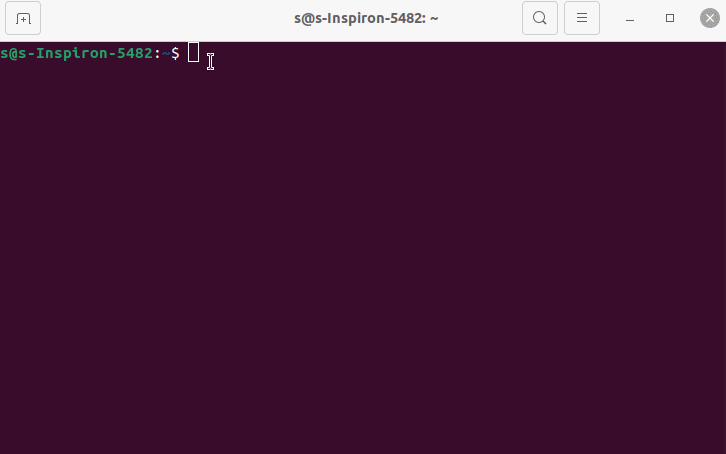
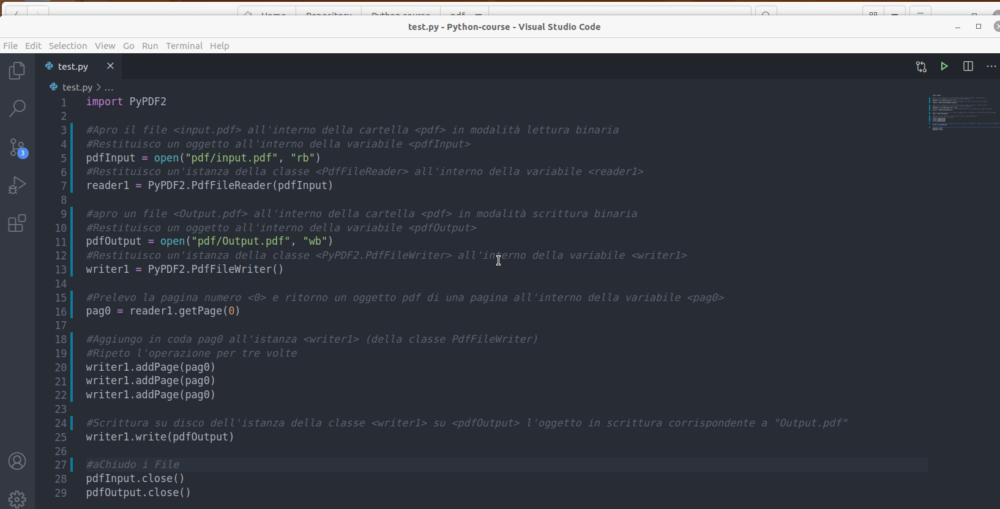

# Python

# Lezione 01

## Prerequisiti 
Conoscenza di un linguaggio qualsiasi OOP come C++ o Javascript

## Corso Python

Python è un linguaggio di programmazione di più "alto livello" rispetto alla maggior parte degli altri linguaggi, orientato a oggetti, adatto, tra gli altri usi, a sviluppare applicazioni distribuite, scripting, computazione numerica e system testing.

Ideato da Guido van Rossum all'inizio degli anni novanta, il nome fu scelto per la passione dello stesso inventore verso i Monty Python e per la loro serie televisiva Monty Python's Flying Circus ed è spesso paragonato a Ruby, Tcl, Perl, JavaScript, Visual Basic o Scheme

[Wikipedia - Python](https://it.wikipedia.org/wiki/Python)

## Installazione e setup

Collegati alla pagina ufficiale di [Python](https://www.python.org/downloads/) e installa la versione per il tuo sistema operativo.

## Installazione e setup - Linux

Per i sistemi su base linux è sufficiente digitare i seguenti comandi:
```bash
sudo apt-get install python3
sudo apt-get install python3-pip
```

**Nota:** Il modulo *pip* di Python permette la gestione e l'installazione di moduli esterni

Per verificare la corretta installazione dell'interprete python digitare da terminale `python3`. In questo modo apriremo inoltre la shell interattiva di python in cui sarà possibile inserire direttamente del codice ed avere una risposta simultanea 



## Configurazione di un IDE

Un ottimo ambiente di sviluppo per Python è [Pycharm](https://www.jetbrains.com/pycharm/download/).<br>
Per questo corso ho preferito non utilizzare un IDE specifico come Pycharm ma uno con un target più ad uso generale come [Visual Studio Code](https://code.visualstudio.com/) con l'ausilio di un'estensione che possa supportare gli emmet (abbreviazioni intelligenti) per il linguaggio python e opzioni per il debug del codice. L'estension che ho installato si chiama *Python* ed è quella che riporto nell'immagine animata qua sotto.


# Lezione 02

## Primo script

Ogni file python ha un'estensione `.py`.

Per l'esecuzione di uno script python è possibile lanciare il file creato con l'estensione `.py` (esempio `test.py`) direttamente dal terminale digitando il comando per l'invocazione dell'interprete python `python3` ad esempio `python3 test.py` all'interno della cartella contenente il file `test.py` oppure attraverso l'estensione appena installata per VS code `Run/Start Debugging`

Ecco l'esecuzione del primo script python
```py
print('ciao mondo')
```


## Aggiunta di moduli

Per l'aggiunta di un modulo che rientra nella libreria standard python basta semplicemente digitare:

```py
import <nomeModulo>
```
A volte tuttavia potremmo aver bisogno di un modulo non standard disponibile sul web. Per installarlo possiamo far ricorso al pacchetto `pip` che permette la gestione e l'installazione dei moduli aggiuntivi python.

Supponiamo di voler scaricare il modulo `PyPDF2` per la gestione dei PDF. Digitare da terminale
```bash
pip install PyPDF2
```

Qualora si avessero dubbi sul nome del modulo o sul comando esatto, niente paura, il browser ci è di supporto

ù

# Lezione 03

## Introduzione a webbrowser

Il seguente script aprirà una località su google.maps digitata come input dall'utente.

Utilizzeremo il comando `input()` che permette l'acquisizione dati da tastiera e la funzione `open` del modulo python `webbrowser`. <br>
La funzione `open` permette di aprire un certo `url` specificato come parametro tra gli apici. Il parametro è quindi passato come una stringa e come tale valgono tutte le operazioni e i metodi applicabili su stringa tra cui l'operatore `+` utilizzato per concatenare due o più stringhe .

- `input()`: consente l'acquisizione dati da tastiera dell'utente.
- `webbrowser.open(myUrl)`: Apre l'indirizzo web specificato dal parametro *myUrl*. Il parametro specificato viene passato come stringa
- `+`: Operatore di concatenazione stringhe

Ecco lo script completo:

```py
import webbrowser
destinazione = input()
webbrowser.open('https://www.google.com/maps' + '/place/' + destinazione)
```


E' possibile ridurre ancora il codice

```py
import webbrowser
webbrowser.open('https://www.google.com/maps' + '/place/' + input())
```

## Come rendo eseguibile un file python?

## Linux

Aggiungere la seguente linea di codice in testa allo script:

```py
#!/usr/bin/env python3
```

Ad esempio:

```py
#!/usr/bin/env python3
import webbrowser
webbrowser.open('https://www.google.com/maps' + '/place/' + input())
```

E' sufficiente rendere il file *eseguibile* (all'interno delle proprietà del file sezione "permessi") e lanciarlo da terminale.


## Commenti 

```py
# questo è un commento e verrà ignorato dall'interprete
print('ciao')
```

# Lezione 04

## Introduzione al modulo PyPDF2

Il seguente script tratterà l'elaborazione di file pdf. Saremo in grado quindi di generare un file pdf con nome predefinito "Output.pdf" che è la copia della prima pagina di un pdf con nome "input.pdf" ricevuto in input

Faremo uso del modulo aggiuntivo [PyPDF2](https://pythonhosted.org/PyPDF2/) da installare da terminale tramite il comando `pip install PyPDF2`

Utilizzeremo le funzioni standard Python di apertuta e chiusura file:
- `open(myFile, mode)`: apre un file e lo restituisce come oggetto.
    - `myfile` indica il nome comprensivo del path del file da aprire
    - `mode` indica la modalità di apertura del file
        - `mode = "r"` modalità lettura
        - `mode = "rb"` modalità lettura binaria
        - `mode = "w"` modalità scrittura
        - `mode = "wb"` modalità scrittura binaria
- `close()`: chiude un file aperto. È necessario chiudere sempre i file aperti poichè in alcuni casi, a causa del buffering, le modifiche apportate a un file potrebbero non essere visualizzate finché non si chiude il file.

[w3schools - Python open() Function](https://www.w3schools.com/python/ref_func_open.asp)<br>
[w3schools - Python close() Function](https://www.w3schools.com/python/ref_file_close.asp)<br>

Del modulo aggiuntivo **PyPDF2** utilizzeremo le classi:
- `PdfFileReader(myPdf)`: Chiama il costruttore della classe *PdfFileReader* che inzializza in lettura il file oggetto pdf *myPdf* ricevuto come parametro e restituisce un'istanza della classe *PdfFileReader*<br>
[The PdfFileReader Class](https://pythonhosted.org/PyPDF2/PdfFileReader.html)<br>
**Metodi**<br>
    - `getPage(pageNumber)`: restituisce una pagina in base al numero *pageNumber* passato come parametro<br>

- `PdfFileWriter()`: Chiama il costruttore della classe *PdfFileWriter()* che inizializza in scrittura un file oggetto pdf e restituisce un'istanza della classe *PdfFileWriter()*<br>
[The PdfFileWriter Class](https://pythonhosted.org/PyPDF2/PdfFileWriter.html)<br>
**Metodi**<br>
    - `addPage(page)`: Aggiunge una pagina PDF,  all'istanza della classe *PdfFileWriter* a cui si applica il metodo. La pagina viene solitamente acquisita da un'istanza di *PdfFileReader*.
    - `write(myPdf)`: Scrive (su disco, da ram a rom) la raccolta di pagine aggiunte a questo oggetto come file PDF, riceve come parametro l'oggetto pdf da scrivere, *myPdf*.

**Nota:** Le "funzioni/classi" di un modulo devono essere invocate sempre specificando il nome del modulo.

Esempio:

```py
import PyPDF2
pdfInput = open("pdf/input.pdf", "rb")
#PyPDF2 è il nome del modulo, PdfFileReader è il nome della classe del modulo PyPDF2
reader1 = PyPDF2.PdfFileReader(pdfInput) 
```

Script completo

```py
import PyPDF2

#Apro il file <input.pdf> all'interno della cartella <pdf> in modalità lettura binaria
#Restituisco un oggetto all'interno della variabile <pdfInput>
pdfInput = open("pdf/input.pdf", "rb")
#Restituisco un'istanza della classe <PdfFileReader> all'interno della variabile <reader1>
reader1 = PyPDF2.PdfFileReader(pdfInput) 

#apro un file <Output.pdf> all'interno della cartella <pdf> in modalità scrittura binaria
#Restituisco un oggetto all'interno della variabile <pdfOutput>
pdfOutput = open("pdf/Output.pdf", "wb")
#Restituisco un'istanza della classe <PyPDF2.PdfFileWriter> all'interno della variabile <writer1>
writer1 = PyPDF2.PdfFileWriter() 

#Prelevo la pagina numero <0> e ritorno un oggetto pdf di una pagina all'interno della variabile <pag0>
pag0 = reader1.getPage(0)

#Aggiungo in coda pag0 all'istanza <writer1> (della classe PdfFileWriter) 
#Ripeto l'operazione per tre volte
writer1.addPage(pag0)
writer1.addPage(pag0)
writer1.addPage(pag0)

#Scrittura su disco dell'istanza della classe <writer1> su <pdfOutput> l'oggetto in scrittura corrispondente a "Output.pdf"
writer1.write(pdfOutput)

#aChiudo i File
pdfInput.close()
pdfOutput.close()
```



# Lezione 05

## Costrutto condizionale `if...else`

Le istruzioni condizionali vengono utilizzate per eseguire un blocco di codice solo nel caso in cui una condizione risulti *true* o *false*

Sintassi costrutto `if` esteso:

```py
if condition1:
    #code 01
    #..
elif condition2:
    #code 02
    #..
else:
    #code 03
    #..
```

Esempio:

```py
print("Inserisci due numeri..)

primoValore = input()
secondoValore = input()

if a > b:
    print("Il primo valore inserito, " + primoValore + " è maggiore del secondo valore inserito, " + secondoValore)
elif b > a:
    print("Il secondo valore inserito, " + secondoValore + " è maggiore del primo valore inserito, " + primoValore)
else:
    print("i due valori inseriti sono uguali")
```

Notare che per il costrutto `if` in python, la `condition` è priva di parentesi tonde `( )` comuni invece a molti altri linguaggi di programmazione; l'operatore `:` è usato come terminatore della `condition` e l'indentazione è necessaria per racchiudere la porzione di codice condizionato da `if`.

# Lezione 06

## Costrutto iterativo `for`

Un ciclo `for` viene utilizzato per iterare su una sequenza (che può essere una lista, una tupla, un dizionario, un insieme o una stringa).

È meno simile alla *keyword* `for` in altri linguaggi di programmazione e funziona più come un metodo iteratore che si trova in altri linguaggi di programmazione orientati agli oggetti.

[w3schools - Python For Loops](https://www.w3schools.com/python/python_for_loops.asp)

Sintassi:

```py
#Sintassi 1:
for target_list in expression_list:
    #code
```

Esempio:

```py
for numero in [1, 2, 3, 4, 5]:
    print(numero*numero)

# 1
# 4
# 9
# 16
# 25

for frutto in ["banana", "mela", "pera"]:
    print(frutto)

# banana
# mela
# pera
```

## Indentazione Python
Il linguaggio python, a differenza di altri linguaggi come C/C++, Javascript .. Non utilizza delimitatori di blocco codice come `{ }` ma si affida alla semplice **indentazione**. Rende quindi indispensabile l'uso di un buon editor di testo per evitare problemi di sintassi o semantica (in alcuni casi nemmeno troppo rari). Non utilizza neanche un terminatore di statement come il classico `;` ma si affida al carattere `a capo`. L'interprete python comunque è in grado di rilevare errori sintattici di indentazione e segnalarlo.

## range() Function

Per iterare un insieme di codice un numero di volte specificato, possiamo usare la funzione `range ()`.
La funzione  `range (number)` restituisce una sequenza di numeri, a partire da 0 per impostazione predefinita, incrementa di 1 (per impostazione predefinita) e termina con un numero specificato tramite il parametro *number*. In realtà termina con il numero `number - 1`.<br>
La funzione `range ()` può accettare 1, 2 o 3 parametri:

- `range(number)`: **un parametro**, genera una lista numerica incrementale nel range `0 - number-1` 
- `range(numberStart, numberEnd)`: **due parametri**, genera una lista numerica incrementale nel range `numberStart - numberEnd-1` 
- `range(numberStart, numberEnd, step)`: **tre parametri**, genera una lista numerica con incremento pari a `step` nel range *massimo* `numberStart - numberEnd-1` 

[w3schools - The range() Function](https://www.w3schools.com/python/python_for_loops.asp)

```py
range(5)       #[0, 1, 2, 3, 4]
range(1, 5)    #[1, 2, 3, 4]
range(1, 5, 2) #[1, 3]
```

```py
for target_list in range(number):
    #code
```

```py
# range(number) costruisce una lista da 0 a number-1
for numero in range(5):
    print(numero*numero)

# 0
# 1
# 4
# 9
# 16

for numero in range(1, 5, 2):
    print(numero)

# 1
# 3
```

Nel seguente esempio specifico alla funzione `print()` di non utilizzare il terminatore di default `a capo` rendendo nullo l'attributo `end` 

```py
print(end="")
```

Esempio:

```py
for numero in range(5):
    print(str(numero) + ":", end="")
    print(numero*numero)

# 0:0
# 1:1
# 2:4
# 3:9
# 4:16
```

# Lezione 07

## PyPDF2 - Copia PDF

Il seguente script prende in input un pdf "input.pdf" e ne produce una copia sul file "Output.pdf" 
Faremo uso della proprietà della classe *PdfFileReader*:
- `numPages`: Restituisce il numero delle pagine del file pdf dell'istanza (della classe *PdfFileReader*) si cui si legge la proprietà

```py
import PyPDF2

pdfInput = open("pdf/input.pdf", "rb")

reader1 = PyPDF2.PdfFileReader(pdfInput) 

pdfOutput = open("pdf/Output.pdf", "wb")

writer1 = PyPDF2.PdfFileWriter() 

#Copia delle pagine dell'oggetto (classe) pdf <reader1> nell'oggetto (classe) pdf <writer1>
for numeroPagina in range(reader1.numPages):
    page = reader1.getPage(numeroPagina)
    writer1.addPage(page)

writer1.write(pdfOutput)

#aChiudo i File
pdfInput.close()
pdfOutput.close()
```


## PyPDF2 - Merge All pdf

Il seguente script unisce tutti i file pdf presenti nella root directory salvandoli con un nome stabilito dall'utente.
Faremo uso di:
- **Modulo os** è un modulo che contiene funzioni per interagire con il sistema operativo per la manipolazione di file e processi, [os — Miscellaneous operating system interfaces](https://docs.python.org/3/library/os.html).<br>
**Nota:**<br>
Per questo esercizio importeremo solo il *metodo* `listdir()` del modulo os: 
```py
from os import listdir
```

- `listdir(path)`: Metodo del modulo **os**. Elenca file e cartelle specificate nella path-directory come parametro. Se non viene specificato nessun parametro restituisce i file della root-directory. Viene restituita una **lista** <br>
[Python3 os.listdir () method](w3big.com)

- **Metodi su stringa**<br>
  - `endswith(myString)`: Restituisce *true* se la stringa a cui applichiamo il metodo termina con la stringa indicata come parametro, *myString*

Altre funzionalità del modulo **PyPDF2**.<br>
- classe `PdfFileMerger`: Inizializza un oggetto **PdfFileMerger**. **PdfFileMerger** unisce più PDF in un unico PDF. 
Restituisce un'istanza della classe **PdfFileMerger**, [PyPDF2 - The PdfFileMerger Class](https://pythonhosted.org/PyPDF2/PdfFileMerger.html).
- metodo `append(myPDF)` della classe `PdfFileMerger`: Concatena tutte le pagine di un oggetto PDF passato come parametro, *myPDF*, alla fine del file PDF a cui si applica il metodo

Riporto lo script completo:

```py
#Merge all pdf files

from os import listdir
import PyPDF2

print("**********************************************")
print("Unisco i file pdf presenti in questa directory")
print("**********************************************")

#Non devo specificare <os.listdir> poichè ho spcificato l'importazione <from os import listdir>
#Se avessi usato <import os> avrei dovuto scrivere <os.listdir>
#listdir restituisce file e cartelle in formato <lista>
listaFiles = listdir()

for nomeFile in listaFiles:
    if nomeFile.endswith('.pdf'):
        print(nomeFile)
print('\n')

#chiedo all'utente come vuole chiamare il file di output
print("Salvo il risultato con il nome:")
nomeFileDestinazione = input()
#Apro il file in scrittura binaria
PDF_Destinazione = open(nomeFileDestinazione, "wb")
print('\n')

merger = PyPDF2.PdfFileMerger()
print("Elaborazione di..")
for nomeFile in listaFiles:
    #Elaboro solo i file con estensione ".pdf"
    if nomeFile.endswith('.pdf'):
        #stampo il nome del file
        print(nomeFile)
        #lo apro in lettura binaria
        pdfFileInput = open(nomeFile, "rb")
        #creo un'istanza della classe <PdfFileReader> sul file appena aperto
        PDF_Reader = PyPDF2.PdfFileReader(pdfFileInput)
        #Appendo il file PDF in coda all'oggetto merger
        merger.append(PDF_Reader)
        #chiudo il file aperto
        pdfFileInput.close()
print('\n')

#Operazione di scrittura
print("Scrittura su: " + nomeFileDestinazione)
merger.write(PDF_Destinazione)
PDF_Destinazione.close()

print("Finito..")
```


# Lezione 08

## Liste

Abbiamo già visto implicitamente un'introduzione al tipo lista e in particolare come creare e iterare sugli elementi di una lista attraverso il ciclo `for` e la funzione `range()`. Il tipo dato lista è molto importante nel linguaggio python.

Le liste sono un tipo di dato utilizzato per memorizzare diversi elementi in una singola variabile.

Le liste sono uno dei 4 tipi di dati incorporati in Python utilizzati per memorizzare raccolte di dati, gli altri 3 sono Tuple, Set e Dictionary, tutti con qualità e utilizzo diversi.

Vediamo le caratteristiche principali delle liste:

- Le liste possono contenere qualsiasi tipo di dato
- Gli elementi della lista sono indicizzati, il primo elemento ha indice [0], il secondo elemento ha indice [1] .. A differenza della maggior parte dei linguaggi si possono usare anche indici negativi, [-1] si riferisce all'ultimo elemento, [-2] si riferisce al penultimo elemento ecc.
- Gli elementi in una lista sono ordinati e l'ordine è stabilito dall'indice. 
- Dopo la creazione, è possibile aggiungere elementi, cambiare il valore degli elementi già esistenti o rimuoverli 
- Dal momento che le liste sono indicizzate è possibile avere elementi duplicati
- La funzione `len()` ritorna il numero degli elementi presenti in una lista
- L'operatore `[::]` permette lo *slicing* di liste ovvero la creazione di porzioni di liste a partire dalla lista a cui si applica l'operatore `[::]`

[w3schools - Python Lists](https://www.w3schools.com/python/python_lists.asp)


## Accesso agli elementi di una lista

L'accesso agli elementi di una lista si effettua tramite l'operatore `[]`
```py
#indici     0         1       2       3            4
#indici    -5        -4      -3      -2           -1
myList = ["banana", "kiwi", "mela", "mandarino", "cachi"]

print(myList[2])  #mela
print(myList[-1]) #cachi

print(len(myList)) #5
```

## Modifica del valore degli elementi in una lista.

Per cambiare il valore degli elementi in una lista si utilizza l'operatore `[]` 

```py
#indici     0         1       2       3            4
#indici    -5        -4      -3      -2           -1
myList = ["banana", "kiwi", "mela", "mandarino", "cachi"]

myList[-1] = "arancia"
myList[2] = "pera"
print(myList)

myList[1:3] = ["mandorla", "nocciola"] 
print(myList)
```

## Aggiunta di elementi in una lista

Sono disponibili i metodi:

- `append(elem)`: Appende *elem* in coda alla lista
- `insert(index, elem)`: Inserisce (senza nessun replace) *elem* alla posizione *index* facendo scalare di una posizione gli elementi dalla posizione *index*
- `extend(otherList)`: Appende in coda gli elementi della lista passata come parametro, *otherList* 

```py
myList = ["banana", "kiwi", "mela", "mandarino", "cachi"]
myList2 = ["mandorla", "nocciola", "noce"]

myList.append("anguria")
print(myList) #['banana', 'kiwi', 'mela', 'mandarino', 'cachi', 'anguria']

myList.insert(2, "melone")
print(myList) #['banana', 'kiwi', 'melone', 'mela', 'mandarino', 'cachi', 'anguria']

myList.extend(myList2)
print(myList) #['banana', 'kiwi', 'melone', 'mela', 'mandarino', 'cachi', 'anguria', 'mandorla', 'nocciola', 'noce']
```

## Rimozione di elementi in una lista

Sono disponibili i metodi:

- `remove(elem)` : Toglie *elem* dalla lista
- `pop(?index)`: Toglie l'elemento corrispondente all'indice *index* passato come parametro opzionale. Se non viene passato nessun parametro toglie l'ultimo elemento. E' possibile ottenere questo risultato anche con il comando `del`, specificando l'elemento, `del myList[index]`
- `clear()`: Svuota la lista. La lista esiste ma è vuota. E' possibile ottenere questo risultato anche con il comando `del` specificando il nome della lista `del myList` ma in questo caso elimina anche l'identificatore

```py
myList = ['banana', 'kiwi', 'melone', 'mela', 'mandarino', 'cachi', 'anguria', 'mandorla', 'nocciola', 'noce']

myList.remove("mandarino")
print(myList) #['banana', 'kiwi', 'melone', 'mela', 'cachi', 'anguria', 'mandorla', 'nocciola', 'noce']

myList.pop(2)
print(myList) #['banana', 'kiwi', 'mela', 'cachi', 'anguria', 'mandorla', 'nocciola', 'noce']
myList.pop()
print(myList) #['banana', 'kiwi', 'mela', 'cachi', 'anguria', 'mandorla', 'nocciola']
del myList[0] 
print(myList) #['kiwi', 'mela', 'cachi', 'anguria', 'mandorla', 'nocciola']

myList.clear() 
print(myList) #[]

myList = ['banana', 'kiwi', 'melone', 'mela', 'mandarino', 'cachi', 'anguria', 'mandorla', 'nocciola', 'noce']
del myList
print(myList) #NameError: name 'myList' is not defined
```

## Creazione di sotto liste, **slicing** <br>

Sintassi:<br>
`mySubList = myList[?startIndex: ?endIndex: ?Step]`: Ritorna una sotto lista a partire dalla lista a cui si applica lo slicing (*myList*). L'operatore `[]` può ricevere tre parametri opzionali separati da `:`. Il primo rappresenta l'indice di partenza (incluso), il secondo l'indice di fine (non incluso) e il terzo il passo. Se il primo parametro non è specificato si assume `0` come valore di partenza. Se il secondo parametro non è specificato si assume `len(myList) - 1` come valore di fine cioè l'ultimo elemento della lista. Se il terzo parametro non è specificato si assume un incremento positivo unitario

```py
#indici     0         1       2       3            4
#indici    -5        -4      -3      -2           -1
myList = ["banana", "kiwi", "mela", "mandarino", "cachi"]

mySubList = myList[1:]
print(mySubList)  #['kiwi', 'mela', 'mandarino', 'cachi']
mySubList = myList[-2:]
print(mySubList) #['mandarino', 'cachi']

mySubList = myList[2:4]
print(mySubList) #['mela', 'mandarino']

mySubList = myList[::2]
print(mySubList) #['banana', 'mela', 'cachi']

#Restituisce una copia <non profonda> di una lista
#Non valido per liste annidate
mySubList = myList[:]
print(mySubList) #["banana", "kiwi", "mela", "mandarino", "cachi"]

#Ordinamento inverso
mySubList = myList[::-1] 
print(mySubList) #['cachi', 'mandarino', 'mela', 'kiwi', 'banana']
```

# Lezione 09

## Copia di Liste

Abbiamo visto nel paragrafo precedente che per la copia di liste è sufficiente utilizzare l'operatore `[:]` ma che non vale per liste annidate. In questa lezione approfondiremo l'operazione di copia di elementi.

Copia semplice, valida per liste non annidate:
```py
myList = ["banana", "kiwi", "mela", "mandarino", "cachi"]
myList2 = myList[:]

print(myList)  #['banana', 'kiwi', 'mela', 'mandarino', 'cachi']
print(myList2) #['banana', 'kiwi', 'mela', 'mandarino', 'cachi']
```

Cosa succede se eseguo la copia tramite il semplice assegnamento?
```py
myList = ["banana", "kiwi", "mela", "mandarino", "cachi"]
myList2 = myList

print(myList)  #['banana', 'kiwi', 'mela', 'mandarino', 'cachi']
print(myList2) #['banana', 'kiwi', 'mela', 'mandarino', 'cachi']
```

Sfruttando quindi l'operatore di assegnamento `=` non ottengo una copia dei valori ma una copia dei riferimenti. In pratica in questo modo *myList* e *myList2* condividono gli stessi dati. Se modifico uno modifico anche l'altro


```py
myList = ["banana", "kiwi", "mela", "mandarino", "cachi"]
myList2 = myList

#Togliendo l'elemento da "myList" lo tolgo anche da "myList2" perchè condividono gli stessi elementi
myList.remove("banana")

print(myList)  #['kiwi', 'mela', 'mandarino', 'cachi']
# !!!
print(myList2) #['kiwi', 'mela', 'mandarino', 'cachi']
```

Ciò non accade con la copia poichè diventano due liste indipendenti:

```py
myList = ["banana", "kiwi", "mela", "mandarino", "cachi"]
myList2 = myList[:]

myList.remove("banana")

print(myList)  #['kiwi', 'mela', 'mandarino', 'cachi']
print(myList2) #['banana', 'kiwi', 'mela', 'mandarino', 'cachi']
```

**Attenzione!** Per liste più complicate come liste annidate l'operatore `[:]` non può essere utilizzato per la copia perchè effettuerebbe una copia per riferimento degli elementi annidati. In generale per effettuare una copia ricorsiva e profonda è necessario utilizzare la funzione `deepcopy()` del modulo `copy`.

Per liste annidate l'operatore `[:]` fallisce:
```py
myList = ["banana", "kiwi", "mela", [1, 2], "cachi"]
myList2 = myList[:]

myList.remove("banana")
myList2[3][0] = 12

# !!! la scrittura su myList2 ha scritto anche myList perchè la lista annidata è stata copiata per riferimento 
print(myList)  #['kiwi', 'mela', [12, 2], 'cachi']
print(myList2) #'banana', 'kiwi', 'mela', [12, 2], 'cachi']
```

## deepcopy()

Per la copia di liste e qualsiasi altro oggetto è possibile ed è consigliabile utilizzare una funzione `deepcopy()` del modulo `copy` che esegue una copia profonda quindi considera anche oggetti e liste annidate

```py
import copy

myList = ["banana", "kiwi", "mela", "mandarino", "cachi"]
myList2 = copy.deepcopy(myList)

myList.remove("banana")

print(myList)  #['kiwi', 'mela', 'mandarino', 'cachi']
print(myList2) #['banana', 'kiwi', 'mela', 'mandarino', 'cachi']
```

La funzione `deepcopy()` è l'unica che eseegue in modo affidabile la copia di elementi considerando eventuali elementi annidati.

```py
import copy
myList = ["banana", "kiwi", "mela", [1, 2], "cachi"]
myList2 = copy.deepcopy(myList)

myList.remove("banana")
myList2[3][0] = 12

print(myList)  #['kiwi', 'mela', [1, 2], 'cachi']
print(myList2) #['banana', 'kiwi', 'mela', [12, 2], 'cachi']
```

# Lezione 10

## Le stringe 

**Le stringhe sono un tipo di dato immutabile in python** <br>

Questo significa che la copia di stringhe può essere fatta attraverso l'assegnamento tra i nomi (contrariamente a quanto accade per altri linguaggi come C++) poichè quando viene creata una copia tramite l'assegnamento non viene copiato il riferimento della stringa ma l'intero oggetto stringa.

```py
s1 = "ciao"
s2 = s1
s2 = "ciaociao"

print(s2) #ciaociao
print(s1) #ciao
```

Ecco una dimostrazione approfondita andando ad scavare tra gli indirizzi in memoria con la funzione `id`

```py
s1 = "ciao"
print(id(s1)) #140440511029104
s2 = s1
print(id(s2)) #140440511029104
s2 = "ciaociao"
print(id(s2)) #140440511029168

print(s2) #ciaociao
print(s1) #ciao
```

**Attenzione** Eseguendo la copia `s2 = s1` ancora non si assegna ad `s2` un nuovo indirizzo in memoria per motivi di efficienza. Lo si assegna quando ad `s2` si assegna un nuovo valore

## Interpolazione di stringhe - Metodo `format()`

Il metodo `format()` applicabile alle stringhe consente di inserire espressioni valutabili all'interno di stringhe
[w3schools - Python String format() Method](https://www.w3schools.com/python/ref_string_format.asp).

Il metodo `format()` formatta i valori specificati e li inserisce all'interno del segnaposto della stringa.
Il segnaposto viene definito utilizzando le parentesi graffe: {}.

Esempio:

```py
#sintassi 1
txt = "1Kg di sale da cucina a solo {price} euro!"
print(txt.format(price = 2)) #1Kg di sale da cucina a solo 2 euro!

#sintassi 2
txt = "1Kg di sale da cucina a solo {0} euro! Rimasti {1} pezzi" 
print(txt.format(2, 500)) #1Kg di sale da cucina a solo 2 euro! Rimasti 500 pezzi
```

Esiste anche una sintassi leggermente diversa:

```py
myList = ["dentista", "17:00"]
print(f"Evento: {myList[0]} - Ora: {myList[1]} ") #Evento: dentista - Ora: 17:00 
```

# Lezione 11

## PyPDF2 - Merge All pdf v2

Questa è una versione migliorata dello script *Merge All pdf*. Aggiunge dei controlli sull'estensione del file e sulla natura del file. Controlla infatti se un file termina con formati "strani" come ".pdF", "PDf" considerandoli comunque validi e controlla eventuali falsi file trappola come cartella che termina con estensione ".pdf". <br>
Faremo uso di:

- `os.path.isfile(path+file)`: Ritorna *true* se il file specificato come parametro (eventualmente con un path relativo o assoluto) è realmente un file.
- Metodo su **stringhe** `.upper()`: Ritorna una **copia** della stringa a cui si applica il metodo in caratteri maiscoli
- **chaining** condition `and`: Permette la concatenazione di condizioni logiche. Ritorna *true* se tutte le condizioni concatenate sono *true*  

Script completo e migliorato

```py
import PyPDF2
import os

print("**********************************************")
print("Unisco i file pdf presenti in questa directory")
print("**********************************************")

listaFiles = os.listdir()

for nomeFile in listaFiles:
    if nomeFile.endswith('.pdf'):
        print(nomeFile)
print('\n')

#chiedo all'utente come vuole chiamare il file di output
print("Salvo il risultato con il nome:")
nomeFileDestinazione = input()
#Apro il file in scrittura binaria
PDF_Destinazione = open(nomeFileDestinazione, "wb")
print('\n')

merger = PyPDF2.PdfFileMerger()
print("Elaborazione di..")
for nomeFile in listaFiles:
    #Elaboro solo i file con estensione ".pdf" o "PDF" o "PdF" ..
    if os.path.isfile(nomeFile) and nomeFile.upper().endswith('.PDF'):
        #stampo il nome del file
        print(nomeFile)
        #lo apro in lettura binaria
        pdfFileInput = open(nomeFile, "rb")
        #creo un'istanza della classe <PdfFileReader> sul file appena aperto
        PDF_Reader = PyPDF2.PdfFileReader(pdfFileInput)
        #Appendo il file PDF in coda all'oggetto merger
        merger.append(PDF_Reader)
        #chiudo il file aperto
        pdfFileInput.close()
print('\n')

#Operazione di scrittura
print("Scrittura su: " + nomeFileDestinazione)
merger.write(PDF_Destinazione)
PDF_Destinazione.close()

print("Finito..")
```

# Lezione 12

## Introduzione alla manipolazione dei docx

Con il seguente script inizieremo a manipolare i docx
Da terminale puoi installare il modulo per la manipolazione dei docx con il comando:

```bash
pip install python-docx
```

Importa il modulo "python-docx" all'interno del tuo script con:
```py
import docx
```

La documentazione ufficiale del modulo "python-docx" la puoi trovare su [docx - documentazione](https://python-docx.readthedocs.io/en/latest/).

Del modulo "python-docx" utilizzeremo:

- `docx.Document(docxFile)`: Chiama il costruttore della classe `Document` passando come parametro di inizializzazione il file "docx" che intendiamo elaborare. Ritorna un'istanza della classe `Document`

- Metodo `sections` della classe `Document`: applicato a un'istanza della classe `Document` restituisce le sezioni del documento "docx"-

- Metodo `paragraphs` della classe `Document`: applicato a un'istanza della classe `Document` restituisce una **lista dell'oggetto** `Paragraph`

- Metodo `text` della classe `Paragraph`: applicato a un'istanza della classe `Paragraph` restituisce il testo di un paragrafo

Utilizzeremo anche l'operatore `*` su **stringa** che permette di generare una ripetizione della stringa a cui si applica l'operatore.

```py
print("ciao "*2 + "!") #ciao ciao !
```

Script completo:

```py
#Manipolazione docx
import docx

divina = docx.Document("divina1.docx")

sezioni = divina.sections

print("il documento contine:")

#Utile quando ci sono diversi valori da valutare
print("- {0} sezioni".format(len(sezioni))) #altrenativa >>> print(str( len(sezioni) ) + " sezioni" ) 


paragrafi = divina.paragraphs
print("- {0} paragrafi".format(len(paragrafi))) #4 sezioni

print("\nStampo i paragrafi..")
print("-"*50)
#Per ogni elemento p estratto dalla lista paragrafi..
for p in paragrafi:
    #p.text restituisce il testo di un paragrafo
    print(p.text)
    #questo metodo su stringa genera una ripetizione 
    print("-"*50)
```

# Lezione 13

## Python `while()`

Con il ciclo while possiamo eseguire un insieme di istruzioni fintanto che una condizione è vera.

[w3schools - Python While Loops](https://www.w3schools.com/python/python_while_loops.asp)

Sintassi:

```py
while condition:
    #code
```

Esempio:

```py
i = 1
while i < 6:    #1 < 6, true   #2 < 6, true   #3 < 6, true   #4 < 6, true    #5 < 6, true    #6 < 6, false -> exit
    print(i)    #1             #2             #3             #4              #5                
    i = i + 1   #i = 2         #i = 3         #i = 4         #i = 5          #i = 6          

# 1
# 2
# 3
# 4
# 5
```

## Comando `break`

Con l'istruzione `break` possiamo interrompere il ciclo anche se la condizione while è vera:

Sintassi:

```py
while condition:
    #code
    #code
    #..
    break #esce
```

Esempio:

```py
i = 1
while i < 6:    #1 < 6, true   #2 < 6, true   
    print(i)    #1             #2                          
    i = i + 1   #i = 2         #i = 3         
    if i == 3:  #i = 2, false  #i = 3, true -> exit
        break
            
# 1
# 2
```

Con i cicli c'è sempre da tenere in considerazione **quando** viene effettuato il controllo delle condizioni di uscita ed entrata del ciclo e la sequenza con cui vengono eseguite le istruzioni all'interno del ciclo. Leggendo l'esempio di sopra non è chiaro se il programmatore con la condizione `i == 3` vuole che venga stampato il numero `3` oppure no. Un'ottima strategia è quella di inserire tutte le condizioni di uscita del ciclo all'inizio ed eventuali istruzioni di controllo ciclo alla fine. Al centro del ciclo andranno tutte le istruzioni che verranno eseguite nel caso *standard*

```py
i = 1
while i < 6:    #1 < 6, true   #2 < 6, true   #3 < 6
    #Condizione di uscita ciclo
    if i == 3:  #i = 1, false  #i = 2, false  #i = 3, true -> exit
        break  
    print(i)    #1             #2     
    #Condizione di controllo ciclo                     
    i = i + 1   #i = 2         #i = 3         
            
# 1
# 2
```

## Comando `continue`

Con l'istruzione `continue` possiamo interrompere l'iterazione corrente e continuare con la successiva

Sintassi:

```py
while condition:
    #code
    #code
    #..
    continue #esce
```

Esempio

```py
i = 1
while i < 6:                 #1 < 6, true   #2 < 6, true   #3 < 6, true   #4 < 6, true   #5 < 6, true   #6 < 6, false -> exit
    if i == 3:               #i = 1, false  #i = 2, false  #i = 3, true   #i = 4, false  #i = 5, false 
        print("Numero " + i)                               #Numero 3
        i = i + 1                                          #i = 4
        continue                                           #execute
    print(i)                 #1             #2                            #4             #5                   
    i = i + 1                #i = 2         #i = 3                        #i = 4         #i = 5         #i = 6         
            
# 1
# 2
# Numero 3
# 4
# 5
```

## Alcune considerazioni finali

Python ha due comandi di loop primitivi:

- `while` loop
- `for` loop

E' normale chiedersi quando usare uno e quando usare l'altro.. Riporto quindi una serie di caratteristiche dei due cicli iterativi in Python

- `for` loop è un ciclo enumerativo. Andrebbe utilizzato quando è noto a priori il numero di iterazioni totali
- `while` loop è un ciclo indefinito. Andrebbe utilizzato quando non è noto a priori il numero di iterazioni totali
- I comandi `break` e `continue` possono essere utilizzati indistintamente sia sul ciclo `for` che sul ciclo `while`

# Lezione 14

## Esercizio Asta online v1

Il seguente script vuole simulare l'andamento di un'asta online con la seguente regola:
- L'asta verrà aggiudicata da chi avrà fatto un'offerta la più vicina alla media delle offerte degli altri

L'utente dovrà inserire un'offerta in *bit coin* e una *email* che rappresenterà l'identificativo. E' consentita un'unica offerta per utente! In questa prima parte ci occuperemo dell'acquisizione dati da tastiera e della generazione di una struttura dati adeguata.


```py
offerte = []

#dato booleano di controllo ciclo
altre_offerte = True

while altre_offerte:
    #offerta contiene l'offerte in bitcoin
    offerta = input("Inserisci l`offerta pervenuta (0 per terminare): ")

    #Converto il dato ricevuto da tastiera in intero
    offerta = int(offerta)

    #Il valore "0" è il terminatore
    if offerta == 0:
        altre_offerte = False
        continue

    
    if offerta < 0:
        print("Non possono essere fatte offerte negative!")
        continue

    #Se l'offerta supera i controlli chiedo l'email
    email = input("Inserire l`email dell`offerente: ")

    #Inserisco la coppia email-offerta nella lista delle offerte
    offerte.append([email, offerta])

print("Le offerte valide sono:")
print(offerte)
```


Che cosa succede se l'utente inserisce dei valori di input non atesi? Ad esempio, invece che inserire un numero inserisce una stringa o qualche carattere non previsto?


Vedremo nel capito successivo come trattare questi errori tramite il costrutto `try Except`

# Lezione 15

## Costrutto `try Except`

Quando si verifica un errore (o un'eccezione),  Python normalmente si ferma e genera un messaggio di errore.

[w3schools - Python Try Except](https://www.w3schools.com/python/python_try_except.asp)

Nell'esempio chiedo all'utente l'inserimento di un numero intero.. Fintanto che l'utente inserisce numeri interi tutto funziona correttamente ma quando per sbaglio l'utente inserisce un carattere non valido, un numero decimale o altro, che succede?

```py
while 1:
    print("inserisci un numero intero..")
    x = int(input())
    if x == 0
        break
    print(x)

#input() = 1
#1
#input() = 2
#2
#input() = dd
#
#Traceback (most recent call last):
#  File "test.py", line 3, in <module>
#   x = int(input())
#ValueError: invalid literal for int() with base 10: 'dd'
```


Inserendo la stringa `"dd"` la conversione esplicita `int()` fallisce e restituisce un errore:

```py
#Traceback (most recent call last):
#  File "test.py", line 3, in <module>
#   x = int(input())
#ValueError: invalid literal for int() with base 10: 'dd'
```

L'errore è di tipo `ValueError` e la descrizione è: `invalid literal for int() with base 10: 'dd'` che significa che la costante letterale `dd` inserita non è un tipo di dato valido per la conversione in base 10, cioè in un numero decimale.

**Come gestisco queste situazioni di errore?**
Il costrutto `try Except` permette la gestione di queste situazioni.

Sintassi:

```py
try:
    #code1
except #typeError:
    #code2
```

Significa: *prova* (try) ad eseguire `code1`, se rilevi un'eccezione di tipo `typeError` esegui `code2` ed "ignora" `code1` ovvero fai finta che `code1` non sia mai stato eseguito. Se non rilevi nessun errore nella fase di `try` allora esegui `code1`

Esempio:

```py
while 1:
    print("Inserisci un numero intero..")        
    try:
        x = int(input())
    except ValueError:
        print("\nNon è un numero intero, riprova..")
        continue
    if x == 0:
        break
    print("\nIl numero inserito è: " + str(x) + "\n")
```


# Lezione 16

## Introduzione alle espressioni regolari con Python

Una RegEx, o espressione regolare, è una sequenza di caratteri che forma un modello di ricerca.
Le RegEx possono essere utilizzate per verificare se una stringa contiene il modello di ricerca specificato.
Python ha un modulo integrato chiamato `re`, che può essere utilizzato per lavorare con le espressioni regolari.


[w3schools - Python RegEx](https://www.w3schools.com/python/python_regex.asp)

# Lezione 17

## Esercizio Asta online v2

Il seguente script vuole simulare l'andamento di un'asta online con la seguente regola:
- L'asta verrà aggiudicata da chi avrà fatto un'offerta la più vicina alla media delle offerte degli altri

L'utente dovrà inserire un'offerta in *bit coin* e una *email* che rappresenterà l'identificativo. E' consentita un'unica offerta per utente! In questa seconda parte ci occuperemo di inserire dei controlli aggiuntivi dei dati acquisiti.

- Aggiungeremo la possibilità di inserire numeri decimali "floating point". Per far ciò utilizzeremo la funzione di conversione esplicita da stringa (l'input da tastiera) a numero decimale, `float()`

- Rileveremo tutti gli errori legati ad un'inserimento di un dato `float` non valido come una stringa o qualche altro carattere (come ad esempio **Invio**) non interpretabile come numero decimale. Alla rivelazione dell'errore stamperemo il messaggio d'errore `"Formato non valido, riprova .."`. Utilizzeremo il costrutto `try-except`

- Aggiungeremo un'espressione regolare abbastanza semplice per il controllo del formato dell'email. Per far ciò utilizzeremo la funzione `re.match(regExp, myVar)` del modulo `re`. L'espressione regolare controlla se la stringa (nel nostro caso l'email) inizia `^` con la sequenza di caratteri minuscoli `"a-z"`, maiuscoli `"A-Z"` o numerici `"0-9"` ripetuti. E' seguita dal carattere `@`, continua con la sequenza di caratteri minuscoli, maiuscoli o numerici, prosegue con il carattere `.` ed p seguita dal dominio che per noi sarà nuovamente una sequenza di caratteri minuscoli, maiuscoli o numerici.

```py
import re
offerte = []
altre_offerte = True

while altre_offerte:
    offerta = input("Inserisci l`offerta pervenuta (0 per terminare): ")

    try:
        offerta = float(offerta)
    except ValueError:
        print("Formato non valido, riprova ...")
        continue

    if offerta == 0:
        altre_offerte = False
        continue

    if offerta < 0:
        print("Non possono essere fatte offerte negative!")
        continue

    email = input("Inserire l`email dell`offerente: ")

    if not re.match("^[a-zA-Z0-9_.+-]+@[a-zA-Z0-9-]+\.[a-zA-Z0-9-.]+$", email):
        print("Email non valida, riprova ...")
        continue

    nuova_offerta = [offerta, email]


print(offerte)
```


# Lezione 18

## Costrutto `if ... in`

Analogamente al costrutto `for ... in` il costrutto `if ... in` si applica a collezioni di elementi in cui si richiede la ricerca di un particolare elemento in una lista

```py
if item in list:
    #code
else:
    #code
```

Esempio:

```py
myFruitsList = ["banana", "mela", "kiwi", "mandarino", "mela"]

print("Inserisci il nome di un frutto")
itemToSearch = input()

if itemToSearch in myFruitsList:
    print("C'è almeno un/una: " + itemToSearch + " nella lista")
else:
    print("Non è presente nessuno/a " + itemToSearch + " nella lista")
```


# Lezione 19

## Esercizio Asta online v3

Il seguente script vuole simulare l'andamento di un'asta online con la seguente regola:
- L'asta verrà aggiudicata da chi avrà fatto un'offerta la più vicina alla media delle offerte degli altri

L'utente dovrà inserire un'offerta in *bit coin* e una *email* che rappresenterà l'identificativo. E' consentita un'unica offerta per utente! In questa terza parte contrellero che la coppia utente/offerta sia unica utilizzando il costrutto `if ... in`

```py
import re
offerte = []
altre_offerte = True

while altre_offerte:
    offerta = input("Inserisci l`offerta pervenuta (0 per terminare): ")

    try:
        offerta = float(offerta)
    except ValueError:
        print("Formato non valido, riprova ...")
        continue

    if offerta == 0:
        altre_offerte = False
        continue

    if offerta < 0:
        print("Non possono essere fatte offerte negative!")
        continue

    email = input("Inserire l`email dell`offerente: ")

    if not re.match("^[a-zA-Z0-9_.+-]+@[a-zA-Z0-9-]+\.[a-zA-Z0-9-.]+$", email):
        print("Email non valida, riprova ...")
        continue

    nuova_offerta = [email, offerta]

    # controllo valido solo se viene fatta la stessa offerta con la stessa mail ... limitato!
    if nuova_offerta in offerte:
        print("Questo utente ha già fatto la sua unica offerta ... respinto!")
        continue
    else:
        offerte.append(nuova_offerta)

print("Le offerte valide sono:")
print(offerte)
```


Come si vede una coppia identica *utente/bit coin* viene catturata e rifiutata ma è ancora permesso che un utente possa fare più offerte

# Lezione 20

## Introduzione alle Funzioni
Le funzioni vanno definite prima di utilizzarle

Una funzione è un blocco di codice che viene eseguito solo quando viene chiamata.
È possibile passare dei valori, chiamati **parametri**, in una funzione.

Una funzione può restituire dei valori come risultato.

In Python una funzione viene definita utilizzando la parola chiave `def`.

[w3schools - Python Functions](https://www.w3schools.com/python/python_functions.asp)

```py
#definizione di una funzione
def myFunc(param)
    #code

#chiamata di una funzione
myFunc(value1)
```

Esempio:

```py
def saluta(nome):
  print("ciao: " + nome +"!")

saluta("Emil")
saluta("Tobias")
saluta("Linus")

# ciao: Emil!
# ciao: Tobias!
# ciao: Linus!
```

# Lezione 21

## Esercizio Asta online v4

Il seguente script vuole simulare l'andamento di un'asta online con la seguente regola:
- L'asta verrà aggiudicata da chi avrà fatto un'offerta la più vicina alla media delle offerte degli altri

L'utente dovrà inserire un'offerta in *bit coin* e una *email* che rappresenterà l'identificativo. In questa quarte parte introdurremo la funzione `stampa_lista(lista_offerte)` che riceve in ingresso la lista delle offerte e stampa il risultato secondo un formato specifico e la funzione `inserisci_offerte()` che rappresenta l'acquisizione dati da tastiera da parte dell'utente e il controllo sull'integrità dei dati ricevuti. Di fatto la complessità dello script si riduce alla chiamta di due funzioni: `inserisci_offerte()` e `stampa_lista`

```py
import re

def stampa_lista(lista_offerte):
    for offerta in lista_offerte:
        print(f"Email Offerente: {offerta[0]} - Offerta: {offerta[1]} ")


def inserisci_offerte():
    lista = []
    altre_offerte = True

    while altre_offerte:
        offerta = input("Inserisci l`offerta pervenuta (0 per terminare): ")

        try:
            offerta = float(offerta)
        except ValueError:
            print("Formato non valido, riprova ...")
            continue

        if offerta == 0:
            altre_offerte = False  # USCITA DAL CICLO
            continue

        if offerta < 0:
            print("Non possono essere fatte offerte negative!")
            continue

        email = input("Inserire l`email dell`offerente: ")

        if not re.match("^[a-zA-Z0-9_.+-]+@[a-zA-Z0-9-]+\.[a-zA-Z0-9-.]+$", email):
            print("Email non valida, riprova ...")
            continue

        nuova_offerta = [email, offerta]

        # controllo valido solo se viene fatta la stessa offerta con la stessa mail ... limitato!
        if nuova_offerta in lista:
            print("Questo utente ha già fatto la sua unica offerta ... respinto!")
            continue
        else:
            lista.append(nuova_offerta)

    return lista


# grazie all`uso di funzioni la complessità del programma principale
# è drasticamente ridotta
offerte = inserisci_offerte()
stampa_lista(offerte)
```

# Lezione 22

## Esercizio Asta online v5

Il seguente script vuole simulare l'andamento di un'asta online con la seguente regola:
- L'asta verrà aggiudicata da chi avrà fatto un'offerta la più vicina alla media delle offerte degli altri

L'utente dovrà inserire un'offerta in *bit coin* e una *email* che rappresenterà l'identificativo. In questa quinta parte introdurremo le funzioni:

- `trova_email(email, lista_offerte)`: Riceve come parametro una stringa digitata in input dall'utente che rappresenta l'identificativo utente, *email* e la lista di tutte le offerte, *lista_offerte*. Ritorna un **boolean** *True* se trova l'identificativo *email* ricevuto come parametro come identificativo nella *lista_offerte*. Questa funzione controlla quindi se un utente ha già fatto un'offerta.

- `media_offerte(lista_offerte)`: Riceve come parametro la lista di tutte le offert *lista_offerte*, calcola la media dei valori delle offerte che rappresentano i *bit coin* e ne ritorna il valore. Ritorna quindi un valore **float**

- `minimo(lista_offerte)`: Riceve come parametro la lista di tutte le offert *lista_offerte*, calcola il minimo dei valori delle offerte che rappresentano i *bit coin* e ne ritorna il valore. Ritorna quindi un valore **float**

- `massimo(lista_offerte)`: Riceve come parametro la lista di tutte le offert *lista_offerte*, calcola il massimo dei valori delle offerte che rappresentano i *bit coin* e ne ritorna il valore. Ritorna quindi un valore **float**

```py
import re

def trova_email(email, lista_offerte):
    trovato = False

    for offerta in lista_offerte:
        if offerta[0] == email:
            trovato = True
            break

    return trovato


def media_offerte(lista_offerte):
    somma = 0.0
    for offerta in lista_offerte:
        somma += offerta[1]

    return somma / len(lista_offerte)


# si assume che la lista non sia vuota
def minimo(lista_offerte):
    #non si parte mai da un valore assoluto
    #prelevo solo il valore numerico dell'offerta
    #min è un numero float
    min = lista_offerte[0][1]

    #lista_offerte[1:] ritorna una lista dal primo elemento fino all'ultimo
    #Itero ogni elemento della lista lista_offerte a partire dal primo
    for offerta in lista_offerte[1:]:
        #se trovo un elemento più piccolo dell'attuale <min>, aggiorno min
        if offerta[1] < min:
            min = offerta[1]

    return min


# si assume che la lista non sia vuota
def massimo(lista_offerte):
    max = lista_offerte[0][1]
    for offerta in lista_offerte[1:]:
        if offerta[1] > max:
            max = offerta[1]

    return max


def stampa_lista(lista_offerte):
    for offerta in lista_offerte:
        print(f"Email Offerente: {offerta[0]} - Offerta: {offerta[1]} ")


def inserisci_offerte():
    lista = []
    altre_offerte = True

    while altre_offerte:
        offerta = input("Inserisci l`offerta pervenuta (0 per terminare): ")

        try:
            offerta = float(offerta)
        except ValueError:
            print("Formato non valido, riprova ...")
            continue

        if offerta == 0:
            altre_offerte = False  # USCITA DAL CICLO
            continue

        if offerta < 0:
            print("Non possono essere fatte offerte negative!")
            continue

        email = input("Inserire l`email dell`offerente: ")

        if not re.match("^[a-zA-Z0-9_.+-]+@[a-zA-Z0-9-]+\.[a-zA-Z0-9-.]+$", email):
            print("Email non valida, riprova ...")
            continue

        nuova_offerta = [email, offerta]

        # controllo valido solo se viene fatta la stessa offerta con la stessa mail ... limitato!
        # if nuova_offerta in offerte:
        #     print("Questo utente ha già fatto la sua unica offerta ... respinto!")
        #     continue
        # else:
        #     offerte.append(nuova_offerta)

        if trova_email(email, lista):
            print("Questo utente ha già fatto la sua unica offerta ... respinto!")
            continue
        else:
            lista.append(nuova_offerta)

    return lista

# grazie all`uso di funzioni la complessità del programma principale
# è drasticamente ridotta
offerte = inserisci_offerte()
stampa_lista(offerte)
print(f"Offerta Media: {media_offerte(offerte)}")
print(f"Offerta minima: {minimo(offerte)}")
```


# Lezione 23

## Python - List Comprehension

*List Comprehension* offre una sintassi più breve quando si desidera creare un nuovo elenco basato sui valori di un elenco esistente.

[w3schools - Python - List Comprehension](https://www.w3schools.com/python/python_lists_comprehension.asp)

E' una sorta di **RegEx** utilizzata per il tipo **List**.
Sintassi.

```py
newlist = [expression for item in iterable if condition == True]
```

Nell'esempio che segue costruisco una lista non utilizzando *List Comprehension*:

```py
fruits = ["apple", "banana", "cherry", "kiwi", "mango"]
newlist = []

#La nuova lista conterrà soltanto elementi che contengono il carattere "a"
for x in fruits:
  if "a" in x:
    newlist.append(x)

print(newlist) #["apple", "banana", "mango"]
```

Il solito esempio utilizzando *List Comprehension*:

```py
fruits = ["apple", "banana", "cherry", "kiwi", "mango"]

#List Comprehension
newlist = [x for x in fruits if "a" in x]

print(newlist)
```

E' una sintassi molto vicina alla sintassi del linguaggio matematico.. Può essere infatti tradotto nel seguente modo: << Cerca le "x" all'interno della lista "fruits" tali che il carattere "a" è contenuto in "x">>

Nel seguente esempio elenco i numeri dispari da 0 a 100 con una sola espressione *List Comprehension*:

```py
#Cerca le x da 0 a 100 tali che il risultato della divisione intera tra x e 2 moltiplicato successivamente per 2 sia diverso da x
#es: 3/2 = 1 >> 1*2 = 2 >> 3!=2 >> print
#es: 4/2 = 2 >> 2*2 = 4 >> 4=4 
print([x for x in range(0, 100) if x // 2 * 2 != x])
```

# Lezione 24

## Esercizio Asta online v6

Il seguente script vuole simulare l'andamento di un'asta online con la seguente regola:
- L'asta verrà aggiudicata da chi avrà fatto un'offerta la più vicina alla media delle offerte degli altri

L'utente dovrà inserire un'offerta in *bit coin* e una *email* che rappresenterà l'identificativo. In questa sesta e ultima parte introdurremo le funzioni:

- `offerta_minima(lista_offerte)`: riceve la *lista_offerte* come parametro e ne identifica la lista con l'offerta minima. E' simile alla funzione `minimo(lista_offerte)` solo che invece di ritornare il valore decimale dell'offerta minima ritorna una lista comprendente la coppia *email/offerta* con *offerta* minima.

- `offerta_massima(lista_offerte)`: riceve la *lista_offerte* come parametro e ne identifica la lista con l'offerta massima. E' simile alla funzione `massimo(lista_offerte)` solo che invece di ritornare il valore decimale dell'offerta massima ritorna una lista comprendente la coppia *email/offerta* con *offerta* massima.

Lo script filtrerà inoltre le offerte che hanno una tolleranza del 10% calcolata sul valore medio.
Infine, è stata definita una funzione `SIMULA_inserisci_offerte()` per evitare di inserire i dati da tastiera e testare lo script

```py
import re

def SIMULA_inserisci_offerte():
    return [
        ['a@a.com', 1], ['b@b.com', 3.3], ['c@c.com', 4.1], ['d@d.com', 3.8], ['e@e.com', 12]
    ]

def trova_email(email, lista_offerte):
    trovato = False

    for offerta in lista_offerte:
        if offerta[0] == email:
            trovato = True
            break

    return trovato

def media_offerte(lista_offerte):
    somma = 0.0
    for offerta in lista_offerte:
        somma += offerta[1]

    return somma / len(lista_offerte)

# si assume che la lista non sia vuota
def minimo(lista_offerte):
    min = lista_offerte[0][1]

    for offerta in lista_offerte[1:]:
        if offerta[1] < min:
            min = offerta[1]

    return min

# invece del solo valore minimo restituisce
# l`intera offerta [email, valore_offerta]
def offerta_minima(lista_offerte):
    min = lista_offerte[0]

    for offerta in lista_offerte[1:]:
        if offerta[1] < min[1]:
            min = offerta
    #ritorna la coppia <email, valore_offerta> corrispondente al minimo di "valore_offerta"
    return min


# si assume che la lista non sia vuota
def massimo(lista_offerte):
    max = lista_offerte[0][1]
    for offerta in lista_offerte[1:]:
        if offerta[1] > max:
            max = offerta[1]

    return max


# invece del solo valore massimo restituisce
# l`intera offerta [email, valore_offerta]
def offerta_massima(lista_offerte):
    max = lista_offerte[0]

    for offerta in lista_offerte[1:]:
        if offerta[1] > max[1]:
            max = offerta

    return max


def stampa_lista(lista_offerte):
    for offerta in lista_offerte:
        print(f"Email Offerente: {offerta[0]} - Offerta: {offerta[1]} ")


def inserisci_offerte():
    lista = []
    altre_offerte = True

    while altre_offerte:
        offerta = input("Inserisci l`offerta pervenuta (0 per terminare): ")

        try:
            offerta = float(offerta)
        except ValueError:
            print("Formato non valido, riprova ...")
            continue

        if offerta == 0:
            altre_offerte = False  # USCITA DAL CICLO
            continue

        if offerta < 0:
            print("Non possono essere fatte offerte negative!")
            continue

        email = input("Inserire l`email dell`offerente: ")

        if not re.match("^[a-zA-Z0-9_.+-]+@[a-zA-Z0-9-]+\.[a-zA-Z0-9-.]+$", email):
            print("Email non valida, riprova ...")
            continue

        nuova_offerta = [email, offerta]

        if trova_email(email, lista):
            print("Questo utente ha già fatto la sua unica offerta ... respinto!")
            continue
        else:
            lista.append(nuova_offerta)

    return lista

print ("""
Il seguente script vuole simulare l\'andamento di un\'asta online con la seguente regola:
<< L\'asta verrà aggiudicata da chi avrà fatto un'offerta la più vicina alla media delle offerte degli altri.>>
L'utente dovrà inserire un'offerta in bit coin e una email che rappresenterà l'identificativo""")

print("-"*40)

# grazie all`uso di funzioni la complessità del programma principale
# è drasticamente ridotta
print("\nStampo una lista di offerte predefinite, evito l'input da tastiera")
offerte = SIMULA_inserisci_offerte()
stampa_lista(offerte)

print("-"*40)

# eliminiamo l`offerta minima e massima
print("\nElimino l'offerta più alta e l'offerta più bassa")
offerte.remove(offerta_minima(offerte))
offerte.remove(offerta_massima(offerte))
stampa_lista(offerte)

print("-"*40)

# costruiamo una nuova lista con gli elementi rimasti
# che non si discostano più del 10% dalla media dei rimasti
offerta_media = media_offerte(offerte)
print(f"Media: {offerta_media}")

tolleranza = offerta_media/100*10
print(f"Tolleranza 10%: {tolleranza}")

print("-"*40)


offerte_filtrate = [x for x in offerte if abs(x[1]-offerta_media) < tolleranza]
print("\nOfferte filtrate in base alla tolleranza..")
stampa_lista(offerte_filtrate)

#Il seguente script vuole simulare l'andamento di un'asta online con la seguente regola:
#<< L'asta verrà aggiudicata da chi avrà fatto un'offerta la più vicina alla media delle offerte degli altri.>>
#L'utente dovrà inserire un'offerta in bit coin e una email che rappresenterà l'identificativo
#----------------------------------------
#
#Stampo una lista di offerte predefinite, evito l'input da tastiera
#Email Offerente: a@a.com - Offerta: 1 
#Email Offerente: b@b.com - Offerta: 3.3 
#Email Offerente: c@c.com - Offerta: 4.1 
#Email Offerente: d@d.com - Offerta: 3.8 
#Email Offerente: e@e.com - Offerta: 12 
#----------------------------------------
#
#Elimino l'offerta più alta e l'offerta più bassa
#Email Offerente: b@b.com - Offerta: 3.3 
#Email Offerente: c@c.com - Offerta: 4.1 
#Email Offerente: d@d.com - Offerta: 3.8 
#----------------------------------------
#Media: 3.733333333333333
#Tolleranza 10%: 0.3733333333333333
#----------------------------------------
#
#Offerte filtrate in base alla tolleranza..
#Email Offerente: c@c.com - Offerta: 4.1 
#Email Offerente: d@d.com - Offerta: 3.8 
```
