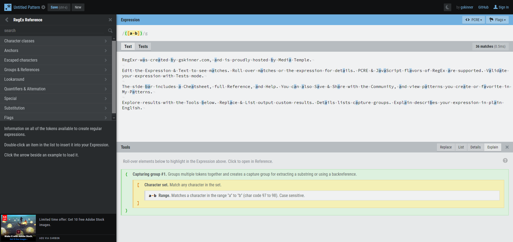

# Regular Expression

Un' espressione regolare è una stringa di caratteri opportunamente codificata che filtra un'insieme di stringhe. E' possibile, con un'espressione regolare creare dei filtri per le ricerche di testo all'interno di un file o un determinato modello.

## Strumenti necessari

Puoi imparare la sintassi delle espressioni regolari su un motore online come [RegExpr](https://regexr.com/).

E' un ottimo strumento poichè oltre ad evidenziare nel testo l'insieme di caratteri filtrati dall'espressione regolare fornisce anche una spiegazione per ogni costrutto utilizzato nell'espressione regolare.

## Qualche esempio

### Selezione 1

Vediamo subito un esempio. La seguente è un'espressione regolare che seleziona tutte le lettere maiuscole e minuscole

|RegExpr| `/[a-zA-Z]/g`|
|---|---|
|Input|Ciao a tutti!! 12 volte grazie..|
|Output|C,i,a,o,a,t,u,t,t,i,v,o,l,t,e,g,r,a,z,i,e|

**Nota:** Ho utato la `,` per separare la selezione.  Con questo si vuol evidenziare che gli spazi vengono ignorati

### Selezione 2

La seguente espressione regolare invece selezionerà soltanto i caratteri numerici

|RegExpr| `/[0-9]/g`|
|---|---|
|Input|Ciao a tutti!! 12 volte grazie..|
|Output|1,2|

## Partiamo dall'inizio

## I metacaratteri

||Descrizione|
|---|---|
| `.` |indica qualsiasi carattere (escluso un accapo)|
| `^` |	indica l’inizio della stringa (o, se all’interno di una classe di caratteri, la negazione della stessa)|
| `$` |indica la fine della stringa|
| ` \| ` |indica l’operatore OR|
| `\` |il carattere di escape dei caratteri speciali|
| `()` |Contengono una sottostringa. Utili per il raggruppamento|
| `[]` | Contengono una ‘classe’ di caratteri|

## I quantificatori

||Descrizione|
|---|---|
| `*` |indica zero o più occorrenze (di un carattere o di un gruppo di caratteri)|
| `+` |indica una o più occorrenze (di un carattere o di un gruppo di caratteri)|
| `?` |indica zero o una occorrenza (di un carattere o di un gruppo di caratteri)|
| `{}` |le parentesi graffe, che indicano il numero esatto, o minimo, o massimo, o l’intervallo di occorrenze (di un carattere o di un gruppo di caratteri)|

### Qualche esempio

|RegExpr| `/./g`|
|---|---|
|Input|Ciao a tutti!! 12 volte grazie..|
|Output|Ciao a tutti!! 12 volte grazie..|

|RegExpr| `/[^0-9]/g`|
|---|---|
|Input|Ciao a tutti!! 12 volte grazie..|
|Output|C,i,a,o, ,a, ,t,u,t,t,i,!,!, , ,v,o,l,t,e, ,g,r,a,z,i,e,.,.,|

|RegExpr| `/t*/g`|
|---|---|
|Input|Ciao a tutti!! 12 volte grazie..|
|Output|t,tt,t|

|RegExpr| `/t?/g`|
|---|---|
|Input|Ciao a tutti!! 12 volte grazie..|
|Output|t,t,t,t|

|RegExpr| `/[0-9]{1}/g`|
|---|---|
|Input|Ciao a tutti!! 12 volte grazie..|
|Output|1,2|

|RegExpr| `/[0-9]{2}/g`|
|---|---|
|Input|Ciao a tutti!! 12 volte grazie..|
|Output|12|

|RegExpr| `/[a-z]{5,6}/g`|
|---|---|
|Input|Ciao a tutti!! 12 volte grazie..|
|Output|tutti,volte,grazie|

|RegExpr| `/[a-z]+/g`|
|---|---|
|Input|Ciao a tutti!! 12 volte grazie..|
|Output|iao,a,tutti,volte,grazie|

|RegExpr| `/[0-9]+/g`|
|---|---|
|Input|Ciao a tutti!! 12 volte grazie..|
|Output|12|

|RegExpr| `/volte\|grazie/g` |
|---|---|
|Input|Ciao a tutti!! 12 volte grazie..|
|Output|volte,grazie|

## Le classi di caratteri e i POSIX

Le classi di caratteri e i POSIX servono per specificare una serie di caratteri allo stesso tempo, senza dover scomodare i gruppi.

|Classe|Equivalente|Descrizione|
|---|---|---|
| `\w`   `[[:word:]]` | `[a-zA-Z0-9_]` |ricerca un carattere “parola” (w sta per word), cioè lettere, numeri e “_”|
| `\d`   `[[:digit:]]` | `[0-9]` |ricerca un numero (d sta per digit)|
| `\s`   `[[:space:]]` | `[ \t\r\n\v\f]` |ricerca uno spazio, comprese tabulazioni e caratteri di fine riga|
|---|---|---|
| `\W` | `[^a-zA-Z0-9_]` |ricerca un carattere che non sia `\w`, cioè tutto quello che non è lettere, numeri o “_””|
| `\D` | `[^0-9]` |l’opposto di `\d`, ricerca qualsiasi cosa che non sia un numero|
| `\S` | `[^ \t\r\n\v\f]` |l’inverso di `\s`, ricerca qualsiasi cosa che non sia uno spazio, una tabulazione o dei caratteri di fine riga|
|---|---|---|
| `[[:alnum:]]` | `[a-zA-Z0-9]` |Ricerca caratteri alfanumerici, senza “_”|
| `[[:alpha:]]` | `[a-zA-Z]` |Ricerca caratteri alfabetici|
| `[[:blank:]]` | `[ \t]` |ricerca solo spazi e tabulazioni|
| `[[:lower:]]` | `[a-z]` |ricerca lettere minuscole|
| `[[:upper:]]` | `[A-Z]` |ricerca lettere maiuscole|
| `[[:graph:]]` | `[\x21-x7E]` |ricerca tutti i caratteri visibili a video della tabella ascii non estesa, dal numero 33 (!) al 126 (~).|
| `[[:print:]]` | `[\x20-x7E]` |ricerca tutti i caratteri visibili a video della tabella ascii non estesa, dal numero 32 (spazio) al 126 (~).|
| `[[:punct:]]` | |ricerca tutti i caratteri di punteggiatura come -!”#$%&'()*+,.\/:;<=>?@[]^_`{|}~|
| `[[:cntrl:]]` | [\x00-x1F\x7F] |ricerca solo i caratteri di controllo|

## Esercizio - ricerca di una email semplice 1

|RegExpr| `/[\w]+@[\w]+\.[\w]+/g`|
|---|---|
|Input|Ciao, ricordati di scrivermi alla mia email personale per l'acconto articolo DKR#123, qt.2, ID@12901, email: prova@gmail.com|
|Output|prova@gmail.com|

Nell'espressione regolare sto cercando uno o più caratteri seguiti dal simbolo `@` seguiti da uno o più caratteri, seguiti da `.` seguito da uno o più caratteri. Ricordo che `\w` ricerca tutte le lettere maiuscole/minuscole compreso il carattere `_` e le cifre.

**Nota:** Per quanto possa sembrare semplice e completo, questo esempio non include le email del tipo `prova.prova@gmail.com`

## Esercizio - ricerca di una email semplice 2

L'esempio precedente non raccoglie email del tipo `prova.prova@gmail.com`, infatti:

|RegExpr| `/[\w]+@[\w]+\.[\w]+/g`|
|---|---|
|Input|Ciao, ricordati di scrivermi alla mia email personale per l'acconto articolo DKR#123, qt.2, ID@12901, email1: mario.rossi78@gmail.com|
|Output|rossi78@gmail.com|

Ecco allora una piccola modifica per aggiungere nella prima parte una selezione opzionale del carattere `.`

|RegExpr| `/([\w]\.?)+@[\w]+\.[\w]+/g`|
|---|---|
|Input|Ciao, ricordati di scrivermi alla mia email personale per l'acconto articolo DKR#123, qt.2, ID@12901, email1: mario.rossi78@gmail.com|
|Output|mario.rossi78@gmail.com|

## Esercizio - ricerca di una url

Questo esercizio ricerca una url semplice ma non completa

|RegExpr| `/(https?)\:\/{2}([\w\.]+\/?)+([\w\#\-\.]+\/?)+/g`|
|---|---|
|Input|Ciao, ricordati di visualizzare i seguenti link, link: https://regexr.com, link: http://regexr.com/5mpk9, link: https://it.wikipedia.org/wiki/Posta_elettronica, link: https://github.com/CodeCoagious19, link: https://webmail.intecs.it/mail#1, link: https://github.com/CodeCoagious19/corsi-programmazione/blob/master/README.md#programmazione-desktop|
|Output|https://regexr.com,http://regexr.com/5mpk9,https://it.wikipedia.org/wiki/Posta_elettronica,https://github.com/CodeCoagious19,https://webmail.intecs.it/mail#1,https://github.com/CodeCoagious19/corsi-programmazione/blob/master/README.md#programmazione-desktop|

L'espressione regolare parte con il cercare `https` o `http`, prosegue alla ricerca di `//`. Nel primo gruppo ricerca testo che sia composto da una o più lettere comprensive del carattere `.` ed eventualmente il carattere `/`. Nel secondo gruppo invece, opzionale e più complesso ricerca del testo che contenga uno o più lettere compresensive eventualmente del carattere `-`, `.` o `#`, anche questo gruppo ha opzionale il caratere `/`. Ripeto inoltre la ricerca di questo gruppo.

