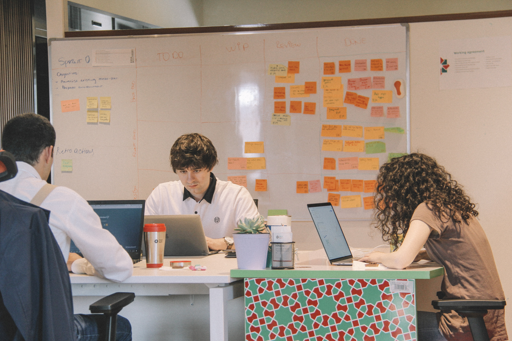

# Metodologie di sviluppo software

# Essere Agili… 

Si ritiene che la metodologia  [#Agile]() (si pronuncia *agiail*, ma anche *egil*) sia forse la innovazione più rilevante a partire da inizio anni 2000  per quanto riguarda lo sviluppo del software. Innovazione  con un  carattere “rivoluzionario”.  Si contesta infatti  l’approccio  tradizionale di sviluppo del software per “fasi successive” (es.  scrittura dei requisiti, architettura, codifica, test, etc.) a vantaggio di uno sviluppo per “funzionalità  *successive*”  ovvero il software viene sviluppato implementando progressivamente nuove funzionalità. Nel mondo Agile le funzionalità sono espresse come “*user stories*” ovvero  requisiti scritti con l’ottica utente per descrivere come si interagisce con il sistema per fare qualcosa.L’approccio Agile stava già lentamente maturando da decenni.  Il modello a cascata tradizionale (*waterfall model*) , manifestava i propri limiti: difficile procedere per fasi, quando i  requisiti cambiano spesso forzando a ritornare sulle fasi già fatte.  Sono nati allora gli approcci incrementali, evolutivi, a spirale,  iterativi, etc. tanti modi diversi che esprimono però  il concetto di  sviluppare versioni successive del software (*release*) via via inserendo funzionalità aggiuntive. La metodologia Agile ha  portato all’estremo tale approccio forzando release successive in tempi **rapidi**  e **fissi** (es. ogni 2 settimane),  chiamati “**sprint**”. Dopo 2 settimane devi consegnare una nuova release: non ti è concesso un ritardo, devi  consegnare comunque con le sole funzionalità implementate fino a quel  momento.  Il “ritardo” sarà cosi sempre palese e quantificabile in  termini di funzionalità attese ma non ancora presenti.Procedere per sprint si è rivelato un potente acceleratore degli sviluppi e  consente un monitoraggio stretto del progetto. L’approccio Agile più  affermato è [#SCRUM]().La INTECS da tempo utilizza approcci Agile in alcuni progetti. Abbiamo  anche scritto articoli su Agile per conferenze internazionali sia nel  settore Automotive che nel settore Railway ( [**Giancarlo Gennaro**](). Inoltre abbiamo attivamente partecipato [**Silvia Mazzini**]() a definire l'approccio Agile pubblicato dalla *European Space Agency*. Abbiamo tenuto corsi e conferenze sui metodi Agili. Il collega John  Favaro ha pure scritto un libro sul tema. Altri hanno preso la  certificazione  di SCRUM "Master" (es. [**Diodato Mauri**]().  Chi vi scrive ha tenuto una consulenza Agile alla BBC Inglese.Qui abbiamo solo citati gli elementi fondanti  ma L’approccio Agile ha numerosi altri aspetti che potete trovare elencati in [Wikipedia](https://l.workplace.com/l.php?u=https%3A%2F%2Fit.wikipedia.org%2Fwiki%2FMetodologia_agile&h=AT1OUp6SQ2drCdz6ZDacjldqLwwlkukQwpjkrRTppV25ld1YSN8TlABWI5xOVRwTPBvcId3ToJLCY2YCsIPqyiwp8WDwTiL1imxeoAl4F5yskYTUUlAEjMpthqItkWJfjkFVlLmFsLoWcCWw&__tn__=-UK-R&c[0]=AT1MaaA4quj2XeX8TBDBjAFwwkCAbF_ErjyhVqccUJiGpxS4UDB1_E5WJv8RyZelhH4WIw3tO6tgIh4fh4ERDwfo_sCk5TfZtVFN7SHUj8ScMJHLY9oGwT3K8TdnfI4rKBr0nlpzSIWIW6nJX_qmZY5SHlnlMRnIL5oL5LzTaAUKpCKg5ULKLtGK6gI6sci2HpVFTGwdbA).Per un affondo su SCRUM si suggerisce  il testo "[Una guida snella alla teoria e alla pratica di Scrum](https://scrumprimer.org/primers/it_scrumprimer20.pdf)

# Configuration Management… ovvero come tenere in ordine il progetto

Quando si lavora ad un progetto il risultato finale **product** è un software da consegnare al cliente, ma durante il processo vengono preparati anche molti risultati intermedi **work products** che consistono in requisiti, architettura, file sorgente, piani di  test, piani di progetto, verbali di riunioni, rapporti di test, etc.Questi "work-products" li possiamo chiamare **configuration item**, **item**.  Ogni configuration item deve essere univocamente identificabile con un nome od un codice ed una versione. Importante è anche registrare   l'autore, il revisore, la data di creazione, etc. Chiamiamo queste  informazioni  "attributi" del configuration item.I configuration item rappresentano i risultati delle attività di progetto e devono essere custoditi gelosamente in una area di progetto **Repository** ad accesso controllato e sottoposto a regolare back up. Il repository è un po' come una *teca* dove inseriamo e conserviamo i *gioielli* via via prodotti ed eventualmente poi modificati dal progetto.  Normalmente la teca è accessibile a tutti i partecipanti del progetto ma in sola lettura mentre l'accesso in scrittura è concesso a poche  persone e magari solo su certi scaffali della teca.Normalmente si nomina un Configuration Manager che svolge il ruolo di "custode  della teca" oppure lo fa direttamente il capo progetto.Una volta inserito un item nella teca se procediamo ad una sua revisione,  inseriremo nella teca l'item aggiornato con un nuovo numero di versione, mantenendo comunque sempre anche la versione precedente  (storicizzazione). Sarà così sempre possibile sapere cosa è cambiato,  quando, da chi, etc.Quando il progetto raggiunge una milestone o un attimo prima di una consegna,  allora si fa una fotografia ("snapshot") dell'intero progetto in quel  momento, per cristallizzare la situazione. Questo concetto è noto come [**baseline**]() di progetto. Le bassline saranno sempre accessibili in futuro.Se due o più persone accedono alla teca contemporaneamente rischiamo di  "sovrapporci" ed ostacolarci a vicenda. Normalmente si prelevano dalla  teca gli item che dobbiamo modificare (**check out**), si lavora su tali item e poi con un **check-in**  si reinseriscono nella teca modificati. Nel frattempo altre persone  non possono modificare tali item, evitando così di sovrapporsi. In altri casi addirittura si crea una copia della intera  teca "provvisoria"  (detta un [**branch**]() dell'intero progetto in quel  momento, per cristallizzare la situazione. Questo concetto è noto come [**baseline**]() di progetto. Le bassline saranno sempre accessibili in futuro. Se due o più persone accedono alla teca contemporaneamente rischiamo di  "sovrapporci" ed ostacolarci a vicenda. Normalmente si prelevano dalla  teca gli item che dobbiamo modificare (**check out**), si lavora su tali item e poi con un **check-in**  si reinseriscono nella teca modificati. Nel frattempo altre persone  non possono modificare tali item, evitando così di sovrapporsi. In altri casi addirittura si crea una copia della intera  teca "provvisoria"  (detta un [**branch**]() tutta per noi sulla quale lavoriamo senza interferenze. Alla fine il branch viene ricongiunto [**merge**]() con il repository principale. In altri casi il branch continua a vivere di vita propria, ad esempio per una [**variante**]()del prodotto.Questi sono i concetti generali e chiedo a [**Patrizia Nencioni**]() ed a [**Roberto Fiorentino**]() se vogliono aggiungere qualcosa di specifico ad un certo settore/mercato/cliente.Gli strumenti più affermati per la gestione della configurazione sono entrambi open source  [**GIT**]() ed [**SVN**](https://subversion.apache.org/) (subversion). Spesso  in combinazione con [**Tortoise**](), una elegante applicazione client che ne semplifica l’accesso.*Per approfondimenti vedi anche [IEEE 828:2012 Standard for Configuration Management in systems and software engineering](https://standards.ieee.org/standard/828-2012.html#Standard)*