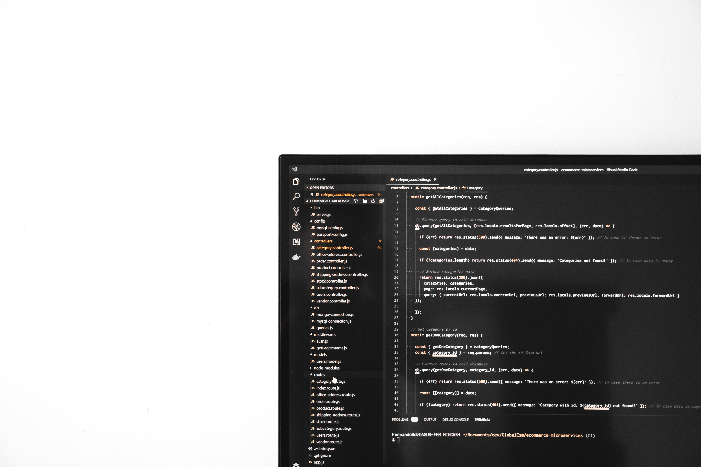

# Quale editor di testo?

Prima o poi ogni programmatore si troverà ad affrontare il dilemma dell'editor di testo. Meglio Visual Studio Code o Atom? Perchè non optare per un editor di testo online? Di quali estensioni ho bisogno?
In questo articolo vedremo di rispondere ad ognuna di queste domande.

## Editor di testo online

Non scartare a priori la possibilità di usare un editor online. Certo, avere un editor installato e piazzato sul PC da più sicurezza e la possibilità di lavorare con o senza la connessione ma è bene comunque conoscere le potenzialità di un editor online.

Un editor online è comodo in generale perchè:

- Non devi usare una Workspace(file e cartelle) sul tuo PC.
- Normalmente ti offre già una scaffolding (impalcatura) del tuo progetto a seconda del linguaggio di programmazione. 
- Basta connettersi con un account per accedere ai progetti.
- Normalmente puoi connetterti con il tuo account GitHub e importare/esportare progetti
- Normalmente ti permette di condividere il codice ad un amico o un collega condividendo direttamente l'url.

- [atom]()
- [vs code]()

# Atom

## Estensioni utili

- [atom-ide](https://ide.atom.io/)
- [ide-typescript](https://github.com/atom/ide-typescript/)
- [platformio-ide-terminal](https://atom.io/packages/platformio-ide-terminal)
- [minimap](https://atom.io/packages/minimap)
- [file-icons](https://atom.io/packages/file-icons)
- [Emmet](https://emmet.io/)
