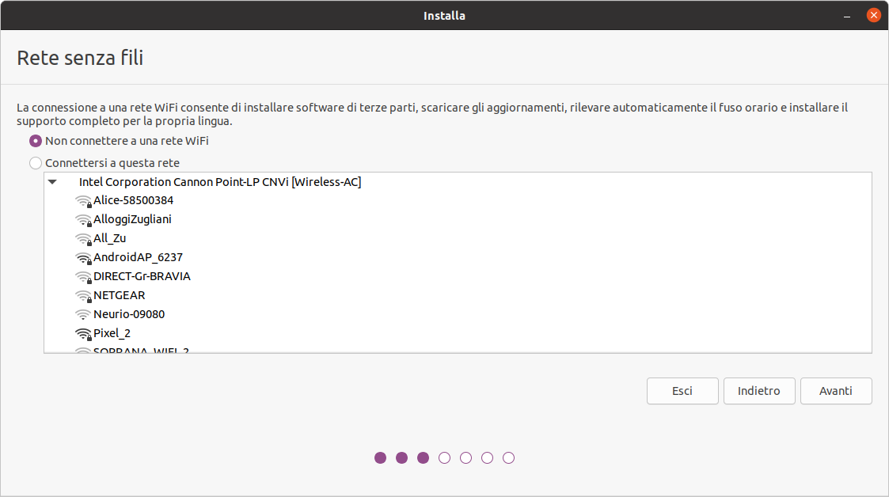
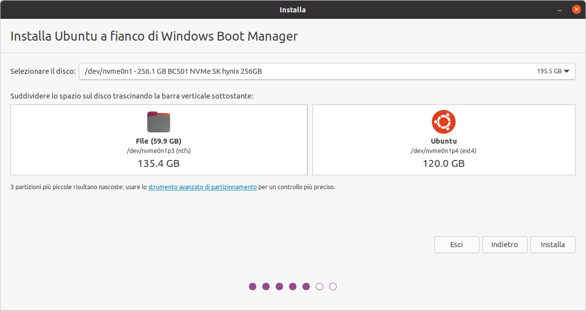
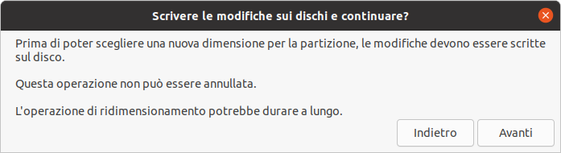
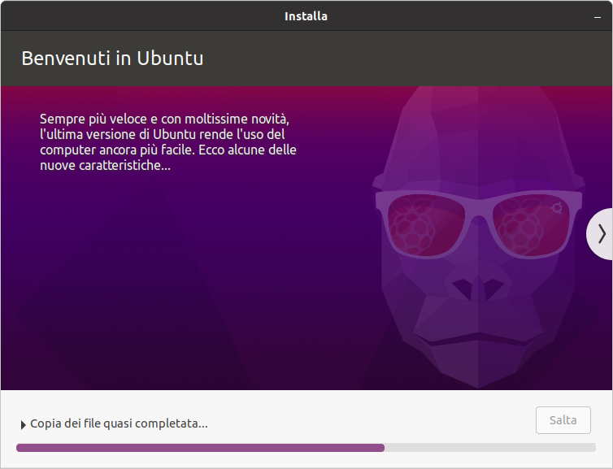
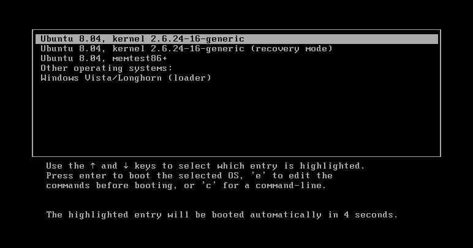
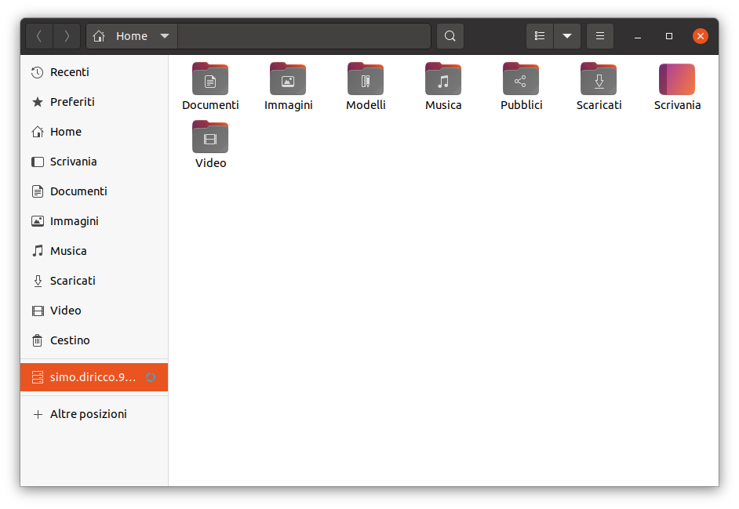
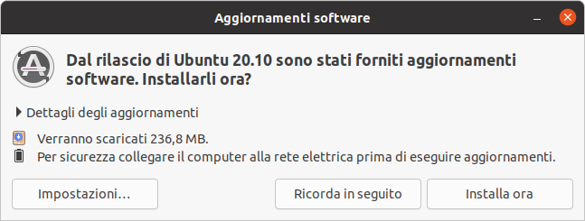
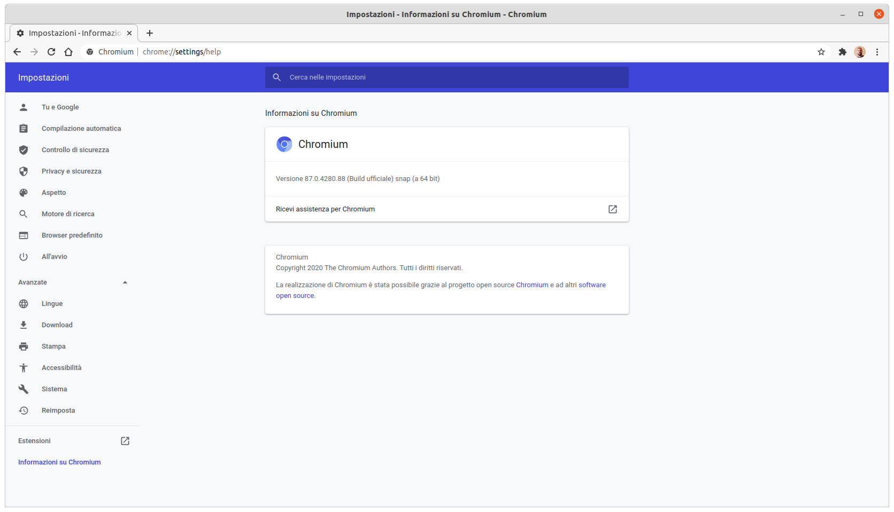

# Installazione e setup di Ubuntu in dual boot con Windows

Se stai leggendo questa guida avrai sentito parlare di Ubuntu e sarai quindi curioso di provarlo sul tuo PC tuttavia probabilmente sei un po' titubante perchè non sai se riuscirai ad installarlo e soprattutto, qualora qualcosa andasse storto, a tornare indietro. Imbattendoti in altre guide ti sei trovato davanti in procedure mai viste e hai paura di scassare il tuo PC o peggio ancora a ricorrere all'assistenza per una stupida infatuazione del sistema operativo Ubuntu.
In questa guida ti guiderò passo passo nell'installazione di Ubuntu 20.10 (ma va bene anche per la 20.04 LTS) e soprattutto ti darò la possibilità di "tornare indietro" alla tua attuale configurazione con Windows come se non fosse successo niente.

- [Installazione e setup di Ubuntu in dual boot con Windows](#installazione-e-setup-di-ubuntu-in-dual-boot-con-windows)
  - [E' facile o difficile installare Ubuntu?](#e-facile-o-difficile-installare-ubuntu)
  - [1. Collegati alla pagina ufficiale](#1-collegati-alla-pagina-ufficiale)
  - [2. Crea un disco di avvio tramite penna USB](#2-crea-un-disco-di-avvio-tramite-penna-usb)
    - [Creazione di un disco di avvio tramite penna USB su Windows](#creazione-di-un-disco-di-avvio-tramite-penna-usb-su-windows)
    - [Creazione di un disco di avvio tramite penna USB su Ubuntu](#creazione-di-un-disco-di-avvio-tramite-penna-usb-su-ubuntu)
  - [3. Riavvia il PC nel bios/uefi menu](#3-riavvia-il-pc-nel-biosuefi-menu)
  - [4. Avvia ubuntu tramite penna USB](#4-avvia-ubuntu-tramite-penna-usb)
  - [5. Prova o installa ubuntu](#5-prova-o-installa-ubuntu)
  - [6. Installa Ubuntu](#6-installa-ubuntu)
    - [Selziona una lingua](#selziona-una-lingua)
    - [Selziona il tipo di tastiera](#selziona-il-tipo-di-tastiera)
    - [Seleziona una rete wifi](#seleziona-una-rete-wifi)
    - [Scegli il tipo di installazione](#scegli-il-tipo-di-installazione)
    - [Dual boot?](#dual-boot)
    - [Scegli la dimensione della partizione Ubuntu](#scegli-la-dimensione-della-partizione-ubuntu)
    - [Imposta la località](#imposta-la-località)
    - [Imposta lu tue informazioni personali](#imposta-lu-tue-informazioni-personali)
    - [Attendi la fine della procedura di installazione](#attendi-la-fine-della-procedura-di-installazione)
    - [Riavvia il pc](#riavvia-il-pc)
    - [Togli la penna USB](#togli-la-penna-usb)
  - [7. GRUB Manager](#7-grub-manager)
  - [Primo avvio](#primo-avvio)
- [Post-Installazione](#post-installazione)
  - [Aggiornamento manuale di sistema](#aggiornamento-manuale-di-sistema)
  - [Applicazioni utili per tutti](#applicazioni-utili-per-tutti)
  - [VLC media player](#vlc-media-player)
  - [Chromium web browser](#chromium-web-browser)
  - [Telegram](#telegram)
  - [Gimp](#gimp)
  - [GNOME tweaks](#gnome-tweaks)
  - [Applicazioni utili per programmatori](#applicazioni-utili-per-programmatori)
  - [git](#git)
  - [Visual studio code](#visual-studio-code)
  - [peek - gif video recorder](#peek---gif-video-recorder)
  - [Qualche configurazione](#qualche-configurazione)
  - [Installazione/rimozione pacchetti e applicazioni.](#installazionerimozione-pacchetti-e-applicazioni)
  - [File manager Nautilus](#file-manager-nautilus)
- [Rimozione di Ubuntu da dual-boot tramite Windows](#rimozione-di-ubuntu-da-dual-boot-tramite-windows)

## E' facile o difficile installare Ubuntu?
Se non hai mai installato o ripristinato un sistema operativo sul tuo PC come Windows potresti non essere a conoscenza di certe procedure che potrebbero spaventarti, mi riferisco al punto [3. Riavvia il PC nel bios/uefi menu](#3-riavvia-il-pc-nel-biosuefi-menu). Prima di iniziare questo tutorial dovresti dare un'occhiata a [questa sezione](#3-riavvia-il-pc-nel-biosuefi-menu) e vedere se riesci a muoverti con il tuo PC come descritto. Se trovi difficoltà o trovi un'interfaccia diversa da quella mostrata in figura capisco che tu possa spaventarti, purtroppo ogni computer ha il suo software di gestione del BIOS. In questo caso è richiesta la massima attenzione e per questo ti consiglio di leggere più e più volte [questa sezione](#3-riavvia-il-pc-nel-biosuefi-menu) finchè non sarà tutto chiaro prima di procedere con l'installazione di Ubunutu. Questa è l'unica potenziale difficoltà che troverai.

## 1. Collegati alla pagina ufficiale
[ubuntu.com](https://ubuntu.com/download/desktop/thank-you?version=20.04.1&architecture=amd64#download) e scarica la versione di Ubuntu che preferisci. Consiglio sempre di installare le versioni `LTS` (come la 20.04 LTS) poichè sono quelle più supportate e stabili. In questa guida installerò la versione 20.10 ma la procedura è la stessa anche per la 20.04 LTS


A fine download verrà scaricato un file con estensione `.iso`, ad esempio nel caso della versione 20.10 sarà `ubuntu-20.10-desktop-amd64.iso`. Il file appena scaricato è detto *file immagine* e deve essere trasferito e scompattato su CD o su penna USB [creando un disco di avvio](#2-crea-un-disco-di-avvio-tramite-penna-usb). Ti consiglio di procurarti una penna USB da almeno 8Gb vuota o con dei file che non ritieni importanti. L'intero contenuto della penna USB verrà sovra-iscritto con il contenuto del file immagine di Ubuntu

## 2. Crea un disco di avvio tramite penna USB
Procurati una penna USB da almeno 8Gb e inseriscila nel PC. Se sei su Windows segui la procedura *Creazione di un disco di avvio tramite penna USB su Windows*, se sei su ubuntu segui invece *Creazione di un disco di avvio tramite penna USB su Ubuntu*

### Creazione di un disco di avvio tramite penna USB su Windows
Scarica ed esegui il software [Rufus](https://rufus.ie/). 
Dovrai selezionare nella scheda `Dispositivo/unità` la penna USB appena inserita, dopodichè tramite il pulsante `SELEZIONA` dovrai scegliere il file immagine di ubuntu `ubuntu-20.10-desktop-amd64.iso`. Delle impostazioni successive ti consiglio di impostare:
- Schema partizione: MBR
- Sistema destinazione: UEFI (non CSM)


Premi su `AVVIA` e attendi che abbia finito

**Nota:** Potrebbe comparire un messaggio chiedendo la connessione ad internet per scaricare dalla rete alcuni file importanti per il boot di Ubunut, acconsenti e procedi

### Creazione di un disco di avvio tramite penna USB su Ubuntu
Apri il software "Creatore dischi di avvio" e seleziona, nella scheda superiore, la sorgente che nel nostro caso sarà `ubuntu-20.10-desktop-amd64.iso` e, nella scheda inferiore, il disco da usare ovvero la penna USB appena inserita. Dopodichè clicca su `Crea disco di avvio`. Una volta terminata la procedura sarai pronto per lanciare ubuntu e installarlo


## 3. Riavvia il PC nel bios/uefi menu
Una volta che hai caricato il sistema operativo Ubuntu sulla penna USB dovrai istruire il tuo PC ad accendersi e leggere il contenuto della penna USB anzichè il sistema operativo Windows installato sul tuo hard disk interno. Per far ciò dovrai ravviare il computer in un menù speciale detto `BIOS` e cambiare il cosìdetto `boot order`. Devi sapere infatti che all'accensione del PC, questo software fa una semplice scansione tra tutti i dischi rigidi alla ricerca di un sistema avviabile, nel nostro caso un sistema operativo. Poichè in prima posizione c'è di default la voce `Internal hard drive` o qualcosa del genere significa che all'accensione verrà sempre controllato se c'è un sistema operativo sull'hard disk interno, troverà Windows installato e lo caricherà. Se per qualche assurdo motivo (l'hard disk viene danneggiato o formattato) il BIOS non troverà un sistema avviabile nell'hard disk, passerà alla seconda voce che probabilmente sarà `CD-ROM drive` e quindi cercherà un sistema avviabile all'interno del CD inserito nel lettore CD e così via. Tra queste voci c'è anche la voce `Removable devices` o `USB` o `USB Hard Disk` o `USB HDD` o voci simili che rappresenta proprio la penna USB. Quello che dobbiamo riuscire a fare sarà semplicemente spostare questa voce in prima posizione in modo da poter finalmente istruire il PC a partire tramite il sistema avviabile che sta sulla penna USB, Ubuntu.

Per accedere al BIOS menu' dovrai riavviare il PC e probabilmente dovrai premere ripetutamente il tasto `F2` o `F12` oppure `ESC` o `F10`. Se fai attenzione, appena si avvia il PC in basso compare per un istante una scritta con le indicazioni del tasto da premere per entrare nel BIOS menu. Ecco un esempio in cui per accedere al menu' è necessario premere il tasto `DEL`


[Lifewire - Change the Boot Order in BIOS](https://www.lifewire.com/change-the-boot-order-in-bios-2624528)

Se siete riusciti ad entrare nel BIOS menu probabilmente vi apparirà a schermo un'interfaccia del genere:


[Lifewire - Change the Boot Order in BIOS](https://www.lifewire.com/change-the-boot-order-in-bios-2624528)

Il BIOS è un software essenziale ben lontano dalle attuali app Android. Per muoversi all'interno del menu' è possibile consultare le indicazioni riportate in fondo allo schermo. In genere ci si muove con i tasti freccia, si esce con il tasto `ESC` e si esce salvando le impostazioni con `F10`. Devi raggiungere la scheda `Boot`. A questo punto appariranno le opzioni di boot elencate in ordine di priorità.


[Lifewire - Change the Boot Order in BIOS](https://www.lifewire.com/change-the-boot-order-in-bios-2624528)

Devi riuscire a spostare l'opzione relativa al disco USB, `Removable devices` o `USB` o `USB Hard Disk` o `USB HDD` o voci simili alla prima posizione. In molti casi per spostare le voci su utilizzano i tasti `F5/F6` oppure i tasti `+/-`. Quando sarai riuscito a spostarla in prima posizione premi `F10`, salverai le modifiche e al prossimo avvio il PC scansionerà i dischi a partire dalla penna USB che hai inserito con Ubuntu pronto a partire. E' tutto!

## 4. Avvia ubuntu tramite penna USB
Una volta settato l'avvio tramite penna USB, mantieni collegata la penna USB e riavvia il PC. Apparirà una schermata simile alla seguente


[linux.org](https://www.linux.org/threads/multi-boot-full-install-to-a-usb.23563/#lg=attachment4039&slide=0)

Scegli la prima opzione `Ubuntu` e attendi che la procedura abbia finito.

## 5. Prova o installa ubuntu

Appena avviato, si aprirà la procedura di installazione. Vi chiederà se vorrete provare Ubuntu (Try Ubuntu) o se vorrete installarlo (Install Ubunutu) 


Se per voi è la prima volta vi consiglio l'opzione `Try Ubuntu`. Potrete navigare tra le applicazioni, nel file manager o nelle impostazioni per prendere familiarità con i settaggi principali. Non abbiate paura di fare pasticci. Ubuntu "vive" nella vostra penna USB. Troverete comunque il link di accesso rapido al setup di installazione sul desktop


## 6. Installa Ubuntu

Riporto passo passo la procedura wizard per l'installazione di ubuntu. Se avete scelto `Install Ubuntu` o avete aperto il link rapido alla wizard sul desktop seguite i seguenti passaggi.

### Selziona una lingua


### Selziona il tipo di tastiera


### Seleziona una rete wifi



### Scegli il tipo di installazione

Se è la prima volta che installate Ubuntu, ti consiglio `Installazione normale`. Con questo tipo di installazione verranno aggiunti software e altri pacchetti utili e ti aiuta in fase di post-installazione. Spunta anche le altre opzioni come in figura


### Dual boot?

Se è la prima volta che installate Ubuntu, ti consiglio di installare ubuntu a fianco di windows, nella cosìdetta modalità *dual-boot*. Ciò ti consentirà di avere sia Windows che Ubuntu sul tuo PC e di poter scegliere quale dei due sistemi operativi lanciare all'accensione del PC. E' fortemente consigliata questa modalità per chi è alle prime armi con Ubuntu perchè per qualsiasi pasticcio tu possa combinare con Ubuntu potrai sempre riavviare il PC e lanciare windows per ripristinare il sistema. Personalmente uso questa modalità.


### Scegli la dimensione della partizione Ubuntu

E' possibile scegliere quanta dimensione di spazio fisso allocare a Ubuntu e quanta lasciare per Windows. Se sei alla prima installazione di Ubuntu ti consiglio di allocare circa `100Gb` in base anche ai programmi che hai intenzione di installare



Clicca su `Installa` e accetta i messaggi successivi.




### Imposta la località


### Imposta lu tue informazioni personali

Scegli un nome per l'account e una password di accesso.


### Attendi la fine della procedura di installazione



### Riavvia il pc


### Togli la penna USB

Quando compare la seguente schermata (o simile), togli la penna USB e premi `Invio`


[SHAILESHJHA.com](https://www.shaileshjha.com/wp-content/uploads/2019/10/virtualbox_ubuntu_desktop_remove_installation_media_1.jpg)

## 7. GRUB Manager
Al riavvio, se hai scelto la modalità dual boot dovrebbe apparire la schermata del software di gestione del dual boot, `GRUB`. Una cosa del genere..



Nel tuo caso apparirà la voce `Ubuntu` e `Windows boot manager`. Ogni volta che accenderai il PC avrai la possibilità di scegliere il sistema operativo da lanciare.

**Nota:** normalmente il software ha un timeout di circa 10 secondi. Se non si sceglie nessuna opzione sceglierà la prima che in questo caso è `Ubuntu`

## Primo avvio

Una volta avviato Ubuntu da `grub` ti chiederà di effettuare l'accesso ad un account. 


Se effettuerai l'accesso tramite google, troverai tra i documenti il link rapido a `google drive`, indicato tramite l'email 



Contemporaneamente si attiverà l'applicazione "Aggiornamenti software" che verificherà la presenza di aggiornamenti



Attendi che il processo finisca e riavvia il PC.


# Post-Installazione

In questa seconda parte imparerai a muovere i primi passi con Ubunutu, scaricare e rimuovere software, configurare l'interfaccia grafica GNOME e utilizzare il terminale per semplici operazioni.

- [Post-Installazione](#post-installazione)
  - [Aggiornamento manuale di sistema](#aggiornamento-manuale-di-sistema)
  - [Applicazioni utili per tutti](#applicazioni-utili-per-tutti)
  - [VLC media player](#vlc-media-player)
  - [Chromium web browser](#chromium-web-browser)
  - [Telegram](#telegram)
  - [Gimp](#gimp)
  - [GNOME tweaks](#gnome-tweaks)
  - [Applicazioni utili per programmatori](#applicazioni-utili-per-programmatori)
  - [git](#git)
  - [Visual studio code](#visual-studio-code)
  - [peek - gif video recorder](#peek---gif-video-recorder)
  - [Qualche configurazione](#qualche-configurazione)
  - [Installazione/rimozione pacchetti e applicazioni.](#installazionerimozione-pacchetti-e-applicazioni)
  - [File manager Nautilus](#file-manager-nautilus)

## Aggiornamento manuale di sistema

Una volta riavviato il PC apri il terminale con il comando `Ctrl + Alt + T` oppure tramite l'applicazione "Terminale" che puoi trovare nella lista delle applicazioni.


Per un aggiornamento manuale del sistema digita:

```bash
sudo apt update && sudo apt upgrade -y
```

**Devo utilizzare obbligatoriamente il Terminale? 🤔**<br>
La maggior parte delle cose interessanti con Ubuntu si fanno attraverso il Terminale ma non devi spaventarti, non ha niente a che vedere con il `prompt` dei comandi di Windows. All'inizio ti limiterai a copiare qualche comando dal web senza capire molto (immagino che molti abbiano utilizzato questo approccio, il sottoscritto compreso) e non è raro che tu possa creare dei pasticci assolutamente rimediabili ma non certo da un utente inesperto ecco perchè ti ho consigliato di installare Ubuntu a fianco di Windows, così se avrai dei problemi potrai formattare la partizione di Ubuntu e riprovarci (non nego che l'ho fatto diverse volte) oppure abbandonare se pensi che il gioco non valga la candela..


## Applicazioni utili per tutti

Prima di installare qualche applicazione interessante apri il terminale con il comando `Ctrl + Alt + T` oppure tramite l'applicazione "Terminale" che puoi trovare nella lista delle applicazioni e aggiorna il sistema con il comando:

```bash
sudo apt-get upgrade
```

Ecco una breve lista di applicazioni utili per tutti che ho deciso di riportare:
- [VLC media player](#vlc-media-player)
- [Chromium web browser](#chromium-web-browser)
- [Telegram](#telegram)
- [Gimp](#gimp)
- [GNOME tweaks](#gnome-tweaks)

## VLC media player

VLC media player è un software di riproduzione multimediale gratuito e open source, portatile, multipiattaforma e un server multimediale in streaming sviluppato dal progetto VideoLAN, [VLC - official webpage](https://www.videolan.org/vlc/index.html)


Per installarlo digita da terminale:

```bash
sudo snap install vlc
```

## Chromium web browser

Chromium è un browser per la navigazione web free e open source, [chromium - offical webpage](https://www.chromium.org/)



Per installarlo digita da terminale:

```bash
sudo apt-get install chromium-browser
```
## Telegram

Telegram è un servizio di messaggistica istantanea, videochiamata e VoIP multipiattaforma basato su cloud, [Telegram - offical webpage](https://telegram.org/)


Per installarlo digita da terminale:

```bash
sudo snap install telegram-desktop
```

## Gimp

GIMP è un editor di grafica raster gratuito e open source utilizzato per la manipolazione e l'editing di immagini o  il disegno in forma libera, [gimp - official webpage](https://www.gimp.org/)


Per installarlo digita da terminale:

```bash
sudo snap install gimp
```

## GNOME tweaks

GNOME Tweak Tool è un'estensione della shell GNOME che puoi usare per modificare l'interfaccia GNOME

Cosa puoi fare con Gnome-tweaks?<br>
Puoi cambiare font o l'aspetto della barra superiore, togliere animazioni.. e richiamare altre estensioni che ti permettondo di estendere la personalizzazione dell'interfaccia grafica


E' possibile installarlo dall'applicazione "Ubuntu Software" cercando nella barra di ricerca "Tweaks" o "Personalizzazioni"


Troverete l'applicazione sotto il nome di "Personalizzazioni".


## Applicazioni utili per programmatori

Ecco una breve lista di applicazioni utili per programmatori che ho deciso di riportare:
- [git](#git)
- [Visual studio code](#visual-studio-code)
- [peek - gif video recorder](#peek---gif-video-recorder)

## git

Git è un sistema di controllo di versione distribuito gratuito e open source progettato per gestire qualsiasi progetto software, dai più piccoli ai più grandi vantando velocità ed efficienza, [git - official webpage](https://git-scm.com/)


Per installarlo digita da terminale:

```bash
sudo apt-get install git
```

## Visual studio code

Visual Studio Code è un editor di test gratuito realizzato da Microsoft per Windows, Linux e macOS, [VS code - offical webpage](https://code.visualstudio.com/)


Per installarlo digita da terminale:

```bash
sudo snap install code --classic
```

Riporto anche alcune estensioni utili:
- Python (ms-python.python)
- Live Server (ritwickdey.liveserver)
- JavaScript (ES6) code snippets (xabikos.javascriptsnippets)
- HTML Snippets (abusaidm.html-snippets)
- Atom One Dark Theme (akamud.vscode-theme-onedark)
- Markdown Preview Github Styling (bierner.markdown-preview-github-styles)

## peek - gif video recorder

peek è un semplice registratore di schermo che consente l'esportazione diretta in formato `.gif`. Il progetto è free e open source, [peek - offical webpage](https://github.com/phw/peek#ubuntu)


Per installarlo digita da terminale:

```bash
sudo add-apt-repository ppa:peek-developers/stable
sudo apt update
sudo apt install peek
```

## Qualche configurazione

- [Installazione/rimozione pacchetti e applicazioni](#Installazionerimozione-pacchetti-e-applicazioni)
- [File manager Nautilus](file-manager-nautilus)

## Installazione/rimozione pacchetti e applicazioni.

Ubuntu non ha un software equivalente a windows come `Disinstalla un programma` da `Pannello di controllo`. Molte applicazioni puoi trovarle su **Ubuntu Software** e da questo centro è possibili disinstallarle.


Molte altre invece, trovate sul web, è probabile che tu le abbia installate tramite il comando da terminale:

```bash
sudo apt install [package name].
```

In questo caso per disinstallarle devi digitare:

```bash
sudo apt remove [package name].
sudo apt autoremove.
```

## File manager Nautilus

Nautilus è il file manager di ubuntu. Di default la visualizzazione di file e cartelle è disposta orizzontalmente.
E' possibile cambiare la visualizzazione delle cartelle, le opzioni di antemprima dei file ed altre preferenze generali  dai tre tasti in alto a destra.

In alto, centralmente, Nautilus mostra il percorso attuale detto anche `path-address` o semplicemente `path`. Premendo `Ctrl + L`, il path diventa editabile ed è possibile inserire un percorso specifico (utile per raggiungere velocemente una directory). 


Personalmente ho preferito abilitare di default l'opzione del path editabile. Se vuoi farlo pure tu digita da terminale: 
```bash
gsettings set org.gnome.nautilus.preferences always-use-location-entry true
```

Se vuoi tornare all'opzione di default digita:
```bash
gsettings set org.gnome.nautilus.preferences always-use-location-entry false
```

Inoltre ho impostato la visualizzazione di file nascoti e, dal menu' `preferenze/viste/viste a elenco`, l'opzione `Consentire l'espansione delle cartelle`. Il risultato è il seguente.


Un'altra cosa molto utile è richiamare il file manager da terminale. per far ciò basta digitare da terminale 
```bash
nautilus .
```

In questo modo aprirà tramite il file manager il path attuale a cui punta il terminale


**Osservazione:** E' sempre possibile richiamare un'applicazione da terminale digitando il nome di esecuzione (che non coincide in generale con il nome esteso)

sudo apt remove [package name].
sudo apt autoremove

# Rimozione di Ubuntu da dual-boot tramite Windows
Qualcosa non va con Ubuntu? Vuoi tornare ad avere Windows come unica partizione? Nessun problema.. Una buona guida non dovrebbe solo aiutarti a raggiungere uno scopo ma anche a tornare indietro.

- Clicca con il tasto destro su `start` e seleziona "Gestione disco". Il software "Gestione disco" mostra tutte le partizioni presenti su disco.
- Tra le partizioni troverai sicuramente `(C:)` ovvero la partizione principale Windows e altre partizioni che potranno essere identificate con il nome `(Disco 0 partizione 0)`, `(Disco 0 partizione 4)` e così via.. Tra queste partizioni dovresti cercare una partizione che abbia una dimensione considerevole o, per essere più precisi, quella che hai impostato per ubuntu in fase di installazione dual-boot. Se ad esempio hai riservato `100Gb` per ubuntu in fase di installazione, sarà la partizione da `100Gb` ad dover essere eliminata. Non toccare le partizioni da qualche centinaia di `Mb` o pochi `Gb`, potrebbero essere riservate al sistema Windows.<br>
  
**Nota**: Nella scheda centrale di "Gestione disco" trovate una descrizione dettagliata delle partizioni. Dovresti essere in grado di individuare facilmente la `Partizione Primaria` che non rappresenta `(C:)`

Una volta individuata clicca con il tasto destro sulla partizione e seleziona `Elimina Volume..`
A questo punto non ti resta che estendere il volume `(C:)` (l'unica partizione valida) comprendendo la partizione non più allocata e ti ritroverai nella condizione esatta prima dell'installazione in dual boot di Ubunutu. Per far ciò clicca con il tasto destro  sulla partizione `(C:)` e seleziona la voce `Estendi Volume..`


